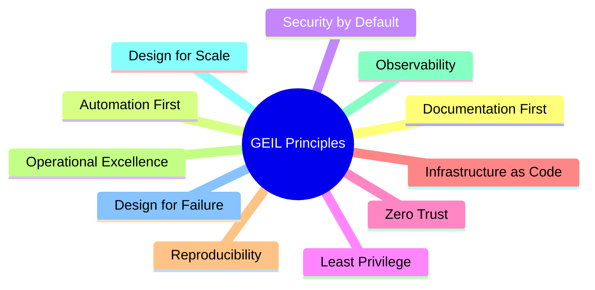

# Architecture Principles

## Document Control

| Field | Value |
|---|---|
| Document ID | GEIL-ARCH-PRINCIPLES-001 |
| Owner | Infrastructure Engineering |
| Status | Approved |
| Version | 1.0 |
| Last Reviewed | 2026-06-29 |
| Review Cycle | Quarterly |
| Classification | Internal Confidential |

## Purpose

Architecture Principles define the durable rules that guide GEIL decisions. These principles apply regardless of which technology implements a capability.

## Principle summary

## Documentation First

Architecture, standards, implementation guides, validation, rollback, and operations guidance must exist before production rollout.

Implications:

- Undocumented infrastructure is considered unmanaged risk.
- Documentation must use canonical GNTECH values from [Environment Specification](../project/environment-specification.md).
- Documentation changes must build successfully before publication.

## Automation First

Repeatable work should be automated where doing so improves safety, repeatability, or recovery.

Implications:

- PowerShell, templates, and future infrastructure-as-code should be source controlled.
- Automation must include validation and rollback considerations.
- Manual procedures remain acceptable when automation would increase risk or complexity.

## Security by Default

Security controls must be baseline architecture, not optional hardening after deployment.

Implications:

- New capabilities require identity, access, logging, backup, and monitoring considerations.
- Internet exposure requires explicit architecture and approval.
- Defaults must prefer deny, least privilege, and auditable access.

## Least Privilege

Users, administrators, services, and systems receive only the permissions required to perform their function.

Implications:

- Daily accounts do not receive standing administrative access.
- Privileged access is tiered and reviewed.
- Service accounts require owner, scope, and lifecycle controls.

## Zero Trust

Trust is not inherited from network location alone. Access decisions consider identity, device, policy, risk, and context.

Implications:

- Network segmentation remains necessary but not sufficient.
- Device health and identity controls influence access decisions.
- Emergency access must be preserved and monitored.

## Infrastructure as Code where practical

Infrastructure definitions should become code when doing so improves repeatability and governance.

Implications:

- Use source control for scripts, templates, and configuration artifacts.
- Require review before production-impacting automation changes.
- Avoid premature automation where platform APIs or operational maturity are insufficient.

## Reproducibility

GNTECH must be able to rebuild critical capabilities from documentation, backups, and source-controlled artifacts.

Implications:

- Implementation documents include prerequisites, commands, validation, and rollback.
- Recovery documents include evidence and test expectations.
- Canonical values are centralized.

## Operational Excellence

Capabilities must be designed for day-2 operations: maintenance, troubleshooting, monitoring, lifecycle, and support.

Implications:

- Every production capability needs ownership.
- Changes require validation and rollback.
- Documentation must include operational handoff considerations.

## Observability

The environment must expose enough telemetry to understand health, performance, security, and user impact.

Implications:

- Monitoring is not optional.
- Alerts require owner, severity, escalation, and closure criteria.
- Security-relevant events must be retained and reviewed.

## Design for Scale

GEIL must support growth from HQ to regional and multinational operations without structural redesign.

Implications:

- Naming, IP addressing, identity, and documentation architecture must allow expansion.
- Documents belong to capability releases, not temporary product groupings.
- Regional patterns must reuse central standards.

## Design for Failure

Assume components, credentials, networks, administrators, and cloud services can fail.

Implications:

- Backup and recovery are architecture requirements.
- Emergency access is mandatory.
- Failure modes must be documented before production dependence.

## Principle conflict resolution

When principles conflict, use this order:

1. Safety and recoverability.
2. Security and least privilege.
3. Operational continuity.
4. Reproducibility and automation.
5. Cost and convenience.

Material exceptions require an ADR.

## Cross-references

- [GEIL Master Plan](../project/master-plan.md)
- [Enterprise Capability Model](enterprise-capability-model.md)
- [Enterprise Reference Architecture](enterprise-reference-architecture.md)
- [Technology Selection Matrix](technology-selection-matrix.md)
