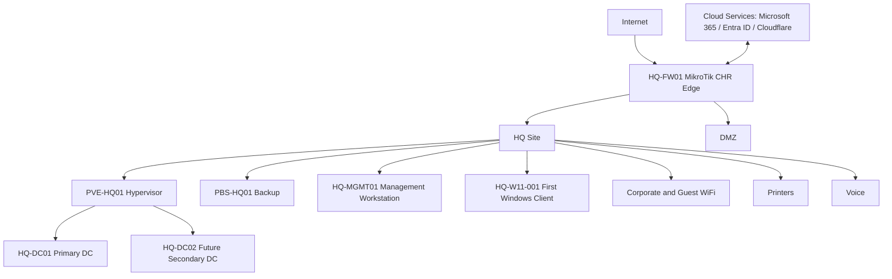
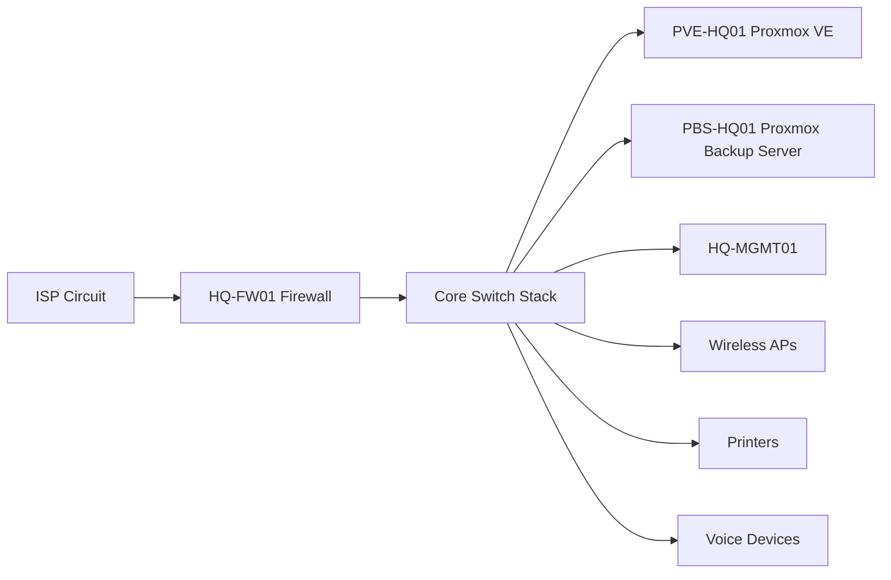
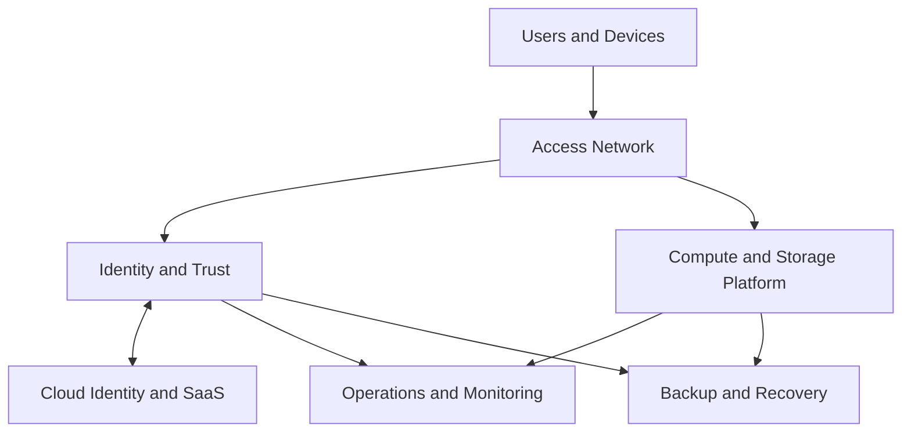
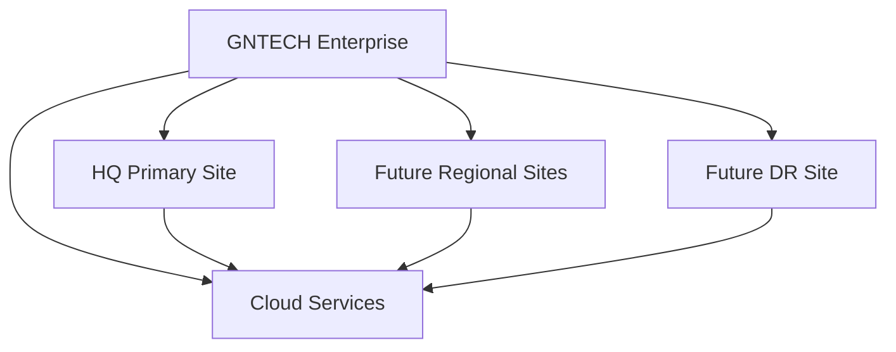
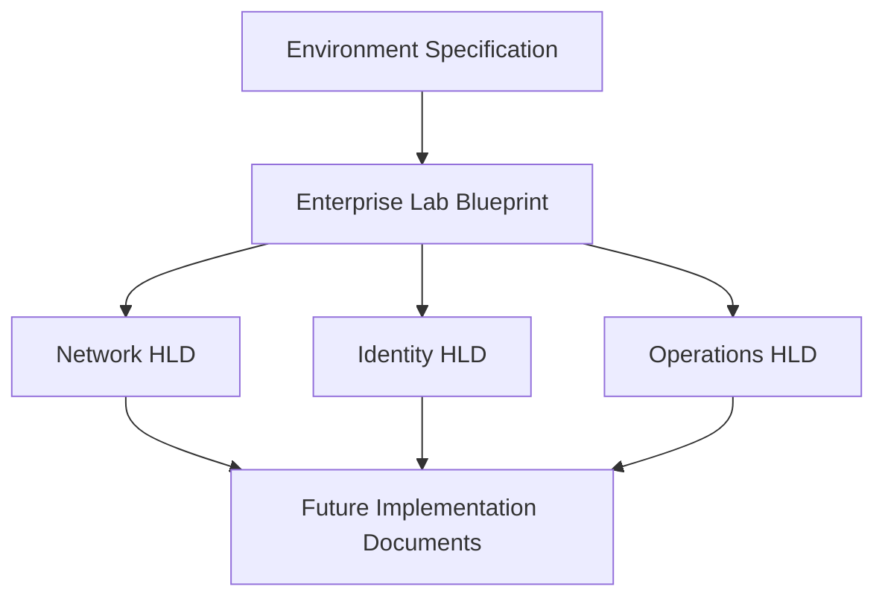
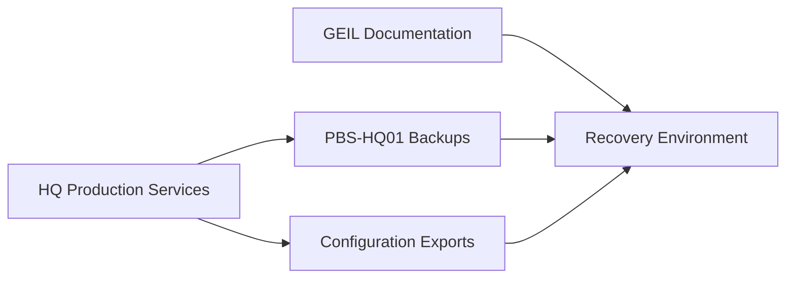

# Enterprise Lab Blueprint HLD

## Document Control

| Field | Value |
|---|---|
| Document ID | GEIL-ARCH-LAB-001 |
| Owner | Infrastructure Engineering |
| Status | Approved |
| Version | 1.0 |
| Last Reviewed | 2026-06-29 |
| Review Cycle | Quarterly |
| Classification | Internal Confidential |

## Purpose

The Enterprise Lab Blueprint is the High-Level Design (HLD) for the GNTECH enterprise implementation. It describes the complete target enterprise architecture even when some components are deployed in later releases.

This document is architecture only. It does not contain implementation procedures or runbooks. Future implementation documents must reference this HLD and remain consistent with it.

!!! note "Adaptation"

    This HLD uses the canonical GNTECH environment from [Environment Specification](../project/environment-specification.md): `corp.gntech.me`, `gntech.me`, `HQ`, `HQ-DC01`, `HQ-FW01`, `PVE-HQ01`, `PBS-HQ01`, `docs.gntechlabs.me`, and `172.20.0.0/16`.

## HLD scope

The blueprint covers:

- Physical topology.
- Logical topology.
- Site topology.
- Datacenter strategy.
- Active Directory site, forest, and domain design.
- DNS and DHCP architecture.
- PKI hierarchy.
- Enterprise WiFi architecture.
- Identity architecture.
- Storage, backup, monitoring, and disaster recovery architecture.
- Security zones, VLAN allocation, IP addressing, and naming strategy.
- Future regional expansion and cloud integration.

## Design intent

GEIL Phase 1 creates a production-style enterprise lab that is intentionally small but architecturally correct. The lab is not disposable. It is the seed architecture for GNTECH's enterprise platform.

## Target enterprise overview

## Physical topology

Physical design assumptions:

| Component | Phase 1 Role | Future Role |
|---|---|---|
| `HQ-FW01` | Internet edge, VLAN gateway, firewall policy | HA firewall pair or enterprise firewall cluster |
| Core switch | VLAN transport | Redundant switch stack |
| `PVE-HQ01` | Primary virtualization host | Member of hypervisor cluster |
| `PBS-HQ01` | Backup repository | Replicated backup node or regional backup tier |
| `HQ-MGMT01` | Administration endpoint | Tiered administrative workstation family |
| Wireless APs | Corporate and guest access | 802.1X enterprise wireless estate |

## Logical topology

Logical design separates user access, identity authority, compute, operations, cloud integration, and recovery. This makes later technology replacement possible without changing capability boundaries.

## Site topology

Phase 1 has one production site: `HQ`. The design reserves the ability to add regional sites and DR without renaming the forest, changing the supernet strategy, or restructuring documentation.

## Datacenter strategy

| Layer | Phase 1 | Target Enterprise |
|---|---|---|
| Primary site | `HQ` | Regional primary datacenters with central governance |
| Compute | `PVE-HQ01` | Clustered compute per region |
| Backup | `PBS-HQ01` | Local plus replicated backup tiers |
| Edge | `HQ-FW01` | HA edge per strategic site |
| Management | `HQ-MGMT01` | Tiered admin workstations and privileged access tooling |
| Documentation | `docs.gntechlabs.me` | Globally available protected engineering portal |

## Capability alignment

| Capability | Blueprint Decision |
|---|---|
| Enterprise Identity | Single forest `corp.gntech.me` with future site expansion. |
| Enterprise Networking | `172.20.0.0/16` supernet divided into canonical VLANs. |
| Enterprise Compute | Proxmox VE hosts infrastructure workloads while preserving replaceability. |
| Enterprise Storage | Storage is separated into workload storage and backup storage capabilities. |
| Enterprise PKI | Two-tier PKI is target state; bootstrap may start constrained by Phase 1 resources. |
| Enterprise Security | Segmentation, least privilege, privileged access tiers, and monitoring are mandatory. |
| Enterprise Backup | PBS-backed recovery is a core architecture capability, not an afterthought. |
| Enterprise Monitoring | Monitoring architecture must observe identity, edge, compute, backup, endpoints, and cloud. |

## Major architecture dependencies

## Future regional expansion

The target architecture supports new regional sites by repeating capability patterns rather than copying technology blindly.

| Expansion Item | Reserved Pattern |
|---|---|
| Site code | Three to five character code, with `HQ` retained for primary site |
| Network | Allocate a new regional supernet or reserved block under an approved enterprise IP plan |
| Identity | Add AD site/subnet mappings; deploy DCs only where justified |
| DNS/DHCP | Local DHCP where survivability requires it; AD-integrated DNS replication by site |
| Security | Regional firewall zones mapped to central policy standards |
| Backup | Local recovery plus cross-site or cloud replication |
| Operations | Central standards with regional delegated execution |

## Disaster recovery strategy

Recovery architecture principles:

- Documentation must remain accessible during infrastructure recovery.
- Identity recovery has priority over application recovery.
- Firewall, DNS, DHCP, and backup configuration exports must be protected.
- Recovery testing is required before declaring production readiness.

## Cloud integration strategy

Cloud services extend the enterprise architecture; they do not replace governance.

| Cloud Capability | Target Design |
|---|---|
| Microsoft 365 tenant | `gntech.me` tenant aligned to enterprise identity and collaboration requirements |
| Microsoft Entra ID | Cloud identity control plane integrated with `corp.gntech.me` where required |
| Intune | Endpoint compliance and configuration management |
| Defender | Endpoint and cloud security signal |
| Cloudflare | DNS, documentation publishing, and protected access for `docs.gntechlabs.me` |

## HLD authority

This HLD is authoritative for future implementation documents. If an implementation document conflicts with this blueprint, update the HLD through architecture review or document the exception through an ADR before implementation.

## Cross-references

- [Environment Specification](../project/environment-specification.md)
- [Enterprise Capability Model](enterprise-capability-model.md)
- [Enterprise Reference Architecture](enterprise-reference-architecture.md)
- [Enterprise Lab Network HLD](enterprise-lab-network-hld.md)
- [Enterprise Lab Identity HLD](enterprise-lab-identity-hld.md)
- [Enterprise Lab Operations HLD](enterprise-lab-operations-hld.md)
- [Architecture Principles](architecture-principles.md)
- [Epic and Release Architecture](../project/epic-release-architecture.md)
