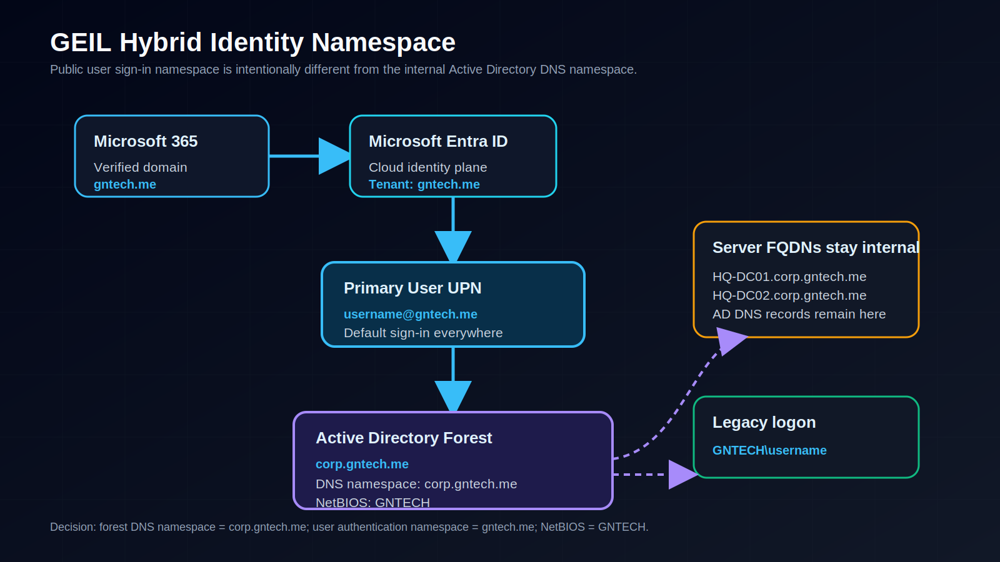
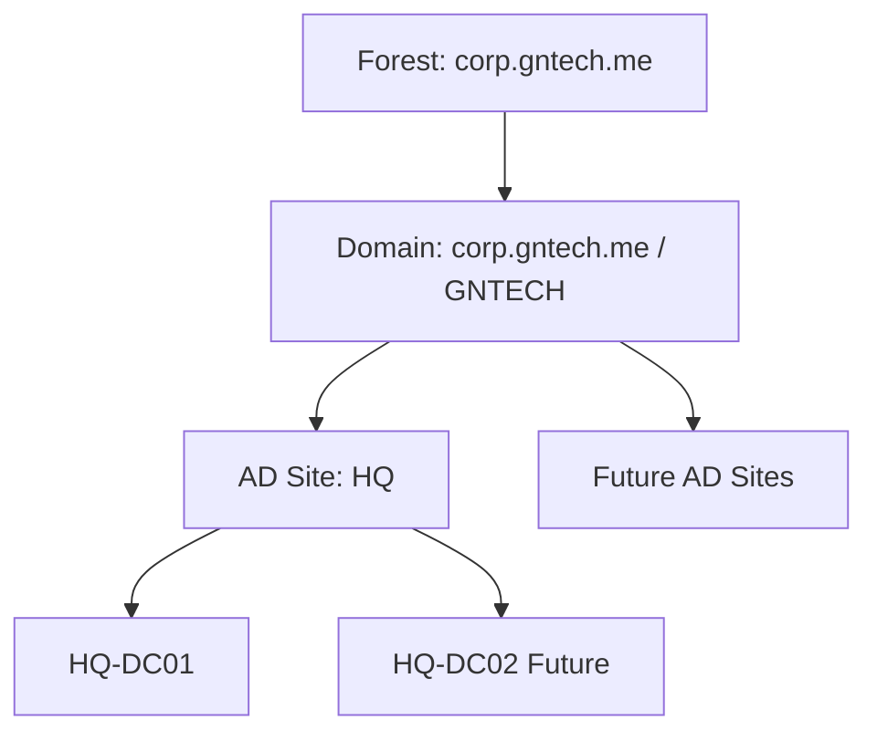
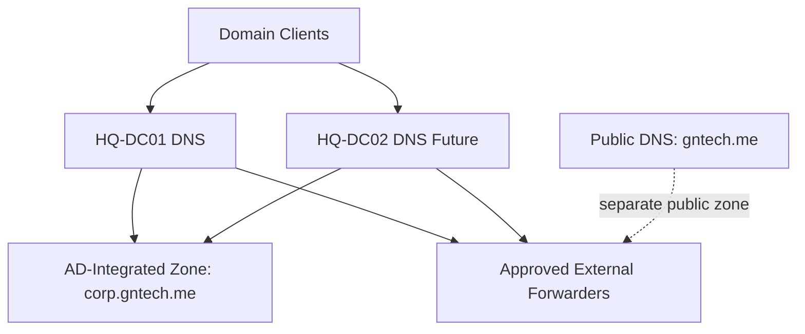
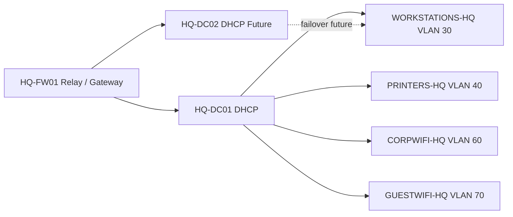
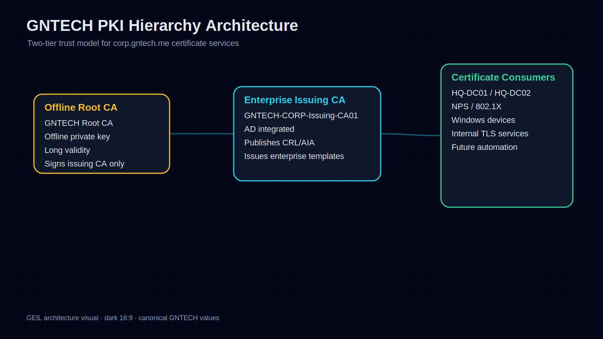
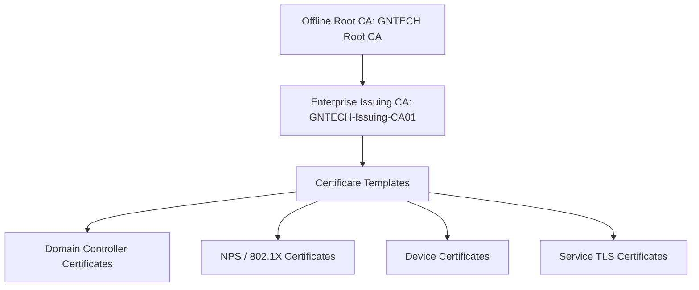
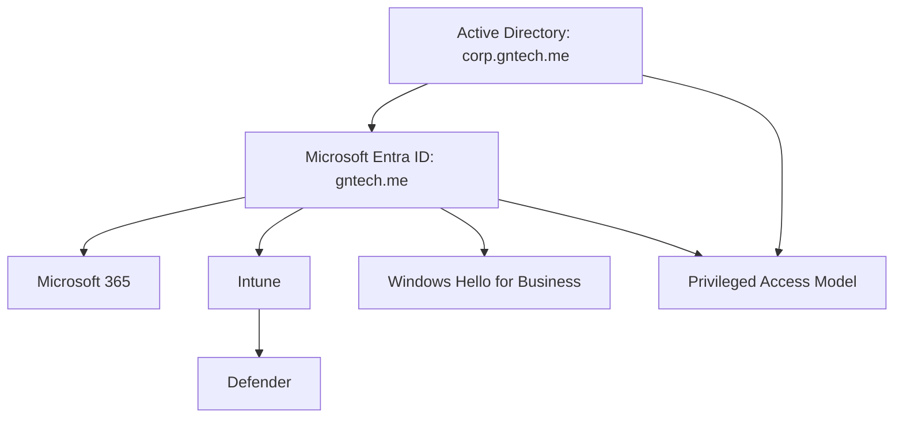

# Enterprise Lab Identity HLD

## Document Control

| Field | Value |
|---|---|
| Document ID | GEIL-ARCH-LAB-ID-001 |
| Owner | Infrastructure Engineering |
| Status | Approved |
| Version | 1.0 |
| Last Reviewed | 2026-06-29 |
| Review Cycle | Quarterly |
| Classification | Internal Confidential |

## Purpose

This document defines the identity, directory, DNS, DHCP, PKI, privileged access, and cloud identity High-Level Design for the GEIL Enterprise Lab Blueprint.

It is architecture only. Implementation documents for AD DS, DNS, DHCP, PKI, NPS, Microsoft 365, Entra ID, Intune, and privileged access must reference this HLD.

## Readable visual asset: Enterprise Lab Identity HLD

This visual summarizes the hybrid identity namespace decision without overloading the page with deeply nested Mermaid branches. It shows Microsoft 365, Microsoft Entra ID, the primary UPN `username@gntech.me`, and the internal Active Directory forest `corp.gntech.me` with NetBIOS `GNTECH`.

!!! note "Adaptation"

    This visual uses canonical GNTECH names including `corp.gntech.me`, `GNTECH`, `HQ-DC01`, `HQ-DC02`, and `gntech.me`. Other organizations must update their Environment Specification before regenerating this visual.

## Forest and domain design

| Design Element | Decision |
|---|---|
| Forest | `corp.gntech.me` |
| Domain | `corp.gntech.me` |
| NetBIOS | `GNTECH` |
| Initial DC | `HQ-DC01` |
| Future second DC | `HQ-DC02` |
| Forest strategy | Single forest, single domain for Phase 1 through small enterprise scale |
| Future expansion | Add AD sites and subnets before adding domains |

## Active Directory site design

Phase 1 uses a single AD site named `HQ`. Future sites are added when routed networks and operational requirements justify site-aware authentication and replication.

| AD Site | Subnets | Domain Controllers | Purpose |
|---|---|---|---|
| `HQ` | `172.20.0.0/16` initially, refined to VLAN subnets as needed | `HQ-DC01`, future `HQ-DC02` | Primary authentication and service location |
| Future regional site | Future routed regional supernet | Only if survivability or latency requires it | Regional authentication and service locality |

## DNS architecture

DNS principles:

- `corp.gntech.me` is the internal AD-integrated DNS zone.
- `gntech.me` is the public Microsoft 365 tenant and public domain.
- Split-brain DNS is avoided unless an ADR approves it.
- Clients use domain controllers for internal DNS.
- Firewall rules must prevent uncontrolled client DNS egress.

## DHCP architecture

DHCP principles:

- Infrastructure servers use static addresses.
- Workstations, corporate WiFi, guest WiFi, and printers use documented scopes.
- `HQ-DC02` is reserved for future DHCP failover.
- DHCP options must point domain devices to `HQ-DC01` and future `HQ-DC02` for DNS.

## Readable visual asset: PKI Hierarchy

The PKI hierarchy is a complex trust diagram and should not rely on a wide Mermaid tree alone. This visual shows the target two-tier trust model from offline root CA to enterprise issuing CA and certificate consumers.

!!! note "Adaptation"

    This visual uses the GNTECH issuing CA name `GNTECH-Issuing-CA01` and the `corp.gntech.me` trust context. Adaptations must update certificate names, CRL/AIA assumptions, DNS names, and relying-party references.

## PKI hierarchy

Target state is a two-tier PKI, even if Phase 1 bootstraps with constrained resources.

PKI principles:

- Root CA is offline in target state.
- Issuing CA integrates with `corp.gntech.me`.
- Certificate templates are versioned and lifecycle-managed.
- CRL and AIA locations must be reachable by relying parties.
- PKI administrators are Tier 0.

## Identity architecture

Identity design principles:

- AD DS is authoritative for initial on-premises identity.
- Entra ID is authoritative for cloud roles and SaaS access.
- Emergency cloud-only access is mandatory.
- Administrative accounts are tiered.
- Device identity becomes a policy signal for cloud and endpoint access.

## Domain and OU strategy

The OU design separates normal operations from administrative control.

| OU | Purpose |
|---|---|
| `OU=GNTECH,DC=corp,DC=gntech,DC=me` | Managed enterprise OU root for GNTECH-owned objects |
| `OU=Admin,OU=GNTECH,DC=corp,DC=gntech,DC=me` | Tiered administrative users and admin delegation targets |
| `OU=Users,OU=GNTECH,DC=corp,DC=gntech,DC=me` | Standard, executive, contractor, and disabled user lifecycle containers |
| `OU=Groups,OU=GNTECH,DC=corp,DC=gntech,DC=me` | Security, Microsoft 365, and role-based access groups |
| `OU=Computers,OU=GNTECH,DC=corp,DC=gntech,DC=me` | Workstations, servers, and staging computer lifecycle containers |
| `OU=Service Accounts,OU=GNTECH,DC=corp,DC=gntech,DC=me` | Standard service accounts, gMSA planning, and legacy service identities |
| `OU=Policies,OU=GNTECH,DC=corp,DC=gntech,DC=me` | Policy staging and future control-plane anchors |

## Cloud integration strategy

| Cloud Capability | Phase 1 HLD Decision | Future Target |
|---|---|---|
| Microsoft 365 | Tenant `gntech.me` | Full collaboration and messaging governance |
| Entra ID | Cloud identity plane | Conditional Access and privileged role governance |
| Intune | Endpoint control plane | Autopilot, compliance, app deployment, device lifecycle |
| Defender | Security signal and endpoint protection | Integrated detection and response |
| WHfB | Passwordless sign-in | Cloud Kerberos trust or approved equivalent |

## Cross-references

- [Enterprise Lab Blueprint HLD](enterprise-lab-blueprint.md)
- [Environment Specification](../project/environment-specification.md)
- [Identity Architecture](identity-architecture.md)
- [Active Directory Implementation](../microsoft-core/active-directory-implementation.md) and [Active Directory Organizational Foundation](../microsoft-core/active-directory-organizational-foundation.md)
- [AD CS PKI](../microsoft-core/ad-cs-pki.md)
- [Privileged Access Model](../security/privileged-access-model.md)
