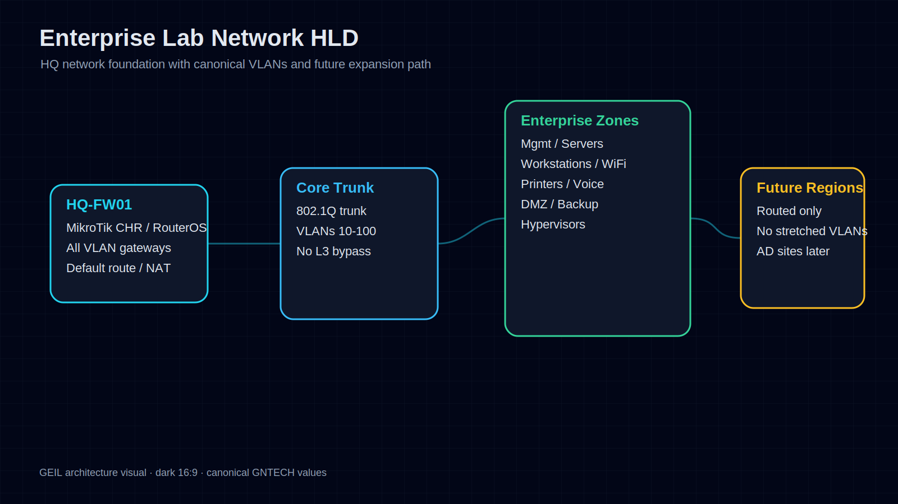
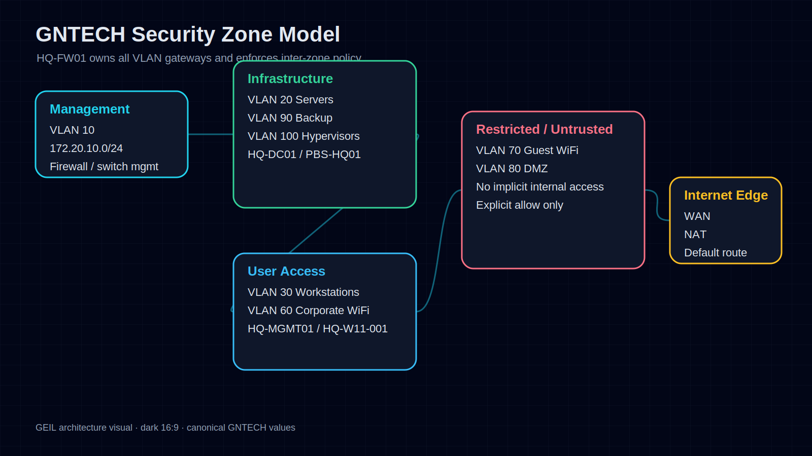
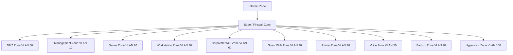
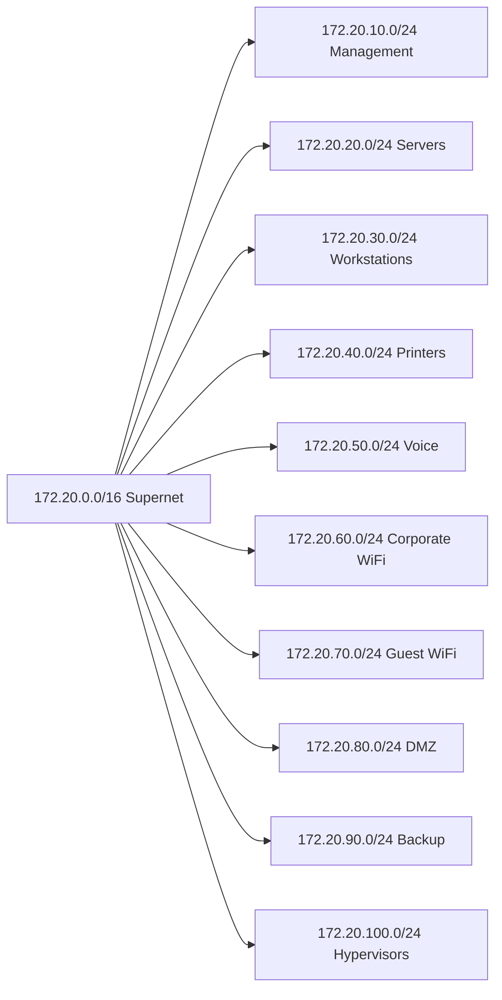
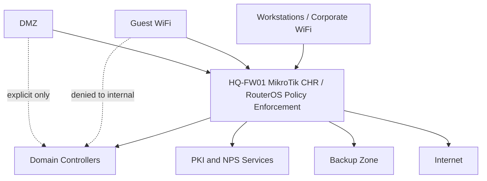
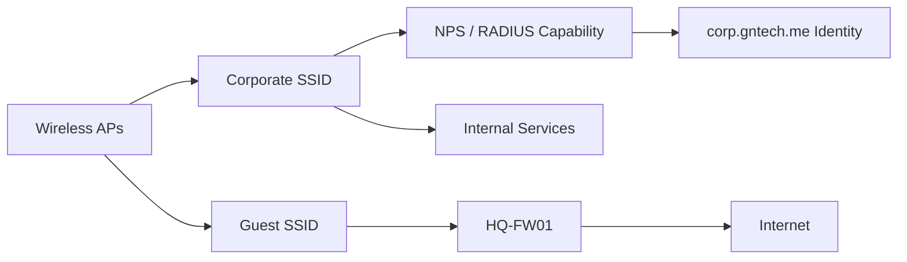
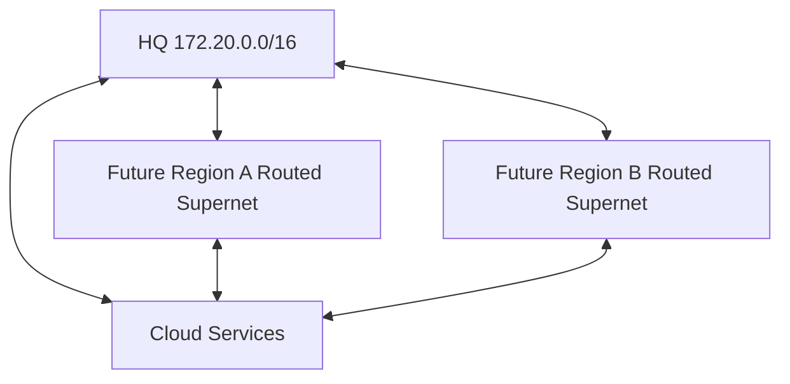

# Enterprise Lab Network HLD

## Document Control

| Field | Value |
|---|---|
| Document ID | GEIL-ARCH-LAB-NET-001 |
| Owner | Infrastructure Engineering |
| Status | Approved |
| Version | 1.0 |
| Last Reviewed | 2026-06-29 |
| Review Cycle | Quarterly |
| Classification | Internal Confidential |

## Purpose

This document defines the network, security zone, VLAN, IP addressing, WiFi, and site connectivity High-Level Design for the GEIL Enterprise Lab Blueprint.

It is architecture only. Implementation guides must reference this HLD before configuring `HQ-FW01` as MikroTik CHR / RouterOS, switches, DHCP scopes, DNS forwarding, wireless networks, or firewall policy.

!!! note "Adaptation"

    This document uses the canonical GNTECH `172.20.0.0/16` network baseline and `HQ` site from [Environment Specification](../project/environment-specification.md).

## Readable visual asset: Enterprise Lab Network HLD

This visual summarizes the HQ network foundation in one readable 16:9 architecture view. `HQ-FW01` is the MikroTik CHR / RouterOS routing and policy boundary, the core trunk carries the canonical VLANs, and future regions use routed expansion rather than stretched VLANs.

!!! note "Adaptation"

    This visual uses the GNTECH `HQ` site and `172.20.0.0/16` addressing model. Organizations adapting this design must update the Environment Specification before regenerating the visual.

## Network design goals

- Provide segmentation from the first deployment phase.
- Keep IP allocation readable and scalable.
- Separate management, servers, workstations, WiFi, guest, DMZ, backup, and hypervisor traffic.
- Support future regional expansion without renumbering HQ.
- Treat network location as one signal, not as complete trust.

## Readable visual asset: Security Zone Model

This visual replaces the large Mermaid zone diagram for normal reading. It shows `HQ-FW01` as the enforcement point between management, infrastructure, user access, restricted/untrusted, and internet edge zones.

!!! note "Adaptation"

    This visual uses GNTECH VLAN names, VLAN IDs, and `172.20.0.0/16` addressing from the Environment Specification. Do not alter these values in GEIL unless the canonical environment changes first.

## Security zone model

## VLAN allocation

| VLAN | Zone | CIDR | Gateway | Trust Level | Primary Systems |
|---:|---|---|---|---|---|
| 10 | Management | `172.20.10.0/24` | `172.20.10.1` | High | `HQ-FW01`, switch management, management interfaces |
| 20 | Servers | `172.20.20.0/24` | `172.20.20.1` | High | `HQ-DC01`, `HQ-DC02`, infrastructure VMs |
| 30 | Workstations | `172.20.30.0/24` | `172.20.30.1` | Medium | `HQ-MGMT01` Windows 11 management workstation, `HQ-W11-001` standard client validation VM, domain clients |
| 40 | Printers | `172.20.40.0/24` | `172.20.40.1` | Low | Printers and MFPs |
| 50 | Voice | `172.20.50.0/24` | `172.20.50.1` | Medium | Voice devices |
| 60 | Corporate WiFi | `172.20.60.0/24` | `172.20.60.1` | Medium | 802.1X corporate wireless clients |
| 70 | Guest WiFi | `172.20.70.0/24` | `172.20.70.1` | Untrusted | Guest devices |
| 80 | DMZ | `172.20.80.0/24` | `172.20.80.1` | Controlled | Future published or isolated services |
| 90 | Backup | `172.20.90.0/24` | `172.20.90.1` | High | `PBS-HQ01`, backup transport |
| 100 | Hypervisors | `172.20.100.0/24` | `172.20.100.1` | High | `PVE-HQ01`, future cluster traffic |

## Management workstation pilot decision

Pilot validation established that `HQ-MGMT01` is the dedicated Windows 11 Enterprise management workstation and initial PAW. It belongs on Management VLAN 10, not Workstations VLAN 30. `HQ-W11-001` and future user workstations remain on VLAN 30. Only management workstations belong on the management VLAN.

## IP addressing allocation

## Baseline host allocations

| Host | VLAN | IP |
|---|---:|---|
| `HQ-FW01` | 10 | `172.20.10.1` |
| `HQ-DC01` | 20 | `172.20.20.11` |
| `HQ-DC02` | 20 | `172.20.20.12` |
| `HQ-MGMT01` | 10 | `172.20.10.10` |
| `PBS-HQ01` | 90 | `172.20.90.10` |
| `PVE-HQ01` | 100 | `172.20.100.11` |

## Routing and firewall architecture

Default policy:

- Deny inter-zone traffic by default.
- Permit only documented service flows.
- Guest WiFi is internet-only.
- Backup and hypervisor zones are restricted to management and backup traffic.
- Management zone access is limited to approved administrative endpoints.

## Enterprise WiFi architecture

WiFi design:

| SSID Type | VLAN | Authentication | Access |
|---|---:|---|---|
| Corporate WiFi | 60 | 802.1X with certificate-backed or approved enterprise authentication | Internal services through firewall policy |
| Guest WiFi | 70 | Captive portal or pre-shared access as approved | Internet only |

## DNS and DHCP network placement

DNS and DHCP are identity-adjacent network services. They are placed in the server zone and provided initially by `HQ-DC01`, with `HQ-DC02` reserved for redundancy.

| Service | Primary | Future Secondary | Notes |
|---|---|---|---|
| DNS | `HQ-DC01` | `HQ-DC02` | AD-integrated zone `corp.gntech.me` |
| DHCP | `HQ-DC01` | `HQ-DC02` | Failover or split-scope design in later phase |
| RADIUS | `HQ-DC01` bootstrap capability | Future dedicated NPS host if approved | Used for 802.1X architecture |

## Regional expansion pattern

Future regions must not extend HQ VLANs across WAN links. Each region receives routed networks, mapped AD sites, local firewall policy, and local DHCP as justified.

## Cross-references

- [Enterprise Lab Blueprint HLD](enterprise-lab-blueprint.md)
- [Environment Specification](../project/environment-specification.md)
- [Network Architecture](../network/network-architecture.md)
- [MikroTik CHR HQ Foundation LLD](../platform/mikrotik-chr-hq-foundation-lld.md)
- [ADR-0002 Use MikroTik CHR for Phase 1 HQ Firewall](../governance/adrs/ADR-0002-mikrotik-chr-phase-1-firewall.md)
- [DNS and DHCP Implementation](../microsoft-core/dns-dhcp-implementation.md)
