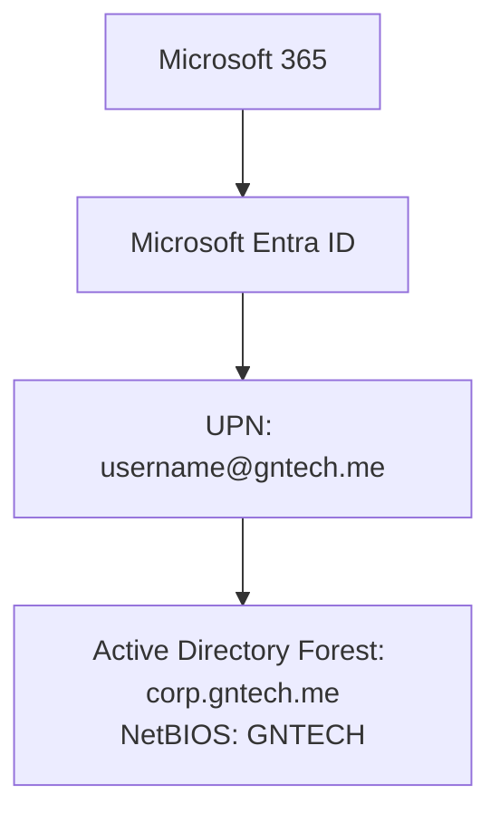

# Identity Architecture

## Document Control

| Field | Value |
|---|---|
| Document ID | GEIL-ARCH-ID-001 |
| Owner | Infrastructure Engineering |
| Status | Draft |
| Version | 1.0 |
| Last Reviewed | 2026-06-29 |
| Review Cycle | Quarterly |
| Classification | Internal Confidential |

!!! note "Adaptation"

    This document uses canonical GNTECH values from the [Environment Specification](../project/environment-specification.md). Organizations adapting this design should change the environment specification first, then update all affected DNS zones, certificates, PowerShell commands, Group Policies, VLANs, firewall rules, and service configurations.

## Purpose

Define identity boundaries, authority, synchronization, and administrative tiers.

## Identity authorities

| Identity Type | Authoritative Source | Notes |
|---|---|---|
| On-premises users and groups | Active Directory | Synced to Entra ID where cloud services are needed |
| Cloud-only emergency accounts | Entra ID | Excluded from Conditional Access lockout dependencies |
| Device identity | AD DS and/or Entra ID | Hybrid joined during transition, Entra joined for cloud-first endpoints |
| Administrative accounts | AD DS or Entra ID by tier | No shared admin accounts |

## Administrative tiers

- Tier 0: AD DS, Entra Connect, PKI, domain controllers, enterprise admins.
- Tier 1: Member servers, virtualization, backup, monitoring.
- Tier 2: Workstations, endpoint management, help desk.

## Synchronization rule

Use Microsoft Entra Connect Cloud Sync or Entra Connect Sync only after documenting sourceAnchor, OU scope, UPN suffixes, and rollback.

## Validation PowerShell

```powershell
Get-ADGroupMember "Domain Admins"
Get-ADGroupMember "Enterprise Admins"
Get-ADUser -Filter 'Enabled -eq $true' -SearchBase "OU=Admin,DC=corp,DC=gntech,DC=me" | Select Name,SamAccountName
```

Expected result: only named Tier 0 administrative users appear in Tier 0 groups.

## Rollback

If an account is assigned to the wrong tier, remove the membership, revoke sessions in Entra ID if applicable, reset credentials, and document the event.

## Hybrid identity namespace model

GEIL uses `corp.gntech.me` as the internal Active Directory forest and DNS namespace, but users authenticate with the Microsoft 365 verified public domain `gntech.me`.



Server FQDNs remain in `corp.gntech.me`, for example `HQ-DC01.corp.gntech.me`. User sign-in uses `username@gntech.me`. Legacy logon remains `GNTECH\username`.
