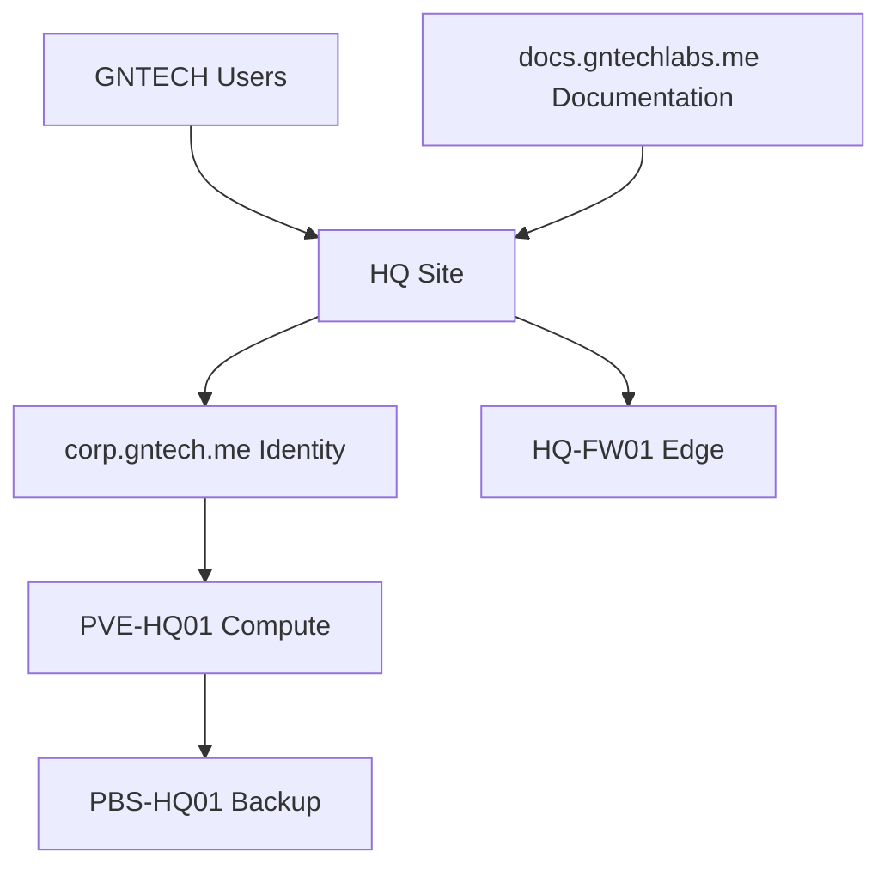
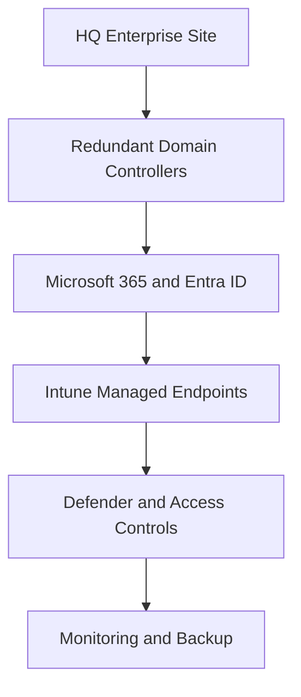
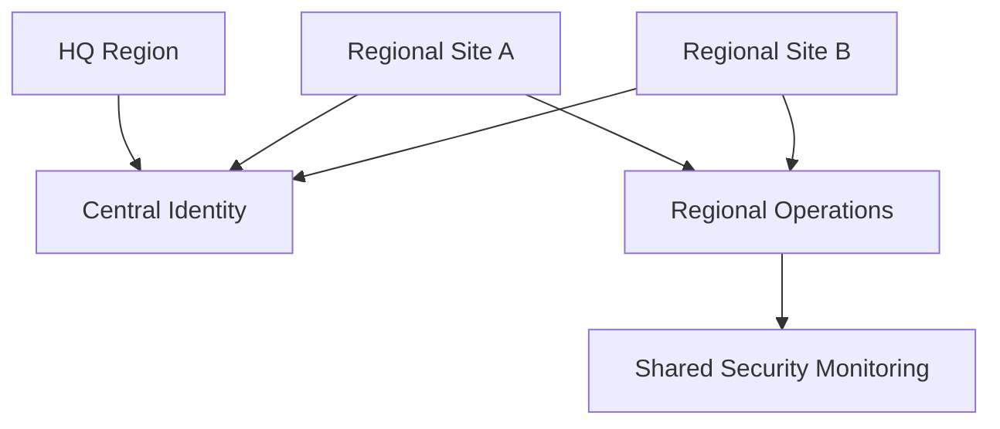
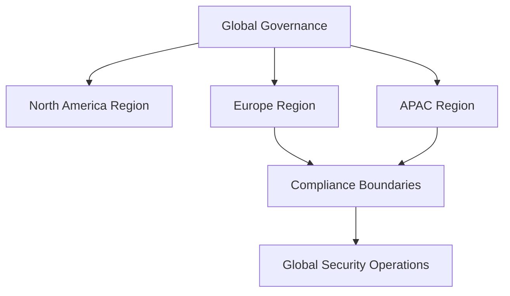
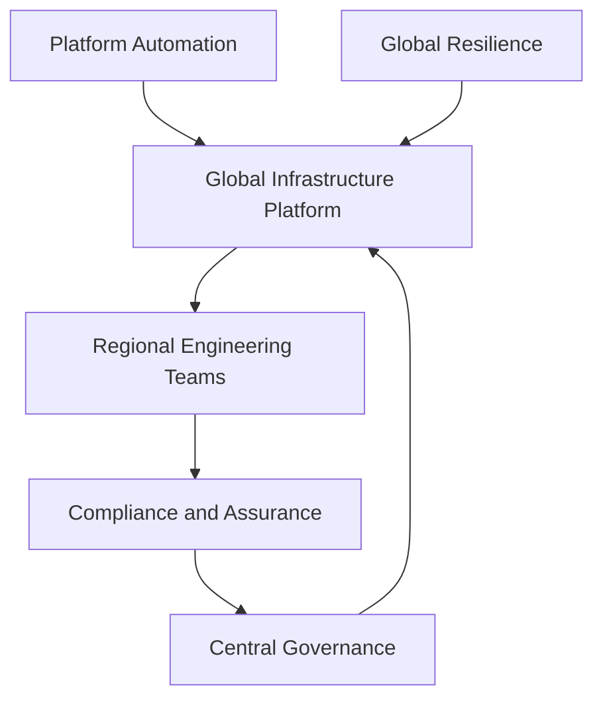

# Implementation Philosophy

## Document Control

| Field | Value |
|---|---|
| Document ID | GEIL-ARCH-IMPL-001 |
| Owner | Infrastructure Engineering |
| Status | Approved |
| Version | 1.0 |
| Last Reviewed | 2026-06-29 |
| Review Cycle | Quarterly |
| Classification | Internal Confidential |

## Purpose

The Implementation Philosophy defines how GEIL evolves from the current GNTECH HQ environment into a small enterprise, regional enterprise, international enterprise, and multinational corporation without losing architectural coherence.

This is an architecture document, not an implementation guide.

## Maturity stages

## Stage 1: 15-user SMB

Architecture goal: build the smallest secure, documented, recoverable enterprise foundation.

Primary characteristics:

- Single primary site: HQ.
- Canonical AD forest/domain: `corp.gntech.me`.
- Segmented network baseline: `172.20.0.0/16`.
- Minimal but disciplined identity, backup, monitoring, and documentation controls.

## Stage 2: Small Enterprise

Architecture goal: formalize operational separation and cloud integration.

Primary characteristics:

- Redundant domain controllers.
- Formal privileged access model.
- Intune and Defender baselines.
- Certificate lifecycle management.
- Documented operational runbooks.

## Stage 3: Regional Enterprise

Architecture goal: support more than one site while preserving central governance.

Primary characteristics:

- Site templates.
- Regional network patterns.
- Delegated administration.
- Repeatable deployment and recovery.
- Shared monitoring and security operations.

## Stage 4: International Enterprise

Architecture goal: support country-level legal, network, operational, and data-handling requirements.

Primary characteristics:

- Regional compliance mapping.
- Data residency decisions.
- Regional identity and access delegation.
- Defined cross-border operations.
- Formal incident and recovery exercises.

## Stage 5: Multinational Corporation

Architecture goal: operate infrastructure as a governed enterprise platform with regional autonomy and central assurance.

Primary characteristics:

- Platform engineering model.
- Regional operations with central standards.
- Automated evidence and control reporting.
- Formal resilience architecture.
- Product-independent capability management.

## Evolution rules

1. Do not skip documentation maturity to accelerate implementation.
2. Do not add a technology unless it supports an explicit capability.
3. Do not scale a weak control; fix the control first.
4. Prefer reversible, observable changes.
5. Preserve canonical environment truth in [Environment Specification](../project/environment-specification.md).
6. Use ADRs for major deviations or technology replacements.

## Cross-references

- [GEIL Master Plan](../project/master-plan.md)
- [Enterprise Capability Model](enterprise-capability-model.md)
- [Enterprise Reference Architecture](enterprise-reference-architecture.md)
- [Architecture Principles](architecture-principles.md)
