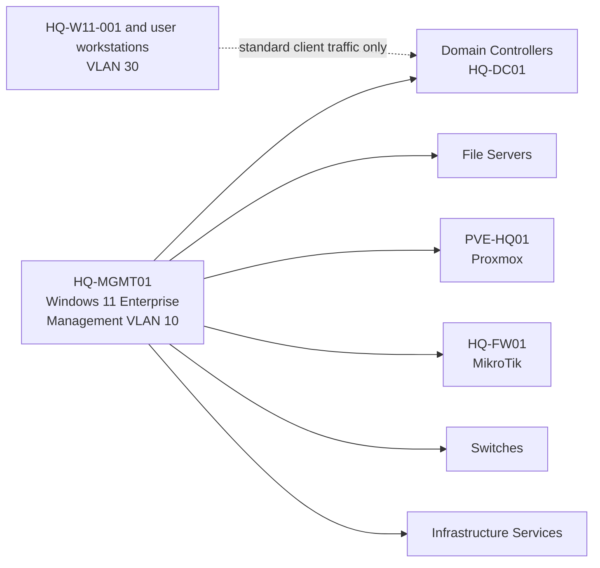

# Network Architecture

## Document Control

| Field | Value |
|---|---|
| Document ID | GEIL-ARCH-NET-001 |
| Owner | Infrastructure Engineering |
| Status | Draft |
| Version | 1.1 |
| Last Reviewed | 2026-07-01 |
| Review Cycle | Quarterly |
| Classification | Internal Confidential |

!!! note "Adaptation"

    This document uses canonical GNTECH values from the [Environment Specification](../project/environment-specification.md). Organizations adapting this design should change the environment specification first, then update all affected DNS zones, certificates, PowerShell commands, Group Policies, VLANs, firewall rules, and service configurations.

## Purpose

Define the standard segmented network design for GEIL deployments.

## Pilot architecture decision

Pilot validation established that `HQ-MGMT01` is the dedicated Windows 11 Enterprise management workstation and initial PAW. It belongs to the Management network, VLAN 10. It is not Windows Server and it is not a standard user workstation.

`HQ-W11-001` and future user workstations remain on VLAN 30. User workstations must not appear as infrastructure management endpoints.

## Default VLAN model

| VLAN | Name | Gateway Example | Internet | Server Access | Primary occupants |
|---:|---|---|---|---|---|
| 10 | Management | `172.20.10.1` | Restricted | Admin only | `HQ-MGMT01`, future PAWs, firewall/switch management interfaces |
| 20 | Servers | `172.20.20.1` | Restricted | Infrastructure services | `HQ-DC01`, future file/application servers |
| 30 | Workstations | `172.20.30.1` | Allowed | AD/DNS/DHCP/PKI/NPS only | `HQ-W11-001` and future user workstations |
| 40 | Printers | `172.20.40.1` | Restricted | Print services only | Printers and MFPs |
| 50 | Voice | `172.20.50.1` | Restricted | Voice services only | Voice devices |
| 60 | Corporate WiFi | `172.20.60.1` | Allowed | Same as Workstations after 802.1X | Corporate wireless clients |
| 70 | Guest WiFi | `172.20.70.1` | Allowed | Denied | Guest devices |
| 80 | DMZ | `172.20.80.1` | Restricted | Explicit published services only | Published or isolated services |
| 90 | Backup | `172.20.90.1` | Denied by default | Backup targets only | Backup transport and storage services |
| 100 | Hypervisors | `172.20.100.1` | Restricted | Management and cluster services only | `PVE-HQ01` and future hypervisors |

## Management traffic model

Management traffic originates from `HQ-MGMT01` or a future approved management workstation/PAW on VLAN 10.



Management endpoints:

| Source | VLAN | Role | Allowed target class |
|---|---:|---|---|
| `HQ-MGMT01` | 10 | Dedicated management workstation / initial PAW | Domain controllers, file servers, Proxmox, MikroTik, switches, infrastructure services |
| Future PAWs | 10 | Approved privileged administration workstations | Same as approved management role |
| `HQ-W11-001` | 30 | Standard client validation VM | AD client services only; not an infrastructure management endpoint |
| Future user workstations | 30 | Standard clients | AD client services, user applications, approved endpoint services |

## Required firewall policy

Default deny between VLANs. Add explicit address-list based rules for:

- Management workstation administration from `ManagementNetworks` to infrastructure management targets.
- DNS: clients and management workstations to domain controllers TCP/UDP 53.
- Kerberos: TCP/UDP 88.
- LDAP/LDAPS: TCP/UDP 389, TCP 636 as required.
- SMB to domain controllers: TCP 445 for SYSVOL/NETLOGON.
- RPC Endpoint Mapper and Dynamic RPC for domain operations.
- NTP: UDP 123 to approved time source.
- RADIUS: UDP 1812/1813 from network devices to NPS when implemented.

User workstation VLAN 30 is not a management source. It receives only the minimum AD, DNS, DHCP, endpoint, and user-service access required for standard clients.

## Active Directory and OU alignment

Network placement and Active Directory OU placement must agree:

| Host class | Network | OU |
|---|---|---|
| `HQ-MGMT01` and future management workstations | VLAN 10 Management | `OU=Management Workstations,OU=Computers,OU=GNTECH,...` |
| `HQ-W11-001` and future user workstations | VLAN 30 Workstations | `OU=Workstations,OU=Computers,OU=GNTECH,...` |
| Servers | VLAN 20 Servers | `OU=Servers,OU=Computers,OU=GNTECH,...` |

## Validation

From `HQ-MGMT01` on VLAN 10:

```powershell
Test-NetConnection HQ-DC01.corp.gntech.me -Port 53
Test-NetConnection HQ-DC01.corp.gntech.me -Port 88
Test-NetConnection HQ-DC01.corp.gntech.me -Port 445
Test-NetConnection 172.20.100.11 -Port 8006
Test-NetConnection 172.20.10.1 -Port 8291
```

From `HQ-W11-001` on VLAN 30:

```powershell
Test-NetConnection HQ-DC01.corp.gntech.me -Port 53
Test-NetConnection HQ-DC01.corp.gntech.me -Port 88
Test-NetConnection HQ-DC01.corp.gntech.me -Port 445
```

Expected result: required AD ports succeed from VLAN 30; approved management ports succeed only from VLAN 10 management workstations; unrelated server and infrastructure-management ports fail from user workstation VLANs.

## Rollback

Export the RouterOS configuration before rule changes. If authentication, DNS, or management access breaks, restore the previous firewall address-list/rule set and reload filters from the console or an approved out-of-band path.

## WinRM management flow

Enterprise WinRM management flows from `HQ-MGMT01` on VLAN 10 Management to domain-joined Windows clients such as `HQ-W11-001` on VLAN 30 Workstations using TCP `5985`. Access control is layered: WinRM listener, Windows Defender Firewall remote address scope, MikroTik inter-VLAN firewall policy, VLAN segmentation, and Kerberos authentication. `IPv4Filter = *` is required because it selects local listener interfaces and is not a source ACL.
