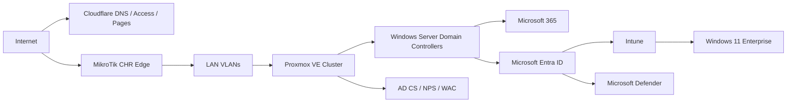

# Reference Architecture

## Document Control

| Field | Value |
|---|---|
| Document ID | GEIL-ARCH-REF-001 |
| Owner | Infrastructure Engineering |
| Status | Draft |
| Version | 1.0 |
| Last Reviewed | 2026-06-29 |
| Review Cycle | Quarterly |
| Classification | Internal Confidential |

## Purpose

Define the standard GEIL enterprise architecture from 15 users to multinational scale.

## Logical architecture

## Scale stages

| Stage | Users | Core Pattern | Required Controls |
|---|---:|---|---|
| SMB | 15-50 | Single site, two virtualization hosts preferred | AD DS, DNS, DHCP, backup, monitoring, MFA |
| Midmarket | 50-500 | Multi-VLAN, two DCs, separate PKI/NPS/WAC | Tiered admin, Intune, Defender, 802.1X |
| Enterprise | 500-5,000 | Multiple sites, redundant WAN, regional services | Change control, SIEM, privileged access workstations |
| Multinational | 5,000+ | Regional architecture and compliance boundaries | Data residency, delegated ops, regional DR |

## Design defaults

- AD DS remains authoritative for on-premises Windows identity unless cloud-native-only is approved by ADR.
- Entra ID and Intune manage SaaS identity and endpoints.
- MikroTik CHR provides edge routing, VPN, and segmentation for SMB/midmarket deployments.
- Proxmox VE hosts infrastructure workloads where a commercial hypervisor is not mandated.
- Microsoft Defender is the endpoint protection standard.

## Validation

For each site, produce an architecture packet with:

- VLAN table.
- IP addressing table.
- Server inventory.
- AD site and subnet mapping.
- Firewall rule export.
- Backup schedule.
- Monitoring target list.

## Rollback

Architecture decisions are rolled back by ADR supersession, not silent edits. Mark the previous ADR superseded and link the replacement.
