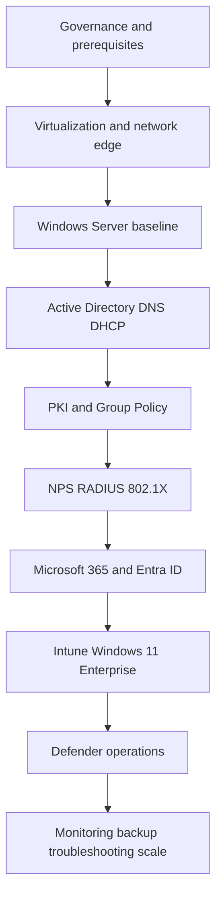

# GNTECH Enterprise Infrastructure Library

## Document Control

| Field | Value |
|---|---|
| Document ID | GEIL-HOME-001 |
| Owner | Infrastructure Engineering |
| Status | Approved |
| Version | 1.0 |
| Last Reviewed | 2026-06-29 |
| Review Cycle | Quarterly |
| Classification | Internal Confidential |

GEIL is the private implementation guide for GNTECH enterprise infrastructure. It defines how to build and operate a Microsoft-centered environment from a 15-user SMB footprint through multi-site and multinational scale.

## Operating principles

1. Documentation first, infrastructure second.
2. Production controls are required even in the first small-business phase.
3. Identity, DNS, time, PKI, backup, and monitoring are foundational services, not optional enhancements.
4. Deviations from Microsoft or vendor best practice require an Architecture Decision Record.
5. Every implementation must be validated and rollback-ready before it is considered complete.

## Reference deployment flow

## Minimum production readiness gate

A site is production-ready only when these controls are complete:

- Two domain controllers are deployed or a documented ADR accepts temporary single-DC risk.
- DNS zones, DHCP scopes, NTP, and firewall rules are documented.
- Tiered administrative accounts exist.
- Backups complete and a restore test has succeeded.
- Monitoring alerts cover domain controllers, edge firewall, virtualization hosts, certificate expiry, storage capacity, and Microsoft 365 identity risk.
- Emergency access accounts exist for Microsoft 365 and MikroTik CHR.
- Change log, rollback plan, and validation evidence are recorded for each major implementation.
