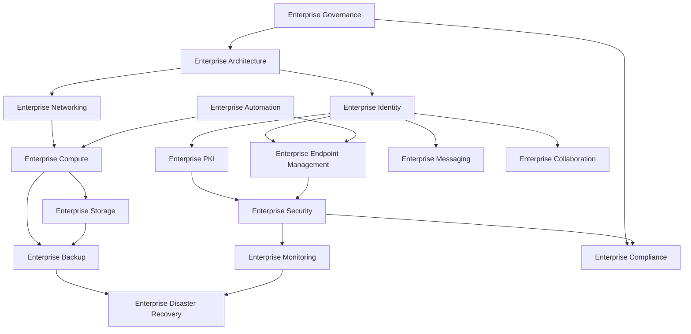

# Enterprise Capability Model

## Document Control

| Field | Value |
|---|---|
| Document ID | GEIL-ARCH-CAP-001 |
| Owner | Infrastructure Engineering |
| Status | Approved |
| Version | 1.0 |
| Last Reviewed | 2026-06-29 |
| Review Cycle | Quarterly |
| Classification | Internal Confidential |

## Purpose

The Enterprise Capability Model defines the permanent capabilities GEIL must support. Capabilities describe what GNTECH must be able to do as an enterprise; technologies describe how GNTECH currently implements those capabilities.

This model guides all future GEIL releases. A document that does not support an enterprise capability does not belong in GEIL.

!!! note "Adaptation"

    This capability model is written for GNTECH and the canonical environment in [Environment Specification](../../project/environment-specification.md). Other organizations may rename owners or sub-capabilities, but should preserve the distinction between capabilities and implementation technologies.

## Capability dependency overview

## Capability catalog

| Capability | Purpose | Business Value | Sub-capabilities | Dependencies | Owner | Current and Future Technologies |
|---|---|---|---|---|---|---|
| Enterprise Governance | Define decision rights, documentation rules, standards, ADRs, and operating model. | Prevents uncontrolled growth and preserves engineering consistency. | Charter, roadmap, backlog, ADRs, document index, review cycles, standards. | None. | Infrastructure Engineering | MkDocs, GitHub, Cloudflare Pages, future policy-as-code. |
| Enterprise Architecture | Define target state, capability dependencies, patterns, and technology boundaries. | Aligns investments with long-lived capabilities rather than products. | Reference architecture, capability model, principles, implementation philosophy. | Governance. | Infrastructure Engineering | Mermaid, MkDocs, ADRs, future architecture repository. |
| Enterprise Identity | Provide authoritative identity, authentication, authorization, and administrative boundaries. | Enables secure access to systems and services. | AD forest/domain, Entra ID, groups, privileged roles, hybrid identity, service identities. | Governance, Architecture, Networking. | Identity Engineering | Active Directory, Microsoft Entra ID, future identity provider alternatives. |
| Enterprise Networking | Provide routed, segmented, resilient, and observable connectivity. | Enables secure service access and future site expansion. | IP plan, VLANs, routing, firewalling, VPN, DNS forwarding, WAN, guest isolation. | Architecture. | Network Engineering | MikroTik CHR, switches, Cloudflare, future SD-WAN/SASE. |
| Enterprise Compute | Provide standardized compute platforms for infrastructure workloads. | Hosts enterprise services reliably and repeatably. | Hypervisors, VM templates, host lifecycle, resource scheduling, cluster patterns. | Networking, Storage, Security. | Platform Engineering | Proxmox VE, Windows Server 2025, future VMware/Hyper-V/Azure Stack alternatives. |
| Enterprise Storage | Provide durable storage for workloads, backups, logs, and shared services. | Protects data availability and performance. | VM storage, backup storage, file services, retention storage, archive. | Compute, Backup. | Platform Engineering | Proxmox storage, PBS storage, future SAN/NAS/cloud storage. |
| Enterprise Endpoint Management | Manage client devices throughout their lifecycle. | Ensures compliant, secure, supportable endpoints. | Enrollment, configuration, patching, compliance, wipe, Autopilot, device inventory. | Identity, Security. | Endpoint Engineering | Windows 11 Enterprise, Intune, Defender, future endpoint platforms. |
| Enterprise Messaging | Provide reliable business communication and mailbox services. | Enables durable internal and external communication. | Mailbox, calendaring, retention, anti-phishing, routing, eDiscovery. | Identity, Security, Compliance. | Collaboration Engineering | Microsoft 365 Exchange Online, future messaging platforms. |
| Enterprise Collaboration | Provide shared productivity, document collaboration, and meeting capabilities. | Improves workforce productivity and controlled information sharing. | Teams, SharePoint, OneDrive, external sharing, governance. | Identity, Compliance, Security. | Collaboration Engineering | Microsoft 365, Teams, SharePoint, future collaboration platforms. |
| Enterprise PKI | Provide certificate-based trust for authentication, encryption, and service identity. | Enables 802.1X, TLS, device trust, and secure automation. | Root CA, issuing CA, templates, CRL/AIA, lifecycle, revocation, monitoring. | Identity, Security, Networking. | Identity Engineering | AD CS, future managed PKI/HSM options. |
| Enterprise Security | Protect identities, devices, networks, data, and administrative planes. | Reduces breach likelihood and blast radius. | Least privilege, Zero Trust, Defender, privileged access, logging, incident response. | Identity, PKI, Endpoint, Monitoring. | Security Engineering | Microsoft Defender, Entra controls, MikroTik CHR, future SIEM/SOAR. |
| Enterprise Monitoring | Detect failures, risks, capacity pressure, and security anomalies. | Reduces downtime and improves response time. | Availability, performance, logs, synthetic checks, alert routing, dashboards. | All production capabilities. | Operations Engineering | Windows logs, Defender, Microsoft 365 health, future SIEM/observability stack. |
| Enterprise Backup | Protect data and configurations from loss or corruption. | Enables recovery from failure, error, and ransomware. | VM backup, system state, CA backup, firewall config, Microsoft 365 retention decisions. | Compute, Storage, Security. | Operations Engineering | Proxmox Backup Server, Windows Server Backup, future enterprise backup platform. |
| Enterprise Disaster Recovery | Restore services after major outage or compromise. | Preserves business continuity. | Recovery tiers, RTO/RPO, restore tests, alternate site, identity recovery. | Backup, Monitoring, Governance. | Operations Engineering | PBS, AD recovery, Cloud services, future DR orchestration. |
| Enterprise Automation | Make infrastructure changes repeatable and auditable. | Reduces manual error and accelerates recovery. | PowerShell, scripts, templates, CI checks, infrastructure as code where practical. | Governance, Identity, Compute, Cloud. | Infrastructure Engineering | PowerShell, GitHub, future Terraform/Ansible/Bicep. |
| Enterprise Compliance | Demonstrate control effectiveness and manage exceptions. | Supports audits, contracts, and regulated growth. | Evidence, control mapping, access reviews, exception register, retention. | Governance, Security, Monitoring. | Security Reviewer | GEIL docs, Microsoft audit logs, future GRC platform. |

## Capability ownership rules

- Each capability has one accountable owner.
- A document may support multiple capabilities, but its release ownership remains singular.
- Capability dependencies must be reviewed before implementation sequencing.
- A technology replacement updates implementation documents but should not invalidate the capability model.

## Cross-references

- [GEIL Master Plan](../../project/master-plan.md)
- [Enterprise Reference Architecture](enterprise-reference-architecture.md)
- [Architecture Principles](architecture-principles.md)
- [Technology Selection Matrix](technology-selection-matrix.md)
- [Epic and Release Architecture](../../project/epic-release-architecture.md)
