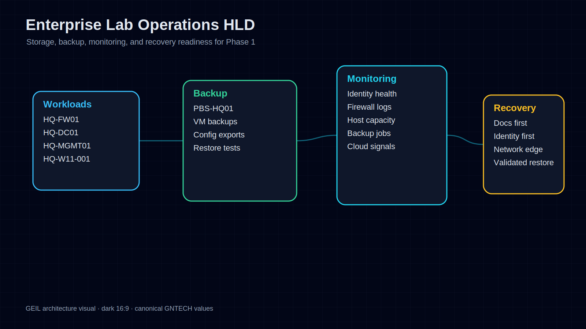
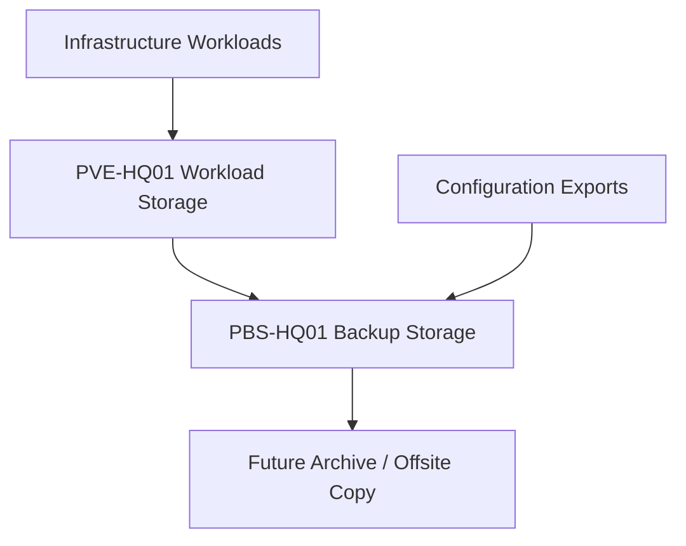
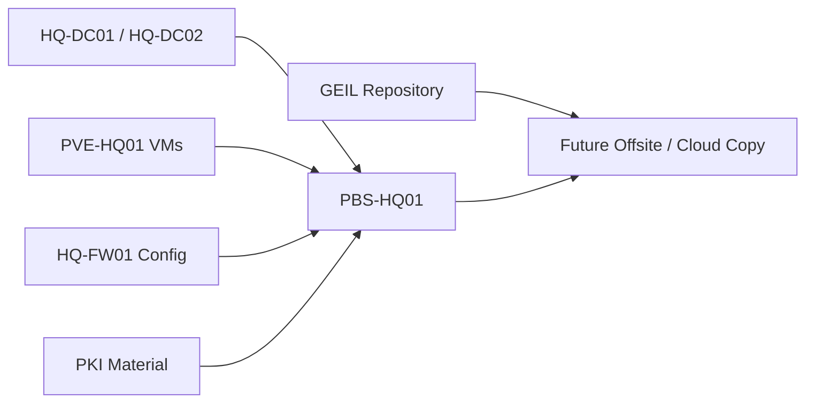
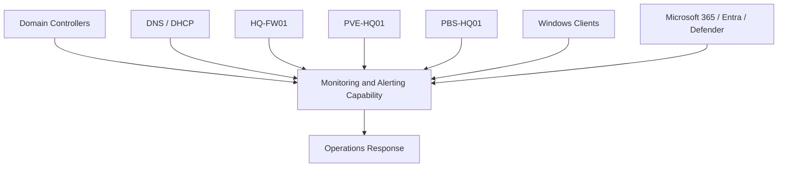
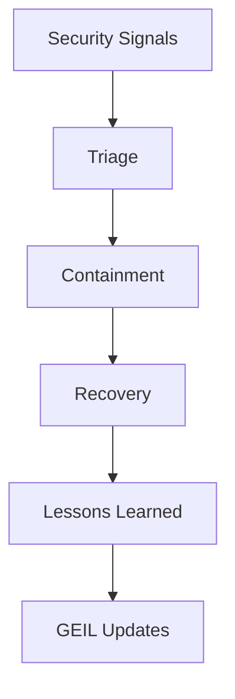
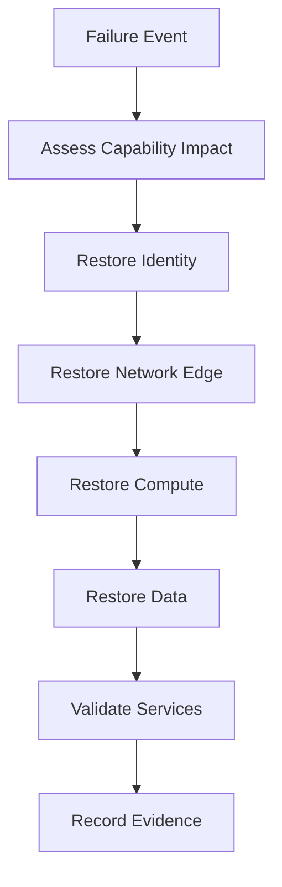

# Enterprise Lab Operations HLD

## Document Control

| Field | Value |
|---|---|
| Document ID | GEIL-ARCH-LAB-OPS-001 |
| Owner | Infrastructure Engineering |
| Status | Approved |
| Version | 1.0 |
| Last Reviewed | 2026-06-29 |
| Review Cycle | Quarterly |
| Classification | Internal Confidential |

## Purpose

This document defines the storage, backup, monitoring, disaster recovery, and operational architecture High-Level Design for the GEIL Enterprise Lab Blueprint.

It is architecture only. It does not provide backup jobs, monitoring configuration, or runbook procedures.

## Readable visual asset: Enterprise Lab Operations HLD

This visual summarizes the operations HLD around workloads, backup, monitoring, and recovery priorities. It is intentionally split from detailed backup and monitoring Mermaid flows to keep normal-page-width rendering readable.

!!! note "Adaptation"

    This visual uses canonical GNTECH systems including `PBS-HQ01`, `HQ-FW01`, `HQ-DC01`, `HQ-MGMT01`, and `HQ-W11-001`. Adaptations must update the Environment Specification before regenerating the asset.

## Storage architecture

Storage principles:

- Workload storage and backup storage are separate capabilities.
- `PVE-HQ01` hosts workload storage for Phase 1.
- `PBS-HQ01` provides backup storage and backup catalog capability.
- Future architecture must support offsite or immutable backup copies.
- Domain controllers are not long-term file service platforms.

## Backup architecture

Backup design principles:

- Identity recovery has highest priority.
- Firewall configuration exports are required after approved changes.
- PKI backup must include CA database, configuration, and private key material according to security policy.
- GEIL documentation must remain recoverable independently of the infrastructure it documents.
- Restore tests are part of architecture readiness.

## Monitoring architecture

Monitoring domains:

| Domain | Required Signals |
|---|---|
| Identity | DC health, replication, privileged group changes, authentication failures |
| Network | WAN status, firewall changes, blocked flows, gateway health |
| Compute | Host health, VM state, CPU, memory, storage pressure |
| Backup | Job success, repository health, restore test status |
| Endpoint | Defender health, compliance, encryption, update posture |
| Cloud | Sign-in risk, service health, admin role changes, Conditional Access changes |
| Documentation | Build status, repository health, publishing status |

## Security operations architecture

Security operations principles:

- Privileged activity is monitored.
- Emergency access sign-in generates critical alerting.
- Tier violations trigger containment and credential rotation review.
- Security exceptions require owner, expiry, and compensating control.

## Disaster recovery strategy

Recovery priorities:

1. Documentation and recovery instructions.
2. Identity and privileged access.
3. Network edge and routing.
4. DNS and DHCP.
5. Compute and storage.
6. PKI and certificate validation.
7. Endpoint management and cloud access.
8. Business applications and collaboration.

## Disaster recovery target model

| Recovery Area | Phase 1 Target | Future Enterprise Target |
|---|---|---|
| Documentation | GitHub and Cloudflare Pages recoverability | Multi-channel emergency access to docs |
| Identity | Recover `HQ-DC01` from backup or rebuild from documented state | Multi-DC, tested forest recovery, regional resilience |
| Firewall | Restore `HQ-FW01` from encrypted config export | HA edge and regional firewall policy management |
| Compute | Restore VMs to `PVE-HQ01` | Cluster or alternate-host recovery |
| Backup | `PBS-HQ01` local restore | Offsite/immutable backup copies |
| Cloud | Emergency access accounts | Formal tenant recovery and Conditional Access rollback |

## Operational readiness model

A capability is operationally ready only when the following exist:

- Architecture document.
- Implementation document.
- Validation criteria.
- Rollback or recovery path.
- Monitoring signal.
- Backup or configuration protection method.
- Owner and escalation route.

## Cross-references

- [Enterprise Lab Blueprint HLD](enterprise-lab-blueprint.md)
- [Environment Specification](../../project/environment-specification.md)
- [Monitoring and Alerting](../operations/monitoring-alerting.md)
- [Backup and Recovery](../operations/backup-recovery.md)
- [Security Operations](../operations/security-operations.md)
- [Troubleshooting](../operations/troubleshooting.md)
