# Enterprise Reference Architecture

## Document Control

| Field | Value |
|---|---|
| Document ID | GEIL-ARCH-ERA-001 |
| Owner | Infrastructure Engineering |
| Status | Approved |
| Version | 1.0 |
| Last Reviewed | 2026-06-29 |
| Review Cycle | Quarterly |
| Classification | Internal Confidential |

## Purpose

This document defines the strategic target architecture for the final GEIL multinational environment. It is intentionally technology-neutral at the capability layer while acknowledging current GNTECH implementation choices documented in the [Environment Specification](../../project/environment-specification.md).

This is not an implementation guide. It is the architectural frame that future implementation guides must support.

## Architecture context

GEIL's final architecture is a layered enterprise platform. Each layer exposes capabilities to the layers above and consumes capabilities from the layers below.

## Business Layer

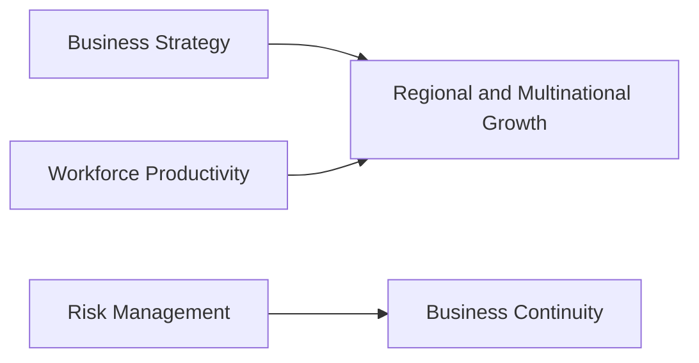

Purpose: define why infrastructure exists. The business layer drives requirements for security, availability, compliance, collaboration, and scale.

## Application Layer

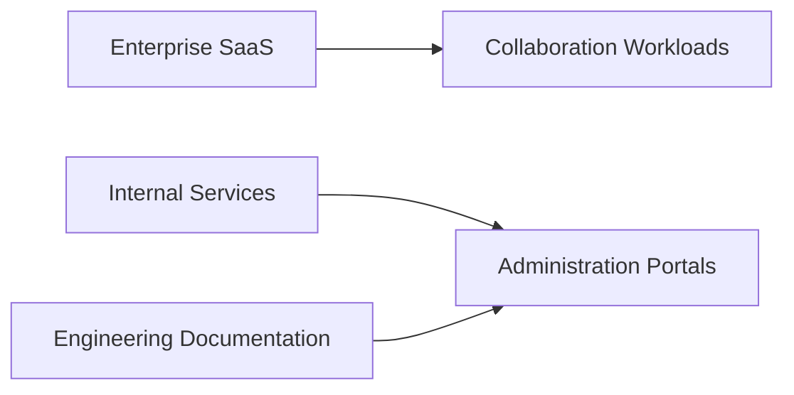

Purpose: provide applications and services consumed by GNTECH users and administrators.

## Identity Layer

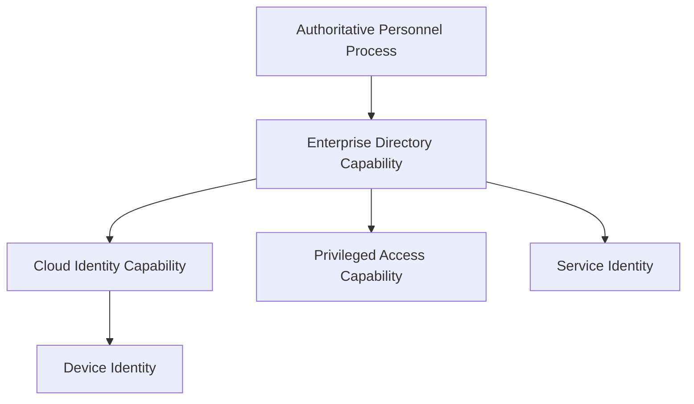

Purpose: establish the authoritative identity, authentication, authorization, and administrative boundary model.

## Network Layer

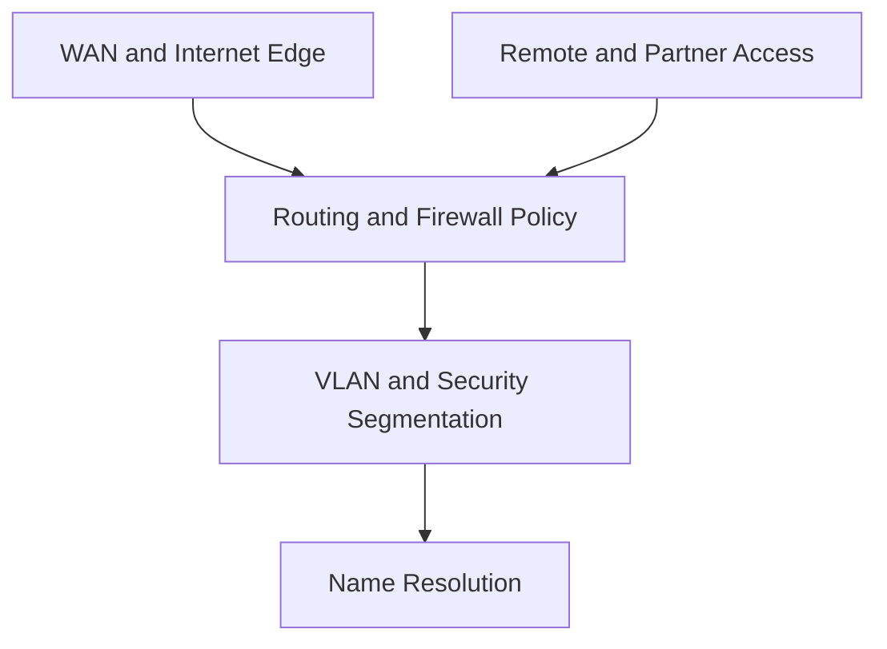

Purpose: connect users, services, sites, and cloud platforms with segmentation and controlled access.

## Security Layer

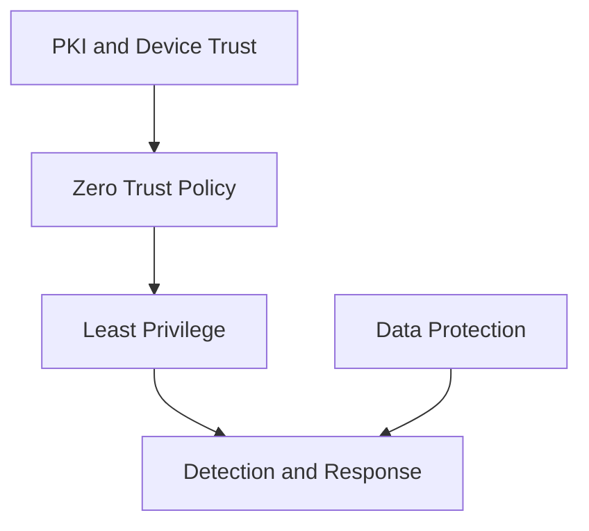

Purpose: enforce protection across identity, device, network, workload, data, and operations.

## Platform Layer

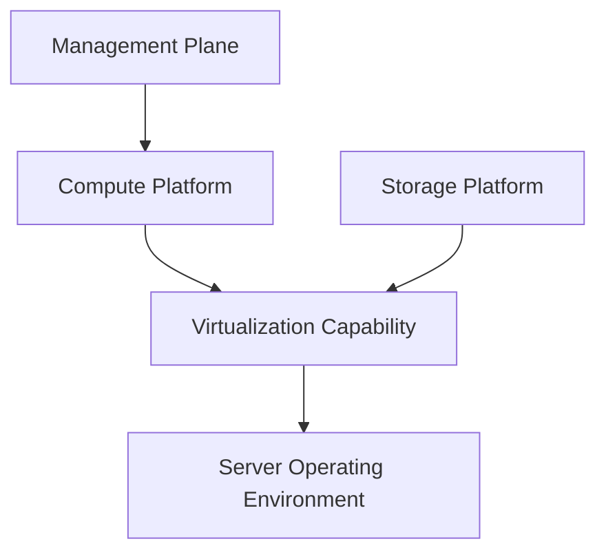

Purpose: provide stable compute and storage capacity for enterprise services.

## Cloud Layer

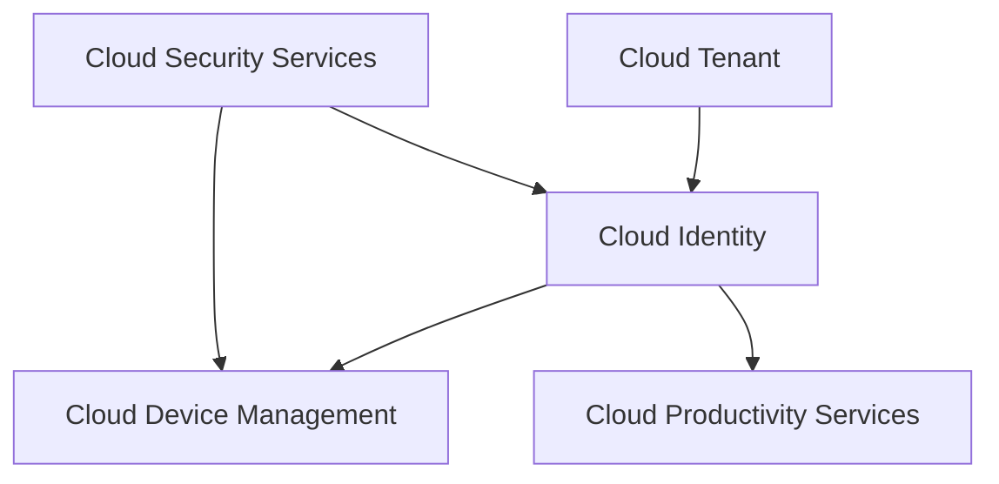

Purpose: integrate Microsoft 365, cloud identity, endpoint management, and cloud security into the enterprise architecture.

## Operations Layer

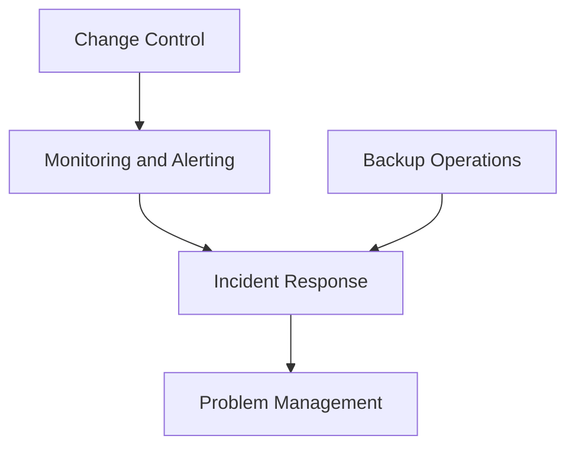

Purpose: operate the environment predictably with evidence, response paths, and continuous improvement.

## Automation Layer

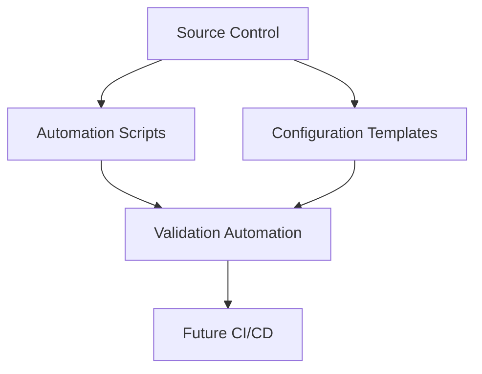

Purpose: make infrastructure changes repeatable, reviewable, and testable.

## Recovery Layer

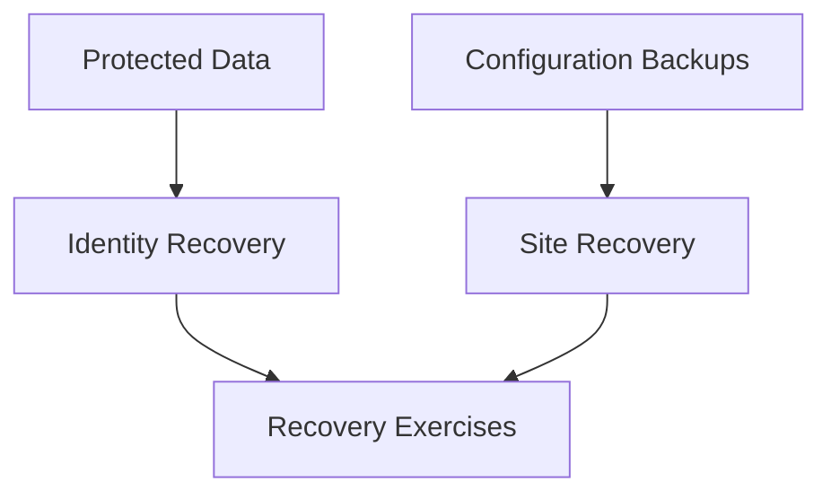

Purpose: restore enterprise capabilities after outage, corruption, operator error, or compromise.

## Readable visual asset: Enterprise Reference Architecture

This visual provides a readable architecture-layer view for normal MkDocs page width. It groups business, identity, network/security, platform/cloud, and operations/recovery capabilities without compressing every layer into a single complex Mermaid hierarchy.

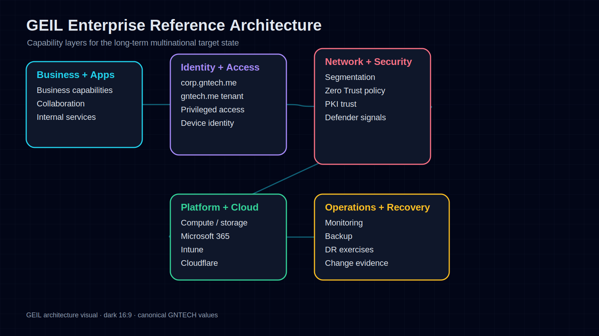

!!! note "Adaptation"

    This visual includes GNTECH identity anchors `corp.gntech.me` and `gntech.me`. Organizations adapting this model should preserve the capability layering while replacing canonical environment values in the Environment Specification.

## Integrated target architecture

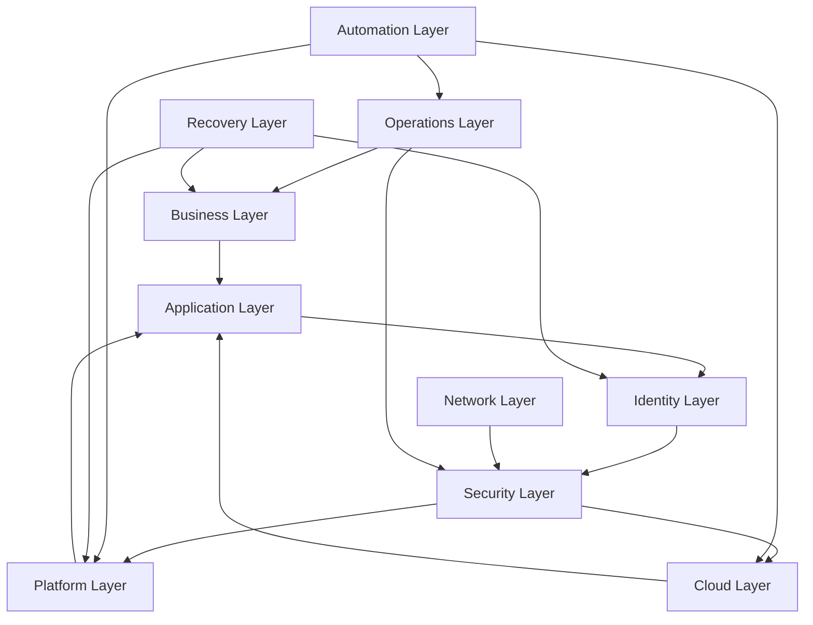

## Multinational target characteristics

| Characteristic | Target State |
|---|---|
| Identity | Central governance with regional delegation and emergency recovery paths. |
| Network | Regional segmentation, controlled WAN/cloud connectivity, and explicit trust boundaries. |
| Security | Zero Trust controls, privileged access isolation, monitoring, and evidence-backed exceptions. |
| Operations | Regional operations with central standards, shared telemetry, and defined escalation. |
| Recovery | Tested recovery for identity, network, cloud administration, documentation, and core services. |
| Automation | Source-controlled automation and validation for repeatable regional deployments. |

## Cross-references

- [GEIL Master Plan](../../project/master-plan.md)
- [Enterprise Capability Model](enterprise-capability-model.md)
- [Architecture Principles](architecture-principles.md)
- [Implementation Philosophy](implementation-philosophy.md)
- [Technology Selection Matrix](technology-selection-matrix.md)
