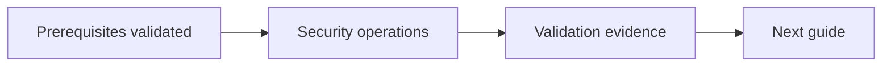

# Security Operations

## Document Control

| Field | Value |
|---|---|
| Document ID | GEIL-OPS-SEC-001 |
| Owner | Infrastructure Engineering |
| Status | Draft |
| Version | 1.0 |
| Last Reviewed | 2026-06-29 |
| Review Cycle | Quarterly |
| Classification | Internal Confidential |

## Purpose

Define security operations requirements for identity, endpoint, network, and infrastructure administration.

## Daily checks

- Entra risky users and sign-ins.
- Defender active alerts.
- Domain controller critical events.
- Backup job failures.
- Firewall configuration changes.

## Weekly checks

- Privileged group membership changes.
- Certificate expiry under 60 days.
- Patch compliance.
- Intune policy failure trends.

## PowerShell validation

```powershell
Get-ADGroupMember "Domain Admins"
Get-ADGroupMember "Enterprise Admins"
Get-EventLog -LogName Security -Newest 50
```

Expected result: privileged membership matches approved access records.

## Incident response

1. Preserve logs.
2. Disable compromised account or device access.
3. Revoke sessions and rotate credentials.
4. Determine blast radius.
5. Restore trusted state.
6. Document lessons learned and update GEIL if procedure changes.

## Rollback

Security exceptions require owner, expiry, compensating control, and approval. Expired exceptions must be removed.


## Audit Correction Notes

!!! success "Execution-order audit"

    This guide was audited for command order, object dependencies, canonical GEIL values, rollback coverage, validation gates, and active MikroTik CHR firewall references. Follow dependency order exactly: validate prerequisites, create objects, validate objects, apply dependent settings, then capture evidence.

- Audit focus: Operate security controls after privileged access and logging baselines exist.
- Active Phase 1 firewall implementation: MikroTik CHR / RouterOS on `HQ-FW01`.
- OPNsense is superseded and must not be used for active Phase 1 deployment.

## Learning Objectives

After completing this guide you will understand:

- What the `Security operations` workstream changes.
- Why the sequence matters.
- Which validations prove the change worked.
- How to recover safely if a step fails.

## What You Will Build

By the end of this guide you will have:

- ✓ Completed the `Security operations` workstream.
- ✓ Captured validation evidence.
- ✓ Preserved rollback or recovery options.

## Estimated Time

30-90 minutes depending on prerequisite readiness and evidence capture.

## Difficulty

Intermediate. Follow the documented order and validate after each major stage.

## Risk Level

Medium. The risk is controlled by validating prerequisites, splitting commands into small blocks, and keeping rollback options available.

## Service Impact

Maintenance window recommended when the guide changes network, identity, firewall, or policy behavior. Read-only validation steps have no service impact.

## Prerequisites

- Canonical GEIL values reviewed in [Environment Specification](../../project/environment-specification.md).
- Previous dependency completed where applicable.
- Administrative access and console recovery path available.
- Secrets stored in the approved password manager, not Git.

## Expected Starting State

- Required prerequisite guide is complete.
- No command in this guide references an object before it exists.
- Existing public/non-GEIL resources remain unchanged.

## Expected Ending State

- `Security operations` is complete and validated.
- Evidence is captured.
- Rollback or recovery path remains documented.

## Architecture Overview



## Background Knowledge

This guide follows the GEIL educational method: teach the purpose, validate prerequisites, apply changes in dependency order, validate immediately, and preserve recovery paths.

## Step-by-Step Procedure

Follow the procedure sections in this document in order. Do not skip validation gates or combine risky command blocks.

## Validation after each major stage

Validate immediately after each change block. Do not continue when expected output does not match the guide.

## Expected Results

- Commands complete without referencing missing objects.
- Canonical GEIL values are visible in outputs.
- No active OPNsense deployment path remains for Phase 1 firewall work.
- `10.10.x.x` remains limited to existing non-GEIL `PROD`/`TEST` references only.

## Evidence to capture

- Command output proving prerequisite state.
- Command output proving ending state.
- Relevant GUI screenshots where applicable.
- Rollback checkpoint or export evidence where applicable.

## Common Mistakes

| Mistake | Impact | Correction |
|---|---|---|
| Running steps out of order | Commands fail or partial state is created | Return to the last validation gate |
| Referencing missing objects | Invalid commands or unsafe defaults | Create and validate the object first |
| Skipping rollback capture | Recovery is slower | Capture snapshot/export before risky changes |

## Troubleshooting

Start with read-only validation. Confirm prerequisites, object existence, canonical values, and logs before changing configuration.

## Knowledge Check

1. What prerequisite must exist before this guide can run safely?
2. Which validation proves the main change worked?
3. What rollback action is safest if the last command fails?

## Next Guide

Continue to:

- [Backup and Recovery](backup-recovery.md)

## Deployment Verified

| Field | Value |
|---|---|
| Validated on | Not yet field validated. Must pass this guide, the code-block audit, and clean-environment review before production execution. |
| Windows Server version | Not yet field validated |
| RouterOS version | Not applicable unless the guide explicitly configures RouterOS |
| Proxmox version | Not applicable unless the guide explicitly configures Proxmox |
| Deployment date | Not yet field validated |
| Deployment notes | Not yet field validated. Must pass this guide, the code-block audit, and clean-environment review before production execution. |
| Known caveats | Treat as documentation-ready but not field-proven until deployment evidence is captured. |
