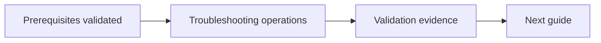

# Troubleshooting

## Document Control

| Field | Value |
|---|---|
| Document ID | GEIL-OPS-TS-001 |
| Owner | Infrastructure Engineering |
| Status | Draft |
| Version | 1.0 |
| Last Reviewed | 2026-06-29 |
| Review Cycle | Quarterly |
| Classification | Internal Confidential |

!!! note "Adaptation"

    This document uses canonical GNTECH values from the [Environment Specification](../../project/environment-specification.md). Organizations adapting this design should change the environment specification first, then update all affected DNS zones, certificates, PowerShell commands, Group Policies, VLANs, firewall rules, and service configurations.

## Purpose

Provide first-response troubleshooting workflow for GEIL infrastructure incidents.

## Incident triage order

1. Scope: one user, one device, one site, or global.
2. Identity: sign-in, MFA, token, account lockout, replication.
3. Network: DNS, DHCP, routing, firewall, VPN.
4. Endpoint: Intune policy, Defender, Windows update, certificate state.
5. Service: Microsoft 365 service health, server event logs, application logs.


## Canonical platform and identity quick checks

Before troubleshooting a cross-service issue, confirm the incident is being evaluated against the current canonical model:

| Layer | Canonical value |
|---|---|
| Firewall | `HQ-FW01` running MikroTik CHR / RouterOS |
| Forest | `corp.gntech.me` |
| NetBIOS | `GNTECH` |
| Primary user UPN suffix | `gntech.me` |
| User sign-in | `username@gntech.me` |
| Legacy logon | `GNTECH\username` |
| Server FQDNs | `*.corp.gntech.me` |

If evidence shows an active OPNsense path, the old `CORP` NetBIOS namespace, or a production `username@corp.gntech.me` sign-in pattern, treat it as architecture drift and stop before applying fixes.

## AD health commands

Run on: `HQ-MGMT01 or HQ-DC01 during bootstrap`

When: troubleshooting domain health, replication, or authentication failures.

Expected outcome: domain controller diagnostics and replication summary complete without critical failures.

```powershell
dcdiag /e /c /v
repadmin /replsummary
Get-ADReplicationFailure -Scope Forest
```

## DNS commands

Run on: `HQ-MGMT01 or affected Windows Client`

When: troubleshooting DNS, domain discovery, or client connectivity failures.

Expected outcome: AD DNS records resolve and the DNS client cache is available for review.

```powershell
Resolve-DnsName corp.gntech.me
Resolve-DnsName _ldap._tcp.dc._msdcs.corp.gntech.me -Type SRV
ipconfig /displaydns
```

## WinRM troubleshooting quick checks

Use the authoritative [Enterprise WinRM Management](../../microsoft-core/administration/enterprise-winrm-management.md) guide for design and validation details. The common failure pattern is treating WinRM `IPv4Filter` as a source ACL. It is not. Source access is controlled by Windows Defender Firewall, MikroTik firewall policy, VLAN segmentation, and Kerberos authentication.

Run on: `HQ-MGMT01`

When: troubleshooting WinRM management from the Management VLAN to a domain-joined Windows client.

Expected outcome: DNS resolves, TCP `5985` responds, WSMan responds, and PowerShell Remoting succeeds with Kerberos.

```powershell
Resolve-DnsName HQ-W11-001
Test-NetConnection HQ-W11-001 -Port 5985
Test-WSMan HQ-W11-001
Invoke-Command -ComputerName HQ-W11-001 -ScriptBlock {
    hostname
    whoami
}
```

Run on: `Windows Client`

When: the management workstation cannot reach WinRM on the target client.

Expected outcome: WinRM listener uses `IPv4Filter = *`, Windows Firewall allows TCP `5985` from `172.20.10.0/24`, and Kerberos/domain connectivity is healthy.

```powershell
winrm enumerate winrm/config/listener
Get-NetFirewallRule -DisplayGroup "Windows Remote Management" |
    Select DisplayName, Enabled, Profile
Get-NetFirewallAddressFilter -AssociatedNetFirewallRule (
    Get-NetFirewallRule -DisplayGroup "Windows Remote Management"
) | Select RemoteAddress
```

## Expected result

The failing layer is identified with evidence before remediation begins.

## Rollback

If a fix worsens impact, revert the last change, restore previous firewall/GPO/policy configuration, and escalate to incident command.


## Audit Correction Notes

!!! success "Execution-order audit"

    This guide was audited for command order, object dependencies, canonical GEIL values, rollback coverage, validation gates, and active MikroTik CHR firewall references. Follow dependency order exactly: validate prerequisites, create objects, validate objects, apply dependent settings, then capture evidence.

- Audit focus: Use a safe diagnostic sequence before making changes.
- Active Phase 1 firewall implementation: MikroTik CHR / RouterOS on `HQ-FW01`.
- OPNsense is superseded and must not be used for active Phase 1 deployment.

## Learning Objectives

After completing this guide you will understand:

- What the `Troubleshooting operations` workstream changes.
- Why the sequence matters.
- Which validations prove the change worked.
- How to recover safely if a step fails.

## What You Will Build

By the end of this guide you will have:

- ✓ Completed the `Troubleshooting operations` workstream.
- ✓ Captured validation evidence.
- ✓ Preserved rollback or recovery options.

## Estimated Time

30-90 minutes depending on prerequisite readiness and evidence capture.

## Difficulty

Intermediate. Follow the documented order and validate after each major stage.

## Risk Level

Medium. The risk is controlled by validating prerequisites, splitting commands into small blocks, and keeping rollback options available.

## Service Impact

Maintenance window recommended when the guide changes network, identity, firewall, or policy behavior. Read-only validation steps have no service impact.

## Prerequisites

- Canonical GEIL values reviewed in [Environment Specification](../../project/environment-specification.md).
- Previous dependency completed where applicable.
- Administrative access and console recovery path available.
- Secrets stored in the approved password manager, not Git.

## Expected Starting State

- Required prerequisite guide is complete.
- No command in this guide references an object before it exists.
- Existing public/non-GEIL resources remain unchanged.

## Expected Ending State

- `Troubleshooting operations` is complete and validated.
- Evidence is captured.
- Rollback or recovery path remains documented.

## Architecture Overview



## Background Knowledge

This guide follows the GEIL educational method: teach the purpose, validate prerequisites, apply changes in dependency order, validate immediately, and preserve recovery paths.

## Step-by-Step Procedure

Follow the procedure sections in this document in order. Do not skip validation gates or combine risky command blocks.

## Validation after each major stage

Validate immediately after each change block. Do not continue when expected output does not match the guide.

## Expected Results

- Commands complete without referencing missing objects.
- Canonical GEIL values are visible in outputs.
- No active OPNsense deployment path remains for Phase 1 firewall work.
- `10.10.x.x` remains limited to existing non-GEIL `PROD`/`TEST` references only.

## Evidence to capture

- Command output proving prerequisite state.
- Command output proving ending state.
- Relevant GUI screenshots where applicable.
- Rollback checkpoint or export evidence where applicable.

## Common Mistakes

| Mistake | Impact | Correction |
|---|---|---|
| Running steps out of order | Commands fail or partial state is created | Return to the last validation gate |
| Referencing missing objects | Invalid commands or unsafe defaults | Create and validate the object first |
| Skipping rollback capture | Recovery is slower | Capture snapshot/export before risky changes |

## Troubleshooting

Start with read-only validation. Confirm prerequisites, object existence, canonical values, and logs before changing configuration.

## Knowledge Check

1. What prerequisite must exist before this guide can run safely?
2. Which validation proves the main change worked?
3. What rollback action is safest if the last command fails?

## Next Guide

Continue to:

- [Security Operations](security-operations.md)

## Deployment Verified

| Field | Value |
|---|---|
| Validated on | Not yet field validated. Must pass this guide, the code-block audit, and clean-environment review before production execution. |
| Windows Server version | Not yet field validated |
| RouterOS version | Not applicable unless the guide explicitly configures RouterOS |
| Proxmox version | Not applicable unless the guide explicitly configures Proxmox |
| Deployment date | Not yet field validated |
| Deployment notes | Not yet field validated. Must pass this guide, the code-block audit, and clean-environment review before production execution. |
| Known caveats | Treat as documentation-ready but not field-proven until deployment evidence is captured. |
