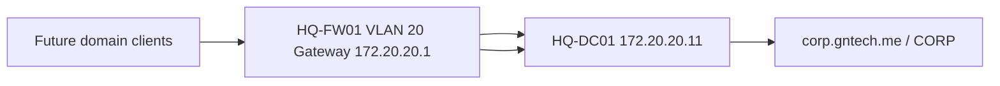

# Active Directory Implementation

## Document Control

| Field | Value |
|---|---|
| Document ID | GEIL-MSC-AD-001 |
| Owner | Infrastructure Engineering |
| Status | Draft |
| Version | 2.0 |
| Last Reviewed | 2026-06-29 |
| Review Cycle | Quarterly |
| Classification | Internal Confidential |

!!! note "Adaptation"

    This guide uses canonical GNTECH values from the [Environment Specification](../project/environment-specification.md), including `corp.gntech.me`, NetBIOS name `CORP`, `HQ-DC01`, and server IP `172.20.20.11`. Change the Environment Specification first before adapting commands.

## Purpose

Deploy the first Active Directory Domain Services domain controller for the GEIL enterprise foundation. This guide promotes `HQ-DC01` into the first domain controller for the `corp.gntech.me` forest and prepares the environment for DNS, DHCP, Group Policy, PKI, and privileged access controls.

## Learning Objectives

After completing this guide you will understand:

- Why Active Directory is the identity foundation for GEIL.
- How `HQ-DC01` integrates with the HQ network and future Microsoft services.
- How to install AD DS and create the `corp.gntech.me` forest.
- How to validate domain controller health.
- How to troubleshoot promotion, DNS, and time-related failures.

## What You Will Build

By the end of this guide you will have:

- ✓ `HQ-DC01` promoted as the first domain controller.
- ✓ `corp.gntech.me` forest created.
- ✓ NetBIOS name `CORP` configured.
- ✓ AD-integrated DNS installed.
- ✓ Baseline OUs created.
- ✓ Validation evidence captured for `dcdiag`, DNS, and FSMO roles.

## Estimated Time

45-90 minutes, excluding Windows Server installation and update time.

## Difficulty

Intermediate.

This guide uses Windows Server Manager and PowerShell. The commands are direct, but forest creation is foundational and should be performed carefully.

## Risk Level

Medium.

Creating the first forest is a major identity decision. In a lab foundation, rollback is a VM snapshot or rebuild. After production use begins, forest rollback is not a casual operation.

## Service Impact

No impact.

This guide creates the first GEIL directory service before production users or workloads depend on it.

## Prerequisites

- [Enterprise Lab Identity HLD](../architecture/enterprise-lab-identity-hld.md) reviewed.
- [Phase 1 Acceptance Package](../platform/phase-1-acceptance-package.md) approved or approved with accepted exceptions.
- `HQ-DC01` VM created from the Phase 1 build plan.
- Windows Server 2025 installed and updated on `HQ-DC01`.
- `HQ-DC01` static IP configured as `172.20.20.11/24`.
- Default gateway configured as `172.20.20.1`.
- Preferred DNS temporarily points to itself or the bootstrap resolver until AD DNS is installed.
- Local Administrator credentials stored in the approved password manager.
- Console or RDP access to `HQ-DC01`.
- Snapshot `CP-DC01-OS` exists before promotion.

## Architecture Overview

`HQ-DC01` is the first domain controller and DNS server for `corp.gntech.me`. It lives on VLAN 20 Servers behind `HQ-FW01`.



!!! info "Architecture references"

    This guide implements the identity baseline from [Enterprise Lab Identity HLD](../architecture/enterprise-lab-identity-hld.md) and depends on the E02 HQ foundation build and validation documents.

## Background Knowledge

### What is Active Directory?

Active Directory Domain Services stores identities, groups, computers, policies, and authentication data for Windows enterprise environments.

### What is a domain controller?

A domain controller is a server that hosts a writable copy of the directory and authenticates domain users, computers, and services.

### What is a forest?

A forest is the top-level AD security boundary. GEIL uses one forest named `corp.gntech.me`.

### What is AD-integrated DNS?

AD-integrated DNS stores DNS zones in Active Directory so domain controllers can replicate DNS records securely.

## Step-by-Step Procedure

### Step 1: Verify the starting state

#### Goal

Confirm `HQ-DC01` is ready for promotion.

#### Why this step matters

AD DS depends on correct IP, DNS, gateway, hostname, and time. Promotion failures are often caused by basic network or name configuration problems.

#### Navigation path

Use an elevated PowerShell session on `HQ-DC01`.

#### Commands

```powershell
hostname
Get-NetIPConfiguration
Get-Date
Test-NetConnection 172.20.20.1
```

#### Expected values

You should now see:

- Hostname: `HQ-DC01`.
- IPv4 address: `172.20.20.11`.
- Default gateway: `172.20.20.1`.
- Gateway test succeeds.

#### Validate this step

```powershell
Resolve-DnsName corp.gntech.me -ErrorAction SilentlyContinue
```

It is acceptable for this to fail before the forest exists. Record the result as pre-AD evidence.

#### Rollback

No rollback is required for read-only validation.

### Step 2: Create a pre-promotion checkpoint

#### Goal

Create a safe rollback point before installing AD DS.

#### Why this step matters

The clean OS checkpoint is the safest rollback path if forest creation fails before production use.

#### Commands from `PVE-HQ01`

```bash
qm snapshot 110 CP-DC01-PRE-ADDS --description "HQ-DC01 before first AD DS forest promotion"
qm listsnapshot 110
```

#### Expected results

You should now see:

- Snapshot `CP-DC01-PRE-ADDS` listed for VM 110.

#### Rollback

```bash
qm rollback 110 CP-DC01-PRE-ADDS
```

!!! danger "Use rollback only before production use"

    Do not roll back a domain controller snapshot after other systems have joined or replicated unless you have a tested AD recovery plan.

### Step 3: Install AD DS and DNS roles

#### Goal

Install the required Windows roles.

#### Why this step matters

The role binaries must exist before forest creation can begin.

#### Commands

```powershell
Install-WindowsFeature AD-Domain-Services,DNS -IncludeManagementTools
Get-WindowsFeature AD-Domain-Services,DNS
```

#### Expected results

You should now see:

- `AD-Domain-Services` installed.
- `DNS` installed.

#### Rollback

Before promotion, remove the features if required:

```powershell
Uninstall-WindowsFeature AD-Domain-Services,DNS -Remove
```

### Step 4: Create the `corp.gntech.me` forest

#### Goal

Promote `HQ-DC01` as the first domain controller.

#### Why this step matters

This creates the identity authority for GEIL. All future Microsoft identity services depend on this forest and domain name.

#### Commands

```powershell
$SafeModePassword = Read-Host "Enter Directory Services Restore Mode password" -AsSecureString
Install-ADDSForest `
  -DomainName "corp.gntech.me" `
  -DomainNetbiosName "CORP" `
  -ForestMode WinThreshold `
  -DomainMode WinThreshold `
  -InstallDNS `
  -SafeModeAdministratorPassword $SafeModePassword `
  -NoRebootOnCompletion:$false `
  -Force
```

#### Expected results

You should now see:

- The server installs AD DS.
- The server reboots.
- The logon screen allows domain logon for `CORP`.

#### Validate this step

After reboot, log in with an approved domain admin context and run:

```powershell
Get-ADDomain | Select-Object DNSRoot,NetBIOSName,DomainMode
Get-ADForest | Select-Object Name,ForestMode
```

Expected output:

- DNSRoot: `corp.gntech.me`.
- NetBIOSName: `CORP`.
- Forest name: `corp.gntech.me`.

#### Rollback

If promotion fails before production use:

1. Capture the error message.
2. Roll back to `CP-DC01-PRE-ADDS` or rebuild `HQ-DC01`.
3. Fix the root cause.
4. Retry promotion.

### Step 5: Create baseline organizational units

#### Goal

Create the first OU structure for servers, workstations, groups, service accounts, disabled objects, and administration.

#### Why this step matters

OUs give GEIL a predictable management structure for future GPOs, delegation, and lifecycle operations.

#### Commands

```powershell
$Base = "DC=corp,DC=gntech,DC=me"
$OUs = "Admin","Servers","Workstations","Groups","Service Accounts","Disabled Objects"
foreach ($OU in $OUs) {
    New-ADOrganizationalUnit -Name $OU -Path $Base -ProtectedFromAccidentalDeletion $true
}
Get-ADOrganizationalUnit -Filter * -SearchBase $Base | Select-Object Name,DistinguishedName
```

#### Expected results

You should now see each baseline OU listed.

#### Rollback

If an OU was created with the wrong name, remove it only if it is empty:

```powershell
Set-ADOrganizationalUnit -Identity "OU=WrongName,DC=corp,DC=gntech,DC=me" -ProtectedFromAccidentalDeletion $false
Remove-ADOrganizationalUnit -Identity "OU=WrongName,DC=corp,DC=gntech,DC=me" -Confirm:$false
```

## Validation

Run:

```powershell
dcdiag /v
repadmin /replsummary
Get-ADDomainController -Filter * | Select-Object HostName,Site,IsGlobalCatalog
Get-ADDomain | Select-Object DNSRoot,DomainMode,PDCEmulator,RIDMaster,InfrastructureMaster
Resolve-DnsName _ldap._tcp.dc._msdcs.corp.gntech.me -Type SRV
```

Expected results:

- No critical `dcdiag` failures.
- Replication summary shows no failures for the single-DC state.
- `HQ-DC01` is a global catalog.
- FSMO roles are identified.
- LDAP SRV records resolve.

## Common Mistakes

| Mistake | Symptom | Fix |
|---|---|---|
| Wrong hostname before promotion | Domain controller has incorrect server name | Roll back before production use and rename before promotion |
| Wrong DNS name | Forest does not match `corp.gntech.me` | Rebuild before production use; do not rename a new forest casually |
| No snapshot | Failed promotion has no safe checkpoint | Rebuild VM from clean OS state |
| Time skew | Authentication or promotion errors | Correct time source and retry |

## Troubleshooting

- If promotion fails, review `C:\Windows\Debug\DCPromo.log`.
- If DNS records are missing, restart Netlogon with `Restart-Service Netlogon` and recheck SRV records.
- If `dcdiag` reports DNS errors, run `dcdiag /test:dns /v` for detail.
- If the server cannot reach the gateway, return to the Phase 1 network validation plan.

## Rollback

Rollback before production use:

```bash
qm shutdown 110
qm rollback 110 CP-DC01-PRE-ADDS
qm start 110
```

After production use begins, use Active Directory recovery procedures instead of VM rollback.

## Evidence Collection

Capture:

- Screenshot: Server Manager showing AD DS and DNS installed.
- Screenshot: Active Directory Users and Computers showing baseline OUs.
- Command output: `Get-ADDomain`.
- Command output: `Get-ADForest`.
- Command output: `dcdiag /v`.
- Command output: `_ldap._tcp.dc._msdcs.corp.gntech.me` SRV lookup.

!!! example "Screenshot Required"

    Path: `Server Manager -> Tools -> Active Directory Users and Computers`

    Expected result:

    - Domain `corp.gntech.me` is visible.
    - Baseline OUs are visible.

    Store screenshots under `docs/assets/images/active-directory-implementation/`.

## Knowledge Check

1. Why does GEIL use `corp.gntech.me` for the AD forest instead of the public `gntech.me` namespace?
2. Why should the pre-promotion snapshot not be rolled back after production use begins?
3. What DNS record proves clients can locate domain controllers?
4. Why are baseline OUs created before broad workload deployment?
5. Which command identifies the FSMO role holders?

## Next Guide

Continue to:

- [DNS and DHCP Implementation](dns-dhcp-implementation.md)
