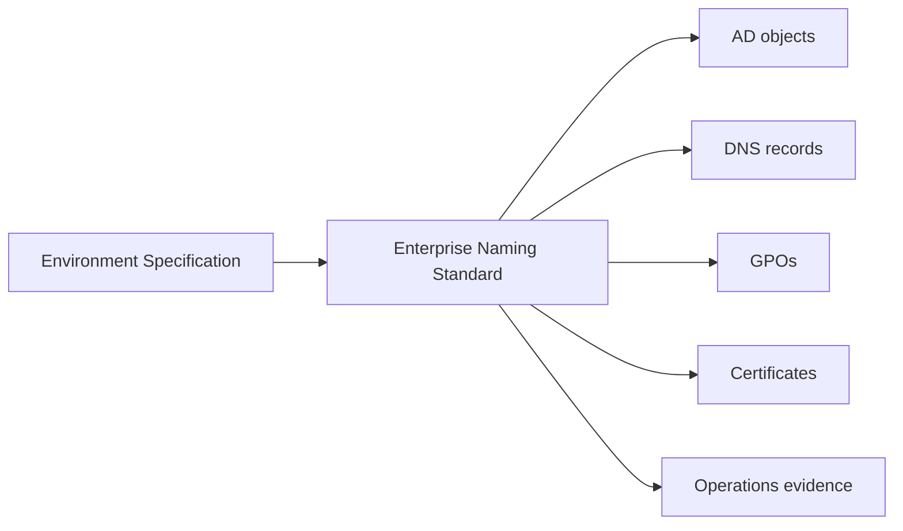

# Enterprise Naming Standard

## Document Control

| Field | Value |
|---|---|
| Document ID | GEIL-MSC-NAME-001 |
| Owner | Infrastructure Engineering |
| Status | Draft |
| Version | 1.0 |
| Last Reviewed | 2026-06-30 |
| Review Cycle | Quarterly |
| Classification | Internal Confidential |

!!! note "Canonical GNTECH values"

    Forest: `corp.gntech.me`; NetBIOS: `GNTECH`; primary UPN suffix: `gntech.me`; Microsoft 365 primary domain: `gntech.me`; hybrid identity plane: Microsoft Entra ID; primary firewall: MikroTik CHR `HQ-FW01`.


## Purpose

Define the naming rules that make GEIL deployable, searchable, auditable, and ready for future Microsoft 365, Entra ID, Intune, PKI, NPS, file, print, and regional expansion.

## Learning Objectives

- Understand why enterprise naming is a control, not cosmetic preference.
- Apply consistent names for users, computers, servers, groups, service accounts, GPOs, DNS, DFS, certificates, hypervisors, Proxmox nodes, and MikroTik devices.
- Validate names before objects are created.
- Roll back incorrect names safely before dependent services exist.

## What You Will Build

A canonical naming model used by every AD, DNS, DHCP, GPO, PKI, NPS, Entra, Intune, backup, and operations guide.

## Architecture Overview



## Why naming matters

Names appear in logs, certificates, DNS records, Kerberos SPNs, firewall rules, GPO links, file permissions, Entra ID sync, audit evidence, and disaster recovery procedures. Ambiguous names force operators to guess. GEIL avoids guesswork by using deterministic patterns.

## Naming standards

| Object type | Standard | Example | Why |
|---|---|---|---|
| Daily users | `<first_initial><lastname>` or approved short name | `gnolasco` | Stable sign-in, simple display, aligns with `gnolasco@gntech.me`. |
| User UPN | `<username>@gntech.me` | `gnolasco@gntech.me` | Matches Microsoft 365 and Entra ID verified domain. |
| Admin users | `admin.<username>` or tier-specific if required | `admin.gnolasco` | Separates admin identity from daily identity. |
| Workstations | `<SITE>-W11-<NNN>` | `HQ-W11-001` | Human-readable location and OS. |
| Servers | `<SITE>-<ROLE><NN>` | `HQ-DC01`, `HQ-MGMT01` | Role and site are visible in logs and DNS. |
| Domain controllers | `<SITE>-DC<NN>` | `HQ-DC01` | AD site and DC order are obvious. |
| Groups | `GG-<Scope>-<Purpose>`, `DL-<Resource>-<Permission>`, `AG-<AdminRole>` | `GG-T1-Server-Admins` | Supports AGDLP/RBAC and access reviews. |
| Service accounts | `svc-<service>` | `svc-monitoring` | Clearly non-human and searchable. |
| gMSA | `gmsa-<service>` | `gmsa-wac` | Signals managed password lifecycle. |
| GPOs | `GEIL-<Scope>-<Purpose>` | `GEIL-Workstation-Security-Baseline` | Shows owner, target, and intent. |
| OUs | Business/lifecycle words | `OU=Workstations,OU=Computers,OU=GNTECH,...` | Maps to policy and delegation. |
| DNS records | FQDN under `corp.gntech.me` for internal servers | `HQ-DC01.corp.gntech.me` | Keeps AD DNS distinct from user sign-in namespace. |
| DFS namespaces | `\corp.gntech.me\<Name>` when deployed | `\corp.gntech.me\Files` | Supports site-aware enterprise file access. |
| File servers | `<SITE>-FS<NN>` | `HQ-FS01` | Site and role visible. |
| Print servers | `<SITE>-PRN<NN>` | `HQ-PRN01` | Site and print role visible. |
| Hypervisors | `PVE-<SITE><NN>` | `PVE-HQ01` | Product, site, and node number. |
| MikroTik devices | `<SITE>-FW<NN>` | `HQ-FW01` | Firewall role and site. |
| Proxmox nodes | `PVE-<SITE><NN>` | `PVE-HQ01` | Cluster-ready convention. |
| Certificates | Subject/SAN uses service FQDN | `HQ-DC01.corp.gntech.me` | Avoids certificate identity ambiguity. |

## PowerShell validation

```powershell
$InvalidUsers = Get-ADUser -Filter * -Properties UserPrincipalName |
    Where-Object { $_.UserPrincipalName -and $_.UserPrincipalName -notlike "*@gntech.me" }
$InvalidUsers | Select-Object SamAccountName,UserPrincipalName

Get-ADComputer -Filter * | Select-Object Name,DNSHostName
Get-ADGroup -Filter 'Name -like "GG-*" -or Name -like "DL-*" -or Name -like "AG-*"' |
    Select-Object Name,GroupScope,GroupCategory
```

## Expected result

- Production user UPNs end in `@gntech.me`.
- Server DNS names end in `.corp.gntech.me`.
- Groups use `GG-`, `DL-`, or `AG-` prefixes.
- No active object uses unexplained generic names.

## Stop conditions

STOP if production users use `@corp.gntech.me`, if a server FQDN is outside `corp.gntech.me`, or if a privileged group does not clearly identify its scope and purpose.

## Rollback

Rename objects only before dependent services exist. If an object is already referenced by GPOs, ACLs, SPNs, certificates, monitoring, backup, or Entra sync, open a change record and update dependencies first.

## Evidence Collection

Capture validation output, screenshots of ADUC object names, DNS records, and certificate subject/SAN examples. Do not capture passwords or secrets.

## Troubleshooting

| Symptom | Likely cause | Fix |
|---|---|---|
| Entra ID shows `@corp.gntech.me` | UPN suffix not corrected | Update UPN before sync. |
| Kerberos/SPN failures | Server renamed after service registration | Review SPNs and DNS aliases. |
| Operators cannot identify group purpose | Group name lacks scope/purpose | Create properly named replacement and migrate access. |

## Next Guide

Continue to [Enterprise Group Strategy](group-strategy.md) after naming rules are accepted.
