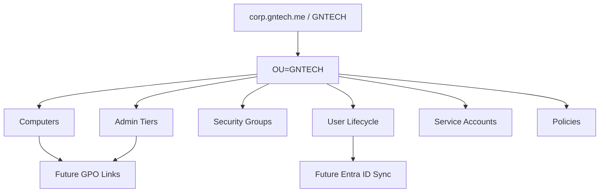

# Active Directory Organizational Foundation

## Document Control

| Field | Value |
|---|---|
| Document ID | GEIL-MSC-ADORG-001 |
| Owner | Infrastructure Engineering |
| Status | Draft |
| Version | 1.0 |
| Last Reviewed | 2026-06-30 |
| Review Cycle | Quarterly |
| Classification | Internal Confidential |

!!! note "Canonical identity model"

    This guide uses the GEIL canonical identity model: forest `corp.gntech.me`, NetBIOS `GNTECH`, primary UPN suffix `gntech.me`, production sign-in `username@gntech.me`, and legacy logon `GNTECH\username`. Server FQDNs remain in `corp.gntech.me`.

## Purpose

Create the initial Active Directory organizational foundation for `corp.gntech.me` after `HQ-DC01` is promoted and healthy, but before DNS/DHCP expansion, Group Policy rollout, PKI, Entra ID sync, Intune, or production user onboarding.

This guide defines and implements the first OU hierarchy, baseline groups, sample user/admin accounts, service account containers, delegation-ready groups, validation commands, and rollback guidance.

## Learning Objectives

After completing this guide you will understand:

- Why AD organizational design must happen immediately after forest creation.
- Why GEIL uses a single `OU=GNTECH` root below `corp.gntech.me`.
- How administrative tiering maps to OUs, groups, GPOs, and delegated administration.
- How user UPNs align with Microsoft 365 and Entra ID.
- How to validate OU, user, group, domain, and forest state before continuing.

## What You Will Build

By the end of this guide you will have:

- ✓ Created the canonical `OU=GNTECH` hierarchy.
- ✓ Added or validated UPN suffix `gntech.me`.
- ✓ Created initial global security groups.
- ✓ Created sample daily, admin, and service accounts using `@gntech.me` UPNs.
- ✓ Created service account OUs for standard, gMSA, and legacy service identities.
- ✓ Moved default users and computers only when safe.
- ✓ Validated the resulting AD structure.
- ✓ Captured evidence for the next guides.

## Estimated Time

45-90 minutes, depending on operator review, password entry, and evidence capture.

## Difficulty

Intermediate. The commands are straightforward, but organizational structure becomes the policy and delegation target for later guides.

## Risk Level

Medium. OU and group creation is reversible when empty, but moving production objects or deleting OUs without checking child objects can cause outages or policy loss.

## Service Impact

Low before production onboarding. This guide should run before production users and computers are created. If existing objects are present, move them only after review.

## Prerequisites

- [Active Directory Implementation](active-directory-implementation.md) completed through forest creation and Hybrid UPN suffix configuration.
- `HQ-DC01` is online and healthy.
- `corp.gntech.me` forest exists.
- NetBIOS domain is `GNTECH`.
- UPN suffix `gntech.me` exists.
- Built-in Administrator UPN is `Administrator@gntech.me`.
- You are signed in with an approved Tier 0 administrative account.
- A current VM checkpoint or system-state backup exists.
- Active Directory PowerShell module is available on `HQ-DC01`.

!!! warning "Do not continue without the hybrid UPN suffix"

    STOP. Do not create production users or service accounts until `Get-ADForest` shows `gntech.me` in `UPNSuffixes`. If the suffix is missing, return to the Hybrid UPN section in the Active Directory Implementation guide.

## Expected Starting State

- Domain DN: `DC=corp,DC=gntech,DC=me`.
- Forest: `corp.gntech.me`.
- NetBIOS: `GNTECH`.
- UPN suffix: `gntech.me`.
- Default AD containers may still contain only default objects.
- No GEIL production OU structure is assumed to exist.

## Expected Ending State

- `OU=GNTECH,DC=corp,DC=gntech,DC=me` exists.
- Canonical child OUs exist and are protected from accidental deletion.
- Initial groups exist under `OU=Security,OU=Groups,OU=GNTECH,...`.
- Sample accounts use `@gntech.me` UPNs.
- Service account OUs exist under `OU=Service Accounts,OU=GNTECH,...`.
- Default Users and Computers containers are reviewed and moved only when safe.

## Architecture Overview



## Background Knowledge

### Why create a top-level GNTECH OU?

The domain root contains built-in AD containers and domain-wide objects. GEIL places managed enterprise objects under `OU=GNTECH` so policies, delegation, lifecycle rules, and Entra ID sync scope can target business-owned objects without modifying default domain containers directly.

### Why separate Admin, Users, Groups, Computers, Service Accounts, and Policies?

Each category has different lifecycle, risk, and policy requirements:

| OU area | Why it exists |
|---|---|
| `Admin` | Separates privileged identities by administrative tier. |
| `Users` | Separates daily users by lifecycle and business risk. |
| `Groups` | Keeps security, Microsoft 365, and RBAC groups predictable for access reviews. |
| `Computers` | Separates workstation, server, and staging policy targets. |
| `Service Accounts` | Separates non-human identities for monitoring, backup, RADIUS, sync, scan, and print services. |
| `Policies` | Reserves a documented anchor for policy staging and future control-plane objects. |

### Why use `gntech.me` for user UPNs?

`corp.gntech.me` is the AD forest and DNS namespace. Users authenticate as `username@gntech.me` so the same sign-in name works across Windows, Microsoft 365, Entra ID, Intune, Windows Hello for Business, and future cloud services.

## Canonical OU Hierarchy

```text
corp.gntech.me
└── GNTECH
    ├── Admin
    │   ├── Tier 0
    │   ├── Tier 1
    │   └── Tier 2
    ├── Users
    │   ├── Standard
    │   ├── Executives
    │   ├── Contractors
    │   └── Disabled
    ├── Groups
    │   ├── Security
    │   ├── Microsoft 365
    │   └── Role-Based Access
    ├── Computers
    │   ├── Workstations
    │   ├── Servers
    │   └── Staging
    ├── Service Accounts
    │   ├── Standard
    │   ├── gMSA
    │   └── Legacy
    └── Policies
```

## Administrative Tiering Model

| Tier | Scope | Examples | Rule |
|---:|---|---|---|
| Tier 0 | Identity and trust plane | Domain Controllers, PKI, Enterprise Admins, Domain Admins, Entra hybrid identity | Never expose Tier 0 credentials to lower-tier systems. |
| Tier 1 | Servers and infrastructure services | Member servers, backup, monitoring, Windows Admin Center, infrastructure services | No Domain Admin or Enterprise Admin membership. |
| Tier 2 | Workstations and helpdesk | Windows 11 clients, endpoint support, helpdesk workflows | No server or domain controller administration. |

## Group Naming Standard

| Prefix | Pattern | Use |
|---|---|---|
| `GG` | `GG-<Scope>-<Purpose>` | Global security groups for users, computers, roles, or eligibility. |
| `DL` | `DL-<Resource>-<Permission>` | Domain local groups for resource permissions. |
| `AG` | `AG-<AdminRole>` | Administrative role groups or assignment groups. |

Initial GEIL groups:

| Group | Type | Purpose |
|---|---|---|
| `GG-T0-Domain-Admins` | Global Security | Tier 0 domain administration eligibility group. |
| `GG-T1-Server-Admins` | Global Security | Tier 1 server administration eligibility group. |
| `GG-T2-Workstation-Admins` | Global Security | Tier 2 workstation administration eligibility group. |
| `GG-IT-Operations` | Global Security | IT operations staff baseline access group. |
| `GG-Helpdesk` | Global Security | Helpdesk staff and delegated support workflows. |
| `GG-VPN-Users` | Global Security | Future VPN authorization group. |
| `GG-WiFi-Corporate` | Global Security | Future 802.1X corporate WiFi authorization group. |
| `GG-FileShare-Finance-RW` | Global Security | Finance file share read/write access group. |
| `GG-FileShare-HR-RW` | Global Security | HR file share read/write access group. |

## Initial Users and Service Accounts

| Account | Type | UPN | Target OU |
|---|---|---|---|
| `gnolasco` | Daily user | `gnolasco@gntech.me` | `OU=Standard,OU=Users,OU=GNTECH,...` |
| `admin.gnolasco` | Administrative user | `admin.gnolasco@gntech.me` | `OU=Tier 0,OU=Admin,OU=GNTECH,...` |
| `svc-backup` | Service account | `svc-backup@gntech.me` | `OU=Standard,OU=Service Accounts,OU=GNTECH,...` |
| `svc-monitoring` | Service account | `svc-monitoring@gntech.me` | `OU=Standard,OU=Service Accounts,OU=GNTECH,...` |

Additional service accounts documented for the foundation:

| Account | Purpose | Preferred model |
|---|---|---|
| `svc-backup` | Backup platform access where gMSA is not supported. | gMSA if supported by backup product; otherwise tightly scoped user service account. |
| `svc-monitoring` | Monitoring collection or probe account. | gMSA for Windows services; least-privilege user if required by tool. |
| `svc-radius` | NPS/RADIUS integrations where a service identity is required. | gMSA where supported. |
| `svc-entra-connect` | Microsoft Entra Connect or Cloud Sync service identity if required. | Follow Microsoft product guidance; Tier 0 controlled. |
| `svc-scan` | Scanner/MFP integration account. | Least privilege user service account; never Domain Admin. |
| `svc-print` | Print service account where required. | gMSA for Windows print services when supported. |

### When to use gMSA

Use a group Managed Service Account when:

- The service runs on Windows Server and supports gMSA.
- Password rotation should be automatic.
- The account should not be used interactively.
- The service can be bound to one or more approved hosts.

Do not use gMSA when the product cannot authenticate with it, when cross-platform credentials are required, or when Microsoft product guidance requires a specific service account model.

## Future Regional OU Expansion

GEIL starts with a single managed root `OU=GNTECH` for HQ. Future regional expansion must not create ad hoc root OUs. Add regions only after an approved architecture decision defines site, delegation, replication, data residency, and operational ownership.

Future pattern:

```text
corp.gntech.me
└── GNTECH
    ├── HQ
    │   ├── Users
    │   ├── Computers
    │   └── Groups
    ├── Regional
    │   ├── AMER
    │   ├── EMEA
    │   └── APAC
    └── Global
        ├── Admin
        ├── Service Accounts
        └── Policies
```

Do not create these regional OUs during the initial HQ deployment. They are documented so the current design can scale without restructuring.

## Step-by-Step Procedure

### Step 1: Validate domain and forest identity

#### Goal — Step 1: Validate domain and forest identity

Confirm the forest, domain, NetBIOS name, and UPN suffix are correct before creating objects.

#### Why this step matters — Step 1: Validate domain and forest identity

OU, user, group, and service account objects depend on the correct domain. If the wrong forest or UPN suffix is used, later Entra ID sync and user sign-in will be wrong.

#### Commands — Step 1: Validate domain and forest identity

```powershell
Import-Module ActiveDirectory
Get-ADForest | Select-Object Name,UPNSuffixes
Get-ADDomain | Select-Object DNSRoot,NetBIOSName,DistinguishedName
```

#### Expected result — Step 1: Validate domain and forest identity

```text
Name        : corp.gntech.me
UPNSuffixes : {gntech.me}

DNSRoot           : corp.gntech.me
NetBIOSName       : GNTECH
DistinguishedName : DC=corp,DC=gntech,DC=me
```

#### If validation fails — Step 1: Validate domain and forest identity

STOP. Do not create users, groups, OUs, or service accounts. Return to the Active Directory Implementation guide and correct the forest or UPN suffix issue first.

#### Rollback — Step 1: Validate domain and forest identity

No rollback is required for read-only validation.

### Step 2: Add the hybrid UPN suffix if missing

#### Goal — Step 2: Add the hybrid UPN suffix if missing

Ensure `gntech.me` exists as an alternate UPN suffix.

#### Why this step matters — Step 2: Add the hybrid UPN suffix if missing

Users must sign in as `username@gntech.me`. Entra ID sync must not normalize production users to `username@corp.gntech.me`.

#### Commands — Step 2: Add the hybrid UPN suffix if missing

This script is idempotent. It reports `Created` when it adds the suffix and `Exists` when the suffix is already present.

```powershell
Import-Module ActiveDirectory
$RequiredUPNSuffix = "gntech.me"
$Forest = Get-ADForest

if ($Forest.UPNSuffixes -contains $RequiredUPNSuffix) {
    [PSCustomObject]@{
        Status = "Exists"
        Name   = $RequiredUPNSuffix
        Scope  = $Forest.Name
    }
}
else {
    Set-ADForest -Identity $Forest.Name -UPNSuffixes @{Add=$RequiredUPNSuffix}
    [PSCustomObject]@{
        Status = "Created"
        Name   = $RequiredUPNSuffix
        Scope  = $Forest.Name
    }
}
```

#### Expected result — Step 2: Add the hybrid UPN suffix if missing

First run, if `gntech.me` is missing:

```text
Status  Name      Scope
------  ----      -----
Created gntech.me corp.gntech.me
```

Later runs:

```text
Status Name      Scope
------ ----      -----
Exists gntech.me corp.gntech.me
```

#### Validate this step — Step 2: Add the hybrid UPN suffix if missing

```powershell
Get-ADForest | Select-Object Name,UPNSuffixes
```

Expected validation output:

```text
Name        : corp.gntech.me
UPNSuffixes : {gntech.me}
```

#### If validation fails — Step 2: Add the hybrid UPN suffix if missing

STOP. Do not create production users. Confirm you are using a Tier 0 account with rights to modify the forest UPN suffix list.

#### Rollback — Step 2: Add the hybrid UPN suffix if missing

If `gntech.me` was added during testing before any users or Entra sync depend on it, remove it only under change control:

```powershell
Set-ADForest -Identity "corp.gntech.me" -UPNSuffixes @{Remove="gntech.me"}
```

Do not remove `gntech.me` after production identities exist.

### Step 3: Create the OU structure

#### Goal — Step 3: Create the OU structure

Create the canonical GEIL OU hierarchy and protect each OU from accidental deletion.

#### Why this step matters — Step 3: Create the OU structure

Future GPOs, delegation rules, Entra ID sync scope, user onboarding, computer lifecycle, and service account governance depend on predictable OU paths.

#### Commands — Step 3: Create the OU structure

Use this idempotent version. It creates parent OUs before child OUs, checks for existing OUs with `-LDAPFilter` scoped to the intended parent, and prints `Created` or `Exists` for each OU.

!!! implementation "Why this script does not use `Get-ADOrganizationalUnit -Identity` for existence checks"

    `Get-ADOrganizationalUnit -Identity` is appropriate when you already know an OU exists and want to retrieve exactly that object. It is not a good existence check during first-time creation because a missing OU raises `ADIdentityNotFoundException`. Even with `-ErrorAction SilentlyContinue`, repeated missing-parent or missing-child checks can produce noisy deployment output and confuse junior operators. This guide uses `-LDAPFilter` with `-SearchBase` and `-SearchScope OneLevel` so a missing child OU returns no object instead of an exception.

```powershell
Import-Module ActiveDirectory
$DomainDN = (Get-ADDomain).DistinguishedName

function ConvertTo-LdapFilterValue {
    param([Parameter(Mandatory)][string]$Value)

    $Value.Replace('\','\5c').Replace('*','\2a').Replace('(','\28').Replace(')','\29').Replace([string][char]0,'\00')
}

function Ensure-GEILOrganizationalUnit {
    param(
        [Parameter(Mandatory)][string]$Name,
        [Parameter(Mandatory)][string]$Path
    )

    $EscapedName = ConvertTo-LdapFilterValue -Value $Name
    $ExistingOU = Get-ADOrganizationalUnit `
        -LDAPFilter "(ou=$EscapedName)" `
        -SearchBase $Path `
        -SearchScope OneLevel `
        -ErrorAction Stop

    if ($ExistingOU) {
        [PSCustomObject]@{
            Status = "Exists"
            Name   = $Name
            Path   = $Path
            DN     = $ExistingOU.DistinguishedName
        }
        return
    }

    $NewOU = New-ADOrganizationalUnit `
        -Name $Name `
        -Path $Path `
        -ProtectedFromAccidentalDeletion $true `
        -PassThru

    [PSCustomObject]@{
        Status = "Created"
        Name   = $Name
        Path   = $Path
        DN     = $NewOU.DistinguishedName
    }
}

# Parent-first order is intentional. Do not alphabetize this list.
$OUs = @(
    @{Name="GNTECH"; Path=$DomainDN},

    @{Name="Admin"; Path="OU=GNTECH,$DomainDN"},
    @{Name="Tier 0"; Path="OU=Admin,OU=GNTECH,$DomainDN"},
    @{Name="Tier 1"; Path="OU=Admin,OU=GNTECH,$DomainDN"},
    @{Name="Tier 2"; Path="OU=Admin,OU=GNTECH,$DomainDN"},

    @{Name="Users"; Path="OU=GNTECH,$DomainDN"},
    @{Name="Standard"; Path="OU=Users,OU=GNTECH,$DomainDN"},
    @{Name="Executives"; Path="OU=Users,OU=GNTECH,$DomainDN"},
    @{Name="Contractors"; Path="OU=Users,OU=GNTECH,$DomainDN"},
    @{Name="Disabled"; Path="OU=Users,OU=GNTECH,$DomainDN"},

    @{Name="Groups"; Path="OU=GNTECH,$DomainDN"},
    @{Name="Security"; Path="OU=Groups,OU=GNTECH,$DomainDN"},
    @{Name="Microsoft 365"; Path="OU=Groups,OU=GNTECH,$DomainDN"},
    @{Name="Role-Based Access"; Path="OU=Groups,OU=GNTECH,$DomainDN"},

    @{Name="Computers"; Path="OU=GNTECH,$DomainDN"},
    @{Name="Workstations"; Path="OU=Computers,OU=GNTECH,$DomainDN"},
    @{Name="Servers"; Path="OU=Computers,OU=GNTECH,$DomainDN"},
    @{Name="Staging"; Path="OU=Computers,OU=GNTECH,$DomainDN"},

    @{Name="Service Accounts"; Path="OU=GNTECH,$DomainDN"},
    @{Name="Standard"; Path="OU=Service Accounts,OU=GNTECH,$DomainDN"},
    @{Name="gMSA"; Path="OU=Service Accounts,OU=GNTECH,$DomainDN"},
    @{Name="Legacy"; Path="OU=Service Accounts,OU=GNTECH,$DomainDN"},

    @{Name="Policies"; Path="OU=GNTECH,$DomainDN"}
)

$Results = foreach ($OU in $OUs) {
    Ensure-GEILOrganizationalUnit -Name $OU.Name -Path $OU.Path
}

$Results | Format-Table Status,Name,DN -AutoSize
```

#### Expected result — Step 3: Create the OU structure

First run shows `Created` for new OUs and `Exists` for any OUs already present:

```text
Status  Name             DN
------  ----             --
Created GNTECH           OU=GNTECH,DC=corp,DC=gntech,DC=me
Created Admin            OU=Admin,OU=GNTECH,DC=corp,DC=gntech,DC=me
Created Tier 0           OU=Tier 0,OU=Admin,OU=GNTECH,DC=corp,DC=gntech,DC=me
Created Users            OU=Users,OU=GNTECH,DC=corp,DC=gntech,DC=me
Created Service Accounts OU=Service Accounts,OU=GNTECH,DC=corp,DC=gntech,DC=me
```

Second and later runs should show `Exists` for all previously created OUs and should not display `ADIdentityNotFoundException` errors.

#### Validate this step — Step 3: Create the OU structure

```powershell
Get-ADOrganizationalUnit -SearchBase "OU=GNTECH,$((Get-ADDomain).DistinguishedName)" -Filter * |
    Sort-Object DistinguishedName |
    Select-Object Name,DistinguishedName,ProtectedFromAccidentalDeletion
```

Expected result includes:

```text
Name              DistinguishedName
----              -----------------
Admin             OU=Admin,OU=GNTECH,DC=corp,DC=gntech,DC=me
Tier 0            OU=Tier 0,OU=Admin,OU=GNTECH,DC=corp,DC=gntech,DC=me
Users             OU=Users,OU=GNTECH,DC=corp,DC=gntech,DC=me
Security          OU=Security,OU=Groups,OU=GNTECH,DC=corp,DC=gntech,DC=me
Workstations      OU=Workstations,OU=Computers,OU=GNTECH,DC=corp,DC=gntech,DC=me
Standard          OU=Standard,OU=Service Accounts,OU=GNTECH,DC=corp,DC=gntech,DC=me
Policies          OU=Policies,OU=GNTECH,DC=corp,DC=gntech,DC=me
```

#### If validation fails — Step 3: Create the OU structure

STOP. Do not create groups, users, GPOs, or delegation rules until every required OU exists.

#### Rollback — Step 3: Create the OU structure

Only remove an OU if it is empty. Do not delete OUs containing users, computers, groups, service accounts, or linked policies.

```powershell
$WrongOU = "OU=WrongName,OU=GNTECH,DC=corp,DC=gntech,DC=me"
Get-ADObject -SearchBase $WrongOU -SearchScope OneLevel -Filter *
Set-ADOrganizationalUnit -Identity $WrongOU -ProtectedFromAccidentalDeletion $false
Remove-ADOrganizationalUnit -Identity $WrongOU -Confirm:$true
```

### Step 4: Create initial groups

#### Goal — Step 4: Create initial groups

Create the initial GEIL security groups under the security group OU.

#### Why this step matters — Step 4: Create initial groups

Groups provide a stable abstraction for permissions, delegation, WiFi authorization, VPN authorization, file share access, and administrator tiering. Permissions should target groups, not individual users.

#### Commands — Step 4: Create initial groups

This script validates the target OU before creating groups. It uses LDAP filters for existence checks and prints `Created` or `Exists` for every group.

```powershell
Import-Module ActiveDirectory
$DomainDN = (Get-ADDomain).DistinguishedName
$GroupPath = "OU=Security,OU=Groups,OU=GNTECH,$DomainDN"

function ConvertTo-LdapFilterValue {
    param([Parameter(Mandatory)][string]$Value)

    $Value.Replace('\','\5c').Replace('*','\2a').Replace('(','\28').Replace(')','\29').Replace([string][char]0,'\00')
}

function Assert-GEILOrganizationalUnit {
    param([Parameter(Mandatory)][string]$DistinguishedName)

    $ParentPath = $DistinguishedName -replace '^OU=[^,]+,',''
    $OuName = ($DistinguishedName -split ',',2)[0] -replace '^OU='
    $EscapedName = ConvertTo-LdapFilterValue -Value $OuName
    $OU = Get-ADOrganizationalUnit `
        -LDAPFilter "(ou=$EscapedName)" `
        -SearchBase $ParentPath `
        -SearchScope OneLevel `
        -ErrorAction Stop

    if (-not $OU) {
        throw "Required OU is missing: $DistinguishedName. Run and validate Step 3 before creating groups."
    }

    $OU
}

function Ensure-GEILGroup {
    param(
        [Parameter(Mandatory)][string]$Name,
        [Parameter(Mandatory)][string]$Path,
        [Parameter(Mandatory)][string]$Description
    )

    $EscapedName = ConvertTo-LdapFilterValue -Value $Name
    $ExistingGroup = Get-ADGroup `
        -LDAPFilter "(sAMAccountName=$EscapedName)" `
        -SearchBase $Path `
        -SearchScope OneLevel `
        -ErrorAction Stop

    if ($ExistingGroup) {
        [PSCustomObject]@{
            Status = "Exists"
            Name   = $Name
            Path   = $Path
            DN     = $ExistingGroup.DistinguishedName
        }
        return
    }

    $NewGroup = New-ADGroup `
        -Name $Name `
        -SamAccountName $Name `
        -GroupScope Global `
        -GroupCategory Security `
        -Path $Path `
        -Description $Description `
        -PassThru

    [PSCustomObject]@{
        Status = "Created"
        Name   = $Name
        Path   = $Path
        DN     = $NewGroup.DistinguishedName
    }
}

Assert-GEILOrganizationalUnit -DistinguishedName $GroupPath | Out-Null

$Groups = @(
    @{Name="GG-T0-Domain-Admins"; Description="Tier 0 domain administration eligibility"},
    @{Name="GG-T1-Server-Admins"; Description="Tier 1 server administration eligibility"},
    @{Name="GG-T2-Workstation-Admins"; Description="Tier 2 workstation administration eligibility"},
    @{Name="GG-IT-Operations"; Description="IT operations access group"},
    @{Name="GG-Helpdesk"; Description="Helpdesk support group"},
    @{Name="GG-VPN-Users"; Description="VPN authorization group"},
    @{Name="GG-WiFi-Corporate"; Description="Corporate WiFi authorization group"},
    @{Name="GG-FileShare-Finance-RW"; Description="Finance file share read/write access"},
    @{Name="GG-FileShare-HR-RW"; Description="HR file share read/write access"}
)

$GroupResults = foreach ($Group in $Groups) {
    Ensure-GEILGroup -Name $Group.Name -Path $GroupPath -Description $Group.Description
}

$GroupResults | Format-Table Status,Name,DN -AutoSize
```

#### Expected result — Step 4: Create initial groups

First run shows `Created` for new groups. Later runs show `Exists` and do not create duplicates.

```text
Status  Name                       DN
------  ----                       --
Created GG-T0-Domain-Admins        CN=GG-T0-Domain-Admins,OU=Security,OU=Groups,OU=GNTECH,...
Created GG-T1-Server-Admins        CN=GG-T1-Server-Admins,OU=Security,OU=Groups,OU=GNTECH,...
Exists  GG-Helpdesk                CN=GG-Helpdesk,OU=Security,OU=Groups,OU=GNTECH,...
```

#### Validate this step — Step 4: Create initial groups

```powershell
Get-ADGroup -SearchBase "OU=Security,OU=Groups,OU=GNTECH,$((Get-ADDomain).DistinguishedName)" -Filter 'Name -like "GG-*"' |
    Sort-Object Name |
    Select-Object Name,GroupScope,GroupCategory,DistinguishedName
```

Expected result includes all nine `GG-*` groups listed above.

#### If validation fails — Step 4: Create initial groups

STOP. Do not assign permissions, delegation, WiFi, VPN, or file share access until the correct groups exist in the correct OU. If the script reports that `OU=Security,OU=Groups,OU=GNTECH,...` is missing, return to Step 3 and create the OU hierarchy first.

#### Rollback — Step 4: Create initial groups

If a group was created with the wrong name and has no members or permissions, remove it under change control:

```powershell
Remove-ADGroup -Identity "Wrong-Group-Name" -Confirm:$true
```

Do not delete a group that may already be used in ACLs, GPO filters, VPN policy, NPS policy, or file permissions.

### Step 5: Create sample users and service accounts

#### Goal — Step 5: Create sample users and service accounts

Create the initial sample daily user, administrative user, and service accounts with `@gntech.me` UPNs.

#### Why this step matters — Step 5: Create sample users and service accounts

The sample accounts prove the OU model, UPN suffix, administrative tiering, and service account structure before production onboarding begins.

#### Commands — Step 5: Create sample users and service accounts

The command prompts for passwords so no secrets are stored in documentation or shell history. It validates every target OU before creating accounts, uses LDAP-filter existence checks, and prints `Created` or `Exists` for each account.

```powershell
Import-Module ActiveDirectory
$DomainDN = (Get-ADDomain).DistinguishedName
$StandardUsersOU = "OU=Standard,OU=Users,OU=GNTECH,$DomainDN"
$Tier0OU = "OU=Tier 0,OU=Admin,OU=GNTECH,$DomainDN"
$StandardSvcOU = "OU=Standard,OU=Service Accounts,OU=GNTECH,$DomainDN"

function ConvertTo-LdapFilterValue {
    param([Parameter(Mandatory)][string]$Value)

    $Value.Replace('\','\5c').Replace('*','\2a').Replace('(','\28').Replace(')','\29').Replace([string][char]0,'\00')
}

function Assert-GEILOrganizationalUnit {
    param([Parameter(Mandatory)][string]$DistinguishedName)

    $ParentPath = $DistinguishedName -replace '^OU=[^,]+,',''
    $OuName = ($DistinguishedName -split ',',2)[0] -replace '^OU='
    $EscapedName = ConvertTo-LdapFilterValue -Value $OuName
    $OU = Get-ADOrganizationalUnit `
        -LDAPFilter "(ou=$EscapedName)" `
        -SearchBase $ParentPath `
        -SearchScope OneLevel `
        -ErrorAction Stop

    if (-not $OU) {
        throw "Required OU is missing: $DistinguishedName. Run and validate Step 3 before creating users or service accounts."
    }

    $OU
}

function Ensure-GEILUser {
    param(
        [Parameter(Mandatory)][hashtable]$User
    )

    $EscapedSam = ConvertTo-LdapFilterValue -Value $User.Sam
    $ExistingUser = Get-ADUser `
        -LDAPFilter "(sAMAccountName=$EscapedSam)" `
        -SearchBase $DomainDN `
        -ErrorAction Stop

    if ($ExistingUser) {
        [PSCustomObject]@{
            Status = "Exists"
            Sam    = $User.Sam
            UPN    = $ExistingUser.UserPrincipalName
            DN     = $ExistingUser.DistinguishedName
        }
        return
    }

    $NewUser = New-ADUser `
        -Name $User.Name `
        -SamAccountName $User.Sam `
        -UserPrincipalName $User.UPN `
        -GivenName $User.GivenName `
        -Surname $User.Surname `
        -Path $User.Path `
        -Description $User.Description `
        -AccountPassword $User.Password `
        -Enabled $User.Enabled `
        -ChangePasswordAtLogon $User.ChangePassword `
        -PassThru

    [PSCustomObject]@{
        Status = "Created"
        Sam    = $User.Sam
        UPN    = $User.UPN
        DN     = $NewUser.DistinguishedName
    }
}

$RequiredUserOUs = @($StandardUsersOU,$Tier0OU,$StandardSvcOU)
foreach ($OU in $RequiredUserOUs) {
    Assert-GEILOrganizationalUnit -DistinguishedName $OU | Out-Null
}

$UserPassword = Read-Host "Enter temporary password for sample human users" -AsSecureString
$ServicePassword = Read-Host "Enter temporary password for sample service accounts" -AsSecureString

$Users = @(
    @{Name="GNolasco"; Sam="gnolasco"; UPN="gnolasco@gntech.me"; GivenName="G"; Surname="Nolasco"; Path=$StandardUsersOU; Description="Initial standard user sample"; Password=$UserPassword; Enabled=$true; ChangePassword=$true},
    @{Name="Admin GNolasco"; Sam="admin.gnolasco"; UPN="admin.gnolasco@gntech.me"; GivenName="Admin"; Surname="GNolasco"; Path=$Tier0OU; Description="Initial Tier 0 administrative user sample"; Password=$UserPassword; Enabled=$true; ChangePassword=$true},
    @{Name="svc-backup"; Sam="svc-backup"; UPN="svc-backup@gntech.me"; GivenName="svc"; Surname="backup"; Path=$StandardSvcOU; Description="Backup service account - least privilege only"; Password=$ServicePassword; Enabled=$true; ChangePassword=$false},
    @{Name="svc-monitoring"; Sam="svc-monitoring"; UPN="svc-monitoring@gntech.me"; GivenName="svc"; Surname="monitoring"; Path=$StandardSvcOU; Description="Monitoring service account - least privilege only"; Password=$ServicePassword; Enabled=$true; ChangePassword=$false}
)

$UserResults = foreach ($User in $Users) {
    Ensure-GEILUser -User $User
}

$UserResults | Format-Table Status,Sam,UPN,DN -AutoSize
```

#### Expected result — Step 5: Create sample users and service accounts

The sample accounts are created in the intended OUs and use `@gntech.me` UPNs. Re-running the script shows `Exists` instead of creating duplicates.

```text
Status  Sam              UPN                         DN
------  ---              ---                         --
Created gnolasco         gnolasco@gntech.me          CN=GNolasco,OU=Standard,OU=Users,OU=GNTECH,...
Created admin.gnolasco   admin.gnolasco@gntech.me    CN=Admin GNolasco,OU=Tier 0,OU=Admin,OU=GNTECH,...
Exists  svc-backup       svc-backup@gntech.me        CN=svc-backup,OU=Standard,OU=Service Accounts,OU=GNTECH,...
```

#### Validate this step — Step 5: Create sample users and service accounts

```powershell
Get-ADUser -Filter 'SamAccountName -in "gnolasco","admin.gnolasco","svc-backup","svc-monitoring"' `
    -Properties UserPrincipalName,Enabled,DistinguishedName |
    Select-Object SamAccountName,UserPrincipalName,Enabled,DistinguishedName
```

Expected output:

```text
SamAccountName   UserPrincipalName          Enabled DistinguishedName
--------------   -----------------          ------- -----------------
gnolasco         gnolasco@gntech.me          True   CN=GNolasco,OU=Standard,OU=Users,OU=GNTECH,...
admin.gnolasco   admin.gnolasco@gntech.me    True   CN=Admin GNolasco,OU=Tier 0,OU=Admin,OU=GNTECH,...
svc-backup       svc-backup@gntech.me        True   CN=svc-backup,OU=Standard,OU=Service Accounts,OU=GNTECH,...
svc-monitoring   svc-monitoring@gntech.me    True   CN=svc-monitoring,OU=Standard,OU=Service Accounts,OU=GNTECH,...
```

#### If validation fails — Step 5: Create sample users and service accounts

STOP. Do not proceed to Entra ID sync, service deployment, or Group Policy security filtering until user UPNs and OU placement are correct. If a required target OU is missing, return to Step 3 and rerun the OU creation script.

#### Rollback — Step 5: Create sample users and service accounts

If uncertain, disable sample users instead of deleting them:

```powershell
function ConvertTo-LdapFilterValue {
    param([Parameter(Mandatory)][string]$Value)

    $Value.Replace('\','\5c').Replace('*','\2a').Replace('(','\28').Replace(')','\29').Replace([string][char]0,'\00')
}

"gnolasco","admin.gnolasco","svc-backup","svc-monitoring" |
    ForEach-Object {
        $EscapedSam = ConvertTo-LdapFilterValue -Value $_
        $Account = Get-ADUser -LDAPFilter "(sAMAccountName=$EscapedSam)" -ErrorAction Stop
        if ($Account) {
            Disable-ADAccount -Identity $Account.DistinguishedName
            [PSCustomObject]@{Status="Disabled"; Sam=$_; DN=$Account.DistinguishedName}
        }
        else {
            [PSCustomObject]@{Status="NotFound"; Sam=$_; DN=$null}
        }
    }
```

Only delete accounts when you have verified they are not used in permissions, services, sync, scheduled tasks, NPS, backup, monitoring, or file ACLs.

### Step 6: Create additional service account placeholders in the correct OU

#### Goal — Step 6: Create additional service account placeholders in the correct OU

Document the expected service accounts before the dependent products are deployed.

#### Why this step matters — Step 6: Create additional service account placeholders in the correct OU

Creating the naming plan early prevents ad hoc service identities later. Some accounts may not be created until the product guide requires them.

#### Commands — Step 6: Create additional service account placeholders in the correct OU

Use this command only when the account is needed by an approved implementation guide. It validates the target OU first and creates disabled accounts by default so they cannot be used before service-specific permissions are defined.

```powershell
Import-Module ActiveDirectory
$DomainDN = (Get-ADDomain).DistinguishedName
$StandardSvcOU = "OU=Standard,OU=Service Accounts,OU=GNTECH,$DomainDN"

function ConvertTo-LdapFilterValue {
    param([Parameter(Mandatory)][string]$Value)

    $Value.Replace('\','\5c').Replace('*','\2a').Replace('(','\28').Replace(')','\29').Replace([string][char]0,'\00')
}

function Assert-GEILOrganizationalUnit {
    param([Parameter(Mandatory)][string]$DistinguishedName)

    $ParentPath = $DistinguishedName -replace '^OU=[^,]+,',''
    $OuName = ($DistinguishedName -split ',',2)[0] -replace '^OU='
    $EscapedName = ConvertTo-LdapFilterValue -Value $OuName
    $OU = Get-ADOrganizationalUnit `
        -LDAPFilter "(ou=$EscapedName)" `
        -SearchBase $ParentPath `
        -SearchScope OneLevel `
        -ErrorAction Stop

    if (-not $OU) {
        throw "Required OU is missing: $DistinguishedName. Run and validate Step 3 before creating service account placeholders."
    }

    $OU
}

function Ensure-GEILDisabledServiceAccount {
    param(
        [Parameter(Mandatory)][string]$Sam,
        [Parameter(Mandatory)][string]$Description,
        [Parameter(Mandatory)][securestring]$Password,
        [Parameter(Mandatory)][string]$Path
    )

    $EscapedSam = ConvertTo-LdapFilterValue -Value $Sam
    $ExistingUser = Get-ADUser `
        -LDAPFilter "(sAMAccountName=$EscapedSam)" `
        -SearchBase $DomainDN `
        -ErrorAction Stop

    if ($ExistingUser) {
        [PSCustomObject]@{
            Status  = "Exists"
            Sam     = $Sam
            Enabled = $ExistingUser.Enabled
            DN      = $ExistingUser.DistinguishedName
        }
        return
    }

    $NewUser = New-ADUser `
        -Name $Sam `
        -SamAccountName $Sam `
        -UserPrincipalName "$Sam@gntech.me" `
        -Path $Path `
        -Description $Description `
        -AccountPassword $Password `
        -Enabled $false `
        -PassThru

    [PSCustomObject]@{
        Status  = "Created"
        Sam     = $Sam
        Enabled = $false
        DN      = $NewUser.DistinguishedName
    }
}

Assert-GEILOrganizationalUnit -DistinguishedName $StandardSvcOU | Out-Null
$DisabledServicePassword = Read-Host "Enter temporary password for disabled service account placeholders" -AsSecureString

$ServiceAccounts = @(
    @{Sam="svc-radius"; Description="Reserved for NPS/RADIUS integration"},
    @{Sam="svc-entra-connect"; Description="Reserved for Microsoft Entra Connect or Cloud Sync if required"},
    @{Sam="svc-scan"; Description="Reserved for scanner/MFP integration"},
    @{Sam="svc-print"; Description="Reserved for print service integration"}
)

$ServiceAccountResults = foreach ($Svc in $ServiceAccounts) {
    Ensure-GEILDisabledServiceAccount `
        -Sam $Svc.Sam `
        -Description $Svc.Description `
        -Password $DisabledServicePassword `
        -Path $StandardSvcOU
}

$ServiceAccountResults | Format-Table Status,Sam,Enabled,DN -AutoSize
```

#### Expected result — Step 6: Create additional service account placeholders in the correct OU

Reserved service accounts exist but are disabled until their implementation guide defines permissions and activation criteria. Re-running the script shows `Exists` and does not create duplicates.

```text
Status  Sam               Enabled DN
------  ---               ------- --
Created svc-radius        False   CN=svc-radius,OU=Standard,OU=Service Accounts,OU=GNTECH,...
Created svc-entra-connect False   CN=svc-entra-connect,OU=Standard,OU=Service Accounts,OU=GNTECH,...
Exists  svc-print         False   CN=svc-print,OU=Standard,OU=Service Accounts,OU=GNTECH,...
```

#### Validate this step — Step 6: Create additional service account placeholders in the correct OU

```powershell
Get-ADUser -Filter 'SamAccountName -like "svc-*"' `
    -SearchBase "OU=Service Accounts,OU=GNTECH,$((Get-ADDomain).DistinguishedName)" `
    -Properties UserPrincipalName,Enabled,Description |
    Select-Object SamAccountName,UserPrincipalName,Enabled,Description
```

Expected output shows `svc-radius`, `svc-entra-connect`, `svc-scan`, and `svc-print` as disabled until used.

#### If validation fails — Step 6: Create additional service account placeholders in the correct OU

STOP. Do not deploy NPS, Entra Connect, scanning, print, monitoring, or backup services with undocumented accounts. If the service account OU is missing, return to Step 3.

#### Rollback — Step 6: Create additional service account placeholders in the correct OU

If a reserved service account is not needed, leave it disabled or delete it only after confirming it has never been used.

### Step 7: Move default users and computers if needed

#### Goal — Step 7: Move default users and computers if needed

Move non-built-in objects from default containers into the GEIL OU hierarchy.

#### Why this step matters — Step 7: Move default users and computers if needed

Objects left in default containers may not receive intended GPOs, delegation, lifecycle controls, or Entra ID sync scoping.

#### Commands — Step 7: Move default users and computers if needed

Review first. Do not move built-in administrative groups or system objects.

```powershell
$DomainDN = (Get-ADDomain).DistinguishedName
Get-ADUser -SearchBase "CN=Users,$DomainDN" -Filter * |
    Select-Object Name,SamAccountName,DistinguishedName
Get-ADComputer -SearchBase "CN=Computers,$DomainDN" -Filter * |
    Select-Object Name,DistinguishedName
```

Move only approved non-built-in users or computers:

```powershell
$StandardUsersOU = "OU=Standard,OU=Users,OU=GNTECH,$((Get-ADDomain).DistinguishedName)"
$StagingComputersOU = "OU=Staging,OU=Computers,OU=GNTECH,$((Get-ADDomain).DistinguishedName)"

# Example only: review each object before moving.
# Get-ADUser -Identity "some.user" | Move-ADObject -TargetPath $StandardUsersOU
# Get-ADComputer -Identity "SOME-PC" | Move-ADObject -TargetPath $StagingComputersOU
```

#### Expected result — Step 7: Move default users and computers if needed

Only reviewed, non-built-in objects move. Built-in groups and administrative objects remain in their Microsoft default locations unless a later approved design says otherwise.

#### If validation fails — Step 7: Move default users and computers if needed

STOP. If a built-in object was moved by mistake, record the change and restore it to the appropriate default container before continuing.

#### Rollback — Step 7: Move default users and computers if needed

Move the object back to its prior container using `Move-ADObject` and the recorded original distinguished name.

### Step 8: Document initial delegation boundaries

#### Goal — Step 8: Document initial delegation boundaries

Prepare delegation by using groups, not direct user permissions.

#### Why this step matters — Step 8: Document initial delegation boundaries

Delegation controls who can reset passwords, join computers, manage workstations, and administer servers. Direct user delegation is hard to audit and should be avoided.

#### Procedure — Step 8: Document initial delegation boundaries

Use **Active Directory Users and Computers -> View -> Advanced Features -> Delegate Control** only after the target OU and delegate group exist.

Initial delegation intent:

| Delegate group | Target OU | Intended future permission |
|---|---|---|
| `GG-Helpdesk` | `OU=Standard,OU=Users,OU=GNTECH,...` | Reset passwords and unlock standard user accounts. |
| `GG-T2-Workstation-Admins` | `OU=Workstations,OU=Computers,OU=GNTECH,...` | Manage workstation computer objects. |
| `GG-T1-Server-Admins` | `OU=Servers,OU=Computers,OU=GNTECH,...` | Manage server computer objects, excluding domain controllers. |
| `GG-T0-Domain-Admins` | Tier 0 systems only | Controlled identity administration eligibility. |

#### Expected result — Step 8: Document initial delegation boundaries

Delegation targets are groups and OUs. No delegation is assigned directly to personal accounts.

#### If validation fails — Step 8: Document initial delegation boundaries

STOP. Do not apply delegation if the target OU or delegate group does not exist.

#### Rollback — Step 8: Document initial delegation boundaries

Remove incorrect delegation from the OU security ACL using Advanced Security settings or a documented ACL rollback. Capture before/after screenshots.

## GPO Readiness

Future Group Policy links use the OU structure created in this guide:

| Future GPO area | Target OU |
|---|---|
| Domain controller baseline | Default `Domain Controllers` OU; do not move DCs under `OU=GNTECH`. |
| Tier 0 restrictions | `OU=Tier 0,OU=Admin,OU=GNTECH,...` |
| Tier 1 restrictions | `OU=Tier 1,OU=Admin,OU=GNTECH,...` |
| Tier 2 restrictions | `OU=Tier 2,OU=Admin,OU=GNTECH,...` |
| Workstation baseline | `OU=Workstations,OU=Computers,OU=GNTECH,...` |
| Server baseline | `OU=Servers,OU=Computers,OU=GNTECH,...` |
| Staging baseline | `OU=Staging,OU=Computers,OU=GNTECH,...` |
| User baseline | `OU=Standard,OU=Users,OU=GNTECH,...` |

STOP. Do not link GPOs until the Group Policy Baseline guide validates OU existence and security filtering.

## Entra ID Readiness

Microsoft Entra ID sync must use the production UPN namespace:

- Synced users must use `@gntech.me` UPNs.
- Do not sync production users with `@corp.gntech.me` UPNs.
- Service accounts should be excluded from user productivity sync unless a product explicitly requires sync.
- Disabled users should either be excluded or synced according to the approved lifecycle policy.
- OU-based sync scoping should include intended user OUs only after validation.

## Deployment Validation

Run these commands before continuing to Group Policy, DNS/DHCP expansion, PKI, NPS, Entra ID, or Intune.

### Validate forest and domain

```powershell
Get-ADForest | Select-Object Name,UPNSuffixes
Get-ADDomain | Select-Object DNSRoot,NetBIOSName,DistinguishedName
```

Expected result:

```text
Name        : corp.gntech.me
UPNSuffixes : {gntech.me}
DNSRoot     : corp.gntech.me
NetBIOSName : GNTECH
```

### Validate OUs

```powershell
Get-ADOrganizationalUnit -SearchBase "OU=GNTECH,$((Get-ADDomain).DistinguishedName)" -Filter * |
    Sort-Object DistinguishedName |
    Select-Object Name,DistinguishedName
```

Expected result: all OUs from the canonical hierarchy are present.

### Validate users

```powershell
Get-ADUser -Filter 'UserPrincipalName -like "*@gntech.me"' `
    -Properties UserPrincipalName,Enabled,DistinguishedName |
    Select-Object SamAccountName,UserPrincipalName,Enabled,DistinguishedName
```

Expected result: sample users and service accounts use `@gntech.me` UPNs.

### Validate groups

```powershell
Get-ADGroup -SearchBase "OU=Security,OU=Groups,OU=GNTECH,$((Get-ADDomain).DistinguishedName)" -Filter * |
    Sort-Object Name |
    Select-Object Name,GroupScope,GroupCategory
```

Expected result: the initial `GG-*` groups exist as Global Security groups.

### Stop condition

STOP. Do not continue beyond the AD organizational foundation if any validation fails. Correct the failed OU, UPN, user, group, or domain condition first.

## Common Mistakes

| Mistake | Impact | Correction |
|---|---|---|
| Creating users before adding `gntech.me` | Users receive `@corp.gntech.me` UPNs | Add suffix first, then correct UPNs before sync. |
| Linking GPOs before OU validation | Policies apply to wrong scope or fail silently | Validate OU paths before using GPO links. |
| Deleting OUs with objects | Accounts, groups, or computers are removed or orphaned | Check child objects before deleting; disable uncertain objects instead. |
| Assigning permissions to users directly | Access reviews become unreliable | Assign permissions to groups only. |
| Using service accounts interactively | Credential exposure risk | Prefer gMSA or non-interactive least-privilege accounts. |

## Troubleshooting

| Symptom | Likely cause | Fix |
|---|---|---|
| `New-ADOrganizationalUnit` fails with access denied | Account lacks rights or not elevated | Use approved Tier 0 account and elevated PowerShell. |
| Repeated `ADIdentityNotFoundException` appears while checking OUs | Script used `Get-ADOrganizationalUnit -Identity` against OUs that do not exist yet | Use the Step 3 LDAP-filter idempotent script. It returns no object for missing child OUs, creates parents first, and prints `Created` or `Exists`. |
| User UPN suffix cannot be selected | `gntech.me` not added to forest | Run Step 2 and re-open ADUC. |
| Group creation fails | Target OU missing | Validate `OU=Security,OU=Groups,OU=GNTECH,...`. Step 4 now fails clearly before `New-ADGroup` if the target OU is missing. |
| `New-ADGroup` reports that the path was not found | `OU=Security,OU=Groups,OU=GNTECH,...` was not created or replicated yet | Run Step 3, validate the OU path, then rerun Step 4. Do not manually change the group path. |
| User or service account creation fails with object path errors | One of the target OUs is missing | Run Step 3 and verify `OU=Standard,OU=Users`, `OU=Tier 0,OU=Admin`, and `OU=Standard,OU=Service Accounts` before rerunning Steps 5 or 6. |
| Objects still appear in `CN=Users` | Default containers were not reviewed | Use Step 7; move only approved non-built-in objects. |
| Entra sync preview shows `@corp.gntech.me` | UPNs were not remediated | Correct UPNs before enabling sync. |

## Rollback

Rollback depends on object state:

1. If OUs are empty, remove them only after disabling accidental deletion protection.
2. If OUs contain objects, do not delete the OU. Move or disable the objects first under change control.
3. If users are uncertain, disable them rather than deleting them.
4. If groups may be referenced by ACLs, GPO filters, VPN, WiFi, or file permissions, do not delete them until dependencies are reviewed.
5. If the wrong UPN suffix was used, correct UPNs before Entra ID sync rather than deleting users.

Safe disable command for sample accounts:

```powershell
function ConvertTo-LdapFilterValue {
    param([Parameter(Mandatory)][string]$Value)

    $Value.Replace('\','\5c').Replace('*','\2a').Replace('(','\28').Replace(')','\29').Replace([string][char]0,'\00')
}

"gnolasco","admin.gnolasco","svc-backup","svc-monitoring","svc-radius","svc-entra-connect","svc-scan","svc-print" |
    ForEach-Object {
        $EscapedSam = ConvertTo-LdapFilterValue -Value $_
        $Account = Get-ADUser -LDAPFilter "(sAMAccountName=$EscapedSam)" -ErrorAction Stop
        if ($Account) {
            Disable-ADAccount -Identity $Account.DistinguishedName
            [PSCustomObject]@{Status="Disabled"; Sam=$_; DN=$Account.DistinguishedName}
        }
        else {
            [PSCustomObject]@{Status="NotFound"; Sam=$_; DN=$null}
        }
    }
```

## Evidence Collection

Capture these outputs:

- `Get-ADForest | Select-Object Name,UPNSuffixes`
- `Get-ADDomain | Select-Object DNSRoot,NetBIOSName,DistinguishedName`
- `Get-ADOrganizationalUnit -SearchBase "OU=GNTECH,..." -Filter *`
- `Get-ADUser` output for sample users and service accounts.
- `Get-ADGroup` output for initial groups.
- Screenshot of Active Directory Users and Computers showing the `GNTECH` OU tree.

Do not commit screenshots containing passwords, sensitive attributes, tokens, or private data.

## Knowledge Check

1. Why does GEIL use `OU=GNTECH` below the domain root?
2. Why must users use `@gntech.me` instead of `@corp.gntech.me`?
3. Which OU receives future workstation GPOs?
4. Why should service accounts usually be non-interactive or gMSA-based?
5. Why should incorrect sample users be disabled before deletion is considered?

## Key Takeaways

- The AD organizational foundation must exist before broad GPO, delegation, Entra sync, PKI, or production onboarding.
- `corp.gntech.me` remains the forest and DNS namespace.
- `gntech.me` is the production user sign-in namespace.
- `GNTECH\username` remains the legacy logon format.
- Permissions and delegation should target groups, not individual users.

## Next Guide

Continue to [Group Policy Baseline](group-policy-baseline.md) only after every validation command in this guide succeeds.
