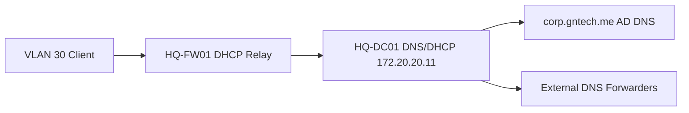
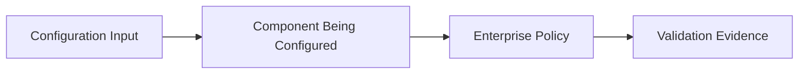

# DNS and DHCP Implementation

## Document Control

| Field | Value |
|---|---|
| Document ID | GEIL-MSC-DNSDHCP-001 |
| Owner | Infrastructure Engineering |
| Status | Draft |
| Version | 2.1 |
| Last Reviewed | 2026-06-29 |
| Review Cycle | Quarterly |
| Classification | Internal Confidential |

!!! note "Adaptation"

    This guide uses canonical GNTECH values from the [Environment Specification](../project/environment-specification.md), including `corp.gntech.me`, `HQ-DC01`, VLAN gateways, and the `172.20.0.0/16` addressing model. Update the Environment Specification before adapting values.

## Purpose

Implement internal DNS configuration and DHCP scopes for the GEIL HQ foundation after `HQ-DC01` has been promoted as the first domain controller.

## Learning Objectives

After completing this guide you will understand:

- Why AD DNS is authoritative for `corp.gntech.me`.
- How DNS forwarders support external resolution without replacing AD DNS.
- How DHCP scopes map to GEIL VLANs.
- How DHCP relay on `HQ-FW01` integrates with Windows DHCP.
- How to validate name resolution, lease assignment, and client options.
- How to troubleshoot common DNS and DHCP failures.

## What You Will Build

By the end of this guide you will have:

- ✓ Secure dynamic updates enabled for `corp.gntech.me`.
- ✓ DNS forwarders configured.
- ✓ Windows DHCP installed and authorized on `HQ-DC01`.
- ✓ Workstation DHCP scope for VLAN 30.
- ✓ Prepared scope plan for printers, corporate WiFi, and future networks.
- ✓ Validation evidence captured for DNS and DHCP.

## Estimated Time

45-75 minutes for initial DNS and the first DHCP scope.

## Difficulty

Intermediate.

The tasks use Windows Server DNS/DHCP consoles and PowerShell. The main risk is assigning incorrect DHCP options to a VLAN.

## Risk Level

Medium.

Incorrect DNS or DHCP options can prevent clients from joining the domain or reaching required services.

## Service Impact

Maintenance window recommended.

The first DHCP scope can affect clients on the target VLAN when DHCP relay is enabled.

## Prerequisites

- [Active Directory Implementation](active-directory-implementation.md) completed.
- `HQ-DC01` is promoted and healthy.
- `HQ-DC01` static IP is `172.20.20.11/24`.
- `HQ-FW01` VLAN gateways exist.
- DHCP relay remains disabled until scopes are ready.
- Approved DNS forwarder policy identified.
- Access to `HQ-DC01` with domain administrative privileges.
- Access to `HQ-FW01` to enable DHCP relay after scopes exist.

## Architecture Overview

AD-integrated DNS runs on `HQ-DC01`. DHCP runs on `HQ-DC01` and serves client VLANs through relay on `HQ-FW01` after scopes are created.



!!! info "Architecture references"

    This guide implements the DNS and DHCP capabilities described in [Enterprise Lab Identity HLD](../architecture/enterprise-lab-identity-hld.md) and relies on the HQ foundation guides in the Platform section.

## Background Knowledge

### What is DNS?

DNS translates names such as `HQ-DC01.corp.gntech.me` into IP addresses.

### What is AD-integrated DNS?

AD-integrated DNS stores zones in Active Directory and replicates them between domain controllers.

### What is DHCP?

DHCP automatically gives clients IP addresses, gateways, DNS servers, and domain search information.

### What is DHCP relay?

DHCP relay forwards client DHCP requests from a VLAN to a DHCP server on another subnet. GEIL uses `HQ-FW01` for relay because `HQ-DC01` is not directly attached to every client VLAN.

## Step-by-Step Procedure

### Step 1: Validate AD DNS health

#### Goal

Confirm the AD DNS zone exists and supports secure updates.

#### Why this step matters

DHCP and domain joins depend on reliable DNS. If DNS is wrong, clients cannot find domain controllers.

#### Navigation path

`Server Manager -> Tools -> DNS`

#### Commands

```powershell
Get-DnsServerZone -Name "corp.gntech.me"
Resolve-DnsName _ldap._tcp.dc._msdcs.corp.gntech.me -Type SRV
```

#### Expected results

You should now see:

- Zone `corp.gntech.me` exists.
- LDAP SRV records resolve.

#### Rollback

No rollback is required for read-only validation.

### Step 2: Enforce secure dynamic updates

#### Goal

Allow domain-joined systems to update DNS securely while preventing unauthenticated updates.

#### Why this step matters

Secure updates reduce stale or malicious DNS records.

#### Commands

```powershell
Set-DnsServerPrimaryZone -Name "corp.gntech.me" -DynamicUpdate Secure
Get-DnsServerZone -Name "corp.gntech.me" | Select-Object ZoneName,DynamicUpdate
```

#### Expected results

You should now see:

- `DynamicUpdate` set to `Secure`.

#### Rollback

Do not disable secure updates for the domain zone unless an approved troubleshooting exception exists.

### Step 3: Configure DNS forwarders

#### Goal

Allow internal DNS to resolve external names without making clients use public DNS directly.

#### Why this step matters

Domain clients should use AD DNS. AD DNS can forward unknown public names upstream.

#### Commands

```powershell
Set-DnsServerForwarder -IPAddress 1.1.1.1,1.0.0.1
Get-DnsServerForwarder
Resolve-DnsName www.microsoft.com
```

#### Expected results

You should now see:

- Forwarders `1.1.1.1` and `1.0.0.1` listed.
- Public DNS lookup succeeds from `HQ-DC01`.

#### Rollback

```powershell
Remove-DnsServerForwarder -IPAddress 1.1.1.1,1.0.0.1 -Force
```

### Step 4: Install and authorize DHCP

#### Goal

Install DHCP on `HQ-DC01` and authorize it in Active Directory.

#### Why this step matters

Windows DHCP servers must be authorized in AD before serving domain networks.

#### Commands

```powershell
Install-WindowsFeature DHCP -IncludeManagementTools
Add-DhcpServerInDC -DnsName "HQ-DC01.corp.gntech.me" -IPAddress 172.20.20.11
Get-DhcpServerInDC
```

#### Expected results

You should now see:

- DHCP role installed.
- `HQ-DC01.corp.gntech.me` authorized with IP `172.20.20.11`.

#### Rollback

```powershell
Remove-DhcpServerInDC -DnsName "HQ-DC01.corp.gntech.me" -IPAddress 172.20.20.11
Uninstall-WindowsFeature DHCP
```

### Step 5: Create the VLAN 30 workstation scope

#### Goal

Provide DHCP addresses to workstation clients on VLAN 30.

#### Why this step matters

VLAN 30 is the first user/client VLAN and supports `HQ-MGMT01` and `HQ-W11-001` testing.

#### Commands

```powershell
Add-DhcpServerv4Scope `
  -Name "WORKSTATIONS-HQ" `
  -StartRange 172.20.30.50 `
  -EndRange 172.20.30.250 `
  -SubnetMask 255.255.255.0 `
  -State Active

Set-DhcpServerv4OptionValue `
  -ScopeId 172.20.30.0 `
  -Router 172.20.30.1 `
  -DnsServer 172.20.20.11 `
  -DnsDomain "corp.gntech.me"

Get-DhcpServerv4Scope
Get-DhcpServerv4OptionValue -ScopeId 172.20.30.0
```

#### Expected results

You should now see:

- Scope `WORKSTATIONS-HQ` active.
- Router option `172.20.30.1`.
- DNS server option `172.20.20.11`.
- DNS domain option `corp.gntech.me`.

#### Rollback

```powershell
Remove-DhcpServerv4Scope -ScopeId 172.20.30.0 -Force
```

### Step 6: Enable DHCP relay on `HQ-FW01` only after scopes exist

#### Goal

Forward VLAN 30 DHCP requests to `HQ-DC01`.

#### Why this step matters

Clients on VLAN 30 cannot broadcast directly to a DHCP server on VLAN 20. Relay bridges that gap without putting DHCP on every VLAN.

#### Navigation path

`HQ-FW01 -> Services -> DHCP Relay`

#### Procedure

1. Enable DHCP relay for VLAN 30 only.
2. Set relay target to `172.20.20.11`.
3. Do not enable relay for VLAN 70 Guest WiFi.
4. Save and apply.

#### Expected results

You should now see:

- VLAN 30 relay target: `172.20.20.11`.
- VLAN 70 is absent from AD DHCP relay.

#### Rollback

Disable relay on VLAN 30 and apply changes.

## Validation

From a VLAN 30 Windows client:

```powershell
ipconfig /release
ipconfig /renew
ipconfig /all
Resolve-DnsName HQ-DC01.corp.gntech.me
Resolve-DnsName _ldap._tcp.dc._msdcs.corp.gntech.me -Type SRV
```

Expected results:

- Client receives `172.20.30.50-250` address.
- Default gateway is `172.20.30.1`.
- DNS server is `172.20.20.11`.
- DNS suffix is `corp.gntech.me`.
- SRV records resolve.

## Common Mistakes

| Mistake | Symptom | Fix |
|---|---|---|
| Relay enabled before scope exists | Client receives no lease | Create scope, then enable relay |
| Guest VLAN relays to AD DHCP | Guest clients get internal options | Remove VLAN 70 from relay immediately |
| Clients use public DNS | Domain join fails | Set DHCP option 006 to `172.20.20.11` |
| Wrong gateway option | Clients cannot leave VLAN | Set router option to VLAN gateway `.1` |

## Troubleshooting

- Use `Get-DhcpServerv4Scope` to confirm the scope exists.
- Use `Get-DhcpServerv4Lease -ScopeId 172.20.30.0` to confirm leases.
- Use MikroTik CHR firewall logs to confirm DHCP relay traffic is allowed.
- Use `Resolve-DnsName` for SRV records before troubleshooting domain join.
- Use `ipconfig /all` to verify client options.

## Rollback

To remove the initial workstation DHCP scope:

```powershell
Remove-DhcpServerv4Scope -ScopeId 172.20.30.0 -Force
```

To deauthorize DHCP:

```powershell
Remove-DhcpServerInDC -DnsName "HQ-DC01.corp.gntech.me" -IPAddress 172.20.20.11
```

To disable relay, use `HQ-FW01 -> Services -> DHCP Relay`, remove VLAN 30, and apply changes.

## Evidence Collection

Capture:

- Screenshot: DNS zone `corp.gntech.me`.
- Screenshot: DHCP scope `WORKSTATIONS-HQ`.
- Screenshot: DHCP relay configuration on `HQ-FW01`.
- Command output: `Get-DnsServerForwarder`.
- Command output: `Get-DhcpServerInDC`.
- Command output: `Get-DhcpServerv4Scope`.
- Client output: `ipconfig /all`.

!!! example "Screenshot Required"

    Path: `Server Manager -> Tools -> DHCP -> HQ-DC01 -> IPv4`

    Expected result:

    - Scope `WORKSTATIONS-HQ` exists.
    - Address pool is `172.20.30.50` through `172.20.30.250`.

    Store screenshots under `docs/assets/images/dns-dhcp-implementation/`.

## Knowledge Check

1. Why should domain clients use AD DNS instead of public DNS directly?
2. Why is DHCP relay required for VLAN 30?
3. Why must VLAN 70 not relay to AD DHCP?
4. Which DHCP option gives clients their default gateway?
5. Which DNS query proves clients can locate domain controllers?

## Next Guide

Continue to:

- [Group Policy Baseline](group-policy-baseline.md)


## Educational Enterprise Context

### What you are building

You are building the DNS and DHCP services as part of the GEIL enterprise learning and deployment platform.

### Why this component exists

DNS lets systems find services by name, and DHCP assigns network configuration to clients. These services exist so domain clients can locate domain controllers and obtain correct VLAN settings automatically.

### How this component interacts with the rest of the enterprise

AD DNS runs on `HQ-DC01`; DHCP serves scopes from VLAN 20 while `HQ-FW01` relays selected VLANs. Guest VLAN 70 must not relay to AD DHCP.

### Internal workflow



The internal workflow is intentionally simple: define the value, apply it to the component, let the component enforce or provide the service, then capture evidence proving the expected behavior.

!!! enterprise "Enterprise pattern"

    Large enterprises typically run DNS/DHCP on multiple servers, use DHCP failover, monitor lease exhaustion, and tightly control client DNS so domain resolution remains reliable.

!!! implementation "GEIL deployment note"

    GEIL intentionally delays DHCP relay until Windows DHCP scopes exist, preventing clients from receiving incomplete or incorrect network options.

### Real-world enterprise usage

In real enterprises, this pattern is used to make infrastructure repeatable, auditable, and recoverable. The guide teaches the manual implementation first so future automation has a known-good target state.

### Design decisions specific to GEIL

| Decision | GEIL Position | Why it matters |
|---|---|---|
| Canonical values | Values come from the Environment Specification | Prevents conflicting hostnames, IP addresses, and service names |
| Evidence-first deployment | Each major step produces validation evidence | Makes acceptance and troubleshooting objective |
| Rollback before risk | Risky changes require checkpoints or exports | Protects the deployment from lockout or destructive mistakes |
| Simple first design | Phase 1 favors clear single-site patterns | Builds a foundation that can scale later without ambiguity |

### Alternatives considered

| Alternative | Why GEIL does not use it first |
|---|---|
| Ad hoc configuration | Hard to audit, teach, or reproduce |
| Full automation before learning | Hides the enterprise concepts from new operators |
| Untracked local notes | Cannot be reviewed, validated, or reused |
| Skipping evidence capture | Makes acceptance subjective |

### Security considerations

- Use approved administrative accounts only.
- Do not store passwords, private keys, firewall exports, or sensitive screenshots in Git.
- Apply least privilege and explicit allow rules.
- Treat management paths as privileged infrastructure.

### Performance considerations

- Validate the component under the expected Phase 1 workload before adding dependent services.
- Avoid broad troubleshooting changes that mask resource, latency, or policy issues.
- Record baseline behavior so future performance regressions are visible.

### Scalability considerations

- Keep names, VLANs, and service boundaries aligned with the HLD/LLD.
- Prefer patterns that can add a second node, second site, or automated deployment later.
- Do not hard-code temporary bootstrap decisions into long-term architecture.

### Operational considerations

- Capture screenshots and command output during deployment.
- Record known exceptions immediately.
- Re-run validation after every rollback or remediation.
- Update this guide when real deployment discovers a better operator note.

### Explanation depth for important values

| Value Type | What it is | Why GEIL uses it | What happens if it changes | Customizable? |
|---|---|---|---|---|
| Hostname | Stable component identity | Enables deterministic docs, DNS, logs, and evidence | Cross-references and monitoring become wrong | Only through Environment Specification |
| IP address | Stable network endpoint | Supports firewall rules, DNS, DHCP, and tests | Connectivity and validation can fail | Only through HLD/LLD update |
| VLAN or bridge name | Network boundary | Keeps traffic segmented and understandable | Traffic may land in the wrong zone | Only through network design update |
| Snapshot/export name | Recovery checkpoint | Makes rollback auditable | Operators may restore the wrong state | Naming can expand but not lose meaning |

### Frequently Asked Questions

#### Why does GEIL explain concepts before commands?

Because an engineer who understands the reason behind a command can troubleshoot safely when the environment differs from the happy path.

#### Can these values be customized?

Yes, but only by updating the Environment Specification and dependent HLD/LLD documents first. Implementation guides consume canonical values; they do not redefine them.

#### Why is evidence collection mandatory?

Evidence proves that implementation matched the design. It also gives future operators a baseline for troubleshooting and audits.

#### Why include rollback in every guide?

Enterprise infrastructure changes can fail even when the design is correct. Rollback guidance prevents panic-driven fixes and protects dependent services.

### Key takeaways

- GEIL guides are learning artifacts and deployment controls.
- The operator should understand why the component exists before configuring it.
- Validation and evidence are part of the implementation, not afterthoughts.
- Canonical values must come from the Environment Specification and HLD/LLD baseline.
