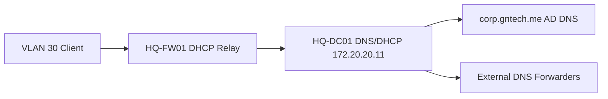

# DNS and DHCP Implementation

## Document Control

| Field | Value |
|---|---|
| Document ID | GEIL-MSC-DNSDHCP-001 |
| Owner | Infrastructure Engineering |
| Status | Draft |
| Version | 2.3 |
| Last Reviewed | 2026-06-29 |
| Review Cycle | Quarterly |
| Classification | Internal Confidential |

!!! note "Adaptation"

    This guide uses canonical GNTECH values from the [Environment Specification](../project/environment-specification.md), including `corp.gntech.me`, `HQ-DC01`, VLAN gateways, and the `172.20.0.0/16` addressing model. Update the Environment Specification before adapting values.

## Purpose

Implement internal DNS configuration and DHCP scopes for the GEIL HQ foundation after `HQ-DC01` has been promoted as the first domain controller.

## Learning Objectives

After completing this guide you will understand:

- Why AD DNS is authoritative for `corp.gntech.me`.
- How DNS forwarders support external resolution without replacing AD DNS.
- How DHCP scopes map to GEIL VLANs.
- How DHCP relay on `HQ-FW01` integrates with Windows DHCP.
- How to validate name resolution, lease assignment, and client options.
- How to troubleshoot common DNS and DHCP failures.

## What You Will Build

By the end of this guide you will have:

- ✓ Secure dynamic updates enabled for `corp.gntech.me`.
- ✓ DNS forwarders configured.
- ✓ Windows DHCP installed and authorized on `HQ-DC01`.
- ✓ Workstation DHCP scope for VLAN 30.
- ✓ Prepared scope plan for printers, corporate WiFi, and future networks.
- ✓ Validation evidence captured for DNS and DHCP.

## Estimated Time

45-75 minutes for initial DNS and the first DHCP scope.

## Difficulty

Intermediate.

The tasks use Windows Server DNS/DHCP consoles and PowerShell. The main risk is assigning incorrect DHCP options to a VLAN.

## Risk Level

Medium.

Incorrect DNS or DHCP options can prevent clients from joining the domain or reaching required services.

## Service Impact

Maintenance window recommended.

The first DHCP scope can affect clients on the target VLAN when DHCP relay is enabled.

## Prerequisites

- [Firewall Rule Matrix](../network/firewall-rule-matrix.md) and [Enterprise Port Reference](../platform/enterprise-port-reference.md) reviewed for DNS/DHCP flows.
- [Active Directory Organizational Foundation](active-directory-organizational-foundation.md) completed before DHCP authorization and scope rollout.


- [Active Directory Implementation](active-directory-implementation.md) completed.
- `HQ-DC01` is promoted and healthy.
- `HQ-DC01` static IP is `172.20.20.11/24`.
- `HQ-FW01` VLAN gateways exist.
- DHCP relay remains disabled until scopes are ready.
- Approved DNS forwarder policy identified.
- Access to `HQ-DC01` with domain administrative privileges.
- Access to `HQ-FW01` to enable DHCP relay after scopes exist.


## Expected Starting State

- Active Directory implementation is complete.
- AD DNS health validates before DHCP integration.
- `HQ-DC01` is reachable at `172.20.20.11`.
- MikroTik CHR VLAN gateways exist on `HQ-FW01`.
- DHCP relay is absent or disabled on MikroTik CHR.
- VLAN 70 Guest WiFi is isolated and not planned for AD DHCP.

## Expected Ending State

- AD DNS zone `corp.gntech.me` uses secure dynamic updates.
- DNS forwarders are configured on `HQ-DC01`.
- DHCP role is installed before authorization.
- DHCP server is authorized before scopes serve clients.
- VLAN 30 scope exists before MikroTik DHCP relay is enabled.
- MikroTik CHR relay targets `172.20.20.11` only for approved VLANs and not VLAN 70.

## Architecture Overview

AD-integrated DNS runs on `HQ-DC01`. DHCP runs on `HQ-DC01` and serves client VLANs through relay on `HQ-FW01` after scopes are created.



!!! info "Architecture references"

    This guide implements the DNS and DHCP capabilities described in [Enterprise Lab Identity HLD](../architecture/enterprise-lab-identity-hld.md) and relies on the HQ foundation guides in the Platform section.

## Background Knowledge

### What is DNS?

DNS translates names such as `HQ-DC01.corp.gntech.me` into IP addresses.

### What is AD-integrated DNS?

AD-integrated DNS stores zones in Active Directory and replicates them between domain controllers.

### What is DHCP?

DHCP automatically gives clients IP addresses, gateways, DNS servers, and domain search information.

### What is DHCP relay?

DHCP relay forwards client DHCP requests from a VLAN to a DHCP server on another subnet. GEIL uses `HQ-FW01` for relay because `HQ-DC01` is not directly attached to every client VLAN.

## Step-by-Step Procedure

### Step 1: Validate AD DNS health

#### Goal

Confirm the AD DNS zone exists and supports secure updates.

#### Why this step matters

DHCP and domain joins depend on reliable DNS. If DNS is wrong, clients cannot find domain controllers.

#### Navigation path

`Server Manager -> Tools -> DNS`

#### Commands

Run on: `HQ-FW01`

When: execute at this point in the procedure after the stated prerequisites are true and before continuing to the next step.

Expected outcome: the command completes successfully and the following expected result or validation section confirms the change.

```powershell
Get-DnsServerZone -Name "corp.gntech.me"
Resolve-DnsName _ldap._tcp.dc._msdcs.corp.gntech.me -Type SRV
```

#### Expected results

You should now see:

- Zone `corp.gntech.me` exists.
- LDAP SRV records resolve.

#### Rollback

No rollback is required for read-only validation.

### Step 2: Enforce secure dynamic updates

#### Goal — Step 2: Enforce secure dynamic updates

Allow domain-joined systems to update DNS securely while preventing unauthenticated updates.

#### Why this step matters — Step 2: Enforce secure dynamic updates

Secure updates reduce stale or malicious DNS records.

#### Commands — Step 2: Enforce secure dynamic updates

Run on: `HQ-FW01`

When: execute at this point in the procedure after the stated prerequisites are true and before continuing to the next step.

Expected outcome: the command completes successfully and the following expected result or validation section confirms the change.

```powershell
$ErrorActionPreference = "Stop"
Import-Module DnsServer -ErrorAction Stop

$CurrentIdentity = [Security.Principal.WindowsIdentity]::GetCurrent()
$CurrentGroups = foreach ($Sid in $CurrentIdentity.Groups) {
    try {
        $Sid.Translate([Security.Principal.NTAccount]).Value
    }
    catch {}
}
$AllowedGroupNames = @(
    "Domain Admins",
    "Enterprise Admins",
    "DHCP Administrators"
)
$CurrentGroupShortNames = $CurrentGroups | ForEach-Object {
    ($_ -split "\\")[-1]
}
if (-not ($CurrentGroupShortNames | Where-Object { $_ -in $AllowedGroupNames })) {
    throw "Current user '$($CurrentIdentity.Name)' lacks approved DHCP/DNS change permissions."
}

$ZoneName = "corp.gntech.me"
$Zone = Get-DnsServerZone -Name $ZoneName -ErrorAction Stop

if ($Zone.DynamicUpdate -ne "Secure") {
    Set-DnsServerPrimaryZone -Name $ZoneName -DynamicUpdate Secure -ErrorAction Stop
    Write-Host "DNS zone updated to secure dynamic updates: $ZoneName" -ForegroundColor Green
}

$Zone = Get-DnsServerZone -Name $ZoneName -ErrorAction Stop
if ($Zone.DynamicUpdate -ne "Secure") {
    throw "DNS zone dynamic update mode is not Secure. Current value: $($Zone.DynamicUpdate)"
}

Write-Host "DNS zone uses secure dynamic updates: $ZoneName" -ForegroundColor Green
Get-DnsServerZone -Name $ZoneName | Select-Object ZoneName,DynamicUpdate
```


#### Expected results — Step 2: Enforce secure dynamic updates

You should now see:

- `DynamicUpdate` set to `Secure`.

#### Rollback — Step 2: Enforce secure dynamic updates

Do not disable secure updates for the domain zone unless an approved troubleshooting exception exists.

### Step 3: Configure DNS forwarders

#### Goal — Step 3: Configure DNS forwarders

Allow internal DNS to resolve external names without making clients use public DNS directly.

#### Why this step matters — Step 3: Configure DNS forwarders

Domain clients should use AD DNS. AD DNS can forward unknown public names upstream.

#### Commands — Step 3: Configure DNS forwarders

Run on: `HQ-DC01`

When: execute at this point in the procedure after the stated prerequisites are true and before continuing to the next step.

Expected outcome: the command completes successfully and the following expected result or validation section confirms the change.

```powershell
$ErrorActionPreference = "Stop"
Import-Module DnsServer -ErrorAction Stop

$CurrentIdentity = [Security.Principal.WindowsIdentity]::GetCurrent()
$CurrentGroups = foreach ($Sid in $CurrentIdentity.Groups) {
    try {
        $Sid.Translate([Security.Principal.NTAccount]).Value
    }
    catch {}
}
$AllowedGroupNames = @(
    "Domain Admins",
    "Enterprise Admins",
    "DHCP Administrators"
)
$CurrentGroupShortNames = $CurrentGroups | ForEach-Object {
    ($_ -split "\\")[-1]
}
if (-not ($CurrentGroupShortNames | Where-Object { $_ -in $AllowedGroupNames })) {
    throw "Current user '$($CurrentIdentity.Name)' lacks approved DHCP/DNS change permissions."
}

$RequiredForwarders = @(
    "1.1.1.1",
    "1.0.0.1"
)

$ExistingForwarders = @((Get-DnsServerForwarder).IPAddress.IPAddressToString)
$MissingForwarders = $RequiredForwarders | Where-Object { $_ -notin $ExistingForwarders }

if ($MissingForwarders.Count -gt 0) {
    Set-DnsServerForwarder -IPAddress $RequiredForwarders -ErrorAction Stop
    Write-Host "DNS forwarders updated: $($RequiredForwarders -join ', ')" -ForegroundColor Green
}

$CurrentForwarders = @((Get-DnsServerForwarder).IPAddress.IPAddressToString)
$StillMissing = $RequiredForwarders | Where-Object { $_ -notin $CurrentForwarders }

if ($StillMissing.Count -gt 0) {
    throw "DNS forwarder validation failed. Missing: $($StillMissing -join ', ')"
}

Write-Host "DNS forwarders validated: $($RequiredForwarders -join ', ')" -ForegroundColor Green
Get-DnsServerForwarder
Resolve-DnsName www.microsoft.com
```


#### Expected results — Step 3: Configure DNS forwarders

You should now see:

- Forwarders `1.1.1.1` and `1.0.0.1` listed.
- Public DNS lookup succeeds from `HQ-DC01`.

#### Rollback — Step 3: Configure DNS forwarders

Run on: `HQ-DC01`

When: execute at this point in the procedure after the stated prerequisites are true and before continuing to the next step.

Expected outcome: the command completes successfully and the following expected result or validation section confirms the change.

```powershell
Remove-DnsServerForwarder -IPAddress 1.1.1.1,1.0.0.1 -Force
```

### Step 4: Install and authorize DHCP

#### Goal — Step 4: Install and authorize DHCP

Install DHCP on `HQ-DC01` and authorize it in Active Directory.

#### Why this step matters — Step 4: Install and authorize DHCP

Windows DHCP servers must be authorized in AD before serving domain networks.

#### Commands — Step 4: Install and authorize DHCP

Run on: `HQ-DC01`

When: execute at this point in the procedure after the stated prerequisites are true and before continuing to the next step.

Expected outcome: the command completes successfully and the following expected result or validation section confirms the change.

```powershell
$ErrorActionPreference = "Stop"
Import-Module ServerManager -ErrorAction Stop

$CurrentIdentity = [Security.Principal.WindowsIdentity]::GetCurrent()
$CurrentGroups = foreach ($Sid in $CurrentIdentity.Groups) {
    try {
        $Sid.Translate([Security.Principal.NTAccount]).Value
    }
    catch {}
}
$AllowedGroupNames = @(
    "Domain Admins",
    "Enterprise Admins",
    "DHCP Administrators"
)
$CurrentGroupShortNames = $CurrentGroups | ForEach-Object {
    ($_ -split "\\")[-1]
}
if (-not ($CurrentGroupShortNames | Where-Object { $_ -in $AllowedGroupNames })) {
    throw "Current user '$($CurrentIdentity.Name)' lacks approved DHCP/DNS change permissions."
}

$ServerFqdn = "HQ-DC01.corp.gntech.me"
$ServerIp = "172.20.20.11"
$Results = @()

$Feature = Get-WindowsFeature DHCP
if (-not $Feature.Installed) {
    Install-WindowsFeature DHCP -IncludeManagementTools -ErrorAction Stop | Out-Null
    $Results += [PSCustomObject]@{Status="Created"; Name="DHCP role"; DistinguishedName=$env:COMPUTERNAME; Parent="Windows Features"; Timestamp=(Get-Date -Format "yyyy-MM-ddTHH:mm:ssK")}
}

$Feature = Get-WindowsFeature DHCP
if ($Feature.Installed) {
    $Results += [PSCustomObject]@{Status="Existing"; Name="DHCP role"; DistinguishedName=$env:COMPUTERNAME; Parent="Windows Features"; Timestamp=(Get-Date -Format "yyyy-MM-ddTHH:mm:ssK")}
}

Import-Module DhcpServer -ErrorAction Stop
$Authorized = Get-DhcpServerInDC | Where-Object {
    $_.DnsName -eq $ServerFqdn -and $_.IPAddress.IPAddressToString -eq $ServerIp
}
if (-not $Authorized) {
    Add-DhcpServerInDC -DnsName $ServerFqdn -IPAddress $ServerIp -ErrorAction Stop
    Write-Host "DHCP server authorized in AD: $ServerFqdn / $ServerIp" -ForegroundColor Green
}

$Authorized = Get-DhcpServerInDC | Where-Object {
    $_.DnsName -eq $ServerFqdn -and $_.IPAddress.IPAddressToString -eq $ServerIp
}
if (-not $Authorized) {
    throw "DHCP authorization validation failed for $ServerFqdn / $ServerIp"
}

$Results += [PSCustomObject]@{Status="Existing"; Name=$ServerFqdn; DistinguishedName=$ServerIp; Parent="AD DHCP Authorization"; Timestamp=(Get-Date -Format "yyyy-MM-ddTHH:mm:ssK")}
$Results | Format-Table Status,Name,DistinguishedName,Parent,Timestamp -AutoSize
[PSCustomObject]@{
    Created  = @($Results | Where-Object Status -eq "Created").Count
    Existing = @($Results | Where-Object Status -eq "Existing").Count
    Failed   = 0
    Total    = @($Results).Count
}
Get-DhcpServerInDC
```


#### Expected results — Step 4: Install and authorize DHCP

You should now see:

- DHCP role installed.
- `HQ-DC01.corp.gntech.me` authorized with IP `172.20.20.11`.

#### Rollback — Step 4: Install and authorize DHCP

Run on: `HQ-DC01`

When: execute at this point in the procedure after the stated prerequisites are true and before continuing to the next step.

Expected outcome: the command completes successfully and the following expected result or validation section confirms the change.

```powershell
Remove-DhcpServerInDC -DnsName "HQ-DC01.corp.gntech.me" -IPAddress 172.20.20.11
Uninstall-WindowsFeature DHCP
```

### Step 5: Create the VLAN 30 workstation scope

#### Goal — Step 5: Create the VLAN 30 workstation scope

Provide DHCP addresses to workstation clients on VLAN 30.

#### Why this step matters — Step 5: Create the VLAN 30 workstation scope

VLAN 30 is the first user/client VLAN and supports `HQ-MGMT01` and `HQ-W11-001` testing.

#### Commands — Step 5: Create the VLAN 30 workstation scope

Run on: `HQ-DC01`

When: execute at this point in the procedure after the stated prerequisites are true and before continuing to the next step.

Expected outcome: the command completes successfully and the following expected result or validation section confirms the change.

```powershell
$ErrorActionPreference = "Stop"
Import-Module DhcpServer -ErrorAction Stop

$CurrentIdentity = [Security.Principal.WindowsIdentity]::GetCurrent()
$CurrentGroups = foreach ($Sid in $CurrentIdentity.Groups) {
    try {
        $Sid.Translate([Security.Principal.NTAccount]).Value
    }
    catch {}
}
$AllowedGroupNames = @(
    "Domain Admins",
    "Enterprise Admins",
    "DHCP Administrators"
)
$CurrentGroupShortNames = $CurrentGroups | ForEach-Object {
    ($_ -split "\\")[-1]
}
if (-not ($CurrentGroupShortNames | Where-Object { $_ -in $AllowedGroupNames })) {
    throw "Current user '$($CurrentIdentity.Name)' lacks approved DHCP/DNS change permissions."
}

$ScopeId = [IPAddress]"172.20.30.0"
$ScopeName = "WORKSTATIONS-HQ"
$Results = @()

$ExistingScope = Get-DhcpServerv4Scope -ScopeId $ScopeId -ErrorAction SilentlyContinue
if (-not $ExistingScope) {
    Add-DhcpServerv4Scope `
        -Name $ScopeName `
        -StartRange 172.20.30.50 `
        -EndRange 172.20.30.250 `
        -SubnetMask 255.255.255.0 `
        -State Active `
        -ErrorAction Stop
    $Results += [PSCustomObject]@{Status="Created"; Name=$ScopeName; DistinguishedName=$ScopeId.IPAddressToString; Parent="DHCP IPv4 Scopes"; Timestamp=(Get-Date -Format "yyyy-MM-ddTHH:mm:ssK")}
}

$Scope = Get-DhcpServerv4Scope -ScopeId $ScopeId -ErrorAction Stop
if ($Scope) {
    $Results += [PSCustomObject]@{Status="Existing"; Name=$Scope.Name; DistinguishedName=$ScopeId.IPAddressToString; Parent="DHCP IPv4 Scopes"; Timestamp=(Get-Date -Format "yyyy-MM-ddTHH:mm:ssK")}
}

Set-DhcpServerv4OptionValue `
    -ScopeId $ScopeId `
    -Router 172.20.30.1 `
    -DnsServer 172.20.20.11 `
    -DnsDomain "corp.gntech.me" `
    -ErrorAction Stop

$Results += [PSCustomObject]@{Status="Updated"; Name="$ScopeName options"; DistinguishedName=$ScopeId.IPAddressToString; Parent="DHCP IPv4 Scope Options"; Timestamp=(Get-Date -Format "yyyy-MM-ddTHH:mm:ssK")}
$Results | Format-Table Status,Name,DistinguishedName,Parent,Timestamp -AutoSize
[PSCustomObject]@{
    Created  = @($Results | Where-Object Status -eq "Created").Count
    Existing = @($Results | Where-Object Status -eq "Existing").Count
    Updated  = @($Results | Where-Object Status -eq "Updated").Count
    Failed   = @($Results | Where-Object Status -eq "Failed").Count
    Total    = @($Results).Count
}
Get-DhcpServerv4Scope -ScopeId $ScopeId
Get-DhcpServerv4OptionValue -ScopeId $ScopeId
```


#### Expected results — Step 5: Create the VLAN 30 workstation scope

You should now see:

- Scope `WORKSTATIONS-HQ` active.
- Router option `172.20.30.1`.
- DNS server option `172.20.20.11`.
- DNS domain option `corp.gntech.me`.

#### Rollback — Step 5: Create the VLAN 30 workstation scope

Run on: `HQ-DC01`

When: execute at this point in the procedure after the stated prerequisites are true and before continuing to the next step.

Expected outcome: the command completes successfully and the following expected result or validation section confirms the change.

```powershell
Remove-DhcpServerv4Scope -ScopeId 172.20.30.0 -Force
```

### Step 6: Enable MikroTik CHR DHCP relay only after scopes exist

#### Goal — Step 6: Enable MikroTik CHR DHCP relay only after scopes exist

Enable DHCP relay for VLAN 30 only after the Windows DHCP server is authorized and the `WORKSTATIONS-HQ` scope exists.

#### Why this step matters — Step 6: Enable MikroTik CHR DHCP relay only after scopes exist

MikroTik CHR processes DHCP relay traffic as router-local traffic. During the pilot deployment, DHCP did not work when only `chain=forward` firewall rules were added. The client broadcast reaches `HQ-FW01`, and the relay process runs locally on the router, so the DHCP request must be allowed in `chain=input` before the default input deny rule.

Guest VLAN 70 must remain isolated and must never relay to AD DHCP. VLAN 40 and VLAN 60 relays must remain disabled until their scopes exist.

DHCP relay is only the address-assignment path. It does not authorize workstation traffic to reach Active Directory after a lease is issued. VLAN 30 clients must also be permitted through the `HQ-FW01` forward chain to reach required `HQ-DC01` services. The authoritative address-list model and service rules are defined in [Active Directory Network Requirements](../platform/active-directory-network-requirements.md).

!!! implementation "Pilot deployment validated"

    The pilot deployment confirmed two separate firewall requirements. First, VLAN 30 clients received DHCP leases only after input-chain DHCP relay rules were added before `Default deny unapproved traffic to router`. Second, clients still could not query DNS or join the domain until least-privilege forward-chain rules allowed VLAN 30 to reach `HQ-DC01` on required Active Directory service ports. DHCP relay alone is not sufficient for Active Directory deployments.

#### Prerequisite validation

Run on `HQ-DC01`:

Run on: `HQ-FW01`

When: execute at this point in the procedure after the stated prerequisites are true and before continuing to the next step.

Expected outcome: the command completes successfully and the following expected result or validation section confirms the change.

```powershell
Get-DhcpServerInDC
Get-DhcpServerv4Scope -ScopeId 172.20.30.0
Get-DhcpServerv4OptionValue -ScopeId 172.20.30.0
```

Expected result:

- `HQ-DC01.corp.gntech.me` is authorized with `172.20.20.11`.
- Scope `WORKSTATIONS-HQ` exists and is active.
- Scope options include router `172.20.30.1`, DNS server `172.20.20.11`, and DNS domain `corp.gntech.me`.

#### RouterOS commands

Run on `HQ-FW01` only after prerequisite validation succeeds.

Run on: `HQ-FW01`

When: execute at this point in the procedure after the stated prerequisites are true and before continuing to the next step.

Expected outcome: the command completes successfully and the following expected result or validation section confirms the change.

```routeros
/ip dhcp-relay disable [find name="relay-vlan40"]
/ip dhcp-relay disable [find name="relay-vlan60"]
/ip dhcp-relay remove [find name="relay-vlan30"]
/ip dhcp-relay add name=relay-vlan30 interface=vlan30-workstations dhcp-server=172.20.20.11 local-address=172.20.30.1 disabled=no
```

Add firewall rules in `chain=input`, not only in `chain=forward`:

Run on: `HQ-FW01`

When: execute at this point in the procedure after the stated prerequisites are true and before continuing to the next step.

Expected outcome: the command completes successfully and the following expected result or validation section confirms the change.

```routeros
/ip firewall filter remove [find comment~"ALLOW DHCP client requests VLAN30"]
/ip firewall filter remove [find comment~"ALLOW DHCP server replies to CHR relay"]
/ip firewall filter add chain=input action=accept protocol=udp in-interface=vlan30-workstations src-address=0.0.0.0/32 dst-address=255.255.255.255 dst-port=67 place-before=[find comment="Default deny unapproved traffic to router"] comment="ALLOW DHCP client requests VLAN30 to CHR relay"
/ip firewall filter add chain=input action=accept protocol=udp src-address=172.20.20.11 dst-address=172.20.30.1 src-port=67 dst-port=67 place-before=[find comment="Default deny unapproved traffic to router"] comment="ALLOW DHCP server replies to CHR relay"
```

Do not create or enable DHCP relay for `vlan70-guestwifi`.

#### Validation

Run on `HQ-FW01`:

Run on: `HQ-FW01`

When: execute at this point in the procedure after the stated prerequisites are true and before continuing to the next step.

Expected outcome: the command completes successfully and the following expected result or validation section confirms the change.

```routeros
/ip/dhcp-relay/print
/ip/firewall/filter/print where comment~"DHCP"
```

Expected result:

```text
relay-vlan30  vlan30-workstations  172.20.20.11  172.20.30.1
relay-vlan40  disabled
relay-vlan60  disabled
```

The DHCP input allow rules must appear before `Default deny unapproved traffic to router`.

From a VLAN 30 client:

Run on: `HQ-FW01`

When: execute at this point in the procedure after the stated prerequisites are true and before continuing to the next step.

Expected outcome: the command completes successfully and the following expected result or validation section confirms the change.

```bash
dhclient -r eth0
dhclient -v eth0
ip -4 a
ip route
cat /etc/resolv.conf
```

Expected result:

- IPv4 lease from `172.20.30.50` through `172.20.30.250`.
- Default gateway `172.20.30.1`.
- DNS server `172.20.20.11`.
- DNS search domain `corp.gntech.me`.

From `HQ-DC01`:

Run on: `HQ-FW01`

When: execute at this point in the procedure after the stated prerequisites are true and before continuing to the next step.

Expected outcome: the command completes successfully and the following expected result or validation section confirms the change.

```powershell
Get-DhcpServerv4Lease -ScopeId 172.20.30.0 -AllLeases
Get-DhcpServerv4ScopeStatistics -ScopeId 172.20.30.0
```

#### Rollback — Step 6: Enable MikroTik CHR DHCP relay only after scopes exist

Run on: `HQ-FW01`

When: execute at this point in the procedure after the stated prerequisites are true and before continuing to the next step.

Expected outcome: the command completes successfully and the following expected result or validation section confirms the change.

```routeros
/ip dhcp-relay disable [find name="relay-vlan30"]
/ip dhcp-relay remove [find name="relay-vlan30"]
/ip firewall filter remove [find comment~"ALLOW DHCP client requests VLAN30"]
/ip firewall filter remove [find comment~"ALLOW DHCP server replies to CHR relay"]
```


## Deployment Verified Notes

!!! implementation "Pilot deployment lesson"

    Pilot deployment confirmed that DNS secure dynamic updates and DNS forwarder configuration work when the PowerShell blocks avoid fragile regex permission checks and avoid fragmented `if`/`else` examples. GEIL implementation blocks should use short-name group checks and independent validation `if` statements so operators can paste safely in interactive PowerShell.

## Audit Correction Notes

!!! success "Execution-order audit"

    This guide was audited for command order, object dependencies, canonical GEIL values, rollback coverage, validation gates, and active MikroTik CHR firewall references. Follow dependency order exactly: validate prerequisites, create objects, validate objects, apply dependent settings, then capture evidence.

- Audit focus: Validate AD DNS before DHCP, authorize DHCP before scopes serve clients, and enable MikroTik relay only after scopes exist.
- Active Phase 1 firewall implementation: MikroTik CHR / RouterOS on `HQ-FW01`.
- OPNsense is superseded and must not be used for active Phase 1 deployment.

## Validation after each major stage

Validate immediately after each change block. Do not continue when expected output does not match the guide.

## Expected Results

- Commands complete without referencing missing objects.
- Canonical GEIL values are visible in outputs.
- No active OPNsense deployment path remains for Phase 1 firewall work.
- `10.10.x.x` remains limited to existing non-GEIL `PROD`/`TEST` references only.

## Evidence to capture

- Command output proving prerequisite state.
- Command output proving ending state.
- Relevant GUI screenshots where applicable.
- Rollback checkpoint or export evidence where applicable.

## Common Mistakes

| Mistake | Impact | Correction |
|---|---|---|
| Running steps out of order | Commands fail or partial state is created | Return to the last validation gate |
| Referencing missing objects | Invalid commands or unsafe defaults | Create and validate the object first |
| Skipping rollback capture | Recovery is slower | Capture snapshot/export before risky changes |

## Deployment Validation

Complete this validation before moving to Group Policy or client-domain validation.

### DNS validation

#### Goal — DNS validation

Prove that AD DNS resolves internal SRV records and external names through approved forwarders.

#### Commands — DNS validation

Run on: `HQ-DC01`

When: execute at this point in the procedure after the stated prerequisites are true and before continuing to the next step.

Expected outcome: the command completes successfully and the following expected result or validation section confirms the change.

```powershell
Resolve-DnsName _ldap._tcp.dc._msdcs.corp.gntech.me -Type SRV
```

Run on: `HQ-DC01`

When: execute at this point in the procedure after the stated prerequisites are true and before continuing to the next step.

Expected outcome: the command completes successfully and the following expected result or validation section confirms the change.

```powershell
Resolve-DnsName cloudflare.com
```

#### Expected result — DNS validation

Internal SRV lookup returns `HQ-DC01.corp.gntech.me`.

External lookup returns at least one public address for `cloudflare.com`.

#### If validation fails — DNS validation

STOP. Do not enable DHCP relay or proceed to client validation.

Continue only if successful.

### DHCP scope validation

#### Goal — DHCP scope validation

Prove that DHCP scopes exist before enabling MikroTik relay.

#### Commands — DHCP scope validation

Run on: `HQ-DC01`

When: execute at this point in the procedure after the stated prerequisites are true and before continuing to the next step.

Expected outcome: the command completes successfully and the following expected result or validation section confirms the change.

```powershell
Get-DhcpServerv4Scope
```

Run on: `HQ-DC01`

When: execute at this point in the procedure after the stated prerequisites are true and before continuing to the next step.

Expected outcome: the command completes successfully and the following expected result or validation section confirms the change.

```powershell
Get-DhcpServerInDC
```

#### Expected result — DHCP scope validation

```text
ScopeId       SubnetMask      Name
172.20.30.0   255.255.255.0   WORKSTATIONS-HQ
```

`Get-DhcpServerInDC` includes `HQ-DC01.corp.gntech.me` and `172.20.20.11`.

#### If validation fails — DHCP scope validation

STOP. Do not enable DHCP relay on `HQ-FW01`.

Continue only if successful.

### MikroTik relay validation

#### Goal — MikroTik relay validation

Enable relay only after DHCP scopes exist and prove no guest relay exists.

#### Commands — MikroTik relay validation

Run on: `HQ-FW01`

When: execute at this point in the procedure after the stated prerequisites are true and before continuing to the next step.

Expected outcome: the command completes successfully and the following expected result or validation section confirms the change.

```routeros
/ip/dhcp-relay/print
```

#### Expected result — MikroTik relay validation

Approved relay entries target `172.20.20.11`. VLAN 70 must not appear.

```text
relay-vlan30  interface=vlan30-workstations  dhcp-server=172.20.20.11  disabled=no
```

#### If validation fails — MikroTik relay validation

STOP. Disable or remove incorrect relay entries.

Run on: `HQ-FW01`

When: execute at this point in the procedure after the stated prerequisites are true and before continuing to the next step.

Expected outcome: the command completes successfully and the following expected result or validation section confirms the change.

```routeros
/ip dhcp-relay disable [find]
```

Continue only if successful.

## Troubleshooting

Start with read-only validation. Confirm prerequisites, object existence, canonical values, and logs before changing configuration.

## Knowledge Check

1. What prerequisite must exist before this guide can run safely?
2. Which validation proves the main change worked?
3. What rollback action is safest if the last command fails?


## DQI Operator Workflow Upgrade

!!! success "Documentation Quality Initiative improvement"

    This guide was upgraded under the GEIL Documentation Quality Initiative and reviewed against the [Deployment Style Guide](../governance/deployment-style-guide.md). The current quality score is **88/100**.

### Operator workflow for this guide

Use this guide as a sequence of small execution units:

1. Read the goal and why it matters.
2. Confirm the prerequisites and starting state.
3. Execute only the current command block or GUI action.
4. Validate immediately.
5. Capture evidence.
6. Continue only when the expected ending state is true.

### First-time operator focus

This guide now emphasizes AD DNS health before DHCP, DHCP role before authorization, scopes before MikroTik relay, VLAN 70 isolation. The operator should not need to infer execution order from surrounding context.

### Step contract reminder

Before every risky action, confirm:

| Field | Operator question |
|---|---|
| Goal | What one thing am I changing now? |
| Why this matters | Why does the enterprise need this? |
| Estimated time | How long should this section take? |
| Risk level | What can break? |
| Prerequisites | Which object must already exist? |
| Starting state | What must be true before I run the command? |
| Expected ending state | What proves I am done? |

### Local troubleshooting pattern

If a step fails:

1. Stop at the failed step.
2. Do not continue to dependent steps.
3. Run the validation command again.
4. Compare the result with the expected output.
5. Use the rollback for the current step before trying a different approach.
6. Record the failure and correction as implementation evidence.

### Screenshot placement rule

When a GUI action appears in this guide, capture the screenshot at that point in the workflow, not at the end of deployment. The screenshot should show the field/value or status that proves the step succeeded.

## Next Guide

Continue to:

- [Group Policy Baseline](group-policy-baseline.md)
