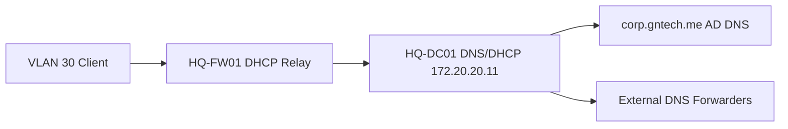

# DNS and DHCP Implementation

## Document Control

| Field | Value |
|---|---|
| Document ID | GEIL-MSC-DNSDHCP-001 |
| Owner | Infrastructure Engineering |
| Status | Draft |
| Version | 2.2 |
| Last Reviewed | 2026-06-29 |
| Review Cycle | Quarterly |
| Classification | Internal Confidential |

!!! note "Adaptation"

    This guide uses canonical GNTECH values from the [Environment Specification](../project/environment-specification.md), including `corp.gntech.me`, `HQ-DC01`, VLAN gateways, and the `172.20.0.0/16` addressing model. Update the Environment Specification before adapting values.

## Purpose

Implement internal DNS configuration and DHCP scopes for the GEIL HQ foundation after `HQ-DC01` has been promoted as the first domain controller.

## Learning Objectives

After completing this guide you will understand:

- Why AD DNS is authoritative for `corp.gntech.me`.
- How DNS forwarders support external resolution without replacing AD DNS.
- How DHCP scopes map to GEIL VLANs.
- How DHCP relay on `HQ-FW01` integrates with Windows DHCP.
- How to validate name resolution, lease assignment, and client options.
- How to troubleshoot common DNS and DHCP failures.

## What You Will Build

By the end of this guide you will have:

- ✓ Secure dynamic updates enabled for `corp.gntech.me`.
- ✓ DNS forwarders configured.
- ✓ Windows DHCP installed and authorized on `HQ-DC01`.
- ✓ Workstation DHCP scope for VLAN 30.
- ✓ Prepared scope plan for printers, corporate WiFi, and future networks.
- ✓ Validation evidence captured for DNS and DHCP.

## Estimated Time

45-75 minutes for initial DNS and the first DHCP scope.

## Difficulty

Intermediate.

The tasks use Windows Server DNS/DHCP consoles and PowerShell. The main risk is assigning incorrect DHCP options to a VLAN.

## Risk Level

Medium.

Incorrect DNS or DHCP options can prevent clients from joining the domain or reaching required services.

## Service Impact

Maintenance window recommended.

The first DHCP scope can affect clients on the target VLAN when DHCP relay is enabled.

## Prerequisites

- [Active Directory Implementation](active-directory-implementation.md) completed.
- `HQ-DC01` is promoted and healthy.
- `HQ-DC01` static IP is `172.20.20.11/24`.
- `HQ-FW01` VLAN gateways exist.
- DHCP relay remains disabled until scopes are ready.
- Approved DNS forwarder policy identified.
- Access to `HQ-DC01` with domain administrative privileges.
- Access to `HQ-FW01` to enable DHCP relay after scopes exist.


## Expected Starting State

- Active Directory implementation is complete.
- AD DNS health validates before DHCP integration.
- `HQ-DC01` is reachable at `172.20.20.11`.
- MikroTik CHR VLAN gateways exist on `HQ-FW01`.
- DHCP relay is absent or disabled on MikroTik CHR.
- VLAN 70 Guest WiFi is isolated and not planned for AD DHCP.

## Expected Ending State

- AD DNS zone `corp.gntech.me` uses secure dynamic updates.
- DNS forwarders are configured on `HQ-DC01`.
- DHCP role is installed before authorization.
- DHCP server is authorized before scopes serve clients.
- VLAN 30 scope exists before MikroTik DHCP relay is enabled.
- MikroTik CHR relay targets `172.20.20.11` only for approved VLANs and not VLAN 70.

## Architecture Overview

AD-integrated DNS runs on `HQ-DC01`. DHCP runs on `HQ-DC01` and serves client VLANs through relay on `HQ-FW01` after scopes are created.



!!! info "Architecture references"

    This guide implements the DNS and DHCP capabilities described in [Enterprise Lab Identity HLD](../architecture/enterprise-lab-identity-hld.md) and relies on the HQ foundation guides in the Platform section.

## Background Knowledge

### What is DNS?

DNS translates names such as `HQ-DC01.corp.gntech.me` into IP addresses.

### What is AD-integrated DNS?

AD-integrated DNS stores zones in Active Directory and replicates them between domain controllers.

### What is DHCP?

DHCP automatically gives clients IP addresses, gateways, DNS servers, and domain search information.

### What is DHCP relay?

DHCP relay forwards client DHCP requests from a VLAN to a DHCP server on another subnet. GEIL uses `HQ-FW01` for relay because `HQ-DC01` is not directly attached to every client VLAN.

## Step-by-Step Procedure

### Step 1: Validate AD DNS health

#### Goal

Confirm the AD DNS zone exists and supports secure updates.

#### Why this step matters

DHCP and domain joins depend on reliable DNS. If DNS is wrong, clients cannot find domain controllers.

#### Navigation path

`Server Manager -> Tools -> DNS`

#### Commands

```powershell
Get-DnsServerZone -Name "corp.gntech.me"
Resolve-DnsName _ldap._tcp.dc._msdcs.corp.gntech.me -Type SRV
```

#### Expected results

You should now see:

- Zone `corp.gntech.me` exists.
- LDAP SRV records resolve.

#### Rollback

No rollback is required for read-only validation.

### Step 2: Enforce secure dynamic updates

#### Goal

Allow domain-joined systems to update DNS securely while preventing unauthenticated updates.

#### Why this step matters

Secure updates reduce stale or malicious DNS records.

#### Commands

```powershell
Set-DnsServerPrimaryZone -Name "corp.gntech.me" -DynamicUpdate Secure
Get-DnsServerZone -Name "corp.gntech.me" | Select-Object ZoneName,DynamicUpdate
```

#### Expected results

You should now see:

- `DynamicUpdate` set to `Secure`.

#### Rollback

Do not disable secure updates for the domain zone unless an approved troubleshooting exception exists.

### Step 3: Configure DNS forwarders

#### Goal

Allow internal DNS to resolve external names without making clients use public DNS directly.

#### Why this step matters

Domain clients should use AD DNS. AD DNS can forward unknown public names upstream.

#### Commands

```powershell
Set-DnsServerForwarder -IPAddress 1.1.1.1,1.0.0.1
Get-DnsServerForwarder
Resolve-DnsName www.microsoft.com
```

#### Expected results

You should now see:

- Forwarders `1.1.1.1` and `1.0.0.1` listed.
- Public DNS lookup succeeds from `HQ-DC01`.

#### Rollback

```powershell
Remove-DnsServerForwarder -IPAddress 1.1.1.1,1.0.0.1 -Force
```

### Step 4: Install and authorize DHCP

#### Goal

Install DHCP on `HQ-DC01` and authorize it in Active Directory.

#### Why this step matters

Windows DHCP servers must be authorized in AD before serving domain networks.

#### Commands

```powershell
Install-WindowsFeature DHCP -IncludeManagementTools
Add-DhcpServerInDC -DnsName "HQ-DC01.corp.gntech.me" -IPAddress 172.20.20.11
Get-DhcpServerInDC
```

#### Expected results

You should now see:

- DHCP role installed.
- `HQ-DC01.corp.gntech.me` authorized with IP `172.20.20.11`.

#### Rollback

```powershell
Remove-DhcpServerInDC -DnsName "HQ-DC01.corp.gntech.me" -IPAddress 172.20.20.11
Uninstall-WindowsFeature DHCP
```

### Step 5: Create the VLAN 30 workstation scope

#### Goal

Provide DHCP addresses to workstation clients on VLAN 30.

#### Why this step matters

VLAN 30 is the first user/client VLAN and supports `HQ-MGMT01` and `HQ-W11-001` testing.

#### Commands

```powershell
Add-DhcpServerv4Scope `
  -Name "WORKSTATIONS-HQ" `
  -StartRange 172.20.30.50 `
  -EndRange 172.20.30.250 `
  -SubnetMask 255.255.255.0 `
  -State Active

Set-DhcpServerv4OptionValue `
  -ScopeId 172.20.30.0 `
  -Router 172.20.30.1 `
  -DnsServer 172.20.20.11 `
  -DnsDomain "corp.gntech.me"

Get-DhcpServerv4Scope
Get-DhcpServerv4OptionValue -ScopeId 172.20.30.0
```

#### Expected results

You should now see:

- Scope `WORKSTATIONS-HQ` active.
- Router option `172.20.30.1`.
- DNS server option `172.20.20.11`.
- DNS domain option `corp.gntech.me`.

#### Rollback

```powershell
Remove-DhcpServerv4Scope -ScopeId 172.20.30.0 -Force
```

### Step 6: Enable MikroTik CHR DHCP relay only after scopes exist

#### Goal

Enable relay only after the Windows DHCP scope exists and is authorized.

#### Why this step matters

If relay is enabled before scopes exist, clients may fail to obtain leases or receive incomplete network options. Guest VLAN 70 must remain isolated and must not relay to AD DHCP.

#### Prerequisite validation

```powershell
Get-DhcpServerv4Scope
Get-DhcpServerInDC
```

Expected result: approved scopes exist and `HQ-DC01.corp.gntech.me` is authorized.

#### RouterOS commands

Run on `HQ-FW01` only after the prerequisite validation succeeds:

```routeros
/ip dhcp-relay add name=relay-vlan30 interface=vlan30-workstations dhcp-server=172.20.20.11 disabled=yes
/ip dhcp-relay print
/ip dhcp-relay enable relay-vlan30
/ip dhcp-relay print
```

Add VLAN 40 and VLAN 60 relay only after their scopes exist:

```routeros
/ip dhcp-relay add name=relay-vlan40 interface=vlan40-printers dhcp-server=172.20.20.11 disabled=yes
/ip dhcp-relay add name=relay-vlan60 interface=vlan60-corpwifi dhcp-server=172.20.20.11 disabled=yes
```

Do not create or enable DHCP relay for `vlan70-guestwifi`.

#### Validation

```routeros
/ip/dhcp-relay/print
```

From `HQ-DC01`:

```powershell
Get-DhcpServerv4Lease -ScopeId 172.20.30.0
```

#### Rollback

```routeros
/ip dhcp-relay disable relay-vlan30
/ip dhcp-relay remove [find name=relay-vlan30]
```


## Audit Correction Notes

!!! success "Execution-order audit"

    This guide was audited for command order, object dependencies, canonical GEIL values, rollback coverage, validation gates, and active MikroTik CHR firewall references. Follow dependency order exactly: validate prerequisites, create objects, validate objects, apply dependent settings, then capture evidence.

- Audit focus: Validate AD DNS before DHCP, authorize DHCP before scopes serve clients, and enable MikroTik relay only after scopes exist.
- Active Phase 1 firewall implementation: MikroTik CHR / RouterOS on `HQ-FW01`.
- OPNsense is superseded and must not be used for active Phase 1 deployment.

## Validation after each major stage

Validate immediately after each change block. Do not continue when expected output does not match the guide.

## Expected Results

- Commands complete without referencing missing objects.
- Canonical GEIL values are visible in outputs.
- No active OPNsense deployment path remains for Phase 1 firewall work.
- `10.10.x.x` remains limited to existing non-GEIL `PROD`/`TEST` references only.

## Evidence to capture

- Command output proving prerequisite state.
- Command output proving ending state.
- Relevant GUI screenshots where applicable.
- Rollback checkpoint or export evidence where applicable.

## Common Mistakes

| Mistake | Impact | Correction |
|---|---|---|
| Running steps out of order | Commands fail or partial state is created | Return to the last validation gate |
| Referencing missing objects | Invalid commands or unsafe defaults | Create and validate the object first |
| Skipping rollback capture | Recovery is slower | Capture snapshot/export before risky changes |

## Troubleshooting

Start with read-only validation. Confirm prerequisites, object existence, canonical values, and logs before changing configuration.

## Knowledge Check

1. What prerequisite must exist before this guide can run safely?
2. Which validation proves the main change worked?
3. What rollback action is safest if the last command fails?

## Next Guide

Continue to:

- [Group Policy Baseline](group-policy-baseline.md)
