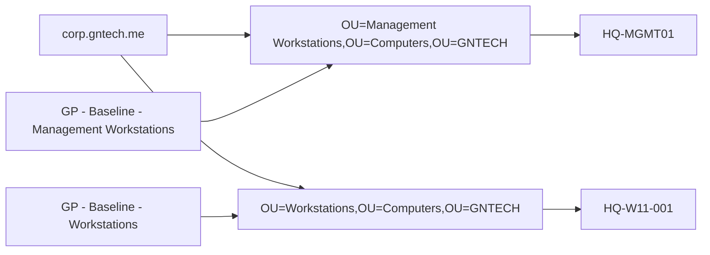

# Group Policy Baseline

## Document Control

| Field | Value |
|---|---|
| Document ID | GEIL-MSC-GPO-001 |
| Owner | Infrastructure Engineering |
| Status | Draft |
| Version | 2.4 |
| Last Reviewed | 2026-07-01 |
| Review Cycle | Quarterly |
| Classification | Internal Confidential |

!!! note "Adaptation"

    This guide uses canonical GNTECH values from the [Environment Specification](../project/environment-specification.md). Update the Environment Specification before changing OU names, domain names, group names, or GPO names.

## Purpose

Create the initial Group Policy baseline for GEIL after the Active Directory forest and baseline OU structure exist.

## Learning Objectives

After completing this guide you will understand:

- Why Group Policy is applied after OU creation.
- How GPO creation, linking, and security filtering differ.
- How to validate GPO scope before enabling broad policy.
- How to roll back by unlinking or disabling a GPO before deleting it.
- How to collect evidence that a policy applied to the intended computer.

## What You Will Build

By the end of this guide you will have:

- ✓ Verified the baseline OU structure exists.
- ✓ Created baseline GPO shells before linking them.
- ✓ Linked the workstation baseline to the Workstations OU under the canonical Computers OU.
- ✓ Created and linked `GP - Baseline - Management Workstations` to the Management Workstations OU.
- ✓ Configured initial validated settings for management workstations: Remote Desktop enabled, Network Level Authentication required, and PowerShell Script Block Logging enabled.
- ✓ Configured a safe example setting for PowerShell script block logging on standard workstations.
- ✓ Validated security filtering and resultant policy.
- ✓ Documented rollback for unlinking and disabling GPOs.

## Estimated Time

30-60 minutes for the initial baseline shell and one validated policy.

## Difficulty

Intermediate. GPOs are easy to create but can affect many systems if linked or filtered incorrectly.

## Risk Level

Medium. Incorrect GPO links or filters can apply settings to the wrong computers.

## Service Impact

Maintenance window recommended for broad policy rollout. Creating unlinked GPOs has no impact; linking enabled GPOs can affect target computers at refresh.

## Prerequisites

- [Active Directory Implementation](active-directory-implementation.md) completed.
- [Active Directory Organizational Foundation](active-directory-organizational-foundation.md) completed and validated.
- [Enterprise Naming Standard](active-directory-naming-standard.md), [Enterprise Group Strategy](group-strategy.md), and [Enterprise Administrative Tiering](../security/administrative-tiering.md) reviewed.
- `corp.gntech.me` forest exists.
- Baseline OUs exist under `OU=GNTECH,DC=corp,DC=gntech,DC=me`, especially `Admin`, `Users`, `Groups`, `Computers`, `Service Accounts`, and `Policies`.
- Group Policy Management Console is installed.
- PowerShell GroupPolicy module is available.
- Test workstation exists or is planned for validation.
- `OU=Management Workstations,OU=Computers,OU=GNTECH,DC=corp,DC=gntech,DC=me` exists for `HQ-MGMT01`.

## Expected Starting State

- Domain exists.
- OUs exist.
- [Active Directory Network Requirements](../platform/active-directory-network-requirements.md) is implemented so workstation clients can reach DNS, Kerberos, LDAP, SMB/SYSVOL/NETLOGON, RPC, NTP, and Global Catalog services on `HQ-DC01`.
- No GEIL baseline GPO is linked to production OUs unless it was created by a previous approved change.

## Expected Ending State

- GPOs exist before links are configured.
- Workstation baseline is linked only to the Workstations OU under the canonical Computers OU.
- `GP - Baseline - Management Workstations` is linked only to `OU=Management Workstations,OU=Computers,OU=GNTECH,...`.
- `HQ-MGMT01` is not left in `OU=Workstations`; it is moved to the Management Workstations OU.
- Initial management workstation settings enable Remote Desktop, require Network Level Authentication, and enable PowerShell Script Block Logging.
- Security filtering is reviewed and documented.
- Rollback commands are captured.

## Architecture Overview

Group Policy depends on the identity foundation sequence: infrastructure -> Windows Server Baseline -> Active Directory -> Organizational Foundation -> Group Strategy -> Group Policy.




!!! enterprise "Enterprise pattern"

    Enterprises usually create GPOs as unlinked objects first, configure and review settings, validate security filtering, then link to a pilot OU before broad deployment.


### Management workstation baseline

Create and link a dedicated management workstation baseline named:

`GP - Baseline - Management Workstations`

Target OU:

`OU=Management Workstations,OU=Computers,OU=GNTECH,DC=corp,DC=gntech,DC=me`

Initial validated settings are Remote Desktop enabled, Network Level Authentication required, and PowerShell Script Block Logging enabled. This GPO is separate from `GP - Baseline - Workstations`; `HQ-MGMT01` is the initial target. `HQ-W11-001` and future user workstations remain under `GP - Baseline - Workstations`. RDP exposure must be restricted by firewall and network policy, not broadly exposed to user or guest networks.

## Background Knowledge

### What is a GPO?

A Group Policy Object stores policy settings. It does nothing until it is linked to a site, domain, or OU and security filtering allows it to apply.

### What is a GPO link?

A link attaches a GPO to a scope such as an OU. The link should be created only after the GPO exists.

### What is security filtering?

Security filtering controls which users or computers inside the linked scope can apply the GPO.

## Step-by-Step Procedure

### Step 1: Validate OU structure and module availability

#### Goal

Confirm the required objects exist before creating or linking GPOs.

#### Commands

Run on: `HQ-MGMT01 or HQ-DC01 during bootstrap`

When: execute at this point in the procedure after the stated prerequisites are true and before continuing to the next step.

Expected outcome: the command completes successfully and the following expected result or validation section confirms the change.

```powershell
[CmdletBinding()]
param()

$ErrorActionPreference = "Stop"
foreach ($ModuleName in @("ActiveDirectory","GroupPolicy")) {
    if (-not (Get-Module -ListAvailable -Name $ModuleName)) { throw "Required module missing: $ModuleName" }
    Import-Module $ModuleName -ErrorAction Stop
}
$CurrentIdentity = [Security.Principal.WindowsIdentity]::GetCurrent()
$CurrentGroups = foreach ($Sid in $CurrentIdentity.Groups) {
    try {
        $Sid.Translate([Security.Principal.NTAccount]).Value
    }
    catch {}
}

$AllowedGroupNames = @(
    "Domain Admins",
    "Enterprise Admins",
    "Group Policy Creator Owners"
)

$CurrentGroupShortNames = $CurrentGroups | ForEach-Object {
    ($_ -split "\\")[-1]
}

if (-not ($CurrentGroupShortNames | Where-Object { $_ -in $AllowedGroupNames })) {
    throw "Current user '$($CurrentIdentity.Name)' lacks approved permissions. Required group short name: $($AllowedGroupNames -join ', ')."
}

$RequiredOUs = @(
  "OU=Admin,OU=GNTECH,DC=corp,DC=gntech,DC=me",
  "OU=Servers,OU=Computers,OU=GNTECH,DC=corp,DC=gntech,DC=me",
  "OU=Management Workstations,OU=Computers,OU=GNTECH,DC=corp,DC=gntech,DC=me",
  "OU=Workstations,OU=Computers,OU=GNTECH,DC=corp,DC=gntech,DC=me",
  "OU=Security,OU=Groups,OU=GNTECH,DC=corp,DC=gntech,DC=me",
  "OU=Policies,OU=GNTECH,DC=corp,DC=gntech,DC=me"
)
$Results = foreach ($OU in $RequiredOUs) {
    $Object = Get-ADObject -Identity $OU -ErrorAction SilentlyContinue
    if ($Object) {
        [PSCustomObject]@{Status="Existing"; Name=$Object.Name; DistinguishedName=$Object.DistinguishedName; Parent="AD OU validation"; Timestamp=(Get-Date -Format "yyyy-MM-ddTHH:mm:ssK")}
    }
    else {
        [PSCustomObject]@{Status="Failed"; Name=$OU; DistinguishedName=$OU; Parent="AD OU validation"; Timestamp=(Get-Date -Format "yyyy-MM-ddTHH:mm:ssK")}
    }
}
$Results | Format-Table Status,Name,DistinguishedName,Parent,Timestamp -AutoSize
Get-Command New-GPO,New-GPLink,Get-GPO
if ($Results.Status -contains "Failed") { throw "One or more required OUs are missing. Complete the Organizational Foundation guide before creating GPOs." }
```

#### Expected result

You should now see all required OUs and GroupPolicy commands.

#### Rollback

No rollback is required for read-only validation.

### Step 2: Create the Group Policy Central Store

#### Goal — Step 2: Create the Group Policy Central Store

Create the central ADMX/ADML store in SYSVOL so every administrator edits policies from the same template baseline.

#### Why this step matters — Step 2: Create the Group Policy Central Store

Without a Central Store, each management workstation may use its local policy definitions. That can cause inconsistent settings visibility between administrators.

#### Commands — Step 2: Create the Group Policy Central Store

Run on: `HQ-MGMT01 or HQ-DC01 during bootstrap`

When: execute at this point in the procedure after the stated prerequisites are true and before continuing to the next step.

Expected outcome: the command completes successfully and the following expected result or validation section confirms the change.

```powershell
$ErrorActionPreference = "Stop"

Import-Module ActiveDirectory -ErrorAction Stop

$Domain = (Get-ADDomain).DNSRoot
$CentralStore = "\\$Domain\SYSVOL\$Domain\Policies\PolicyDefinitions"

New-Item -ItemType Directory -Path $CentralStore -Force | Out-Null

Copy-Item `
    -Path "C:\Windows\PolicyDefinitions\*" `
    -Destination $CentralStore `
    -Recurse `
    -Force

if (-not (Test-Path $CentralStore)) {
    throw "Central Store validation failed: $CentralStore"
}

Write-Host "Group Policy Central Store exists: $CentralStore" -ForegroundColor Green
Get-ChildItem $CentralStore | Select-Object -First 10 Name
```

#### Expected result — Step 2: Create the Group Policy Central Store

You should see `True` behavior through the success message and a list of `.admx` files or language folders such as `en-US`.

#### Rollback — Step 2: Create the Group Policy Central Store

Do not remove the Central Store after GPO editing begins unless a change record approves the rollback. To remove an incorrectly copied Central Store before use:

Run on: `HQ-MGMT01 or HQ-DC01 during bootstrap`

When: execute at this point in the procedure after the stated prerequisites are true and before continuing to the next step.

Expected outcome: the command completes successfully and the following expected result or validation section confirms the change.

```powershell
Remove-Item "\\corp.gntech.me\SYSVOL\corp.gntech.me\Policies\PolicyDefinitions" -Recurse -Force
```

### Step 3: Create GPOs before linking

#### Goal — Step 3: Create GPOs before linking

Create baseline GPO shells without applying them yet.

#### Commands — Step 3: Create GPOs before linking

Run on: `HQ-MGMT01 or HQ-DC01 during bootstrap`

When: execute at this point in the procedure after the stated prerequisites are true and before continuing to the next step.

Expected outcome: the command completes successfully and the following expected result or validation section confirms the change.

```powershell
[CmdletBinding()]
param()

$ErrorActionPreference = "Stop"

function Test-GEILModule {
    [CmdletBinding()]
    param([Parameter(Mandatory)][string]$Name)
    if (-not (Get-Module -ListAvailable -Name $Name)) {
        throw "Required PowerShell module missing: $Name"
    }
    Import-Module $Name -ErrorAction Stop
}

function Test-GEILDomainContext {
    [CmdletBinding()]
    param()
    $Domain = Get-ADDomain -ErrorAction Stop
    if ($Domain.DNSRoot -ne "corp.gntech.me") {
        throw "Unexpected AD domain '$($Domain.DNSRoot)'. Expected corp.gntech.me."
    }
    $Domain
}

function Test-GEILGpoPermission {
    [CmdletBinding()]
    param()
    $Identity = [Security.Principal.WindowsIdentity]::GetCurrent()
    $Groups = foreach ($Sid in $Identity.Groups) {
        try { $Sid.Translate([Security.Principal.NTAccount]).Value } catch { }
    }
    $AllowedGroupNames = @("Domain Admins","Enterprise Admins","Group Policy Creator Owners")
    $GroupShortNames = $Groups | ForEach-Object { ($_ -split "\\")[-1] }
    if (-not ($GroupShortNames | Where-Object { $_ -in $AllowedGroupNames })) {
        throw "Current user '$($Identity.Name)' lacks approved GPO creation rights. Use Domain Admins, Enterprise Admins, or Group Policy Creator Owners under change control."
    }
}

function Ensure-GEILGpo {
    [CmdletBinding()]
    param([Parameter(Mandatory)][string]$Name)
    $Timestamp = Get-Date -Format "yyyy-MM-ddTHH:mm:ssK"
    try {
        $Existing = Get-GPO -Name $Name -ErrorAction SilentlyContinue
        if ($Existing) {
            [PSCustomObject]@{Status="Existing"; Name=$Name; DistinguishedName=$Existing.Path; Parent="Group Policy Objects"; Timestamp=$Timestamp; Error=$null}
            return
        }
        $New = New-GPO -Name $Name -ErrorAction Stop
        [PSCustomObject]@{Status="Created"; Name=$Name; DistinguishedName=$New.Path; Parent="Group Policy Objects"; Timestamp=$Timestamp; Error=$null}
    }
    catch {
        [PSCustomObject]@{Status="Failed"; Name=$Name; DistinguishedName=$null; Parent="Group Policy Objects"; Timestamp=$Timestamp; Error=$_.Exception.Message}
    }
}

function Write-GEILSummary {
    [CmdletBinding()]
    param([Parameter(Mandatory)][object[]]$Results)
    [PSCustomObject]@{
        Created  = @($Results | Where-Object Status -eq "Created").Count
        Existing = @($Results | Where-Object Status -eq "Existing").Count
        Failed   = @($Results | Where-Object Status -eq "Failed").Count
        Total    = @($Results).Count
    }
}

Test-GEILModule -Name ActiveDirectory
Test-GEILModule -Name GroupPolicy
Test-GEILDomainContext | Out-Null
Test-GEILGpoPermission

$Gpos = @(
    "GP - Baseline - Domain Security",
    "GP - Baseline - Domain Controllers",
    "GP - Baseline - Windows Servers",
    "GP - Baseline - Workstations",
    "GP - Baseline - Management Workstations",
    "GP - Security - PowerShell Logging",
    "GP - Security - Windows Firewall",
    "GP - Security - WinRM",
    "GP - Security - Microsoft Defender",
    "GP - Security - Windows Update",
    "GP - Tier0 - Admin Restrictions",
    "GP - Preferences - Workstation Defaults"
)

$Results = foreach ($Gpo in $Gpos) { Ensure-GEILGpo -Name $Gpo }
$Results | Format-Table Status,Name,DistinguishedName,Parent,Timestamp -AutoSize
$Summary = Write-GEILSummary -Results $Results
$Summary | Format-List Created,Existing,Failed,Total

$Failures = @($Results | Where-Object Status -eq "Failed")
if ($Failures.Count -gt 0) {
    $Failures | Format-Table Name,Error -Wrap
    throw "GPO creation completed with $($Failures.Count) failure(s)."
}
```


#### Rollback — Step 3: Create GPOs before linking

If a GPO was created with the wrong name and has no links:

Run on: `HQ-MGMT01 or HQ-DC01 during bootstrap`

When: execute at this point in the procedure after the stated prerequisites are true and before continuing to the next step.

Expected outcome: the command completes successfully and the following expected result or validation section confirms the change.

```powershell
Remove-GPO -Name "Incorrect-GPO-Name" -Confirm:$false
```

### Step 4: Configure baseline workstation and management workstation settings

#### Goal — Step 4: Configure baseline workstation and management workstation settings

Enable PowerShell Script Block Logging for standard workstations, and configure the initial validated management workstation settings for `HQ-MGMT01`: Remote Desktop enabled, Network Level Authentication required, and PowerShell Script Block Logging enabled.

#### Commands — Step 4: Configure baseline workstation and management workstation settings

Run on: `HQ-MGMT01 or HQ-DC01 during bootstrap`

When: execute at this point in the procedure after the stated prerequisites are true and before continuing to the next step.

Expected outcome: the command completes successfully and the following expected result or validation section confirms the change.

```powershell
$ErrorActionPreference = "Stop"

Import-Module GroupPolicy -ErrorAction Stop

$StandardWorkstationGpo = "GP - Baseline - Workstations"
$ManagementWorkstationGpo = "GP - Baseline - Management Workstations"

foreach ($GpoName in @($StandardWorkstationGpo,$ManagementWorkstationGpo)) {
    Set-GPRegistryValue `
        -Name $GpoName `
        -Key "HKLM\Software\Policies\Microsoft\Windows\PowerShell\ScriptBlockLogging" `
        -ValueName EnableScriptBlockLogging `
        -Type DWord `
        -Value 1 `
        -ErrorAction Stop
}

Set-GPRegistryValue `
    -Name $ManagementWorkstationGpo `
    -Key "HKLM\Software\Policies\Microsoft\Windows NT\Terminal Services" `
    -ValueName fDenyTSConnections `
    -Type DWord `
    -Value 0 `
    -ErrorAction Stop

Set-GPRegistryValue `
    -Name $ManagementWorkstationGpo `
    -Key "HKLM\Software\Policies\Microsoft\Windows NT\Terminal Services" `
    -ValueName UserAuthentication `
    -Type DWord `
    -Value 1 `
    -ErrorAction Stop

foreach ($GpoName in @($StandardWorkstationGpo,$ManagementWorkstationGpo)) {
    Get-GPRegistryValue `
        -Name $GpoName `
        -Key "HKLM\Software\Policies\Microsoft\Windows\PowerShell\ScriptBlockLogging" `
        -ValueName EnableScriptBlockLogging
}

Get-GPRegistryValue `
    -Name $ManagementWorkstationGpo `
    -Key "HKLM\Software\Policies\Microsoft\Windows NT\Terminal Services" `
    -ValueName fDenyTSConnections

Get-GPRegistryValue `
    -Name $ManagementWorkstationGpo `
    -Key "HKLM\Software\Policies\Microsoft\Windows NT\Terminal Services" `
    -ValueName UserAuthentication
```

#### Expected result — Step 4: Configure baseline workstation and management workstation settings

The command should return registry policy entries showing `EnableScriptBlockLogging = 1` for both workstation GPOs, `fDenyTSConnections = 0` for `GP - Baseline - Management Workstations`, and `UserAuthentication = 1` for Network Level Authentication. RDP must still be restricted by firewall and network policy; this GPO must not be interpreted as broad RDP exposure. Example output:

```text
PolicyState : Set
Value       : 1
Type        : DWord
ValueName   : EnableScriptBlockLogging
HasValue    : True
```

#### Rollback — Step 4: Configure baseline workstation and management workstation settings

Run on: `HQ-MGMT01 or HQ-DC01 during bootstrap`

When: execute at this point in the procedure after the stated prerequisites are true and before continuing to the next step.

Expected outcome: the command completes successfully and the following expected result or validation section confirms the change.

```powershell
foreach ($GpoName in @("GP - Baseline - Workstations","GP - Baseline - Management Workstations")) {
    Remove-GPRegistryValue -Name $GpoName `
      -Key "HKLM\Software\Policies\Microsoft\Windows\PowerShell\ScriptBlockLogging" `
      -ValueName EnableScriptBlockLogging
}

Remove-GPRegistryValue -Name "GP - Baseline - Management Workstations" `
  -Key "HKLM\Software\Policies\Microsoft\Windows NT\Terminal Services" `
  -ValueName fDenyTSConnections

Remove-GPRegistryValue -Name "GP - Baseline - Management Workstations" `
  -Key "HKLM\Software\Policies\Microsoft\Windows NT\Terminal Services" `
  -ValueName UserAuthentication
```

### Step 5: Validate security filtering before linking

#### Commands — Step 5: Validate security filtering before linking

Run on: `HQ-MGMT01 or HQ-DC01 during bootstrap`

When: execute at this point in the procedure after the stated prerequisites are true and before continuing to the next step.

Expected outcome: the command completes successfully and the following expected result or validation section confirms the change.

```powershell
Get-GPPermission -Name "GP - Baseline - Workstations" -All | Select-Object Trustee,Permission
Get-GPPermission -Name "GP - Baseline - Management Workstations" -All | Select-Object Trustee,Permission
```

Expected result: filtering is visible and documented. Do not proceed if it would apply to unintended computers.

### Step 6: Link the GPO to the Workstations OU under the canonical Computers OU

#### Commands — Step 6: Link the GPO to the Workstations OU under the canonical Computers OU

Run on: `HQ-MGMT01 or HQ-DC01 during bootstrap`

When: execute at this point in the procedure after the stated prerequisites are true and before continuing to the next step.

Expected outcome: the command completes successfully and the following expected result or validation section confirms the change.

```powershell
$ErrorActionPreference = "Stop"

Import-Module GroupPolicy -ErrorAction Stop
Import-Module ActiveDirectory -ErrorAction Stop

$GpoName = "GP - Baseline - Workstations"
$TargetOU = "OU=Workstations,OU=Computers,OU=GNTECH,DC=corp,DC=gntech,DC=me"

if (-not (Get-ADObject -Identity $TargetOU -ErrorAction SilentlyContinue)) {
    throw "Target OU does not exist: $TargetOU"
}

if (-not (Get-GPO -Name $GpoName -ErrorAction SilentlyContinue)) {
    throw "GPO does not exist: $GpoName"
}

$ExistingLink = (Get-GPInheritance -Target $TargetOU).GpoLinks |
    Where-Object { $_.DisplayName -eq $GpoName }

if (-not $ExistingLink) {
    New-GPLink -Name $GpoName -Target $TargetOU -LinkEnabled Yes -ErrorAction Stop | Out-Null
    Write-Host "Linked GPO: $GpoName -> $TargetOU" -ForegroundColor Green
}

$ExistingLink = (Get-GPInheritance -Target $TargetOU).GpoLinks |
    Where-Object { $_.DisplayName -eq $GpoName }

if (-not $ExistingLink) {
    throw "GPO link validation failed: $GpoName"
}

Get-GPInheritance -Target $TargetOU
```

#### Expected result — Step 6: Link the GPO to the Workstations OU under the canonical Computers OU

`GpoLinks` for the Workstations OU should include `GP - Baseline - Workstations`. `InheritedGpoLinks` should include this GPO and `Default Domain Policy`.

#### Rollback — Step 6: Link the GPO to the Workstations OU under the canonical Computers OU

Run on: `HQ-MGMT01 or HQ-DC01 during bootstrap`

When: execute at this point in the procedure after the stated prerequisites are true and before continuing to the next step.

Expected outcome: the command completes successfully and the following expected result or validation section confirms the change.

```powershell
Remove-GPLink -Name "GP - Baseline - Workstations" `
  -Target "OU=Workstations,OU=Computers,OU=GNTECH,DC=corp,DC=gntech,DC=me"
```

### Step 7: Link the Management Workstations GPO and move `HQ-MGMT01`

#### Goal — Step 7: Link the Management Workstations GPO and move `HQ-MGMT01`

Link `GP - Baseline - Management Workstations` only to `OU=Management Workstations,OU=Computers,OU=GNTECH,...` and ensure `HQ-MGMT01` is not left in the standard Workstations OU.

#### Commands — Step 7: Link the Management Workstations GPO and move `HQ-MGMT01`

Run on: `HQ-MGMT01 or HQ-DC01 during bootstrap`

When: after the management workstation GPO exists and the Management Workstations OU exists.

Expected outcome: the management workstation GPO is linked to the Management Workstations OU and `HQ-MGMT01` is placed in that OU.

```powershell
$ErrorActionPreference = "Stop"

Import-Module ActiveDirectory -ErrorAction Stop
Import-Module GroupPolicy -ErrorAction Stop

$GpoName = "GP - Baseline - Management Workstations"
$ManagementWorkstationsOU = "OU=Management Workstations,OU=Computers,OU=GNTECH,DC=corp,DC=gntech,DC=me"
$StandardWorkstationsOU = "OU=Workstations,OU=Computers,OU=GNTECH,DC=corp,DC=gntech,DC=me"

if (-not (Get-ADObject -Identity $ManagementWorkstationsOU -ErrorAction SilentlyContinue)) {
    throw "Target OU does not exist: $ManagementWorkstationsOU"
}

if (-not (Get-GPO -Name $GpoName -ErrorAction SilentlyContinue)) {
    throw "GPO does not exist: $GpoName"
}

$ExistingLink = (Get-GPInheritance -Target $ManagementWorkstationsOU).GpoLinks |
    Where-Object { $_.DisplayName -eq $GpoName }

if (-not $ExistingLink) {
    New-GPLink -Name $GpoName -Target $ManagementWorkstationsOU -LinkEnabled Yes -ErrorAction Stop | Out-Null
    Write-Host "Linked GPO: $GpoName -> $ManagementWorkstationsOU" -ForegroundColor Green
}

$Computer = Get-ADComputer -Identity "HQ-MGMT01" -Properties DistinguishedName -ErrorAction Stop
if ($Computer.DistinguishedName -like "*OU=Workstations,OU=Computers,OU=GNTECH,*") {
    Write-Warning "HQ-MGMT01 is currently in the standard Workstations OU and will be moved."
}

if ($Computer.DistinguishedName -notlike "*$ManagementWorkstationsOU") {
    Move-ADObject -Identity $Computer.DistinguishedName -TargetPath $ManagementWorkstationsOU -ErrorAction Stop
}

Get-GPInheritance -Target $ManagementWorkstationsOU
Get-ADComputer -Identity "HQ-MGMT01" -Properties DistinguishedName |
    Select-Object Name,DistinguishedName
```

#### Expected result — Step 7: Link the Management Workstations GPO and move `HQ-MGMT01`

`GpoLinks` for the Management Workstations OU includes `GP - Baseline - Management Workstations`, and `HQ-MGMT01` has this distinguished name:

```text
CN=HQ-MGMT01,OU=Management Workstations,OU=Computers,OU=GNTECH,DC=corp,DC=gntech,DC=me
```

`HQ-MGMT01` must not remain in `OU=Workstations`.

#### Rollback — Step 7: Link the Management Workstations GPO and move `HQ-MGMT01`

Run on: `HQ-MGMT01 or HQ-DC01 during bootstrap`

When: only if the management workstation GPO was linked to the wrong OU or the change must be backed out before validation.

Expected outcome: the management workstation GPO link is removed from the Management Workstations OU.

```powershell
Remove-GPLink -Name "GP - Baseline - Management Workstations" `
  -Target "OU=Management Workstations,OU=Computers,OU=GNTECH,DC=corp,DC=gntech,DC=me"
```

### WinRM security baseline

`GP - Security - WinRM` documents and configures the validated WinRM management baseline. It should be linked to the same managed Windows client scope as the applicable workstation/server baseline after pilot validation.

| Policy area | Configured setting | Expected behavior |
|---|---|---|
| Service | Enable remote server management through WinRM | WinRM service can accept domain remoting requests after policy applies. |
| Listener | `IPv4Filter = *`; `IPv6Filter =` | WinRM creates HTTP listeners on local IPv4 interfaces; IPv6 is out of current scope. |
| Authentication | Kerberos / domain authentication | `HQ-MGMT01` authenticates to `HQ-W11-001` using Kerberos. |
| Firewall | TCP `5985`, Domain Profile, remote address `172.20.10.0/24` | Only Management VLAN sources can reach WinRM on the target host. |
| Validation | `Test-WSMan`, `Invoke-Command`, `Enter-PSSession` | PowerShell Remoting succeeds from `HQ-MGMT01`. |

Expected registry keys on the client after policy applies:

```text
HKLM\Software\Policies\Microsoft\Windows\WinRM\Service\AllowAutoConfig = 1
HKLM\Software\Policies\Microsoft\Windows\WinRM\Service\IPv4Filter = *
HKLM\Software\Policies\Microsoft\Windows\WinRM\Service\IPv6Filter =
```

!!! warning "IPv4Filter is not a source ACL"

    `IPv4Filter` selects local interfaces for WinRM listeners. It does not authorize source networks. Use `IPv4Filter = *` and enforce access through Windows Defender Firewall, MikroTik firewall policy, VLAN segmentation, and Kerberos authentication. Do not document `IPv4Filter = 172.20.10.0/24`.

Configure the WinRM service policy values in the GPO:

Run on: `HQ-MGMT01 or HQ-DC01 during bootstrap`

When: after `GP - Security - WinRM` exists and before linking/validating the GPO.

Expected outcome: the GPO contains the validated WinRM service listener policy values.

```powershell
$GpoName = "GP - Security - WinRM"

Set-GPRegistryValue `
    -Name $GpoName `
    -Key "HKLM\Software\Policies\Microsoft\Windows\WinRM\Service" `
    -ValueName AllowAutoConfig `
    -Type DWord `
    -Value 1

Set-GPRegistryValue `
    -Name $GpoName `
    -Key "HKLM\Software\Policies\Microsoft\Windows\WinRM\Service" `
    -ValueName IPv4Filter `
    -Type String `
    -Value "*"

Set-GPRegistryValue `
    -Name $GpoName `
    -Key "HKLM\Software\Policies\Microsoft\Windows\WinRM\Service" `
    -ValueName IPv6Filter `
    -Type String `
    -Value ""
```

Windows Defender Firewall must allow inbound TCP `5985` on the Domain Profile from remote address `172.20.10.0/24`. This is the endpoint-side source restriction. MikroTik provides inter-VLAN authorization. See [Enterprise WinRM Management](administration/enterprise-winrm-management.md) for the full architecture and validation commands.

### Step 8: Validate resultant policy

From `HQ-W11-001` for the standard workstation baseline and from `HQ-MGMT01` for the management workstation baseline after domain join and OU placement:

Run on: `Windows Client and HQ-MGMT01`

When: after each target computer is in its correct OU and the relevant GPO is linked.

Expected outcome: `HQ-W11-001` applies `GP - Baseline - Workstations`; `HQ-MGMT01` applies `GP - Baseline - Management Workstations`.

```powershell
Test-Path \corp.gntech.me\SYSVOL
Test-Path \corp.gntech.me\NETLOGON
gpupdate /force
gpresult /r
gpresult /h C:\Temp\geil-gpresult.html
Get-WinEvent -LogName "Microsoft-Windows-GroupPolicy/Operational" -MaxEvents 20
```

Expected result: `GP - Baseline - Workstations` appears in applied computer policies for `HQ-W11-001`; `GP - Baseline - Management Workstations` appears in applied computer policies for `HQ-MGMT01`. `HQ-MGMT01` must not show as a member of the standard Workstations OU. Remote Desktop is enabled with Network Level Authentication, but access must remain restricted by firewall and management-network policy.

## Validation after each major stage

- OU validation passes before GPO creation.
- GPOs exist before links are configured.
- Security filtering is reviewed before linking.
- `gpresult` confirms the intended policy applies to the intended computer.

## Evidence to capture

- `Get-ADOrganizationalUnit` output for required OUs.
- `Get-GPO -All` output for GEIL GPOs, including `GP - Security - WinRM`.
- `Get-GPPermission` output.
- `Get-GPInheritance` output for Workstations and Management Workstations OUs.
- `Get-ADComputer HQ-MGMT01 -Properties DistinguishedName` output.
- `gpupdate /force`, `gpresult /r`, and `gpresult` HTML from `HQ-W11-001` and `HQ-MGMT01`.
- Event log review output.

## Common Mistakes

| Mistake | Symptom | Fix |
|---|---|---|
| Link created before GPO settings reviewed | Policy applies too early | Remove link, review settings, relink when approved |
| OU missing | `New-GPLink` fails | Create OU in AD implementation guide first |
| Filtering too broad | Policy applies to wrong computers | Adjust security filtering before linking |
| `HQ-MGMT01` remains in Workstations OU | Management workstation receives standard workstation GPO | Move `HQ-MGMT01` to Management Workstations OU and re-run `gpupdate /force` |
| RDP broadly reachable | Remote Desktop exposed outside management paths | Restrict RDP with firewall/network policy; do not expose RDP to user or guest networks |
| WinRM unreachable from `HQ-MGMT01` | GPO, Windows Firewall, MikroTik firewall, DNS, or Kerberos issue | Validate `GP - Security - WinRM`, TCP 5985 firewall scope, MikroTik VLAN rule, DNS name resolution, and `Test-WSMan`. |
| GPO deleted instead of disabled | Rollback evidence lost | Unlink or disable first; delete only after impact review |

## Troubleshooting

- Use `Get-GPInheritance` to confirm links.
- Use `Get-GPPermission` to confirm filtering.
- Use `gpresult /r` and `gpresult /h` on the target client.
- Check `Microsoft-Windows-GroupPolicy/Operational` event log for processing failures.

## Rollback

Rollback in this order:

1. Unlink the GPO from the OU.
2. Disable the GPO if additional containment is required.
3. Remove or correct settings.
4. Delete only after impact is understood.

Run on: `HQ-MGMT01 or HQ-DC01 during bootstrap`

When: execute at this point in the procedure after the stated prerequisites are true and before continuing to the next step.

Expected outcome: the command completes successfully and the following expected result or validation section confirms the change.

```powershell
foreach ($GpoName in @("GP - Baseline - Workstations","GP - Baseline - Management Workstations")) {
    Set-GPO -Name $GpoName -GpoStatus AllSettingsDisabled
}
```

## Deployment Validation

Complete this validation on `HQ-W11-001` and `HQ-MGMT01` before broad rollout.

### GPO application validation

#### Goal — GPO application validation

Prove that baseline GPOs apply to the intended pilot object and do not apply broadly by accident.

#### Commands — GPO application validation

Run on: `Windows Client and HQ-MGMT01`

When: after each computer is domain-joined, placed in the correct OU, and the relevant baseline GPO is linked.

Expected outcome: Group Policy refresh completes and `gpresult` shows the expected baseline GPO for each computer.

```powershell
gpupdate /force
gpresult /r
gpresult /h C:\Temp\geil-gpresult.html
Get-WinEvent -LogName "Microsoft-Windows-GroupPolicy/Operational" -MaxEvents 20
```

#### Expected result — GPO application validation

```text
Computer Policy update has completed successfully.
User Policy update has completed successfully.
```

The generated `geil-gpresult.html` shows only the expected GEIL baseline GPOs for the pilot workstation.

#### If validation fails — GPO application validation

STOP. Do not link the policy more broadly.

Unlink or disable the affected GPO before troubleshooting:

Run on: `HQ-MGMT01 or HQ-DC01 during bootstrap`

When: execute at this point in the procedure after the stated prerequisites are true and before continuing to the next step.

Expected outcome: the command completes successfully and the following expected result or validation section confirms the change.

```powershell
foreach ($GpoName in @("GP - Baseline - Workstations","GP - Baseline - Management Workstations")) {
    Set-GPO -Name $GpoName -GpoStatus AllSettingsDisabled
}
```

Continue only if successful.

## Pilot Deployment Findings

!!! success "Pilot validated"

    The following Group Policy foundation steps were validated during GEIL Pilot Deployment 001 on `HQ-DC01`:

    - The domain initially contained only `Default Domain Policy` and `Default Domain Controllers Policy`.
    - `OU=GNTECH` inherited only `Default Domain Policy` before GEIL links were created.
    - `dcdiag /test:sysvolcheck`, `dcdiag /test:netlogons`, and `gpupdate /force` completed successfully.
    - The Central Store did not exist initially and was created under `\\corp.gntech.me\SYSVOL\corp.gntech.me\Policies\PolicyDefinitions`.
    - The GPO shell set using the `GP - ...` naming convention was created successfully.
    - `GP - Baseline - Workstations` was linked only to `OU=Workstations,OU=Computers,OU=GNTECH,DC=corp,DC=gntech,DC=me`.
    - PowerShell Script Block Logging was configured and validated with `Get-GPRegistryValue`.

!!! implementation "Copy/paste note"

    This guide avoids fragile permission regex and fragmented `if/else` examples. Deployment blocks should remain safe when pasted interactively in PowerShell.

## Knowledge Check

1. Why must the OU structure exist before linking GPOs?
2. Why should a GPO be created before it is linked?
3. What does security filtering control?
4. Why is unlinking safer than deleting during rollback?
5. Which command proves a GPO applied to a workstation?


## DQI Operator Workflow Upgrade

!!! success "Documentation Quality Initiative improvement"

    This guide was upgraded under the GEIL Documentation Quality Initiative and reviewed against the [Deployment Style Guide](../governance/deployment-style-guide.md). The current quality score is **87/100**.

### Operator workflow for this guide

Use this guide as a sequence of small execution units:

1. Read the goal and why it matters.
2. Confirm the prerequisites and starting state.
3. Execute only the current command block or GUI action.
4. Validate immediately.
5. Capture evidence.
6. Continue only when the expected ending state is true.

### First-time operator focus

This guide now emphasizes OU validation before GPO links, GPO creation before linking, filtering validation, pilot rollout, unlink/disable rollback. The operator should not need to infer execution order from surrounding context.

### Step contract reminder

Before every risky action, confirm:

| Field | Operator question |
|---|---|
| Goal | What one thing am I changing now? |
| Why this matters | Why does the enterprise need this? |
| Estimated time | How long should this section take? |
| Risk level | What can break? |
| Prerequisites | Which object must already exist? |
| Starting state | What must be true before I run the command? |
| Expected ending state | What proves I am done? |

### Local troubleshooting pattern

If a step fails:

1. Stop at the failed step.
2. Do not continue to dependent steps.
3. Run the validation command again.
4. Compare the result with the expected output.
5. Use the rollback for the current step before trying a different approach.
6. Record the failure and correction as implementation evidence.

### Screenshot placement rule

When a GUI action appears in this guide, capture the screenshot at that point in the workflow, not at the end of deployment. The screenshot should show the field/value or status that proves the step succeeded.

## Next Guide

Continue to:

- [Privileged Access Model](../security/privileged-access-model.md)


## Audit Correction Notes

!!! success "Execution-order audit"

    This guide was audited for command order, object dependencies, canonical GEIL values, rollback coverage, validation gates, and active MikroTik CHR firewall references. Follow dependency order exactly: validate prerequisites, create objects, validate objects, apply dependent settings, then capture evidence.

- Audit focus: Create GPOs before links, verify OU structure and filtering before applying policy.
- Active Phase 1 firewall implementation: MikroTik CHR / RouterOS on `HQ-FW01`.
- OPNsense is superseded and must not be used for active Phase 1 deployment.

## Expected Results

- Commands complete without referencing missing objects.
- Canonical GEIL values are visible in outputs.
- No active OPNsense deployment path remains for Phase 1 firewall work.
- `10.10.x.x` remains limited to existing non-GEIL `PROD`/`TEST` references only.
