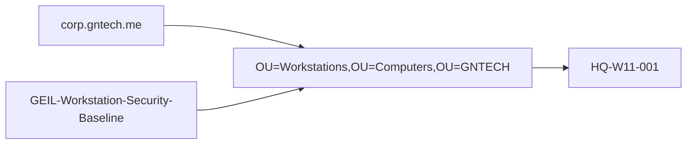

# Group Policy Baseline

## Document Control

| Field | Value |
|---|---|
| Document ID | GEIL-MSC-GPO-001 |
| Owner | Infrastructure Engineering |
| Status | Draft |
| Version | 2.2 |
| Last Reviewed | 2026-06-29 |
| Review Cycle | Quarterly |
| Classification | Internal Confidential |

!!! note "Adaptation"

    This guide uses canonical GNTECH values from the [Environment Specification](../project/environment-specification.md). Update the Environment Specification before changing OU names, domain names, group names, or GPO names.

## Purpose

Create the initial Group Policy baseline for GEIL after the Active Directory forest and baseline OU structure exist.

## Learning Objectives

After completing this guide you will understand:

- Why Group Policy is applied after OU creation.
- How GPO creation, linking, and security filtering differ.
- How to validate GPO scope before enabling broad policy.
- How to roll back by unlinking or disabling a GPO before deleting it.
- How to collect evidence that a policy applied to the intended computer.

## What You Will Build

By the end of this guide you will have:

- ✓ Verified the baseline OU structure exists.
- ✓ Created baseline GPO shells before linking them.
- ✓ Linked the workstation baseline to the Workstations OU under the canonical Computers OU.
- ✓ Configured a safe example setting for PowerShell script block logging.
- ✓ Validated security filtering and resultant policy.
- ✓ Documented rollback for unlinking and disabling GPOs.

## Estimated Time

30-60 minutes for the initial baseline shell and one validated policy.

## Difficulty

Intermediate. GPOs are easy to create but can affect many systems if linked or filtered incorrectly.

## Risk Level

Medium. Incorrect GPO links or filters can apply settings to the wrong computers.

## Service Impact

Maintenance window recommended for broad policy rollout. Creating unlinked GPOs has no impact; linking enabled GPOs can affect target computers at refresh.

## Prerequisites

- [Active Directory Implementation](active-directory-implementation.md) completed.
- [Active Directory Organizational Foundation](active-directory-organizational-foundation.md) completed and validated.
- [Enterprise Naming Standard](active-directory-naming-standard.md), [Enterprise Group Strategy](group-strategy.md), and [Enterprise Administrative Tiering](../security/administrative-tiering.md) reviewed.
- `corp.gntech.me` forest exists.
- Baseline OUs exist under `OU=GNTECH,DC=corp,DC=gntech,DC=me`, especially `Admin`, `Users`, `Groups`, `Computers`, `Service Accounts`, and `Policies`.
- Group Policy Management Console is installed.
- PowerShell GroupPolicy module is available.
- Test workstation exists or is planned for validation.

## Expected Starting State

- Domain exists.
- OUs exist.
- No GEIL baseline GPO is linked to production OUs unless it was created by a previous approved change.

## Expected Ending State

- GPOs exist before links are configured.
- Workstation baseline is linked only to the Workstations OU under the canonical Computers OU.
- Security filtering is reviewed and documented.
- Rollback commands are captured.

## Architecture Overview

Group Policy depends on the identity foundation sequence: infrastructure -> Windows Server Baseline -> Active Directory -> Organizational Foundation -> Group Strategy -> Group Policy.




!!! enterprise "Enterprise pattern"

    Enterprises usually create GPOs as unlinked objects first, configure and review settings, validate security filtering, then link to a pilot OU before broad deployment.

## Background Knowledge

### What is a GPO?

A Group Policy Object stores policy settings. It does nothing until it is linked to a site, domain, or OU and security filtering allows it to apply.

### What is a GPO link?

A link attaches a GPO to a scope such as an OU. The link should be created only after the GPO exists.

### What is security filtering?

Security filtering controls which users or computers inside the linked scope can apply the GPO.

## Step-by-Step Procedure

### Step 1: Validate OU structure and module availability

#### Goal

Confirm the required objects exist before creating or linking GPOs.

#### Commands

```powershell
[CmdletBinding()]
param()

$ErrorActionPreference = "Stop"
foreach ($ModuleName in @("ActiveDirectory","GroupPolicy")) {
    if (-not (Get-Module -ListAvailable -Name $ModuleName)) { throw "Required module missing: $ModuleName" }
    Import-Module $ModuleName -ErrorAction Stop
}
$CurrentIdentity = [Security.Principal.WindowsIdentity]::GetCurrent()
$CurrentGroups = foreach ($Sid in $CurrentIdentity.Groups) {
    try { $Sid.Translate([Security.Principal.NTAccount]).Value } catch { }
}
if (-not ($CurrentGroups | Where-Object { $_ -match '\(Domain Admins|Enterprise Admins|Group Policy Creator Owners)$' })) {
    throw "Current user '$($CurrentIdentity.Name)' lacks approved permissions for GPO validation/creation."
}

$RequiredOUs = @(
  "OU=Admin,OU=GNTECH,DC=corp,DC=gntech,DC=me",
  "OU=Servers,OU=Computers,OU=GNTECH,DC=corp,DC=gntech,DC=me",
  "OU=Workstations,OU=Computers,OU=GNTECH,DC=corp,DC=gntech,DC=me",
  "OU=Security,OU=Groups,OU=GNTECH,DC=corp,DC=gntech,DC=me",
  "OU=Policies,OU=GNTECH,DC=corp,DC=gntech,DC=me"
)
$Results = foreach ($OU in $RequiredOUs) {
    $Object = Get-ADObject -Identity $OU -ErrorAction SilentlyContinue
    if ($Object) {
        [PSCustomObject]@{Status="Existing"; Name=$Object.Name; DistinguishedName=$Object.DistinguishedName; Parent="AD OU validation"; Timestamp=(Get-Date -Format "yyyy-MM-ddTHH:mm:ssK")}
    }
    else {
        [PSCustomObject]@{Status="Failed"; Name=$OU; DistinguishedName=$OU; Parent="AD OU validation"; Timestamp=(Get-Date -Format "yyyy-MM-ddTHH:mm:ssK")}
    }
}
$Results | Format-Table Status,Name,DistinguishedName,Parent,Timestamp -AutoSize
Get-Command New-GPO,New-GPLink,Get-GPO
if ($Results.Status -contains "Failed") { throw "One or more required OUs are missing. Complete the Organizational Foundation guide before creating GPOs." }
```

#### Expected result

You should now see all required OUs and GroupPolicy commands.

#### Rollback

No rollback is required for read-only validation.

### Step 2: Create GPOs before linking

#### Goal — Step 2: Create GPOs before linking

Create baseline GPO shells without applying them yet.

#### Commands — Step 2: Create GPOs before linking

```powershell
[CmdletBinding()]
param()

$ErrorActionPreference = "Stop"

function Test-GEILModule {
    [CmdletBinding()]
    param([Parameter(Mandatory)][string]$Name)
    if (-not (Get-Module -ListAvailable -Name $Name)) {
        throw "Required PowerShell module missing: $Name"
    }
    Import-Module $Name -ErrorAction Stop
}

function Test-GEILDomainContext {
    [CmdletBinding()]
    param()
    $Domain = Get-ADDomain -ErrorAction Stop
    if ($Domain.DNSRoot -ne "corp.gntech.me") {
        throw "Unexpected AD domain '$($Domain.DNSRoot)'. Expected corp.gntech.me."
    }
    $Domain
}

function Test-GEILGpoPermission {
    [CmdletBinding()]
    param()
    $Identity = [Security.Principal.WindowsIdentity]::GetCurrent()
    $Groups = foreach ($Sid in $Identity.Groups) {
        try { $Sid.Translate([Security.Principal.NTAccount]).Value } catch { }
    }
    if (-not ($Groups | Where-Object { $_ -match '\(Domain Admins|Enterprise Admins|Group Policy Creator Owners)$' })) {
        throw "Current user '$($Identity.Name)' lacks approved GPO creation rights. Use Domain Admins, Enterprise Admins, or Group Policy Creator Owners under change control."
    }
}

function Ensure-GEILGpo {
    [CmdletBinding()]
    param([Parameter(Mandatory)][string]$Name)
    $Timestamp = Get-Date -Format "yyyy-MM-ddTHH:mm:ssK"
    try {
        $Existing = Get-GPO -Name $Name -ErrorAction SilentlyContinue
        if ($Existing) {
            [PSCustomObject]@{Status="Existing"; Name=$Name; DistinguishedName=$Existing.Path; Parent="Group Policy Objects"; Timestamp=$Timestamp; Error=$null}
            return
        }
        $New = New-GPO -Name $Name -ErrorAction Stop
        [PSCustomObject]@{Status="Created"; Name=$Name; DistinguishedName=$New.Path; Parent="Group Policy Objects"; Timestamp=$Timestamp; Error=$null}
    }
    catch {
        [PSCustomObject]@{Status="Failed"; Name=$Name; DistinguishedName=$null; Parent="Group Policy Objects"; Timestamp=$Timestamp; Error=$_.Exception.Message}
    }
}

function Write-GEILSummary {
    [CmdletBinding()]
    param([Parameter(Mandatory)][object[]]$Results)
    [PSCustomObject]@{
        Created  = @($Results | Where-Object Status -eq "Created").Count
        Existing = @($Results | Where-Object Status -eq "Existing").Count
        Failed   = @($Results | Where-Object Status -eq "Failed").Count
        Total    = @($Results).Count
    }
}

Test-GEILModule -Name ActiveDirectory
Test-GEILModule -Name GroupPolicy
Test-GEILDomainContext | Out-Null
Test-GEILGpoPermission

$Gpos = @(
  "GEIL-DC-Security-Baseline",
  "GEIL-Server-Security-Baseline",
  "GEIL-Workstation-Security-Baseline",
  "GEIL-Admin-Tier0-Restrictions"
)

$Results = foreach ($Gpo in $Gpos) { Ensure-GEILGpo -Name $Gpo }
$Results | Format-Table Status,Name,DistinguishedName,Parent,Timestamp -AutoSize
$Summary = Write-GEILSummary -Results $Results
$Summary | Format-List Created,Existing,Failed,Total

$Failures = @($Results | Where-Object Status -eq "Failed")
if ($Failures.Count -gt 0) {
    $Failures | Format-Table Name,Error -Wrap
    throw "GPO creation completed with $($Failures.Count) failure(s)."
}
```


#### Rollback — Step 2: Create GPOs before linking

If a GPO was created with the wrong name and has no links:

```powershell
Remove-GPO -Name "Incorrect-GPO-Name" -Confirm:$false
```

### Step 3: Configure a safe workstation baseline setting

#### Goal — Step 3: Configure a safe workstation baseline setting

Enable PowerShell script block logging in the workstation baseline before linking.

#### Commands — Step 3: Configure a safe workstation baseline setting

```powershell
Set-GPRegistryValue -Name "GEIL-Workstation-Security-Baseline" `
  -Key "HKLM\Software\Policies\Microsoft\Windows\PowerShell\ScriptBlockLogging" `
  -ValueName EnableScriptBlockLogging -Type DWord -Value 1

Get-GPRegistryValue -Name "GEIL-Workstation-Security-Baseline" `
  -Key "HKLM\Software\Policies\Microsoft\Windows\PowerShell\ScriptBlockLogging" `
  -ValueName EnableScriptBlockLogging
```

#### Rollback — Step 3: Configure a safe workstation baseline setting

```powershell
Remove-GPRegistryValue -Name "GEIL-Workstation-Security-Baseline" `
  -Key "HKLM\Software\Policies\Microsoft\Windows\PowerShell\ScriptBlockLogging" `
  -ValueName EnableScriptBlockLogging
```

### Step 4: Validate security filtering before linking

#### Commands — Step 4: Validate security filtering before linking

```powershell
Get-GPPermission -Name "GEIL-Workstation-Security-Baseline" -All | Select-Object Trustee,Permission
```

Expected result: filtering is visible and documented. Do not proceed if it would apply to unintended computers.

### Step 5: Link the GPO to the Workstations OU under the canonical Computers OU

#### Commands — Step 5: Link the GPO to the Workstations OU under the canonical Computers OU

```powershell
[CmdletBinding()]
param()

$ErrorActionPreference = "Stop"
Import-Module ActiveDirectory -ErrorAction Stop
Import-Module GroupPolicy -ErrorAction Stop

$CurrentIdentity = [Security.Principal.WindowsIdentity]::GetCurrent()
$CurrentGroups = foreach ($Sid in $CurrentIdentity.Groups) {
    try { $Sid.Translate([Security.Principal.NTAccount]).Value } catch { }
}
if (-not ($CurrentGroups | Where-Object { $_ -match '\(Domain Admins|Enterprise Admins|Group Policy Creator Owners)$' })) {
    throw "Current user '$($CurrentIdentity.Name)' lacks approved GPO link permissions."
}

$GpoName = "GEIL-Workstation-Security-Baseline"
$TargetOU = "OU=Workstations,OU=Computers,OU=GNTECH,DC=corp,DC=gntech,DC=me"

if (-not (Get-ADObject -Identity $TargetOU -ErrorAction SilentlyContinue)) {
    throw "Target OU does not exist: $TargetOU"
}
if (-not (Get-GPO -Name $GpoName -ErrorAction SilentlyContinue)) {
    throw "GPO does not exist: $GpoName. Complete Step 2 before linking."
}

$ExistingLink = (Get-GPInheritance -Target $TargetOU).GpoLinks | Where-Object DisplayName -eq $GpoName
if ($ExistingLink) {
    [PSCustomObject]@{Status="Existing"; Name=$GpoName; DistinguishedName=$TargetOU; Parent="GPO link target"; Timestamp=(Get-Date -Format "yyyy-MM-ddTHH:mm:ssK")}
}
else {
    New-GPLink -Name $GpoName -Target $TargetOU -LinkEnabled Yes | Out-Null
    [PSCustomObject]@{Status="Created"; Name=$GpoName; DistinguishedName=$TargetOU; Parent="GPO link target"; Timestamp=(Get-Date -Format "yyyy-MM-ddTHH:mm:ssK")}
}

Get-GPInheritance -Target $TargetOU
```


#### Rollback — Step 5: Link the GPO to the Workstations OU under the canonical Computers OU

```powershell
Remove-GPLink -Name "GEIL-Workstation-Security-Baseline" `
  -Target "OU=Workstations,OU=Computers,OU=GNTECH,DC=corp,DC=gntech,DC=me"
```

### Step 6: Validate resultant policy

From a test workstation such as `HQ-W11-001` after domain join:

```powershell
gpupdate /force
gpresult /h C:\Temp\geil-gpresult.html
Get-WinEvent -LogName "Microsoft-Windows-GroupPolicy/Operational" -MaxEvents 20
```

Expected result: `GEIL-Workstation-Security-Baseline` appears in applied computer policies for the test workstation.

## Validation after each major stage

- OU validation passes before GPO creation.
- GPOs exist before links are configured.
- Security filtering is reviewed before linking.
- `gpresult` confirms the intended policy applies to the intended computer.

## Evidence to capture

- `Get-ADOrganizationalUnit` output for required OUs.
- `Get-GPO -All` output for GEIL GPOs.
- `Get-GPPermission` output.
- `Get-GPInheritance` output.
- `gpresult` HTML from a test workstation.
- Event log review output.

## Common Mistakes

| Mistake | Symptom | Fix |
|---|---|---|
| Link created before GPO settings reviewed | Policy applies too early | Remove link, review settings, relink when approved |
| OU missing | `New-GPLink` fails | Create OU in AD implementation guide first |
| Filtering too broad | Policy applies to wrong computers | Adjust security filtering before linking |
| GPO deleted instead of disabled | Rollback evidence lost | Unlink or disable first; delete only after impact review |

## Troubleshooting

- Use `Get-GPInheritance` to confirm links.
- Use `Get-GPPermission` to confirm filtering.
- Use `gpresult /r` and `gpresult /h` on the target client.
- Check `Microsoft-Windows-GroupPolicy/Operational` event log for processing failures.

## Rollback

Rollback in this order:

1. Unlink the GPO from the OU.
2. Disable the GPO if additional containment is required.
3. Remove or correct settings.
4. Delete only after impact is understood.

```powershell
Set-GPO -Name "GEIL-Workstation-Security-Baseline" -GpoStatus AllSettingsDisabled
```

## Deployment Validation

Complete this validation on a pilot workstation before broad rollout.

### GPO application validation

#### Goal — GPO application validation

Prove that baseline GPOs apply to the intended pilot object and do not apply broadly by accident.

#### Commands — GPO application validation

```powershell
gpupdate /force
```

```powershell
gpresult /h C:\Temp\geil-gpresult.html
```

```powershell
Get-WinEvent -LogName "Microsoft-Windows-GroupPolicy/Operational" -MaxEvents 20
```

#### Expected result — GPO application validation

```text
Computer Policy update has completed successfully.
User Policy update has completed successfully.
```

The generated `geil-gpresult.html` shows only the expected GEIL baseline GPOs for the pilot workstation.

#### If validation fails — GPO application validation

STOP. Do not link the policy more broadly.

Unlink or disable the affected GPO before troubleshooting:

```powershell
Set-GPO -Name "GEIL-Workstation-Security-Baseline" -GpoStatus AllSettingsDisabled
```

Continue only if successful.

## Knowledge Check

1. Why must the OU structure exist before linking GPOs?
2. Why should a GPO be created before it is linked?
3. What does security filtering control?
4. Why is unlinking safer than deleting during rollback?
5. Which command proves a GPO applied to a workstation?


## DQI Operator Workflow Upgrade

!!! success "Documentation Quality Initiative improvement"

    This guide was upgraded under the GEIL Documentation Quality Initiative and reviewed against the [Deployment Style Guide](../governance/deployment-style-guide.md). The current quality score is **87/100**.

### Operator workflow for this guide

Use this guide as a sequence of small execution units:

1. Read the goal and why it matters.
2. Confirm the prerequisites and starting state.
3. Execute only the current command block or GUI action.
4. Validate immediately.
5. Capture evidence.
6. Continue only when the expected ending state is true.

### First-time operator focus

This guide now emphasizes OU validation before GPO links, GPO creation before linking, filtering validation, pilot rollout, unlink/disable rollback. The operator should not need to infer execution order from surrounding context.

### Step contract reminder

Before every risky action, confirm:

| Field | Operator question |
|---|---|
| Goal | What one thing am I changing now? |
| Why this matters | Why does the enterprise need this? |
| Estimated time | How long should this section take? |
| Risk level | What can break? |
| Prerequisites | Which object must already exist? |
| Starting state | What must be true before I run the command? |
| Expected ending state | What proves I am done? |

### Local troubleshooting pattern

If a step fails:

1. Stop at the failed step.
2. Do not continue to dependent steps.
3. Run the validation command again.
4. Compare the result with the expected output.
5. Use the rollback for the current step before trying a different approach.
6. Record the failure and correction as implementation evidence.

### Screenshot placement rule

When a GUI action appears in this guide, capture the screenshot at that point in the workflow, not at the end of deployment. The screenshot should show the field/value or status that proves the step succeeded.

## Next Guide

Continue to:

- [Privileged Access Model](../security/privileged-access-model.md)


## Audit Correction Notes

!!! success "Execution-order audit"

    This guide was audited for command order, object dependencies, canonical GEIL values, rollback coverage, validation gates, and active MikroTik CHR firewall references. Follow dependency order exactly: validate prerequisites, create objects, validate objects, apply dependent settings, then capture evidence.

- Audit focus: Create GPOs before links, verify OU structure and filtering before applying policy.
- Active Phase 1 firewall implementation: MikroTik CHR / RouterOS on `HQ-FW01`.
- OPNsense is superseded and must not be used for active Phase 1 deployment.

## Expected Results

- Commands complete without referencing missing objects.
- Canonical GEIL values are visible in outputs.
- No active OPNsense deployment path remains for Phase 1 firewall work.
- `10.10.x.x` remains limited to existing non-GEIL `PROD`/`TEST` references only.
