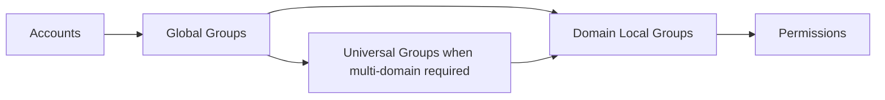

# Enterprise Group Strategy

## Document Control

| Field | Value |
|---|---|
| Document ID | GEIL-MSC-GROUP-001 |
| Owner | Infrastructure Engineering |
| Status | Draft |
| Version | 1.0 |
| Last Reviewed | 2026-06-30 |
| Review Cycle | Quarterly |
| Classification | Internal Confidential |

!!! note "Canonical GNTECH values"

    Forest: `corp.gntech.me`; NetBIOS: `GNTECH`; primary UPN suffix: `gntech.me`; Microsoft 365 primary domain: `gntech.me`; hybrid identity plane: Microsoft Entra ID; primary firewall: MikroTik CHR `HQ-FW01`.


## Purpose

Define how GEIL uses Active Directory groups for scalable authorization, delegation, file access, WiFi/VPN authorization, administrative roles, and future Microsoft 365 integration.

## Learning Objectives

- Understand AGDLP and AGUDLP.
- Design role-based access using groups instead of direct user permissions.
- Validate nesting, membership, and effective scope.
- Roll back incorrect membership safely.

## Architecture Overview



## Enterprise rationale

Directly assigning users to file ACLs, GPO filters, VPN policies, or NPS policies does not scale. GEIL uses groups as stable authorization objects so access can be reviewed and changed without rewriting resource ACLs.

## AGDLP

AGDLP means:

- Accounts go into Global groups.
- Global groups go into Domain Local groups.
- Domain Local groups receive Permissions.

Example:

```text
gnolasco -> GG-FileShare-Finance-RW -> DL-FinanceShare-RW -> NTFS/Share Permission
```

## AGUDLP

AGUDLP adds Universal groups for multi-domain or forest-wide roles. GEIL starts single-domain, so AGDLP is preferred. Use AGUDLP later only when regional domains or multi-domain design requires universal membership.

## Role Based Access Control

| Role group | Purpose | Example use |
|---|---|---|
| `GG-T0-Domain-Admins` | Tier 0 admin eligibility | AD DS administration approval path. |
| `GG-T1-Server-Admins` | Server admin eligibility | Local admin on member servers through GPO. |
| `GG-T2-Workstation-Admins` | Workstation support | Local admin on workstation support targets. |
| `GG-Helpdesk` | User support | Password reset/unlock delegation. |
| `GG-WiFi-Corporate` | Corporate WiFi authorization | NPS policy group. |

## PowerShell implementation examples

```powershell
Import-Module ActiveDirectory
$DomainDN = (Get-ADDomain).DistinguishedName

$CurrentIdentity = [Security.Principal.WindowsIdentity]::GetCurrent()
$CurrentGroups = foreach ($Sid in $CurrentIdentity.Groups) {
    try {
        $Sid.Translate([Security.Principal.NTAccount]).Value
    }
    catch {}
}

$AllowedGroupNames = @(
    "Domain Admins",
    "Enterprise Admins"
)

$CurrentGroupShortNames = $CurrentGroups | ForEach-Object {
    ($_ -split "\\")[-1]
}

if (-not ($CurrentGroupShortNames | Where-Object { $_ -in $AllowedGroupNames })) {
    throw "Current user '$($CurrentIdentity.Name)' lacks approved permissions. Required group short name: $($AllowedGroupNames -join ', ')."
}
$SecurityOU = "OU=Security,OU=Groups,OU=GNTECH,$DomainDN"

function ConvertTo-LdapFilterValue {
    param([Parameter(Mandatory)][string]$Value)
    $Value.Replace('\','\5c').Replace('*','\2a').Replace('(','\28').Replace(')','\29').Replace([string][char]0,'\00')
}

$ParentOU = $SecurityOU -replace '^OU=[^,]+,',''
$SecurityOUObject = Get-ADOrganizationalUnit `
    -LDAPFilter '(ou=Security)' `
    -SearchBase $ParentOU `
    -SearchScope OneLevel `
    -ErrorAction Stop
if (-not $SecurityOUObject) {
    throw "Required OU missing: $SecurityOU. Complete Active Directory Organizational Foundation before creating groups."
}

$Groups = @(
    "GG-FileShare-Finance-RW",
    "DL-FinanceShare-RW",
    "GG-FileShare-HR-RW",
    "DL-HRShare-RW"
)

$Results = foreach ($Group in $Groups) {
    $EscapedGroup = ConvertTo-LdapFilterValue -Value $Group
    $ExistingGroup = Get-ADGroup `
        -LDAPFilter "(sAMAccountName=$EscapedGroup)" `
        -SearchBase $SecurityOU `
        -SearchScope OneLevel `
        -ErrorAction Stop

    if ($ExistingGroup) {
        [PSCustomObject]@{Status="Exists"; Name=$Group; DN=$ExistingGroup.DistinguishedName}
        continue
    }

    $Scope = if ($Group.StartsWith("DL-")) { "DomainLocal" } else { "Global" }
    $NewGroup = New-ADGroup `
        -Name $Group `
        -SamAccountName $Group `
        -GroupScope $Scope `
        -GroupCategory Security `
        -Path $SecurityOU `
        -PassThru
    [PSCustomObject]@{Status="Created"; Name=$Group; DN=$NewGroup.DistinguishedName}
}

$Results | Format-Table Status,Name,DN -AutoSize

$FinanceDL = Get-ADGroup -LDAPFilter '(sAMAccountName=DL-FinanceShare-RW)' -SearchBase $SecurityOU -SearchScope OneLevel -ErrorAction Stop
$FinanceGG = Get-ADGroup -LDAPFilter '(sAMAccountName=GG-FileShare-Finance-RW)' -SearchBase $SecurityOU -SearchScope OneLevel -ErrorAction Stop
if (-not (Get-ADGroupMember -Identity $FinanceDL.DistinguishedName | Where-Object DistinguishedName -eq $FinanceGG.DistinguishedName)) {
    Add-ADGroupMember -Identity $FinanceDL.DistinguishedName -Members $FinanceGG.DistinguishedName
    [PSCustomObject]@{Status="Created"; Relationship="GG-FileShare-Finance-RW -> DL-FinanceShare-RW"}
}
else {
    [PSCustomObject]@{Status="Exists"; Relationship="GG-FileShare-Finance-RW -> DL-FinanceShare-RW"}
}
```

## Validation

```powershell
Get-ADGroup -Filter 'Name -like "GG-*" -or Name -like "DL-*" -or Name -like "AG-*"' |
    Select-Object Name,GroupScope,GroupCategory,DistinguishedName
Get-ADGroupMember "DL-FinanceShare-RW" | Select-Object Name,ObjectClass
```

Expected result: resource permissions target `DL-*` groups, membership contains `GG-*` role/access groups, and user accounts are not directly assigned to resource ACLs.

## Stop conditions

STOP if a permission is assigned directly to a user, if a `DL-*` resource group contains unmanaged users directly, or if a group name does not show scope and purpose.

## Rollback

Remove incorrect nesting before deleting groups:

```powershell
Remove-ADGroupMember -Identity "DL-FinanceShare-RW" -Members "GG-FileShare-Finance-RW" -Confirm:$true
```

Do not delete groups until file ACLs, GPO filters, VPN/NPS policies, and application assignments are checked.

## Evidence Collection

Capture group list, group membership, sample ACL using groups, and access review notes.

## Troubleshooting

| Symptom | Cause | Fix |
|---|---|---|
| User lacks access | Missing membership or token not refreshed | Add to correct `GG-*`, sign out/in. |
| Access applies too broadly | Group nested into wrong resource group | Remove nesting and review ACL. |
| Audit cannot identify purpose | Poor group name | Replace with standard name and migrate access. |

## Next Guide

Continue to [Group Policy Baseline](group-policy-baseline.md) after groups validate.
