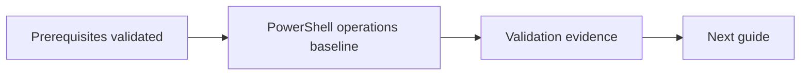

# PowerShell Operations

## Document Control

| Field | Value |
|---|---|
| Document ID | GEIL-MSC-PS-001 |
| Owner | Infrastructure Engineering |
| Status | Draft |
| Version | 1.1 |
| Last Reviewed | 2026-06-29 |
| Review Cycle | Quarterly |
| Classification | Internal Confidential |

## Purpose

Standardize safe PowerShell execution for GEIL operations.

## Standards

- Use PowerShell 7 where supported; use Windows PowerShell only for modules that require it.
- Use `-WhatIf` before destructive changes when supported.
- Capture transcript for approved changes.
- Prefer idempotent scripts.
- Never hard-code secrets.


## GEIL Enterprise PowerShell object-creation standard

All future GEIL Active Directory automation that creates or modifies objects must follow the canonical pattern demonstrated in [Active Directory Organizational Foundation](active-directory-organizational-foundation.md). Do not create new one-off object-creation styles for OUs, groups, users, service accounts, computers, GPOs, DNS objects, DHCP objects, or future AD automation.

### Mandatory pattern for AD object creation

Every production AD object-creation script must:

1. Use `[CmdletBinding()]` and support `-Verbose`.
2. Validate that the required PowerShell module is available before any state-changing action.
3. Validate domain context before attempting domain object changes.
4. Validate permissions early and fail with a meaningful message.
5. Validate parent containers before searching or creating beneath them.
6. Use `Get-ADObject -Identity <ParentDN>` to confirm parent Distinguished Names exist before using them as `-SearchBase` values.
7. Use `-LDAPFilter` for object existence checks when objects may not exist.
8. Use `-SearchScope OneLevel` when checking for a child object directly under a known parent.
9. LDAP-escape user-supplied or variable values before placing them in an LDAP filter.
10. Return structured `PSCustomObject` output rather than relying on unstructured console text.
11. Include at least `Status`, `Name`, `DistinguishedName`, `Parent`, and `Timestamp` in creation output when applicable.
12. Report summary counts for `Created`, `Existing`, `Failed`, and `Total`.
13. Continue auditing remaining planned objects after an individual object failure when safe.
14. Throw at the end if any failures occurred so automation receives a non-zero exit condition.
15. Include validation, rollback, troubleshooting, and evidence guidance immediately after the command block.

### Canonical helper-function names

Use consistent helper names so future guides are readable and reusable:

- `Test-GEILParentContainer`
- `Get-GEILOrganizationalUnit` or the matching object-specific `Get-GEIL*` function
- `Ensure-GEILOrganizationalUnit` or the matching object-specific `Ensure-GEIL*` function
- `Write-GEILSummary`
- `ConvertTo-GEILLdapFilterValue`

### Why this pattern is mandatory

`mkdocs build --strict` cannot prove that a PowerShell block is deployable. The Active Directory Organizational Foundation implementation showed that syntactically valid documentation can still contain dependency-order and existence-check defects. The canonical GEIL Enterprise PowerShell pattern prevents recurring classes of deployment failures:

- missing RSAT or AD module errors discovered after partial execution
- workgroup or wrong-domain execution
- insufficient permissions discovered only after several objects are created
- `SearchBase` errors caused by missing parent containers
- `ADIdentityNotFoundException` noise from using `Get-AD* -Identity` as a missing-object existence check
- duplicate objects during repeat execution
- partial failures without a complete summary

### Reference implementation

Use the OU creation script in [Active Directory Organizational Foundation](active-directory-organizational-foundation.md#step-3-create-the-ou-structure) as the reference implementation for future AD object-creation scripts.

## Change transcript pattern

```powershell
$Transcript = "C:\ChangeLogs\CHG-20260629-001-$(Get-Date -Format yyyyMMdd-HHmmss).log"
Start-Transcript -Path $Transcript
# Run approved commands here.
Stop-Transcript
```

Expected result: transcript file exists and is attached to the change record.

## Validation pattern

Every script must include:

```powershell
try {
    # implementation
}
catch {
    Write-Error $_
    throw
}
```

## Rollback pattern

Record pre-change state before modifying objects:

```powershell
Get-ADUser j.smith -Properties * | Export-Clixml C:\ChangeLogs\j.smith-before.xml
```

If rollback is needed, use the exported state to restore changed attributes manually or via reviewed script.


## Audit Correction Notes

!!! success "Execution-order audit"

    This guide was audited for command order, object dependencies, canonical GEIL values, rollback coverage, validation gates, and active MikroTik CHR firewall references. Follow dependency order exactly: validate prerequisites, create objects, validate objects, apply dependent settings, then capture evidence.

- Audit focus: Prepare safe administrative PowerShell usage after Windows and identity foundations exist.
- Active Phase 1 firewall implementation: MikroTik CHR / RouterOS on `HQ-FW01`.
- OPNsense is superseded and must not be used for active Phase 1 deployment.

## Learning Objectives

After completing this guide you will understand:

- What the `PowerShell operations baseline` workstream changes.
- Why the sequence matters.
- Which validations prove the change worked.
- How to recover safely if a step fails.

## What You Will Build

By the end of this guide you will have:

- ✓ Completed the `PowerShell operations baseline` workstream.
- ✓ Captured validation evidence.
- ✓ Preserved rollback or recovery options.

## Estimated Time

30-90 minutes depending on prerequisite readiness and evidence capture.

## Difficulty

Intermediate. Follow the documented order and validate after each major stage.

## Risk Level

Medium. The risk is controlled by validating prerequisites, splitting commands into small blocks, and keeping rollback options available.

## Service Impact

Maintenance window recommended when the guide changes network, identity, firewall, or policy behavior. Read-only validation steps have no service impact.

## Prerequisites

- Canonical GEIL values reviewed in [Environment Specification](../project/environment-specification.md).
- Previous dependency completed where applicable.
- Administrative access and console recovery path available.
- Secrets stored in the approved password manager, not Git.

## Expected Starting State

- Required prerequisite guide is complete.
- No command in this guide references an object before it exists.
- Existing public/non-GEIL resources remain unchanged.

## Expected Ending State

- `PowerShell operations baseline` is complete and validated.
- Evidence is captured.
- Rollback or recovery path remains documented.

## Architecture Overview



## Background Knowledge

This guide follows the GEIL educational method: teach the purpose, validate prerequisites, apply changes in dependency order, validate immediately, and preserve recovery paths.

## Step-by-Step Procedure

Follow the procedure sections in this document in order. Do not skip validation gates or combine risky command blocks.

## Validation after each major stage

Validate immediately after each change block. Do not continue when expected output does not match the guide.

## Expected Results

- Commands complete without referencing missing objects.
- Canonical GEIL values are visible in outputs.
- No active OPNsense deployment path remains for Phase 1 firewall work.
- `10.10.x.x` remains limited to existing non-GEIL `PROD`/`TEST` references only.

## Evidence to capture

- Command output proving prerequisite state.
- Command output proving ending state.
- Relevant GUI screenshots where applicable.
- Rollback checkpoint or export evidence where applicable.

## Common Mistakes

| Mistake | Impact | Correction |
|---|---|---|
| Running steps out of order | Commands fail or partial state is created | Return to the last validation gate |
| Referencing missing objects | Invalid commands or unsafe defaults | Create and validate the object first |
| Skipping rollback capture | Recovery is slower | Capture snapshot/export before risky changes |

## Deployment Validation

Before using a PowerShell operation in a deployment guide, validate that the command is safe, reversible, and produces evidence.

```powershell
$PSVersionTable.PSVersion
```

Expected result:

```text
Major  Minor
5      1
```

If a command changes state, the guide must show validation and rollback immediately after the command. If rollback is unknown, STOP and do not run the command in production.

## Troubleshooting

Start with read-only validation. Confirm prerequisites, object existence, canonical values, and logs before changing configuration.

## Knowledge Check

1. What prerequisite must exist before this guide can run safely?
2. Which validation proves the main change worked?
3. What rollback action is safest if the last command fails?

## Next Guide

Continue to:

- [Windows Admin Center](windows-admin-center.md)
