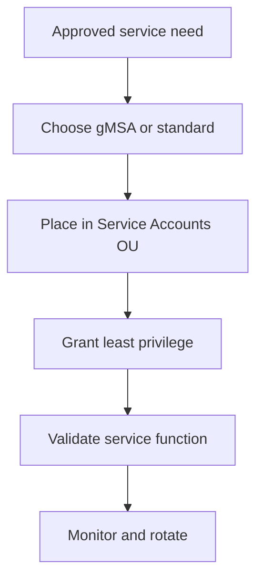

# Enterprise Service Account Standard

## Document Control

| Field | Value |
|---|---|
| Document ID | GEIL-MSC-SVCACCT-001 |
| Owner | Infrastructure Engineering |
| Status | Draft |
| Version | 1.0 |
| Last Reviewed | 2026-06-30 |
| Review Cycle | Quarterly |
| Classification | Internal Confidential |

!!! note "Canonical GNTECH values"

    Forest: `corp.gntech.me`; NetBIOS: `GNTECH`; primary UPN suffix: `gntech.me`; Microsoft 365 primary domain: `gntech.me`; hybrid identity plane: Microsoft Entra ID; primary firewall: MikroTik CHR `HQ-FW01`.


## Purpose

Define how GEIL creates, stores, rotates, validates, monitors, and retires non-human identities, including standard service accounts, group Managed Service Accounts, scheduled tasks, IIS, SQL, NPS, Entra Connect, backup, monitoring, scan, and print services.

## Architecture Overview



## Account types

| Type | Use | Example | Preferred? |
|---|---|---|---|
| gMSA | Windows services supporting managed password | `gmsa-wac` | Yes, when supported. |
| Standard service account | Products that cannot use gMSA | `svc-backup` | Use only with controls. |
| Scheduled task account | Tasks requiring domain access | `svc-monitoring` | Prefer gMSA where supported. |
| Product-required account | Entra Connect or vendor-specific | `svc-entra-connect` | Follow vendor/Microsoft guidance. |

## Least privilege rules

- Never make service accounts Domain Admins by default.
- Deny interactive logon unless explicitly required.
- Store credentials only in the approved password manager.
- Assign permissions through groups where practical.
- Document owner, purpose, system, rotation interval, and rollback.

## PowerShell: create a standard service account

```powershell
Import-Module ActiveDirectory
$DomainDN = (Get-ADDomain).DistinguishedName
$SvcOU = "OU=Standard,OU=Service Accounts,OU=GNTECH,$DomainDN"
$Password = Read-Host "Enter service account password" -AsSecureString

$ParentOU = $SvcOU -replace '^OU=[^,]+,',''
$SvcOUObject = Get-ADOrganizationalUnit `
    -LDAPFilter '(ou=Standard)' `
    -SearchBase $ParentOU `
    -SearchScope OneLevel `
    -ErrorAction Stop
if (-not $SvcOUObject) {
    throw "Required OU missing: $SvcOU. Complete the Organizational Foundation guide first."
}

$ExistingAccount = Get-ADUser -LDAPFilter '(sAMAccountName=svc-monitoring)' -ErrorAction Stop
if ($ExistingAccount) {
    Set-ADUser -Identity $ExistingAccount.DistinguishedName -PasswordNeverExpires $false
    [PSCustomObject]@{Status="Exists"; Sam="svc-monitoring"; DN=$ExistingAccount.DistinguishedName}
}
else {
    $NewAccount = New-ADUser -Name "svc-monitoring" -SamAccountName "svc-monitoring" -UserPrincipalName "svc-monitoring@gntech.me" `
        -Path $SvcOU -AccountPassword $Password -Enabled $true -Description "Monitoring service account; least privilege only" -PassThru
    Set-ADUser -Identity $NewAccount.DistinguishedName -PasswordNeverExpires $false
    [PSCustomObject]@{Status="Created"; Sam="svc-monitoring"; DN=$NewAccount.DistinguishedName}
}
```

## PowerShell: create a gMSA

Prerequisite: KDS root key exists. In a new lab, create it only after understanding replication timing.

```powershell
Get-KdsRootKey
# Lab-only immediate availability. Production should allow normal propagation time.
# Add-KdsRootKey -EffectiveTime ((Get-Date).AddHours(-10))
New-ADServiceAccount -Name "gmsa-wac" -DNSHostName "gmsa-wac.corp.gntech.me" `
    -PrincipalsAllowedToRetrieveManagedPassword "GG-T1-Server-Admins" `
    -Path "OU=gMSA,OU=Service Accounts,OU=GNTECH,$((Get-ADDomain).DistinguishedName)"
```

## Service-specific guidance

| Service | Recommended identity | Notes |
|---|---|---|
| IIS app pool | gMSA | Bind to approved web servers only. |
| SQL service | gMSA where supported | Coordinate SPNs. |
| NPS | Built-in service or gMSA if required | Do not overprivilege. |
| Entra Connect | Microsoft guidance | Treat as Tier 0. |
| Backup | gMSA if product supports it | Otherwise `svc-backup` with scoped rights. |
| Monitoring | gMSA or `svc-monitoring` | Read-only where possible. |
| Scheduled Tasks | gMSA where supported | Avoid storing passwords in task XML. |
| Scan/print | `svc-scan`, `svc-print` only if required | Restrict logon and permissions. |

## Validation

```powershell
Get-ADUser -Filter 'SamAccountName -like "svc-*"' -SearchBase "OU=Service Accounts,OU=GNTECH,$((Get-ADDomain).DistinguishedName)" `
    -Properties Enabled,PasswordLastSet,PasswordNeverExpires,Description |
    Select-Object SamAccountName,Enabled,PasswordLastSet,PasswordNeverExpires,Description
Get-ADServiceAccount -Filter * -SearchBase "OU=gMSA,OU=Service Accounts,OU=GNTECH,$((Get-ADDomain).DistinguishedName)" |
    Select-Object Name,Enabled,DistinguishedName
```

## Expected result

Service accounts are in the Service Accounts OU, use `@gntech.me`, have documented descriptions, and have no unnecessary privileged group membership.

## Stop conditions

STOP if a service account requires Domain Admin, interactive logon, broad file access, or password never expires without documented approval.

## Rollback

Disable first:

```powershell
Disable-ADAccount -Identity "svc-monitoring"
```

Delete only after confirming no service, scheduled task, SPN, ACL, certificate enrollment, sync connector, or monitoring probe depends on it.

## Evidence Collection

Capture account properties, group membership, service owner, service binding, rotation record, and validation output. Do not capture passwords.

## Troubleshooting

| Symptom | Cause | Fix |
|---|---|---|
| Service fails after password rotation | Credential not updated or gMSA unsupported | Update credential or migrate to supported gMSA. |
| Kerberos fails | Missing SPN | Register correct SPN under change control. |
| Excessive privileges found | Emergency shortcut became permanent | Remove membership and document replacement permission. |

## Next Guide

Continue to [Enterprise Administrative Tiering](../security/administrative-tiering.md).
