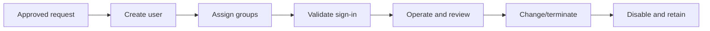

# Enterprise User Lifecycle

## Document Control

| Field | Value |
|---|---|
| Document ID | GEIL-MSC-USERLIFE-001 |
| Owner | Infrastructure Engineering |
| Status | Draft |
| Version | 1.0 |
| Last Reviewed | 2026-06-30 |
| Review Cycle | Quarterly |
| Classification | Internal Confidential |

!!! note "Canonical GNTECH values"

    Forest: `corp.gntech.me`; NetBIOS: `GNTECH`; primary UPN suffix: `gntech.me`; Microsoft 365 primary domain: `gntech.me`; hybrid identity plane: Microsoft Entra ID; primary firewall: MikroTik CHR `HQ-FW01`.


## Purpose

Define the lifecycle for human identities in `corp.gntech.me` so new hires, department changes, contractors, temporary users, guests, privilege elevation, password reset, account lockout, and offboarding are consistent and auditable.

## Architecture Overview



## Lifecycle states

| State | OU | Key controls |
|---|---|---|
| New hire | `OU=Standard,OU=Users,OU=GNTECH,...` | Approved request, `@gntech.me` UPN, initial groups. |
| Executive | `OU=Executives,OU=Users,OU=GNTECH,...` | Additional monitoring and data handling. |
| Contractor | `OU=Contractors,OU=Users,OU=GNTECH,...` | Expiration date and sponsor. |
| Temporary | Contractors or Standard with expiration | Expiration and access review. |
| Disabled/offboarded | `OU=Disabled,OU=Users,OU=GNTECH,...` | Disabled, group removal, retention. |

## New hire workflow

### Why

A new hire receives a durable identity used by Windows, Microsoft 365, Entra ID, Intune, and future services. The UPN must be correct before sync.

### PowerShell

Run on: `HQ-MGMT01 unless this is an initial bootstrap step that explicitly requires HQ-DC01`

When: execute at this point in the procedure after the stated prerequisites are true and before continuing to the next step.

Expected outcome: the command completes successfully and the following expected result or validation section confirms the change.

```powershell
Import-Module ActiveDirectory
$DomainDN = (Get-ADDomain).DistinguishedName

$CurrentIdentity = [Security.Principal.WindowsIdentity]::GetCurrent()
$CurrentGroups = foreach ($Sid in $CurrentIdentity.Groups) {
    try {
        $Sid.Translate([Security.Principal.NTAccount]).Value
    }
    catch {}
}

$AllowedGroupNames = @(
    "Domain Admins",
    "Enterprise Admins"
)

$CurrentGroupShortNames = $CurrentGroups | ForEach-Object {
    ($_ -split "\\")[-1]
}

if (-not ($CurrentGroupShortNames | Where-Object { $_ -in $AllowedGroupNames })) {
    throw "Current user '$($CurrentIdentity.Name)' lacks approved permissions. Required group short name: $($AllowedGroupNames -join ', ')."
}
$TargetOU = "OU=Standard,OU=Users,OU=GNTECH,$DomainDN"
$Password = Read-Host "Enter temporary password" -AsSecureString

$ParentOU = $TargetOU -replace '^OU=[^,]+,',''
$TargetOUObject = Get-ADOrganizationalUnit `
    -LDAPFilter '(ou=Standard)' `
    -SearchBase $ParentOU `
    -SearchScope OneLevel `
    -ErrorAction Stop
if (-not $TargetOUObject) {
    throw "Required OU missing: $TargetOU. Complete the Organizational Foundation guide first."
}

$ExistingUser = Get-ADUser -LDAPFilter '(sAMAccountName=gnolasco)' -ErrorAction Stop
if ($ExistingUser) {
    [PSCustomObject]@{Status="Exists"; Sam="gnolasco"; DN=$ExistingUser.DistinguishedName}
}
else {
    $NewUser = New-ADUser -Name "G Nolasco" -SamAccountName "gnolasco" -UserPrincipalName "gnolasco@gntech.me" `
        -Path $TargetOU -AccountPassword $Password -Enabled $true -ChangePasswordAtLogon $true -PassThru
    [PSCustomObject]@{Status="Created"; Sam="gnolasco"; DN=$NewUser.DistinguishedName}
}

$OperationsGroup = Get-ADGroup -LDAPFilter '(sAMAccountName=GG-IT-Operations)' -ErrorAction Stop
$User = Get-ADUser -LDAPFilter '(sAMAccountName=gnolasco)' -ErrorAction Stop
if (-not $OperationsGroup) { throw "Required group missing: GG-IT-Operations." }
if (-not (Get-ADGroupMember -Identity $OperationsGroup.DistinguishedName | Where-Object DistinguishedName -eq $User.DistinguishedName)) {
    Add-ADGroupMember -Identity $OperationsGroup.DistinguishedName -Members $User.DistinguishedName
    [PSCustomObject]@{Status="Created"; Membership="gnolasco -> GG-IT-Operations"}
}
else {
    [PSCustomObject]@{Status="Exists"; Membership="gnolasco -> GG-IT-Operations"}
}
```

### Validation

Run on: `HQ-MGMT01 unless this is an initial bootstrap step that explicitly requires HQ-DC01`

When: execute at this point in the procedure after the stated prerequisites are true and before continuing to the next step.

Expected outcome: the command completes successfully and the following expected result or validation section confirms the change.

```powershell
Get-ADUser gnolasco -Properties UserPrincipalName,Enabled,MemberOf,DistinguishedName |
    Select-Object SamAccountName,UserPrincipalName,Enabled,DistinguishedName
```

Expected result: user is enabled, located under `OU=Standard`, UPN is `gnolasco@gntech.me`, and baseline membership includes `GG-IT-Operations` when the organizational foundation membership step has run.

## Termination workflow

Run on: `HQ-MGMT01 unless this is an initial bootstrap step that explicitly requires HQ-DC01`

When: execute at this point in the procedure after the stated prerequisites are true and before continuing to the next step.

Expected outcome: the command completes successfully and the following expected result or validation section confirms the change.

```powershell
Disable-ADAccount -Identity "gnolasco"
Get-ADPrincipalGroupMembership "gnolasco" | Where-Object Name -ne "Domain Users" |
    ForEach-Object { Remove-ADGroupMember -Identity $_.Name -Members "gnolasco" -Confirm:$false }
Move-ADObject -Identity (Get-ADUser "gnolasco").DistinguishedName `
    -TargetPath "OU=Disabled,OU=Users,OU=GNTECH,$((Get-ADDomain).DistinguishedName)"
```

STOP if legal hold, mailbox retention, or HR retention requirements are unknown. Disable first; delete later only after retention approval.

## Department change

Remove obsolete group membership and add new department groups. Do not move the user unless lifecycle category changes.

## Privilege elevation

Use separate admin accounts such as `admin.gnolasco@gntech.me`. Never add daily users to privileged groups. The Active Directory Organizational Foundation guide assigns the initial `gnolasco -> GG-IT-Operations` membership and `admin.gnolasco -> GG-T0-Domain-Admins` membership. Daily users such as `gnolasco` must not be added directly to `Domain Admins`; pilot Tier 0 bootstrap uses `GG-T0-Domain-Admins -> Domain Admins` instead.

## Contractors and temporary users

Set account expiration:

Run on: `HQ-MGMT01 unless this is an initial bootstrap step that explicitly requires HQ-DC01`

When: execute at this point in the procedure after the stated prerequisites are true and before continuing to the next step.

Expected outcome: the command completes successfully and the following expected result or validation section confirms the change.

```powershell
Set-ADAccountExpiration -Identity "contractor.user" -DateTime "2026-12-31T17:00:00"
```

## Guest users

External collaboration guests are primarily Entra ID objects and should not be created in AD unless a documented on-premises dependency exists.

## Password reset and account lockout

Run on: `HQ-MGMT01 unless this is an initial bootstrap step that explicitly requires HQ-DC01`

When: execute at this point in the procedure after the stated prerequisites are true and before continuing to the next step.

Expected outcome: the command completes successfully and the following expected result or validation section confirms the change.

```powershell
Unlock-ADAccount -Identity "gnolasco"
Set-ADAccountPassword -Identity "gnolasco" -Reset -NewPassword (Read-Host "New temporary password" -AsSecureString)
Set-ADUser -Identity "gnolasco" -ChangePasswordAtLogon $true
```

## Evidence Collection

Capture request ID, user creation output, group membership, expiration date where applicable, and offboarding disable/move evidence. Never capture passwords.

## Rollback

If a user was created incorrectly, disable the account first. Correct UPN/OU/group membership if unused. Delete only after confirming no mailbox, Entra sync dependency, ACL, audit, or legal hold requirement exists.

## Troubleshooting

| Symptom | Likely cause | Fix |
|---|---|---|
| User cannot sign in to Microsoft 365 | Wrong UPN or sync not complete | Correct UPN to `@gntech.me`, run sync. |
| User has wrong access | Incorrect group membership | Review `Get-ADPrincipalGroupMembership`. |
| Lockouts continue | Cached credential or service misuse | Check lockout source before reset loops. |

## Next Guide

Continue to [Enterprise Service Account Standard](service-account-standard.md).
