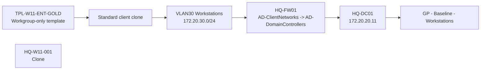

# Windows 11 Domain Join and GPO Validation

## Document Control

| Field | Value |
|---|---|
| Document ID | GEIL-PLAT-W11-DOMJOIN-001 |
| Owner | Infrastructure Engineering |
| Status | Approved |
| Version | 1.0 |
| Last Reviewed | 2026-07-01 |
| Review Cycle | Quarterly |
| Classification | Internal Confidential |

!!! note "Canonical GNTECH values"

    Forest: `corp.gntech.me`; NetBIOS: `GNTECH`; domain controller: `HQ-DC01`; domain controller IP: `172.20.20.11`; workstation VLAN: VLAN 30; workstation OU: `OU=Workstations,OU=Computers,OU=GNTECH,DC=corp,DC=gntech,DC=me`; workstation GPO: `GP - Baseline - Workstations`.

## Purpose

Clone a standard Windows 11 workstation from the workgroup-only golden template, attach it to VLAN 30, validate network and Active Directory reachability, join `corp.gntech.me`, move the computer object to the canonical Workstations OU, and validate Group Policy application. This guide is for `HQ-W11-001` and future standard clients, not `HQ-MGMT01` management workstation.

## Scope

Included:

- Clone from `TPL-W11-ENT-GOLD`.
- Attach the standard client clone to `GEILLAN` VLAN 30.
- Validate DHCP.
- Validate DNS to `HQ-DC01`.
- Validate firewall access to required domain-controller services.
- Rename or confirm hostname.
- Join `corp.gntech.me`.
- Move the standard client computer object to `OU=Workstations,OU=Computers,OU=GNTECH`.
- Run `gpupdate /force`.
- Generate `gpresult`.
- Validate `GP - Baseline - Workstations`.

Excluded:

- Building the Windows 11 template.
- Intune enrollment.
- Windows Hello for Business.
- Production user migration.

## Pilot finding

The Windows 11 template must remain workgroup-only. Domain join happens only after cloning and after network validation. This prevents domain secure-channel state, user profiles, GPO state, Entra/Intune state, and workstation identity from being baked into every clone.

## Prerequisites

- [Windows 11 Enterprise Golden Template](windows-11-enterprise-golden-template.md) completed.
- [Active Directory Network Requirements](../../platform/active-directory-network-requirements.md) implemented on `HQ-FW01`.
- [DNS and DHCP Implementation](../dns-dhcp-implementation.md) completed for VLAN 30.
- [Group Policy Baseline](../group-policy-baseline.md) created and linked to the Workstations OU.
- `OU=Workstations,OU=Computers,OU=GNTECH,DC=corp,DC=gntech,DC=me` exists.
- Domain join credentials are approved and available for the change window.
- [Authentication Standards](../authentication-standards.md) reviewed: Windows sign-in and Remote Desktop examples use `GNTECH\username`; Microsoft 365 / Entra ID examples use `username@gntech.me`.

## Starting state

- `TPL-W11-ENT-GOLD` is a Proxmox template and is not domain joined.
- No production workstation clone has been created from this template for the current validation.
- VLAN 30 DHCP scope `WORKSTATIONS-HQ` exists.
- `HQ-FW01` allows `AD-ClientNetworks` to `AD-DomainControllers` using least-privilege rules.

## Expected ending state

- `HQ-W11-001` is cloned from the template.
- The VM NIC is on `GEILLAN` VLAN 30.
- The client receives DHCP from VLAN 30.
- DNS resolves through `HQ-DC01`.
- Domain-controller service reachability validates.
- The workstation is joined to `corp.gntech.me`.
- The computer object is in the canonical Workstations OU.
- `GP - Baseline - Workstations` applies to the workstation.

## Architecture Overview



## Step-by-Step Procedure

### Step 1: Clone from the Windows 11 template

#### Goal

Create a unique workstation VM from the generalized workgroup-only template.

#### Commands

Run from `PVE-HQ01`. Adjust VMID only if `9301` is already used.

Run on: `HQ-FW01`

When: execute at this point in the procedure after the stated prerequisites are true and before continuing to the next step.

Expected outcome: the command completes successfully and the following expected result or validation section confirms the change.

```bash
qm clone 9201 9301 --name HQ-W11-001 --full true
qm set 9301 --net0 virtio,bridge=GEILLAN,tag=30
qm set 9301 --agent enabled=1
qm start 9301
```

#### Validation

Run on: `HQ-FW01`

When: execute at this point in the procedure after the stated prerequisites are true and before continuing to the next step.

Expected outcome: the command completes successfully and the following expected result or validation section confirms the change.

```bash
qm config 9301
```

Expected output includes `name: HQ-W11-001`, `bridge=GEILLAN`, and `tag=30`.

#### Rollback

Run on: `HQ-FW01`

When: execute at this point in the procedure after the stated prerequisites are true and before continuing to the next step.

Expected outcome: the command completes successfully and the following expected result or validation section confirms the change.

```bash
qm stop 9301
qm destroy 9301 --purge
```

### Step 2: Validate DHCP on VLAN 30

#### Goal

Confirm the cloned workstation receives a VLAN30 address and the DNS server option points to `HQ-DC01`.

#### Commands

Run inside `HQ-W11-001` before domain join:

Run on: `HQ-FW01`

When: execute at this point in the procedure after the stated prerequisites are true and before continuing to the next step.

Expected outcome: the command completes successfully and the following expected result or validation section confirms the change.

```powershell
ipconfig /renew
ipconfig /all
```

#### Expected output

- IPv4 address is in `172.20.30.0/24`.
- Default gateway is `172.20.30.1`.
- DNS server is `172.20.20.11`.
- DNS suffix is `corp.gntech.me` if provided by DHCP options.

#### Stop condition

STOP if DHCP fails or DNS server is not `172.20.20.11`. Fix DHCP scope, relay, and firewall input-chain relay rules before continuing.

### Step 3: Validate DNS and domain-controller firewall access

#### Goal

Prove the workstation can reach Active Directory services before domain join.

#### Commands

Run inside `HQ-W11-001`:

Run on: `HQ-FW01`

When: execute at this point in the procedure after the stated prerequisites are true and before continuing to the next step.

Expected outcome: the command completes successfully and the following expected result or validation section confirms the change.

```powershell
ping 172.20.20.11
Resolve-DnsName corp.gntech.me -Server 172.20.20.11
Resolve-DnsName _ldap._tcp.dc._msdcs.corp.gntech.me -Type SRV -Server 172.20.20.11
Test-NetConnection HQ-DC01.corp.gntech.me -Port 53
Test-NetConnection HQ-DC01.corp.gntech.me -Port 88
Test-NetConnection HQ-DC01.corp.gntech.me -Port 389
Test-NetConnection HQ-DC01.corp.gntech.me -Port 445
Test-NetConnection HQ-DC01.corp.gntech.me -Port 135
Test-NetConnection HQ-DC01.corp.gntech.me -Port 3268
w32tm /stripchart /computer:HQ-DC01.corp.gntech.me /samples:3
nltest /dsgetdc:corp.gntech.me
```

#### Expected output

- Ping succeeds when ICMP is permitted for validation.
- DNS and SRV lookups return `HQ-DC01`.
- TCP checks succeed.
- Time replies are received.
- `nltest` discovers `HQ-DC01`.

#### Stop condition

STOP if DHCP works but these tests fail. DHCP relay is not sufficient for domain join. Return to [Active Directory Network Requirements](../../platform/active-directory-network-requirements.md) and verify address lists and service rules before continuing.

### Step 4: Rename or confirm hostname

#### Goal

Ensure the clone has the intended workstation name before domain join.

#### Commands

Run inside `HQ-W11-001`:

Run on: `Windows Client`

When: execute at this point in the procedure after the stated prerequisites are true and before continuing to the next step.

Expected outcome: the command completes successfully and the following expected result or validation section confirms the change.

```powershell
$DesiredName = "HQ-W11-001"
$CurrentName = $env:COMPUTERNAME
if ($CurrentName -ne $DesiredName) {
    Rename-Computer -NewName $DesiredName -Restart
}
else {
    [PSCustomObject]@{Status="Existing"; Name=$CurrentName}
}
```

After restart, confirm:

Run on: `Windows Client`

When: execute at this point in the procedure after the stated prerequisites are true and before continuing to the next step.

Expected outcome: the command completes successfully and the following expected result or validation section confirms the change.

```powershell
hostname
```

#### Expected output

The hostname is `HQ-W11-001`.

### Step 5: Join `corp.gntech.me`

#### Goal

Join the workstation to the Active Directory domain only after network validation passes.

#### Commands

Run inside `HQ-W11-001` with approved domain join credentials:

Run on: `Windows Client`

When: execute at this point in the procedure after the stated prerequisites are true and before continuing to the next step.

Expected outcome: the command completes successfully and the following expected result or validation section confirms the change.

```powershell
$DomainName = "corp.gntech.me"
$ComputerInfo = Get-CimInstance Win32_ComputerSystem
if ($ComputerInfo.PartOfDomain -and $ComputerInfo.Domain -eq $DomainName) {
    [PSCustomObject]@{Status="Existing"; Domain=$ComputerInfo.Domain; Computer=$env:COMPUTERNAME}
}
else {
    Add-Computer -DomainName $DomainName -Restart
}
```

#### Expected output

The workstation restarts and joins `corp.gntech.me`.

#### Stop condition

STOP if domain join fails. Do not retry blindly. Validate DNS, Kerberos, LDAP, SMB, RPC, NTP, and Global Catalog access first.

### Step 6: Move the computer object to the Workstations OU

#### Goal

Place the computer object under the OU where `GP - Baseline - Workstations` is linked.

#### Commands

Run from `HQ-DC01` or an approved RSAT workstation after the domain join succeeds:

Run on: `Windows Client`

When: execute at this point in the procedure after the stated prerequisites are true and before continuing to the next step.

Expected outcome: the command completes successfully and the following expected result or validation section confirms the change.

```powershell
Import-Module ActiveDirectory
$ComputerName = "HQ-W11-001"
$TargetOU = "OU=Workstations,OU=Computers,OU=GNTECH,$((Get-ADDomain).DistinguishedName)"
$Computer = Get-ADComputer -Identity $ComputerName -ErrorAction Stop
$Target = Get-ADObject -Identity $TargetOU -ErrorAction Stop
if ($Computer.DistinguishedName -notlike "*$TargetOU") {
    Move-ADObject -Identity $Computer.DistinguishedName -TargetPath $Target.DistinguishedName
    [PSCustomObject]@{Status="Moved"; Computer=$ComputerName; TargetOU=$Target.DistinguishedName}
}
else {
    [PSCustomObject]@{Status="Existing"; Computer=$ComputerName; TargetOU=$Target.DistinguishedName}
}
```

#### Validation

Run on: `Windows Client`

When: execute at this point in the procedure after the stated prerequisites are true and before continuing to the next step.

Expected outcome: the command completes successfully and the following expected result or validation section confirms the change.

```powershell
Get-ADComputer -Identity HQ-W11-001 | Select-Object Name,DistinguishedName
```

Expected result: distinguished name contains `OU=Workstations,OU=Computers,OU=GNTECH`.

#### Rollback

Move the computer object back only if the join was a test and the object placement is wrong. Do not delete the computer object until secure-channel and policy impact is understood.

### Step 7: Run Group Policy update

#### Goal

Force policy retrieval after OU placement.

#### Commands

Run inside `HQ-W11-001` after reboot/domain sign-in:

Run on: `Windows Client`

When: execute at this point in the procedure after the stated prerequisites are true and before continuing to the next step.

Expected outcome: the command completes successfully and the following expected result or validation section confirms the change.

```powershell
gpupdate /force
```

#### Expected output

Computer and user policy update completes successfully.

#### Stop condition

STOP if GPUpdate reports domain controller, SYSVOL, RPC, or DNS failures. Validate the Active Directory network requirements before changing GPOs.

### Step 8: Generate GPResult

#### Goal

Capture evidence that `GP - Baseline - Workstations` applies.

#### Commands

Run inside `HQ-W11-001`:

Run on: `Windows Client`

When: execute at this point in the procedure after the stated prerequisites are true and before continuing to the next step.

Expected outcome: the command completes successfully and the following expected result or validation section confirms the change.

```powershell
New-Item -ItemType Directory -Path C:\Temp -Force | Out-Null
gpresult /h C:\Temp\geil-hq-w11-001-gpresult.html
gpresult /r
```

#### Validation

Review `C:\Temp\geil-hq-w11-001-gpresult.html` and command output.

Expected result:

- `GP - Baseline - Workstations` appears in applied computer policy.
- SYSVOL access works.
- No domain controller discovery errors appear.

## Deployment Validation

Run this complete validation inside `HQ-W11-001` after domain join:

Run on: `Windows Client`

When: execute at this point in the procedure after the stated prerequisites are true and before continuing to the next step.

Expected outcome: the command completes successfully and the following expected result or validation section confirms the change.

```powershell
hostname
whoami /fqdn
Test-Path \\corp.gntech.me\SYSVOL
Test-Path \\corp.gntech.me\NETLOGON
Resolve-DnsName _ldap._tcp.dc._msdcs.corp.gntech.me -Type SRV -Server 172.20.20.11
nltest /dsgetdc:corp.gntech.me
gpupdate /force
gpresult /r
```

Expected result: workstation identity, domain controller discovery, SYSVOL, NETLOGON, GPUpdate, and GPResult all validate.

## Evidence Collection

Capture:

- Proxmox clone config showing `GEILLAN` VLAN 30.
- `ipconfig /all` output.
- DNS and SRV lookup output.
- Firewall/port validation output.
- Domain join result or post-join domain membership evidence.
- AD computer distinguished name under the Workstations OU.
- `gpupdate /force` output.
- `gpresult /r` output.
- `C:\Temp\geil-hq-w11-001-gpresult.html`.

## Troubleshooting

| Symptom | Likely cause | Fix |
|---|---|---|
| DHCP works but DNS times out | AD service firewall rules missing or below default deny | Apply [Active Directory Network Requirements](../../platform/active-directory-network-requirements.md). |
| Domain join cannot locate domain | DNS/SRV lookup failure | Validate DNS option `172.20.20.11` and SRV records. |
| GPUpdate fails with SYSVOL error | SMB TCP 445 blocked or SYSVOL unavailable | Validate `Test-Path \\corp.gntech.me\SYSVOL`. |
| GPUpdate fails with RPC error | RPC 135 or dynamic RPC blocked | Validate address-list based AD rules on `HQ-FW01`. |
| Workstation receives wrong GPO | Computer object in wrong OU | Move object to `OU=Workstations,OU=Computers,OU=GNTECH`. |
| Template clone is already domain joined | Template was joined incorrectly | Rebuild the golden template as workgroup-only. |

## Rollback

If domain join was a test and must be reversed:

Run on: `HQ-FW01`

When: execute at this point in the procedure after the stated prerequisites are true and before continuing to the next step.

Expected outcome: the command completes successfully and the following expected result or validation section confirms the change.

```powershell
Remove-Computer -UnjoinDomainCredential GNTECH\Administrator -WorkgroupName WORKGROUP -Restart
```

From AD, disable the computer account instead of deleting it until validation evidence is reviewed.

## Next Guide

After `GP - Baseline - Workstations` validates, continue to Intune, Defender, Windows Hello for Business, or endpoint management guides as appropriate.

## Deployment Verified

| Field | Value |
|---|---|
| Validated on | Pilot finding validated the documentation model: domain join happens after clone and network validation, not inside the template. |
| Windows Server version | Windows Server 2025 domain controller target |
| RouterOS version | RouterOS v7 target through `HQ-FW01` |
| Proxmox version | Proxmox VE 9 target |
| Deployment date | 2026-07-01 pilot lesson incorporated |
| Deployment notes | Guide separates clone/domain join/GPO validation from the golden template build. |
| Known caveats | Next pilot should capture full GPResult HTML and RouterOS AD rule counters from a non-management workstation. |
