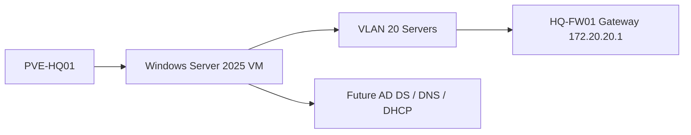
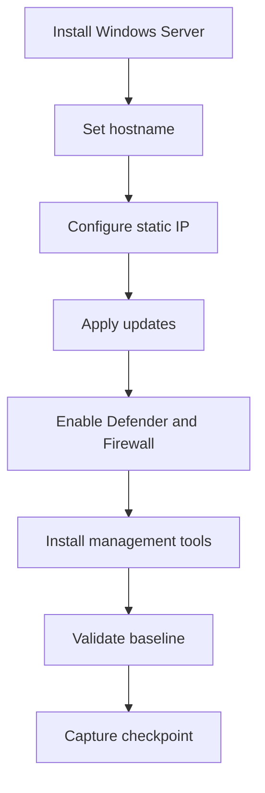

# Windows Server 2025 Baseline

## Document Control

| Field | Value |
|---|---|
| Document ID | GEIL-MSC-WS2025-001 |
| Owner | Infrastructure Engineering |
| Status | Draft |
| Version | 2.3 |
| Last Reviewed | 2026-06-29 |
| Review Cycle | Quarterly |
| Classification | Internal Confidential |

!!! note "Adaptation"

    This document uses canonical GNTECH values from the [Environment Specification](../project/environment-specification.md). Organizations adapting this design should change the environment specification first, then update hostnames, IP addresses, DNS servers, firewall rules, and role-specific commands.

## Purpose

Deploy a consistent Windows Server 2025 baseline before installing enterprise infrastructure roles such as AD DS, DNS, DHCP, PKI, NPS, or management tooling.

## Learning Objectives

After completing this guide you will understand:

- Why every infrastructure server starts from a standardized baseline.
- How a Windows Server baseline supports identity, DNS, DHCP, PKI, and operations.
- How to configure hostname, networking, updates, security, and management tools.
- How to validate the server before installing enterprise roles.
- How to capture evidence and roll back safely before role installation.

## What You Will Build

By the end of this guide you will have:

- ✓ A Windows Server 2025 VM prepared for infrastructure roles.
- ✓ Correct hostname, static IP, gateway, and DNS settings.
- ✓ Windows updates applied.
- ✓ Windows Defender and Windows Firewall enabled.
- ✓ Management tools installed.
- ✓ Pre-role validation and screenshot evidence captured.
- ✓ Snapshot checkpoint ready before role installation.

## Estimated Time

45-90 minutes, excluding ISO download and Windows Update time.

## Difficulty

Beginner.

The tasks use Server Manager and PowerShell. The guide explains each concept before requiring action.

## Risk Level

Medium.

Changing network identity and DNS values can make future domain promotion fail. Risk is controlled by validating settings before roles are installed.

## Service Impact

No impact.

This baseline is performed before the server provides production services.

## Prerequisites

- [Windows Server 2025 Golden Template](../platform/windows-server-2025-golden-template.md) reviewed if this server is cloned from a template.
- [Enterprise Naming Standard](active-directory-naming-standard.md) reviewed for server naming, DNS, certificates, and evidence naming.
- [Active Directory Network Requirements](../platform/active-directory-network-requirements.md) reviewed before domain clients are introduced.


- [Phase 1 Build Plan](../platform/phase-1-build-plan.md) completed for the target VM.
- [Phase 1 Validation Plan](../platform/phase-1-validation-plan.md) passed for network reachability.
- Windows Server 2025 ISO available in Proxmox.
- VirtIO driver ISO available if VirtIO storage or network adapters are used.
- Console access to the target VM.
- Static IP assignment from the Environment Specification.
- Snapshot exists before role installation.


## Expected Starting State

- VM shell exists on `GEILLAN` with the correct VLAN tag.
- Windows Server 2025 ISO and VirtIO driver ISO are attached or available.
- No AD DS role is installed yet.

## Expected Ending State

- Hostname, static IP, DNS bootstrap settings, time zone, updates, and remote management baseline are complete.
- Server is ready for AD DS promotion but is not promoted yet.

## Architecture Overview

Windows Server 2025 is the base operating system for Microsoft infrastructure services. In Phase 1, the first server using this baseline is `HQ-DC01` on VLAN 20 Servers.



!!! enterprise "Enterprise pattern"

    Medium and large enterprises use standardized server baselines so every infrastructure server starts with predictable security, management, logging, patching, and network settings before role-specific configuration begins.

## Background Knowledge

### What is a server baseline?

A server baseline is the required starting configuration before a server performs a role. It reduces variation and makes troubleshooting easier.

### What is a static IP?

A static IP is manually assigned and does not change. Infrastructure servers use static IPs so clients and other services can reliably find them.

### What is a DNS client setting?

The DNS client setting tells the server which DNS resolver to ask. Domain controllers and member servers must use internal AD DNS, not public DNS directly.

### What is a snapshot checkpoint?

A snapshot captures VM state before risky changes. Use snapshots before role installation, not as a replacement for proper backups after production use begins.

## What you are building

You are building a reusable Windows Server foundation that future guides can safely turn into a domain controller, DNS/DHCP server, certificate authority, NPS server, or management server.

## Why this component exists

Without a baseline, each server would have different settings, different update state, different firewall behavior, and different troubleshooting assumptions. GEIL uses a baseline to make later role guides deterministic.

## How this component interacts with the rest of the enterprise

The server baseline interacts with:

- `HQ-FW01` for routing, firewall policy, and the address-list based Active Directory client-to-domain-controller model.
- AD DNS after domain services exist.
- Proxmox snapshots for rollback before production role installation.
- Operations evidence packages for proof of readiness.

## Internal workflow



## Real-world enterprise usage

!!! enterprise "Enterprise usage"

    In large enterprises, server baselines are usually implemented through golden images, configuration management, Desired State Configuration, Intune/Arc, or GPO. GEIL begins with explicit manual steps so the operator understands the required state before automating it later.

## Design decisions specific to GEIL

| Decision | GEIL Value | Why GEIL uses it | What if it changes? | Customizable? |
|---|---|---|---|---|
| First server target | `HQ-DC01` | First Microsoft infrastructure server | AD/DNS docs must be updated | Yes, only through Environment Specification |
| Server VLAN | VLAN 20 Servers | Keeps infrastructure servers separate from clients | Firewall rules and DHCP options change | Yes, with HLD/LLD update |
| First DC IP | `172.20.20.11` | Stable AD DNS target | DHCP/DNS/firewall references break | Yes, through Environment Specification |
| Gateway | `172.20.20.1` | `HQ-FW01` owns VLAN gateways | Routing fails if wrong | No for GEIL Phase 1 |

## Alternatives considered

| Alternative | Why not used initially |
|---|---|
| Fully automated image pipeline | Deferred until the manual baseline is understood and validated |
| DHCP for servers | Infrastructure services require stable addressing |
| Public DNS on servers | Domain services require internal authoritative DNS |
| Snapshot-only recovery after role install | Unsafe for AD and other replicated infrastructure roles |

## Security considerations

- Keep local Administrator credentials in an approved password manager.
- Enable Windows Firewall before role installation.
- Do not browse the internet from infrastructure servers.
- Apply updates before exposing services.
- Do not store screenshots containing secrets in Git.

## Performance considerations

- Allocate CPU and memory based on the role that will be installed later.
- Confirm storage drivers are correct before installing roles.
- Apply updates before performance validation to avoid measuring a transient patch state.

## Scalability considerations

A standardized baseline makes it easier to add `HQ-DC02`, management servers, certificate authorities, and future regional servers without redesigning the operating system layer.

## Operational considerations

- Record hostname, IP, OS version, patch level, and snapshot name.
- Keep the pre-role snapshot until the role-specific guide creates its own checkpoint.
- Move from manual baseline to automation only after the standard is proven.


## Detailed Windows Deployment Walkthrough

This section expands the baseline into a first-time deployment workflow for `HQ-DC01`.

!!! warning "Do not install AD DS yet"

    This guide prepares Windows Server 2025 only. Do not install AD DS, DNS, DHCP, CA, NPS, or other infrastructure roles until this baseline is complete and validated.

### Proxmox VM settings for `HQ-DC01`

Confirm the VM shell before starting Windows setup.

| Setting | Canonical value | Why |
|---|---|---|
| VM name | `HQ-DC01` | First domain controller and DNS/DHCP server |
| Target host | `PVE-HQ01` | HQ virtualization host |
| Network bridge | `GEILLAN` | Internal GEIL trunk |
| VLAN tag | `20` | Servers VLAN |
| Static IP after install | `172.20.20.11/24` | Canonical first DC address |
| Default gateway | `172.20.20.1` | MikroTik CHR VLAN 20 gateway |
| DNS during bootstrap | `172.20.20.11` after AD DNS role is installed; temporary resolver only before promotion if needed for updates | AD DNS must be authoritative after promotion |
| Disk bus | VirtIO SCSI recommended | Better performance on Proxmox |
| NIC model | VirtIO recommended | Better performance on Proxmox |
| VirtIO ISO | Attached during install | Required if Windows cannot see disk or NIC |

Proxmox validation before Windows install:

```bash
qm config 110 | egrep 'name|net|scsi|ide|sata|virtio|boot'
```

Expected result:

- VM name is `HQ-DC01`.
- Network adapter is attached to `GEILLAN`.
- VLAN tag is `20` if VLAN tagging is configured at the VM NIC.
- Windows Server ISO and VirtIO ISO are available.

### Windows edition and installation choice

Use the approved Windows Server 2025 edition for GEIL. For first-time learning and screenshot evidence, use **Desktop Experience** unless the release specifically requires Server Core.

!!! enterprise "Enterprise note"

    Many enterprises prefer Server Core for reduced attack surface. GEIL starts with Desktop Experience for the first learning deployment so that engineers can compare GUI state with PowerShell state. Later hardening releases can introduce Server Core and image automation.

### Disk driver workflow during setup

If Windows Setup does not show a disk:

1. Click **Load driver**.
2. Browse the VirtIO ISO.
3. Select the Windows Server storage driver matching the OS architecture.
4. Load the driver.
5. Confirm the target disk appears.
6. Continue installation.

Do not continue if the disk layout is unclear or the wrong disk appears.

### Network driver workflow after first boot

If Windows has no network adapter after login:

1. Open **Device Manager**.
2. Locate the unknown network device.
3. Update driver from the VirtIO ISO.
4. Install the NetKVM driver matching Windows Server 2025/Windows Server family and architecture.
5. Reboot if prompted.
6. Validate with:

```powershell
Get-NetAdapter
```

Expected result: one connected adapter is visible. Record the exact `InterfaceAlias`; use it in later commands if it is not `Ethernet`.

### First-login checklist

After the first administrator login:

1. Set the local Administrator password and store it in the approved password manager.
2. Confirm the system clock and time zone.
3. Confirm the VM has the correct NIC and disk drivers.
4. Confirm the network adapter alias.
5. Rename the server before installing roles.
6. Configure static IP before installing roles.
7. Patch before installing roles.
8. Create a pre-role snapshot before AD DS promotion.

### Static IP detail for `HQ-DC01`

If the adapter alias is not `Ethernet`, replace `$InterfaceAlias` with the discovered alias.

```powershell
$InterfaceAlias = (Get-NetAdapter | Where-Object Status -eq 'Up' | Select-Object -First 1 -ExpandProperty Name)
$InterfaceAlias
New-NetIPAddress -InterfaceAlias $InterfaceAlias -IPAddress '172.20.20.11' -PrefixLength 24 -DefaultGateway '172.20.20.1'
Set-DnsClientServerAddress -InterfaceAlias $InterfaceAlias -ServerAddresses '172.20.20.11'
Get-NetIPConfiguration -InterfaceAlias $InterfaceAlias
```

!!! note "DNS bootstrap nuance"

    Before AD DNS exists, `172.20.20.11` may not resolve external names. If Windows Update requires temporary external DNS before promotion, document the temporary resolver, apply updates, then return DNS to the AD design before promotion. After AD DS/DNS installation, `HQ-DC01` must use itself for DNS.

### Patch and reboot loop

Run updates until no more approved updates are available:

1. Open `Settings -> Windows Update`.
2. Check for updates.
3. Install updates.
4. Reboot if required.
5. Repeat until no required updates remain.
6. Capture update history evidence.

PowerShell evidence:

```powershell
Get-HotFix | Sort-Object InstalledOn -Descending | Select-Object -First 10
Get-ComputerInfo | Select-Object CsName,WindowsProductName,OsBuildNumber,OsHardwareAbstractionLayer
```

### Pre-role snapshot requirement

After hostname, network, patching, drivers, Defender, and firewall validation are complete, create a checkpoint from Proxmox before installing AD DS.

Run on `PVE-HQ01`:

```bash
qm shutdown 110
qm snapshot 110 CP-DC01-BASELINE --description "HQ-DC01 Windows Server 2025 baseline before AD DS"
qm start 110
qm listsnapshot 110
```

Expected result:

- Snapshot `CP-DC01-BASELINE` exists.
- The server boots after the snapshot.
- No AD DS role is installed yet.

!!! danger "Snapshot boundary"

    This snapshot is safe before AD DS promotion. Do not rely on hypervisor snapshot rollback for an active domain controller after clients, DNS, DHCP, or other domain controllers depend on it.

### Do-not-proceed gates

Do not continue to Active Directory if any of these are true:

- Hostname is not `HQ-DC01`.
- Static IP is not `172.20.20.11/24`.
- Default gateway is not `172.20.20.1`.
- Network adapter driver is missing or unstable.
- Windows is unpatched or waiting for reboot.
- Defender or Windows Firewall is disabled.
- No pre-role snapshot exists.
- DNS settings were left on a public resolver without a documented reason.

## Step-by-Step Procedure

### Step 1: Install Windows Server 2025

#### Goal

Install the operating system on the target VM.

#### Why this step matters

Every future Microsoft role depends on a clean, supported operating system install.

#### Background knowledge

Windows Server roles are installed after the base OS is stable. Do not install AD DS, DHCP, or PKI during the OS installation step.

#### Procedure

Use the Proxmox console to boot from the Windows Server 2025 ISO and complete setup.

#### Commands

Not applicable during GUI installation.

#### GUI navigation

`Proxmox -> target VM -> Console`

#### Expected result

You should now see a Windows Server desktop or Server Core prompt.

#### Validation

```powershell
Get-ComputerInfo | Select-Object WindowsProductName,WindowsVersion,OsBuildNumber
```

#### Evidence

Capture a screenshot of the Windows Server login or Server Manager page.

#### Common Mistakes

| Mistake | Why it matters | Correction |
|---|---|---|
| Promoting AD before static IP is configured | Domain DNS and SRV records can be wrong | Complete this baseline first |
| Leaving DNS pointed only to public resolvers after promotion | Domain clients cannot locate AD services | Point DNS to `HQ-DC01` after AD DNS exists |
| Skipping updates before role install | First domain controller starts from a weak baseline | Patch before promotion |

## Troubleshooting

If the disk is not visible, attach the VirtIO ISO and load the correct storage driver.

#### Rollback

Destroy and recreate the VM if the OS install fails before configuration begins.

#### Next step

Set the server hostname.

### Step 2: Set hostname

#### Goal — Step 2: Set hostname

Rename the server to its canonical GEIL name.

#### Why this step matters — Step 2: Set hostname

Server names become part of logs, certificates, DNS records, monitoring, and operational evidence.

#### Commands — Step 2: Set hostname

For `HQ-DC01`:

```powershell
Rename-Computer -NewName "HQ-DC01" -Restart
```

#### GUI navigation — Step 2: Set hostname

`Server Manager -> Local Server -> Computer name`

#### Expected result — Step 2: Set hostname

You should now see `HQ-DC01` after reboot.

#### Validation — Step 2: Set hostname

```powershell
hostname
```

Expected output:

```text
HQ-DC01
```

#### Evidence — Step 2: Set hostname

Capture command output or Server Manager Local Server screenshot.

#### Troubleshooting

If the hostname does not change, confirm you ran PowerShell as Administrator and rebooted.

#### Rollback — Step 2: Set hostname

Before role installation, rename again using `Rename-Computer` and reboot.

#### Next step — Step 2: Set hostname

Configure static IP addressing.

### Step 3: Configure static IP and DNS

#### Goal — Step 3: Configure static IP and DNS

Assign the server its canonical network identity.

#### Why this step matters — Step 3: Configure static IP and DNS

Infrastructure services must be reachable at stable IP addresses. Domain services are especially sensitive to DNS and IP changes.

#### Commands — Step 3: Configure static IP and DNS

```powershell
New-NetIPAddress -InterfaceAlias "Ethernet" -IPAddress "172.20.20.11" -PrefixLength 24 -DefaultGateway "172.20.20.1"
Set-DnsClientServerAddress -InterfaceAlias "Ethernet" -ServerAddresses "172.20.20.11"
Get-NetIPConfiguration
```

#### GUI navigation — Step 3: Configure static IP and DNS

`Control Panel -> Network and Sharing Center -> Change adapter settings -> Ethernet -> IPv4 Properties`

#### Expected result — Step 3: Configure static IP and DNS

You should now see:

- IP address `172.20.20.11`.
- Prefix length `/24`.
- Default gateway `172.20.20.1`.
- DNS server `172.20.20.11` for the first domain controller bootstrap state.

#### Validation — Step 3: Configure static IP and DNS

```powershell
Test-NetConnection 172.20.20.1
Get-DnsClientServerAddress -AddressFamily IPv4
```

#### Evidence — Step 3: Configure static IP and DNS

Capture `Get-NetIPConfiguration` output.

#### Troubleshooting — Step 3: Configure static IP and DNS

If the interface alias is not `Ethernet`, discover it with:

```powershell
Get-NetAdapter
```

#### Rollback — Step 3: Configure static IP and DNS

```powershell
Remove-NetIPAddress -InterfaceAlias "Ethernet" -IPAddress "172.20.20.11" -Confirm:$false
Set-DnsClientServerAddress -InterfaceAlias "Ethernet" -ResetServerAddresses
```

#### Next step — Step 3: Configure static IP and DNS

Apply updates and enable security baseline controls.

### Step 4: Apply updates and enable security controls

#### Goal — Step 4: Apply updates and enable security controls

Bring the server to a supported patch and security state before installing roles.

#### Why this step matters — Step 4: Apply updates and enable security controls

Installing infrastructure roles on an unpatched server creates avoidable risk and can introduce troubleshooting noise.

#### Commands — Step 4: Apply updates and enable security controls

```powershell
Get-MpComputerStatus | Select-Object AMServiceEnabled,AntivirusEnabled,RealTimeProtectionEnabled
Get-NetFirewallProfile | Select-Object Name,Enabled
```

Use Windows Update from the GUI or approved enterprise update tooling.

#### GUI navigation — Step 4: Apply updates and enable security controls

`Settings -> Windows Update`

#### Expected result — Step 4: Apply updates and enable security controls

You should now see:

- Latest approved updates installed.
- Defender enabled.
- Firewall profiles enabled.

#### Validation — Step 4: Apply updates and enable security controls

```powershell
Get-HotFix | Sort-Object InstalledOn -Descending | Select-Object -First 5
Get-NetFirewallProfile
```

#### Evidence — Step 4: Apply updates and enable security controls

Capture Windows Update status and firewall profile output.

#### Troubleshooting — Step 4: Apply updates and enable security controls

If updates fail, check network connectivity, DNS resolution, and Windows Update logs before installing roles.

#### Rollback — Step 4: Apply updates and enable security controls

Use Windows Update uninstall or VM snapshot before role installation if an update causes boot or network failure.

#### Next step — Step 4: Apply updates and enable security controls

Install management tools.

### Step 5: Install management tools

#### Goal — Step 5: Install management tools

Install only the local administration features needed for bootstrap and role validation. Windows Server is not a daily admin workstation; routine administration must move to `HQ-MGMT01`, the Windows 11 Enterprise management workstation / initial PAW, after it is cloned, joined, validated, and equipped with RSAT/admin tools.

#### Why this step matters — Step 5: Install management tools

Role-specific guides sometimes require local management cmdlets during bootstrap. Installing tools early makes validation repeatable, but this does not make `HQ-DC01` or any Windows Server a routine operator workstation.

#### Commands — Step 5: Install management tools

```powershell
Install-WindowsFeature -Name RSAT-AD-PowerShell,RSAT-DNS-Server -IncludeAllSubFeature
Get-WindowsFeature RSAT-AD-PowerShell,RSAT-DNS-Server
```

#### GUI navigation — Step 5: Install management tools

`Server Manager -> Manage -> Add Roles and Features -> Features`

#### Expected result — Step 5: Install management tools

You should now see RSAT tools installed.

#### Validation — Step 5: Install management tools

```powershell
Get-Command Get-ADDomain -ErrorAction SilentlyContinue
Get-Command Get-DnsServerZone -ErrorAction SilentlyContinue
```

These commands may not return useful role data until roles exist, but the cmdlets should be present after tooling is installed.

#### Evidence — Step 5: Install management tools

Capture `Get-WindowsFeature` output.

#### Rollback — Step 5: Install management tools

```powershell
Uninstall-WindowsFeature RSAT-AD-PowerShell,RSAT-DNS-Server
```

#### Next step — Step 5: Install management tools

Capture the pre-role checkpoint.

## Validation

Run:

```powershell
hostname
Get-ComputerInfo | Select-Object CsName,WindowsProductName,OsBuildNumber
Get-NetIPConfiguration
Get-DnsClientServerAddress -AddressFamily IPv4
Get-MpComputerStatus | Select-Object AMServiceEnabled,AntivirusEnabled,RealTimeProtectionEnabled
Get-NetFirewallProfile | Select-Object Name,Enabled
```

Expected results:

- Hostname is canonical.
- Windows Server 2025 is installed.
- Static IP, gateway, and DNS match the role plan.
- Defender and firewall are enabled.

## Common deployment mistakes

| Mistake | Symptom | Fix |
|---|---|---|
| Wrong interface alias | IP command fails | Run `Get-NetAdapter` and use the correct alias |
| Public DNS configured | Domain promotion or join problems later | Use internal DNS per the role plan |
| No pre-role snapshot | Failed role install has no clean rollback | Create checkpoint before role install |
| Server renamed after role install | Service principal and DNS issues | Rename before installing roles |

## Frequently Asked Questions

### Can the hostname be customized?

Only through the Environment Specification. Many later commands and evidence checks refer to canonical names.

### Why use a static IP?

Infrastructure roles must be reachable at predictable addresses. DHCP is appropriate for clients, not core server identities.

### Should Windows Firewall be disabled for troubleshooting?

No. Create explicit allow rules or troubleshoot the blocked traffic. Disabling the firewall hides design errors.

### Can snapshots replace backup?

No. Snapshots are useful before role installation. After roles such as AD DS are installed, use role-aware backup and recovery.

## Troubleshooting — Troubleshooting

- Use `Get-NetAdapter` to identify interface names.
- Use `Test-NetConnection 172.20.20.1` to validate the gateway.
- Use `Get-WinEvent -LogName System -MaxEvents 50` for recent OS errors.
- Use Windows Update logs when patching fails.

## Rollback

Before role installation, revert to the pre-role VM checkpoint if the baseline is incorrect. After role installation, follow the role-specific rollback guide.

## Evidence Collection

Capture:

- Screenshot: Server Manager Local Server.
- Screenshot: Windows Update status.
- Command output: `Get-NetIPConfiguration`.
- Command output: `Get-ComputerInfo`.
- Command output: Defender and firewall status.
- Snapshot name and timestamp.

!!! example "Screenshot Required"

    Path: `Server Manager -> Local Server`

    Expected result:

    - Computer name shows canonical server name.
    - Ethernet settings show the expected static IP.

    Store screenshots under `docs/assets/images/windows-server-2025-baseline/`.

## Key takeaways

- A server baseline is an enterprise control, not just an installation checklist.
- Hostname, IP, DNS, patching, firewall, and evidence must be correct before roles are installed.
- GEIL uses canonical values so later guides can be deterministic.
- Snapshots are useful before role installation, but role-aware backups are required after production use begins.

## Deployment Validation

Complete this validation before moving to Active Directory Domain Services.

### Windows network validation

#### Goal — Windows network validation

Prove that `HQ-DC01` can reach its VLAN gateway, the internet, and DNS resolution before AD DS is installed.

#### Commands — Windows network validation

```powershell
Get-NetIPAddress -AddressFamily IPv4
```

```powershell
Test-NetConnection 172.20.20.1
```

```powershell
Test-NetConnection 1.1.1.1 -Port 443
```

```powershell
Resolve-DnsName cloudflare.com
```

#### Expected result — Windows network validation

`Get-NetIPAddress` includes:

```text
IPAddress         : 172.20.20.11
PrefixLength      : 24
AddressFamily     : IPv4
```

Gateway test includes:

```text
ComputerName           : 172.20.20.1
PingSucceeded          : True
```

Internet test includes:

```text
TcpTestSucceeded       : True
```

DNS test includes at least one returned address for `cloudflare.com`.

#### If validation fails — Windows network validation

STOP. Do not install AD DS.

- If gateway ping fails, check Proxmox VLAN tag 20, `GEILLAN`, and `HQ-FW01` VLAN 20 gateway.
- If internet fails, check the MikroTik `Allow GEIL LAN to internet` firewall rule and NAT masquerade.
- If DNS name resolution fails, check temporary bootstrap DNS settings and RouterOS DNS forwarding.

Continue only if successful.

### AD DS readiness validation

#### Goal — AD DS readiness validation

Confirm that the server is a clean baseline and no domain role has been installed yet.

#### Commands — AD DS readiness validation

```powershell
Get-WindowsFeature AD-Domain-Services,DNS,DHCP
```

```powershell
hostname
```

#### Expected result — AD DS readiness validation

```text
AD-Domain-Services    Available
DNS                   Available
DHCP                  Available
HQ-DC01
```

Installed state should be `Available`, not `Installed`, before the AD DS implementation guide begins.

#### If validation fails — AD DS readiness validation

STOP. Do not continue to AD DS promotion until the baseline is corrected or the VM is rolled back to `CP-DC01-BASELINE`.

Continue only if successful.

## Knowledge Check

1. Why does GEIL assign static IPs to infrastructure servers?
2. Why should public DNS not be configured on future domain controllers?
3. What evidence proves the server is ready for role installation?
4. Why should hostname changes happen before installing AD DS or other roles?
5. When is a VM snapshot an unsafe rollback method?


## DQI Operator Workflow Upgrade

!!! success "Documentation Quality Initiative improvement"

    This guide was upgraded under the GEIL Documentation Quality Initiative and reviewed against the [Deployment Style Guide](../governance/deployment-style-guide.md). The current quality score is **94/100**.

### Operator workflow for this guide

Use this guide as a sequence of small execution units:

1. Read the goal and why it matters.
2. Confirm the prerequisites and starting state.
3. Execute only the current command block or GUI action.
4. Validate immediately.
5. Capture evidence.
6. Continue only when the expected ending state is true.

### First-time operator focus

This guide now emphasizes VM settings, VirtIO driver workflow, hostname/IP/DNS baseline, patch loop, pre-role snapshot, do-not-proceed gates. The operator should not need to infer execution order from surrounding context.

### Step contract reminder

Before every risky action, confirm:

| Field | Operator question |
|---|---|
| Goal | What one thing am I changing now? |
| Why this matters | Why does the enterprise need this? |
| Estimated time | How long should this section take? |
| Risk level | What can break? |
| Prerequisites | Which object must already exist? |
| Starting state | What must be true before I run the command? |
| Expected ending state | What proves I am done? |

### Local troubleshooting pattern

If a step fails:

1. Stop at the failed step.
2. Do not continue to dependent steps.
3. Run the validation command again.
4. Compare the result with the expected output.
5. Use the rollback for the current step before trying a different approach.
6. Record the failure and correction as implementation evidence.

### Screenshot placement rule

When a GUI action appears in this guide, capture the screenshot at that point in the workflow, not at the end of deployment. The screenshot should show the field/value or status that proves the step succeeded.

## Identity foundation dependency

After this baseline validates, continue to [Active Directory Implementation](active-directory-implementation.md). Do not deploy PKI, NPS, Entra Connect, Intune, or Windows Hello until Active Directory Organizational Foundation, Enterprise Group Strategy, Administrative Tiering, and Domain Controller Backup are complete.

## Next Guide

Continue to:

- [Active Directory Implementation](active-directory-implementation.md)


## Audit Correction Notes

!!! success "Execution-order audit"

    This guide was audited for command order, object dependencies, canonical GEIL values, rollback coverage, validation gates, and active MikroTik CHR firewall references. Follow dependency order exactly: validate prerequisites, create objects, validate objects, apply dependent settings, then capture evidence.

- Audit focus: Prepare `HQ-DC01` before AD DS promotion.
- Active Phase 1 firewall implementation: MikroTik CHR / RouterOS on `HQ-FW01`.
- OPNsense is superseded and must not be used for active Phase 1 deployment.

## Validation after each major stage

Validate immediately after each change block. Do not continue when expected output does not match the guide.

## Expected Results

- Commands complete without referencing missing objects.
- Canonical GEIL values are visible in outputs.
- No active OPNsense deployment path remains for Phase 1 firewall work.
- `10.10.x.x` remains limited to existing non-GEIL `PROD`/`TEST` references only.

## Evidence to capture

- Command output proving prerequisite state.
- Command output proving ending state.
- Relevant GUI screenshots where applicable.
- Rollback checkpoint or export evidence where applicable.

## Deployment Verified

| Field | Value |
|---|---|
| Validated on | Not yet field validated. Must pass this guide, the code-block audit, and clean-environment review before production execution. |
| Windows Server version | Not yet field validated |
| RouterOS version | Not applicable unless the guide explicitly configures RouterOS |
| Proxmox version | Proxmox VE 9 target |
| Deployment date | Not yet field validated |
| Deployment notes | Not yet field validated. Must pass this guide, the code-block audit, and clean-environment review before production execution. |
| Known caveats | Treat as documentation-ready but not field-proven until deployment evidence is captured. |
