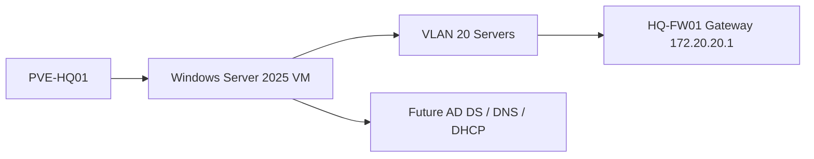
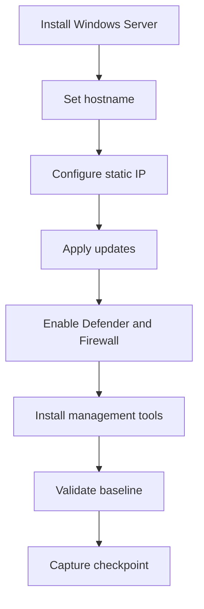

# Windows Server 2025 Baseline

## Document Control

| Field | Value |
|---|---|
| Document ID | GEIL-MSC-WS2025-001 |
| Owner | Infrastructure Engineering |
| Status | Draft |
| Version | 2.0 |
| Last Reviewed | 2026-06-29 |
| Review Cycle | Quarterly |
| Classification | Internal Confidential |

!!! note "Adaptation"

    This document uses canonical GNTECH values from the [Environment Specification](../project/environment-specification.md). Organizations adapting this design should change the environment specification first, then update hostnames, IP addresses, DNS servers, firewall rules, and role-specific commands.

## Purpose

Deploy a consistent Windows Server 2025 baseline before installing enterprise infrastructure roles such as AD DS, DNS, DHCP, PKI, NPS, or management tooling.

## Learning Objectives

After completing this guide you will understand:

- Why every infrastructure server starts from a standardized baseline.
- How a Windows Server baseline supports identity, DNS, DHCP, PKI, and operations.
- How to configure hostname, networking, updates, security, and management tools.
- How to validate the server before installing enterprise roles.
- How to capture evidence and roll back safely before role installation.

## What You Will Build

By the end of this guide you will have:

- ✓ A Windows Server 2025 VM prepared for infrastructure roles.
- ✓ Correct hostname, static IP, gateway, and DNS settings.
- ✓ Windows updates applied.
- ✓ Windows Defender and Windows Firewall enabled.
- ✓ Management tools installed.
- ✓ Pre-role validation and screenshot evidence captured.
- ✓ Snapshot checkpoint ready before role installation.

## Estimated Time

45-90 minutes, excluding ISO download and Windows Update time.

## Difficulty

Beginner.

The tasks use Server Manager and PowerShell. The guide explains each concept before requiring action.

## Risk Level

Medium.

Changing network identity and DNS values can make future domain promotion fail. Risk is controlled by validating settings before roles are installed.

## Service Impact

No impact.

This baseline is performed before the server provides production services.

## Prerequisites

- [Phase 1 Build Plan](../platform/phase-1-build-plan.md) completed for the target VM.
- [Phase 1 Validation Plan](../platform/phase-1-validation-plan.md) passed for network reachability.
- Windows Server 2025 ISO available in Proxmox.
- VirtIO driver ISO available if VirtIO storage or network adapters are used.
- Console access to the target VM.
- Static IP assignment from the Environment Specification.
- Snapshot exists before role installation.

## Architecture Overview

Windows Server 2025 is the base operating system for Microsoft infrastructure services. In Phase 1, the first server using this baseline is `HQ-DC01` on VLAN 20 Servers.



!!! enterprise "Enterprise pattern"

    Medium and large enterprises use standardized server baselines so every infrastructure server starts with predictable security, management, logging, patching, and network settings before role-specific configuration begins.

## Background Knowledge

### What is a server baseline?

A server baseline is the required starting configuration before a server performs a role. It reduces variation and makes troubleshooting easier.

### What is a static IP?

A static IP is manually assigned and does not change. Infrastructure servers use static IPs so clients and other services can reliably find them.

### What is a DNS client setting?

The DNS client setting tells the server which DNS resolver to ask. Domain controllers and member servers must use internal AD DNS, not public DNS directly.

### What is a snapshot checkpoint?

A snapshot captures VM state before risky changes. Use snapshots before role installation, not as a replacement for proper backups after production use begins.

## What you are building

You are building a reusable Windows Server foundation that future guides can safely turn into a domain controller, DNS/DHCP server, certificate authority, NPS server, or management server.

## Why this component exists

Without a baseline, each server would have different settings, different update state, different firewall behavior, and different troubleshooting assumptions. GEIL uses a baseline to make later role guides deterministic.

## How this component interacts with the rest of the enterprise

The server baseline interacts with:

- `HQ-FW01` for routing and firewall policy.
- AD DNS after domain services exist.
- Proxmox snapshots for rollback before production role installation.
- Operations evidence packages for proof of readiness.

## Internal workflow



## Real-world enterprise usage

!!! enterprise "Enterprise usage"

    In large enterprises, server baselines are usually implemented through golden images, configuration management, Desired State Configuration, Intune/Arc, or GPO. GEIL begins with explicit manual steps so the operator understands the required state before automating it later.

## Design decisions specific to GEIL

| Decision | GEIL Value | Why GEIL uses it | What if it changes? | Customizable? |
|---|---|---|---|---|
| First server target | `HQ-DC01` | First Microsoft infrastructure server | AD/DNS docs must be updated | Yes, only through Environment Specification |
| Server VLAN | VLAN 20 Servers | Keeps infrastructure servers separate from clients | Firewall rules and DHCP options change | Yes, with HLD/LLD update |
| First DC IP | `172.20.20.11` | Stable AD DNS target | DHCP/DNS/firewall references break | Yes, through Environment Specification |
| Gateway | `172.20.20.1` | `HQ-FW01` owns VLAN gateways | Routing fails if wrong | No for GEIL Phase 1 |

## Alternatives considered

| Alternative | Why not used initially |
|---|---|
| Fully automated image pipeline | Deferred until the manual baseline is understood and validated |
| DHCP for servers | Infrastructure services require stable addressing |
| Public DNS on servers | Domain services require internal authoritative DNS |
| Snapshot-only recovery after role install | Unsafe for AD and other replicated infrastructure roles |

## Security considerations

- Keep local Administrator credentials in an approved password manager.
- Enable Windows Firewall before role installation.
- Do not browse the internet from infrastructure servers.
- Apply updates before exposing services.
- Do not store screenshots containing secrets in Git.

## Performance considerations

- Allocate CPU and memory based on the role that will be installed later.
- Confirm storage drivers are correct before installing roles.
- Apply updates before performance validation to avoid measuring a transient patch state.

## Scalability considerations

A standardized baseline makes it easier to add `HQ-DC02`, management servers, certificate authorities, and future regional servers without redesigning the operating system layer.

## Operational considerations

- Record hostname, IP, OS version, patch level, and snapshot name.
- Keep the pre-role snapshot until the role-specific guide creates its own checkpoint.
- Move from manual baseline to automation only after the standard is proven.

## Step-by-Step Procedure

### Step 1: Install Windows Server 2025

#### Goal

Install the operating system on the target VM.

#### Why this step matters

Every future Microsoft role depends on a clean, supported operating system install.

#### Background knowledge

Windows Server roles are installed after the base OS is stable. Do not install AD DS, DHCP, or PKI during the OS installation step.

#### Procedure

Use the Proxmox console to boot from the Windows Server 2025 ISO and complete setup.

#### Commands

Not applicable during GUI installation.

#### GUI navigation

`Proxmox -> target VM -> Console`

#### Expected result

You should now see a Windows Server desktop or Server Core prompt.

#### Validation

```powershell
Get-ComputerInfo | Select-Object WindowsProductName,WindowsVersion,OsBuildNumber
```

#### Evidence

Capture a screenshot of the Windows Server login or Server Manager page.

#### Troubleshooting

If the disk is not visible, attach the VirtIO ISO and load the correct storage driver.

#### Rollback

Destroy and recreate the VM if the OS install fails before configuration begins.

#### Next step

Set the server hostname.

### Step 2: Set hostname

#### Goal

Rename the server to its canonical GEIL name.

#### Why this step matters

Server names become part of logs, certificates, DNS records, monitoring, and operational evidence.

#### Commands

For `HQ-DC01`:

```powershell
Rename-Computer -NewName "HQ-DC01" -Restart
```

#### GUI navigation

`Server Manager -> Local Server -> Computer name`

#### Expected result

You should now see `HQ-DC01` after reboot.

#### Validation

```powershell
hostname
```

Expected output:

```text
HQ-DC01
```

#### Evidence

Capture command output or Server Manager Local Server screenshot.

#### Troubleshooting

If the hostname does not change, confirm you ran PowerShell as Administrator and rebooted.

#### Rollback

Before role installation, rename again using `Rename-Computer` and reboot.

#### Next step

Configure static IP addressing.

### Step 3: Configure static IP and DNS

#### Goal

Assign the server its canonical network identity.

#### Why this step matters

Infrastructure services must be reachable at stable IP addresses. Domain services are especially sensitive to DNS and IP changes.

#### Commands

```powershell
New-NetIPAddress -InterfaceAlias "Ethernet" -IPAddress "172.20.20.11" -PrefixLength 24 -DefaultGateway "172.20.20.1"
Set-DnsClientServerAddress -InterfaceAlias "Ethernet" -ServerAddresses "172.20.20.11"
Get-NetIPConfiguration
```

#### GUI navigation

`Control Panel -> Network and Sharing Center -> Change adapter settings -> Ethernet -> IPv4 Properties`

#### Expected result

You should now see:

- IP address `172.20.20.11`.
- Prefix length `/24`.
- Default gateway `172.20.20.1`.
- DNS server `172.20.20.11` for the first domain controller bootstrap state.

#### Validation

```powershell
Test-NetConnection 172.20.20.1
Get-DnsClientServerAddress -AddressFamily IPv4
```

#### Evidence

Capture `Get-NetIPConfiguration` output.

#### Troubleshooting

If the interface alias is not `Ethernet`, discover it with:

```powershell
Get-NetAdapter
```

#### Rollback

```powershell
Remove-NetIPAddress -InterfaceAlias "Ethernet" -IPAddress "172.20.20.11" -Confirm:$false
Set-DnsClientServerAddress -InterfaceAlias "Ethernet" -ResetServerAddresses
```

#### Next step

Apply updates and enable security baseline controls.

### Step 4: Apply updates and enable security controls

#### Goal

Bring the server to a supported patch and security state before installing roles.

#### Why this step matters

Installing infrastructure roles on an unpatched server creates avoidable risk and can introduce troubleshooting noise.

#### Commands

```powershell
Get-MpComputerStatus | Select-Object AMServiceEnabled,AntivirusEnabled,RealTimeProtectionEnabled
Get-NetFirewallProfile | Select-Object Name,Enabled
```

Use Windows Update from the GUI or approved enterprise update tooling.

#### GUI navigation

`Settings -> Windows Update`

#### Expected result

You should now see:

- Latest approved updates installed.
- Defender enabled.
- Firewall profiles enabled.

#### Validation

```powershell
Get-HotFix | Sort-Object InstalledOn -Descending | Select-Object -First 5
Get-NetFirewallProfile
```

#### Evidence

Capture Windows Update status and firewall profile output.

#### Troubleshooting

If updates fail, check network connectivity, DNS resolution, and Windows Update logs before installing roles.

#### Rollback

Use Windows Update uninstall or VM snapshot before role installation if an update causes boot or network failure.

#### Next step

Install management tools.

### Step 5: Install management tools

#### Goal

Install administration features needed by later guides.

#### Why this step matters

Role-specific guides require management cmdlets and consoles. Installing tools early makes validation repeatable.

#### Commands

```powershell
Install-WindowsFeature -Name RSAT-AD-PowerShell,RSAT-DNS-Server -IncludeAllSubFeature
Get-WindowsFeature RSAT-AD-PowerShell,RSAT-DNS-Server
```

#### GUI navigation

`Server Manager -> Manage -> Add Roles and Features -> Features`

#### Expected result

You should now see RSAT tools installed.

#### Validation

```powershell
Get-Command Get-ADDomain -ErrorAction SilentlyContinue
Get-Command Get-DnsServerZone -ErrorAction SilentlyContinue
```

These commands may not return useful role data until roles exist, but the cmdlets should be present after tooling is installed.

#### Evidence

Capture `Get-WindowsFeature` output.

#### Rollback

```powershell
Uninstall-WindowsFeature RSAT-AD-PowerShell,RSAT-DNS-Server
```

#### Next step

Capture the pre-role checkpoint.

## Validation

Run:

```powershell
hostname
Get-ComputerInfo | Select-Object CsName,WindowsProductName,OsBuildNumber
Get-NetIPConfiguration
Get-DnsClientServerAddress -AddressFamily IPv4
Get-MpComputerStatus | Select-Object AMServiceEnabled,AntivirusEnabled,RealTimeProtectionEnabled
Get-NetFirewallProfile | Select-Object Name,Enabled
```

Expected results:

- Hostname is canonical.
- Windows Server 2025 is installed.
- Static IP, gateway, and DNS match the role plan.
- Defender and firewall are enabled.

## Common deployment mistakes

| Mistake | Symptom | Fix |
|---|---|---|
| Wrong interface alias | IP command fails | Run `Get-NetAdapter` and use the correct alias |
| Public DNS configured | Domain promotion or join problems later | Use internal DNS per the role plan |
| No pre-role snapshot | Failed role install has no clean rollback | Create checkpoint before role install |
| Server renamed after role install | Service principal and DNS issues | Rename before installing roles |

## Frequently Asked Questions

### Can the hostname be customized?

Only through the Environment Specification. Many later commands and evidence checks refer to canonical names.

### Why use a static IP?

Infrastructure roles must be reachable at predictable addresses. DHCP is appropriate for clients, not core server identities.

### Should Windows Firewall be disabled for troubleshooting?

No. Create explicit allow rules or troubleshoot the blocked traffic. Disabling the firewall hides design errors.

### Can snapshots replace backup?

No. Snapshots are useful before role installation. After roles such as AD DS are installed, use role-aware backup and recovery.

## Troubleshooting

- Use `Get-NetAdapter` to identify interface names.
- Use `Test-NetConnection 172.20.20.1` to validate the gateway.
- Use `Get-WinEvent -LogName System -MaxEvents 50` for recent OS errors.
- Use Windows Update logs when patching fails.

## Rollback

Before role installation, revert to the pre-role VM checkpoint if the baseline is incorrect. After role installation, follow the role-specific rollback guide.

## Evidence Collection

Capture:

- Screenshot: Server Manager Local Server.
- Screenshot: Windows Update status.
- Command output: `Get-NetIPConfiguration`.
- Command output: `Get-ComputerInfo`.
- Command output: Defender and firewall status.
- Snapshot name and timestamp.

!!! example "Screenshot Required"

    Path: `Server Manager -> Local Server`

    Expected result:

    - Computer name shows canonical server name.
    - Ethernet settings show the expected static IP.

    Store screenshots under `docs/assets/images/windows-server-2025-baseline/`.

## Key takeaways

- A server baseline is an enterprise control, not just an installation checklist.
- Hostname, IP, DNS, patching, firewall, and evidence must be correct before roles are installed.
- GEIL uses canonical values so later guides can be deterministic.
- Snapshots are useful before role installation, but role-aware backups are required after production use begins.

## Knowledge Check

1. Why does GEIL assign static IPs to infrastructure servers?
2. Why should public DNS not be configured on future domain controllers?
3. What evidence proves the server is ready for role installation?
4. Why should hostname changes happen before installing AD DS or other roles?
5. When is a VM snapshot an unsafe rollback method?

## Next Guide

Continue to:

- [Active Directory Implementation](active-directory-implementation.md)
