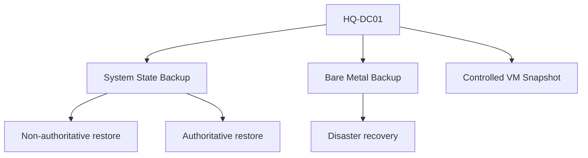

# Domain Controller Backup and Recovery

## Document Control

| Field | Value |
|---|---|
| Document ID | GEIL-OPS-DCBACKUP-001 |
| Owner | Infrastructure Engineering |
| Status | Draft |
| Version | 1.0 |
| Last Reviewed | 2026-06-30 |
| Review Cycle | Quarterly |
| Classification | Internal Confidential |

!!! note "Canonical GNTECH values"

    Forest: `corp.gntech.me`; NetBIOS: `GNTECH`; primary UPN suffix: `gntech.me`; Microsoft 365 primary domain: `gntech.me`; hybrid identity plane: Microsoft Entra ID; primary firewall: MikroTik CHR `HQ-FW01`.


## Purpose

Define how GEIL protects and recovers domain controllers for `corp.gntech.me`, including snapshots, System State, Bare Metal Recovery, authoritative restore, non-authoritative restore, and disaster recovery.

## Architecture Overview



## Backup strategy

| Method | Use | Caution |
|---|---|---|
| VM snapshot | Short maintenance rollback before risky changes | Not a long-term AD backup. Avoid reverting old DC snapshots. |
| System State | AD DS, registry, SYSVOL, boot files | Required for proper AD restore. |
| Bare Metal | Full server recovery | Requires tested recovery media/storage. |
| Authoritative restore | Restore deleted AD objects as authoritative | High-risk; use only when required. |
| Non-authoritative restore | Restore DC and let replication update it | Normal DC recovery pattern. |

## Why snapshots are not enough

A domain controller is a replicated identity database. Reverting old snapshots can create replication and USN rollback hazards if used incorrectly. Snapshots are acceptable for immediate pre-change rollback in the lab foundation, but production recovery requires supported System State and bare-metal backup procedures.

## PowerShell backup examples

Install Windows Server Backup:

```powershell
Install-WindowsFeature Windows-Server-Backup
```

Run System State backup to approved backup storage:

```powershell
wbadmin start systemstatebackup -backupTarget:E: -quiet
```

List backup versions:

```powershell
wbadmin get versions
```

## Validation

```powershell
wbadmin get versions
Get-WinEvent -LogName Microsoft-Windows-Backup -MaxEvents 20
repadmin /replsummary
dcdiag /v
```

Expected result: backup version exists, backup event shows success, replication has zero failures, and DC health validates.

## Restore models

### Non-authoritative restore

Use when restoring a failed DC that should catch up from healthy replication partners. For the first single DC, recovery is effectively disaster recovery until `HQ-DC02` exists.

### Authoritative restore

Use when deleted AD objects must be restored and replicated as authoritative. This requires Directory Services Restore Mode and careful object selection.

### Bare Metal Recovery

Use when the OS or VM is unrecoverable. Recover from tested backup media, then validate AD health.

## Stop conditions

STOP if backups have never been restored in a test, if DSRM password is unknown, if backup media contains unprotected secrets, or if only old VM snapshots exist.

## Rollback

Before a risky AD change, capture a short-lived checkpoint and a System State backup. If validation fails immediately after a change, prefer documented rollback of the change. Use DC restore only when normal rollback is insufficient.

## Evidence Collection

Capture backup version output, event log success, backup target, restore-test record, `dcdiag`, `repadmin`, and DSRM credential escrow confirmation. Do not capture passwords or backup encryption keys.

## Troubleshooting

| Symptom | Cause | Fix |
|---|---|---|
| Backup target unavailable | Storage or permissions issue | Fix target before AD changes. |
| System State backup fails | VSS or writer issue | Check VSS writers and event logs. |
| Restore plan unclear | No tested runbook | Stop and perform test restore in isolated environment. |

## Next Guide

Add backup validation before PKI, NPS, Entra Connect, and additional domain controllers.
