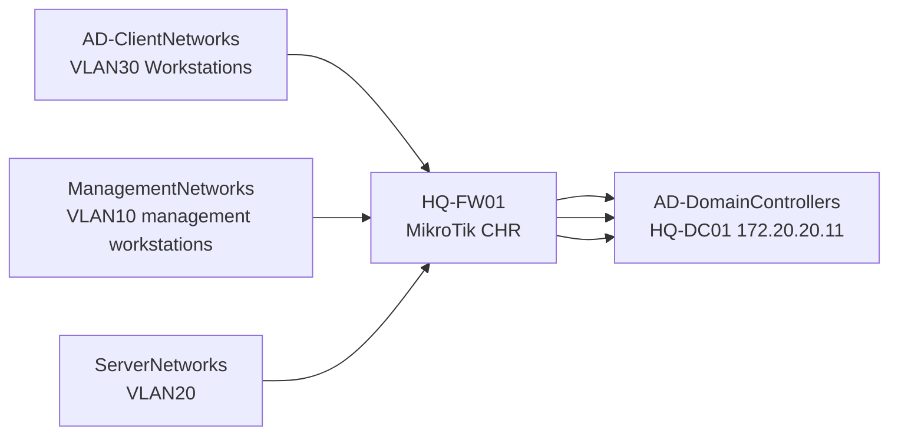

# Active Directory Network Requirements

## Document Control

| Field | Value |
|---|---|
| Document ID | GEIL-PLAT-AD-NET-001 |
| Owner | Infrastructure Engineering |
| Status | Approved |
| Version | 1.0 |
| Last Reviewed | 2026-07-01 |
| Review Cycle | Quarterly |
| Classification | Internal Confidential |

## Purpose

Define the authoritative GEIL network communication standard for Active Directory clients, domain controllers, and the MikroTik CHR firewall.

This document replaces duplicated one-off firewall guidance in implementation guides. Other GEIL guides must reference this standard instead of redefining Active Directory firewall rules.

## Validated pilot finding

During pilot deployment:

- `HQ-FW01` was running MikroTik CHR / RouterOS.
- `HQ-DC01` was running Windows Server 2025.
- VLAN20 Servers was `172.20.20.0/24`.
- VLAN30 Workstations was `172.20.30.0/24`.
- DHCP relay worked.
- VLAN30 clients received IP addresses.
- Internet access worked.
- DHCP option DNS server `172.20.20.11` was delivered correctly.
- Clients could not reach `HQ-DC01`.
- Ping to `172.20.20.11` timed out.
- DNS queries timed out.
- Domain join failed.

Root cause: firewall policy only allowed the single management workstation `172.20.30.10` to communicate with `HQ-DC01`. Other domain workstations were blocked by the default deny forward rule.

!!! warning "DHCP relay is not Active Directory connectivity"

    DHCP relay proves address assignment only. It does not prove DNS, Kerberos, LDAP, SMB/SYSVOL, RPC, time synchronization, Global Catalog, or domain join connectivity. Active Directory deployments require explicit client-to-domain-controller firewall policy.

## Architecture model

GEIL uses reusable RouterOS address lists instead of one firewall rule per VLAN.



## Canonical RouterOS address lists

| Address list | Members | Purpose |
|---|---|---|
| `AD-DomainControllers` | `172.20.20.11` | Domain controller service targets. Add future DCs here. |
| `AD-ClientNetworks` | `172.20.30.0/24` | Domain clients that must join/use AD. Add future workstation/corporate WiFi client networks here. |
| `ManagementNetworks` | `172.20.10.0/24`, `172.20.30.10` | Approved administration sources. |
| `ServerNetworks` | `172.20.20.0/24` | Server VLAN and future member-server networks. |

## RouterOS address-list commands

Create address lists before firewall rules reference them.

```routeros
/ip firewall address-list add list=AD-DomainControllers address=172.20.20.11 comment="HQ-DC01 domain controller"
/ip firewall address-list add list=AD-ClientNetworks address=172.20.30.0/24 comment="VLAN30 Workstations domain clients"
/ip firewall address-list add list=ManagementNetworks address=172.20.10.0/24 comment="VLAN10 Management"
/ip firewall address-list add list=ManagementNetworks address=172.20.10.0/24 comment="VLAN10 approved management workstations"
/ip firewall address-list add list=ServerNetworks address=172.20.20.0/24 comment="VLAN20 Servers"
```

Validation:

```routeros
/ip/firewall/address-list/print where list~"AD-|ManagementNetworks|ServerNetworks"
```

Expected result: all address lists exist before any Active Directory firewall rule references them.

## Production Active Directory firewall policy

Add these rules before `Default deny unapproved forwarding`.

```routeros
/ip firewall filter add chain=forward action=accept src-address-list=AD-ClientNetworks dst-address-list=AD-DomainControllers protocol=tcp dst-port=53 place-before=[find comment="Default deny unapproved forwarding"] comment="AD DNS TCP clients to DCs"
/ip firewall filter add chain=forward action=accept src-address-list=AD-ClientNetworks dst-address-list=AD-DomainControllers protocol=udp dst-port=53 place-before=[find comment="Default deny unapproved forwarding"] comment="AD DNS UDP clients to DCs"
/ip firewall filter add chain=forward action=accept src-address-list=AD-ClientNetworks dst-address-list=AD-DomainControllers protocol=tcp dst-port=88 place-before=[find comment="Default deny unapproved forwarding"] comment="AD Kerberos TCP clients to DCs"
/ip firewall filter add chain=forward action=accept src-address-list=AD-ClientNetworks dst-address-list=AD-DomainControllers protocol=udp dst-port=88 place-before=[find comment="Default deny unapproved forwarding"] comment="AD Kerberos UDP clients to DCs"
/ip firewall filter add chain=forward action=accept src-address-list=AD-ClientNetworks dst-address-list=AD-DomainControllers protocol=tcp dst-port=389 place-before=[find comment="Default deny unapproved forwarding"] comment="AD LDAP TCP clients to DCs"
/ip firewall filter add chain=forward action=accept src-address-list=AD-ClientNetworks dst-address-list=AD-DomainControllers protocol=udp dst-port=389 place-before=[find comment="Default deny unapproved forwarding"] comment="AD LDAP UDP clients to DCs"
/ip firewall filter add chain=forward action=accept src-address-list=AD-ClientNetworks dst-address-list=AD-DomainControllers protocol=tcp dst-port=445 place-before=[find comment="Default deny unapproved forwarding"] comment="AD SMB SYSVOL clients to DCs"
/ip firewall filter add chain=forward action=accept src-address-list=AD-ClientNetworks dst-address-list=AD-DomainControllers protocol=tcp dst-port=135 place-before=[find comment="Default deny unapproved forwarding"] comment="AD RPC endpoint mapper clients to DCs"
/ip firewall filter add chain=forward action=accept src-address-list=AD-ClientNetworks dst-address-list=AD-DomainControllers protocol=tcp dst-port=49152-65535 place-before=[find comment="Default deny unapproved forwarding"] comment="AD dynamic RPC clients to DCs"
/ip firewall filter add chain=forward action=accept src-address-list=AD-ClientNetworks dst-address-list=AD-DomainControllers protocol=udp dst-port=123 place-before=[find comment="Default deny unapproved forwarding"] comment="AD NTP clients to DCs"
/ip firewall filter add chain=forward action=accept src-address-list=AD-ClientNetworks dst-address-list=AD-DomainControllers protocol=tcp dst-port=3268 place-before=[find comment="Default deny unapproved forwarding"] comment="AD Global Catalog clients to DCs"
/ip firewall filter add chain=forward action=accept src-address-list=AD-ClientNetworks dst-address-list=AD-DomainControllers protocol=tcp dst-port=3269 place-before=[find comment="Default deny unapproved forwarding"] comment="AD Global Catalog SSL clients to DCs"
/ip firewall filter add chain=forward action=accept disabled=yes src-address-list=AD-ClientNetworks dst-address-list=AD-DomainControllers protocol=tcp dst-port=636 place-before=[find comment="Default deny unapproved forwarding"] comment="OPTIONAL AD LDAPS clients to DCs if enabled"
```

## Why each service is required

| Service | Protocol/Port | Why it is required |
|---|---|---|
| DNS | TCP/UDP 53 | Domain clients must resolve domain controllers, SRV records, SYSVOL paths, and internal names through AD DNS. |
| Kerberos | TCP/UDP 88 | Domain sign-in and ticket acquisition require Kerberos. |
| LDAP | TCP/UDP 389 | Domain controller discovery, directory lookup, and many domain operations use LDAP. |
| SMB / SYSVOL / NETLOGON | TCP 445 | Domain join, Group Policy, logon scripts, SYSVOL, and NETLOGON access require SMB. |
| RPC Endpoint Mapper | TCP 135 | Windows clients discover RPC service endpoints through the endpoint mapper. |
| Dynamic RPC | TCP 49152-65535 | Group Policy, domain join, management, and Windows AD operations use dynamic RPC endpoints. |
| NTP / Windows Time | UDP 123 | Kerberos is time-sensitive; clients must synchronize time with the domain hierarchy. |
| Global Catalog | TCP 3268 | Directory lookup and forest-wide queries use Global Catalog. |
| Global Catalog SSL | TCP 3269 | Secure Global Catalog is required when secure directory queries are enabled. |
| LDAPS | TCP 636 | Optional until AD CS/LDAPS is enabled and validated. Keep the rule disabled until then. |

## Temporary pilot validation rule

This broad rule is allowed only to prove that firewall policy is the blocker. It is not a production rule.

```routeros
/ip firewall filter add chain=forward action=accept src-address=172.20.30.0/24 dst-address=172.20.20.11 place-before=[find comment="Default deny unapproved forwarding"] comment="TEMP PILOT ONLY allow VLAN30 to HQ-DC01"
/ip firewall filter remove [find comment="TEMP PILOT ONLY allow VLAN30 to HQ-DC01"]
```

Use it only long enough to prove causality. Remove it immediately and replace it with the production address-list rules.

## Validation from the Management VLAN

Run from `HQ-MGMT01` on VLAN10 to prove the management workstation can reach required domain-controller services before domain join and RSAT administration.

```powershell
ping 172.20.20.11
Resolve-DnsName corp.gntech.me -Server 172.20.20.11
Test-NetConnection HQ-DC01.corp.gntech.me -Port 88
Test-NetConnection HQ-DC01.corp.gntech.me -Port 389
Test-NetConnection HQ-DC01.corp.gntech.me -Port 445
```

Expected result: `HQ-MGMT01` can reach AD services from `ManagementNetworks` without granting infrastructure-management access to VLAN30 clients.

## Validation from a VLAN30 client

Run from a normal VLAN30 workstation such as `HQ-W11-001`. `HQ-MGMT01` is on VLAN10 and validates management-workstation reachability separately.

```powershell
ping 172.20.20.11
Resolve-DnsName corp.gntech.me -Server 172.20.20.11
Resolve-DnsName _ldap._tcp.dc._msdcs.corp.gntech.me -Type SRV -Server 172.20.20.11
Test-NetConnection HQ-DC01.corp.gntech.me -Port 445
Test-NetConnection HQ-DC01.corp.gntech.me -Port 135
Test-NetConnection HQ-DC01.corp.gntech.me -Port 3268
w32tm /stripchart /computer:HQ-DC01.corp.gntech.me /samples:3
nltest /dsgetdc:corp.gntech.me
gpupdate /force
gpresult /r
Test-Path \\corp.gntech.me\SYSVOL
Test-Path \\corp.gntech.me\NETLOGON
```

Expected result:

- Ping to `172.20.20.11` succeeds when ICMP is permitted for validation.
- DNS resolves `corp.gntech.me` and AD SRV records.
- Kerberos/domain controller discovery succeeds.
- SYSVOL and NETLOGON paths are reachable.
- `gpupdate /force` completes without firewall timeouts.
- `gpresult /r` shows applied computer/user policy after domain join.

## Validation from RouterOS

```routeros
/ip/firewall/address-list/print where list~"AD-|ManagementNetworks|ServerNetworks"
/ip/firewall/filter/print stats where comment~"AD "
```

Expected result: address lists exist, AD service rules appear before the default deny forward rule, and counters increment during client validation.

## Stop conditions

STOP if any of the following occur:

- DHCP succeeds but DNS queries to `172.20.20.11` time out.
- Domain join cannot locate `corp.gntech.me`.
- `SYSVOL` or `NETLOGON` is unreachable.
- `gpupdate /force` times out with RPC or domain-controller errors.
- Only `172.20.30.10` can reach `HQ-DC01`.
- A broad temporary pilot rule remains enabled after validation.
- AD firewall rules reference raw VLAN CIDRs directly instead of `AD-ClientNetworks` and `AD-DomainControllers` address lists.

## Rollback

Remove only the AD service rules or address-list entries added during the current change if validation fails.

```routeros
/ip firewall filter remove [find comment~"AD "]
/ip firewall address-list remove [find list=AD-ClientNetworks]
/ip firewall address-list remove [find list=AD-DomainControllers]
```

Do not remove unrelated baseline internet, guest isolation, management, or DHCP relay rules during AD network rollback.

## Evidence

Capture:

- RouterOS address-list print output.
- RouterOS firewall rule print with counters.
- VLAN30 client DNS query output.
- `nltest /dsgetdc:corp.gntech.me` output.
- `Test-Path \\corp.gntech.me\SYSVOL` output.
- `Test-Path \\corp.gntech.me\NETLOGON` output.
- `gpupdate /force` output.
- `gpresult /r` or `gpresult /h` evidence after domain join.

## Next step

Use this standard from:

- [MikroTik CHR HQ Foundation Implementation](mikrotik-chr-hq-foundation-implementation.md)
- [Firewall Rule Matrix](firewall-rule-matrix.md)
- [DNS and DHCP Implementation](../microsoft-core/dns-dhcp-implementation.md)
- [Group Policy Baseline](../microsoft-core/group-policy-baseline.md)
- [Phase 1 Validation Plan](phase-1-validation-plan.md)
