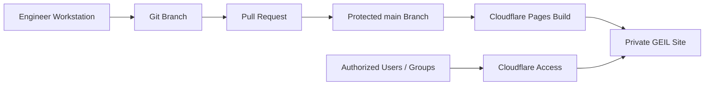
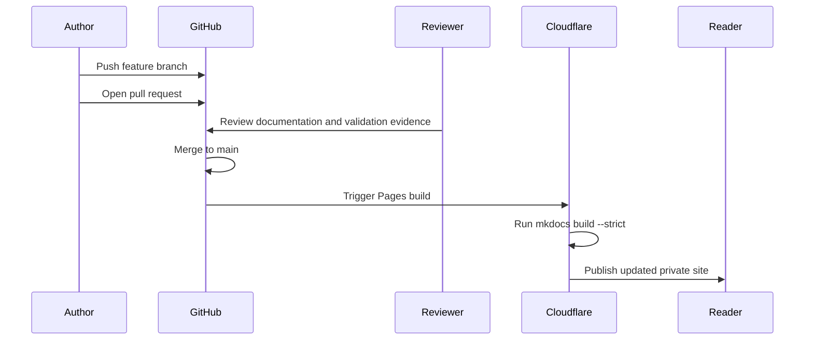

# Cloudflare Pages Deployment Runbook

## Document Control

| Field | Value |
|---|---|
| Document ID | GEIL-PLT-CFPAGES-001 |
| Owner | Infrastructure Engineering |
| Status | Draft |
| Version | 1.0 |
| Last Reviewed | 2026-06-29 |
| Review Cycle | Quarterly |
| Classification | Internal Confidential |

## Purpose

Deploy the private GEIL MkDocs Material site from a GitHub repository to Cloudflare Pages and protect access with Cloudflare Access.

This runbook covers initial deployment, validation, routine operations, rollback, and troubleshooting. It is written for production internal documentation, not a public marketing site.

## Scope

In scope:

- GitHub private repository preparation.
- MkDocs strict build validation.
- Cloudflare Pages project creation.
- Cloudflare Pages build settings.
- Custom hostname and DNS preparation.
- Cloudflare Access protection requirements.
- Deployment validation and rollback.

Out of scope:

- Public website hosting.
- Publishing secrets or environment-specific inventories.
- Replacing formal backup of the Git repository.
- Page-level authorization inside the static site.

## Architecture



## Prerequisites

| Requirement | Expected State |
|---|---|
| GitHub repository | Private repository exists for GEIL |
| Branch protection | `main` requires pull request review before merge |
| Local build | `mkdocs build --strict` succeeds locally |
| Cloudflare account | Administrative access to the Cloudflare account that owns `<PUBLIC_DOMAIN>` |
| DNS zone | `<PUBLIC_DOMAIN>` is active in Cloudflare DNS |
| Access identity provider | Cloudflare Access has an approved identity provider, such as Microsoft Entra ID |
| Emergency access | At least two Cloudflare administrators can recover access |

## Required repository files

The repository must include:

```text
mkdocs.yml
requirements.txt
docs/
.gitignore
README.md
CHANGELOG.md
```

The repository must not include:

```text
.env
*.pfx
*.p12
*.key
*.pem
*.rdp
*.ovpn
recovery-codes.txt
tenant-id.txt
```

## Local validation before Cloudflare connection

Run from the repository root.

```bash
python3 -m venv .venv
. .venv/bin/activate
python -m pip install --upgrade pip
python -m pip install -r requirements.txt
mkdocs build --strict
```

Expected result:

```text
Documentation built successfully with zero warnings or errors.
```

If the build fails, do not connect or deploy the Pages project. Fix navigation, Markdown, or dependency errors first.

## GitHub repository controls

Configure these controls before connecting Cloudflare Pages.

| Control | Required Setting |
|---|---|
| Visibility | Private |
| Default branch | `main` |
| Branch protection | Pull request required before merge |
| Force pushes | Disabled for `main` |
| Secret scanning | Enabled where license permits |
| Actions permissions | Restricted to approved workflows if GitHub Actions is later used |

Validation command:

```bash
git remote -v
git branch --show-current
git status --short
```

Expected result:

- Remote points to the approved private repository.
- Current branch is an implementation branch or `main` during validation.
- Working tree is clean before production deployment.

## Cloudflare Pages project creation

1. Sign in to Cloudflare Dashboard with a named administrator account.
2. Open Workers & Pages.
3. Select Create application.
4. Select Pages.
5. Connect to Git.
6. Authorize the GitHub organization that owns `<ORG_NAME>/<REPO_NAME>`.
7. Select the GEIL repository.
8. Configure the production branch as `main`.

## Cloudflare Pages build settings

Use the following settings.

| Setting | Value |
|---|---|
| Project name | `geil-docs` or approved equivalent |
| Production branch | `main` |
| Framework preset | None |
| Build command | `python -m pip install -r requirements.txt && mkdocs build --strict` |
| Build output directory | `site` |
| Root directory | repository root |
| Python version | Cloudflare default supported Python, unless pinned by environment variable |

If Python version pinning is required, set an environment variable only after verifying Cloudflare's currently supported values:

| Variable | Example Value | Notes |
|---|---|---|
| `PYTHON_VERSION` | `3.12` | Use a Cloudflare-supported version, not a workstation-only version |

## Custom domain configuration

Recommended hostname:

```text
geil.<PUBLIC_DOMAIN>
```

Procedure:

1. Open the Pages project.
2. Select Custom domains.
3. Add `geil.<PUBLIC_DOMAIN>`.
4. Allow Cloudflare to create the required DNS record.
5. Confirm SSL/TLS certificate issuance.

Validation from an admin workstation:

```powershell
Resolve-DnsName geil.<PUBLIC_DOMAIN>
Test-NetConnection geil.<PUBLIC_DOMAIN> -Port 443
```

Expected result:

- DNS resolves to Cloudflare.
- TCP 443 succeeds.
- Browser shows the Cloudflare Access sign-in page, not the documentation content directly.

## Cloudflare Access protection

Cloudflare Pages alone is not sufficient for private GEIL documentation. Protect the hostname with Cloudflare Access before broad rollout.

Minimum Access policy:

| Setting | Required Value |
|---|---|
| Application type | Self-hosted or Pages application, depending on Cloudflare dashboard flow |
| Application domain | `geil.<PUBLIC_DOMAIN>` |
| Session duration | 8 to 12 hours for normal users |
| Identity provider | Microsoft Entra ID or approved IdP |
| Allow policy | Approved infrastructure/security groups only |
| Emergency access | At least two named administrators with documented recovery path |

Recommended group model:

| Group | Access |
|---|---|
| `GEIL-Readers` | Read published documentation |
| `GEIL-Authors` | Read documentation and submit repository PRs through GitHub |
| `GEIL-Approvers` | Approve PRs and production documentation changes |
| `GEIL-Admins` | Cloudflare Pages and Access administration |

Validation:

1. Open a private browser session as an authorized user.
2. Browse to `https://geil.<PUBLIC_DOMAIN>`.
3. Confirm Cloudflare Access authentication is required.
4. Confirm documentation loads after successful authentication.
5. Open a second private browser session as an unauthorized user.
6. Confirm access is denied.

Expected result:

- Authorized users can access GEIL after Access authentication.
- Unauthorized users cannot view content.
- Direct `*.pages.dev` preview access is either disabled, restricted, or documented as an accepted temporary risk.

## Deployment workflow



## Routine publication procedure

1. Create a feature branch.
2. Write or update documentation.
3. Update `mkdocs.yml` navigation when adding pages.
4. Update the document index, backlog, roadmap, and changelog.
5. Run local validation.
6. Commit changes.
7. Open a pull request.
8. Attach validation evidence.
9. Merge after review.
10. Confirm Cloudflare Pages production deployment succeeds.

Local validation:

```bash
. .venv/bin/activate
mkdocs build --strict
```

Expected result:

```text
Documentation built successfully with zero warnings or errors.
```

## Rollback procedure

Use this procedure if a deployment publishes incorrect, incomplete, or unsafe guidance.

### Preferred rollback: redeploy a known-good commit

1. Open the Cloudflare Pages project.
2. Open Deployments.
3. Identify the last known-good production deployment.
4. Select Rollback to this deployment.
5. Confirm the production hostname serves the previous content.
6. Open a corrective GitHub issue or PR.

### Git rollback: revert the bad merge

Use when the repository must reflect the rollback immediately.

```bash
git checkout main
git pull --ff-only
git revert <BAD_MERGE_COMMIT_SHA>
git push origin main
```

Expected result:

- Cloudflare Pages starts a new deployment.
- The reverted content is no longer present after deployment completes.

### Emergency access rollback

If Cloudflare Access blocks all administrators:

1. Use a documented Cloudflare emergency administrator account.
2. Temporarily add a named administrator allow policy.
3. Restore normal group-based policy.
4. Review IdP group synchronization.
5. Record the event in the change log.

Do not disable Cloudflare Access for GEIL except during an approved emergency and only for the minimum time required.

## Troubleshooting

| Symptom | Likely Cause | Response |
|---|---|---|
| Pages build fails with missing `mkdocs` | Build command did not install requirements | Set build command to `python -m pip install -r requirements.txt && mkdocs build --strict` |
| Pages build fails with navigation error | `mkdocs.yml` references missing file or unlinked page warning under strict mode | Fix navigation or create the referenced production document |
| Site is publicly visible | Cloudflare Access policy missing or bypassed by preview domain | Add Access application and restrict preview domain exposure |
| Authorized user denied | User not in allowed IdP group or stale identity token | Confirm Entra group membership and re-authenticate |
| DNS resolves incorrectly | Custom hostname not attached to Pages or conflicting DNS record exists | Remove conflicting record and recreate custom domain mapping |
| Mermaid not rendering | MkDocs extension or Material rendering issue | Confirm `pymdownx.superfences` and Mermaid custom fence in `mkdocs.yml` |

## Security considerations

- GEIL contains internal implementation guidance and must not be public.
- Do not commit Cloudflare API tokens, GitHub tokens, or service account credentials.
- Use named accounts for Cloudflare and GitHub administration.
- Prefer Microsoft Entra ID groups for Access authorization.
- Review Cloudflare audit logs after access policy changes.
- Treat bypass or service tokens as privileged credentials.

## Operational checks

Weekly:

- Confirm latest Pages deployment succeeded.
- Confirm Cloudflare Access application is enabled.
- Review failed Access login patterns.
- Confirm repository branch protection remains active.

Monthly:

- Review `GEIL-Admins` membership.
- Review stale Cloudflare and GitHub administrators.
- Run a clean local `mkdocs build --strict` from a fresh clone.

Quarterly:

- Test deployment rollback.
- Test emergency administrator access.
- Review whether `*.pages.dev` exposure is disabled, restricted, or explicitly accepted.

## Required ADRs, runbooks, diagrams, and cross-references

### ADRs

- Existing: [ADR-0001 MkDocs Material Documentation Platform](../governance/adrs/ADR-0001-mkdocs-material.md).
- Required if deviating: create an ADR if GEIL is deployed without Cloudflare Access or if the repository is not private.
- Recommended future ADR: static-site authorization limitations and accepted controls if page-level authorization becomes a requirement.

### Runbooks

- This document is the primary Cloudflare Pages deployment runbook.
- Future runbook required: Cloudflare Access policy administration and emergency access recovery.
- Future runbook recommended: GitHub branch protection and repository security baseline.

### Diagrams

- Included: deployment architecture flow.
- Included: publication sequence diagram.
- Future diagram recommended: identity provider to Cloudflare Access authorization flow.

### Cross-references

- [GEIL Project Charter](../project/project-charter.md)
- [Documentation Standard](../governance/documentation-standard.md)
- [Documentation Roadmap](../project/documentation-roadmap.md)
- [Documentation Backlog](../project/documentation-backlog.md)
- [Document Index](../project/document-index.md)
- [ADR-0001 MkDocs Material Documentation Platform](../governance/adrs/ADR-0001-mkdocs-material.md)
