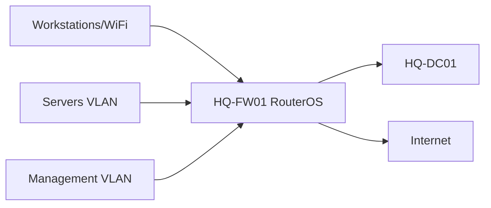

# Firewall Rule Matrix

## Document Control

| Field | Value |
|---|---|
| Document ID | GEIL-PLAT-FW-MATRIX-001 |
| Owner | Infrastructure Engineering |
| Status | Draft |
| Version | 1.0 |
| Last Reviewed | 2026-06-30 |
| Review Cycle | Quarterly |
| Classification | Internal Confidential |

!!! note "Canonical GNTECH values"

    Forest: `corp.gntech.me`; NetBIOS: `GNTECH`; primary UPN suffix: `gntech.me`; Microsoft 365 primary domain: `gntech.me`; hybrid identity plane: Microsoft Entra ID; primary firewall: MikroTik CHR `HQ-FW01`.


## Purpose

Provide the canonical firewall policy matrix for `HQ-FW01` MikroTik CHR / RouterOS so Microsoft Core services are deployed with explicit, auditable network flows.

## Architecture Overview



## Rule matrix

| Source | Destination | Protocol | Ports | Purpose | Approval | Future owner | Validation |
|---|---|---|---|---|---|---|---|
| VLAN 30 Workstations | `HQ-DC01` | TCP/UDP | 53 | DNS resolution | Identity/Network | Microsoft Core | `Resolve-DnsName corp.gntech.me` |
| VLAN 30 Workstations | `HQ-DC01` | TCP/UDP | 88 | Kerberos auth | Identity | Microsoft Core | Domain logon succeeds |
| VLAN 30 Workstations | `HQ-DC01` | TCP/UDP | 389 | LDAP | Identity | Microsoft Core | `nltest /dsgetdc:corp.gntech.me` |
| VLAN 30 Workstations | `HQ-DC01` | TCP | 445 | SMB/GPO/SYSVOL | Identity | Microsoft Core | `Test-Path \corp.gntech.me\SYSVOL` |
| VLAN 30 Workstations | `HQ-DC01` | TCP | 135 + RPC dynamic | AD/GPO/RPC | Identity | Microsoft Core | `gpupdate /force` |
| VLAN 20 Servers | `HQ-DC01` | TCP/UDP | 53,88,389,445 | Domain member operations | Identity | Microsoft Core | Member server secure channel validates |
| VLAN 10 Management | `HQ-FW01` | TCP | 8291,22,443 | WinBox/SSH/HTTPS management | Network | Platform | Approved admin source reaches RouterOS |
| VLAN 20 Servers | Internet | TCP | 80,443 | Updates and Microsoft cloud endpoints | Platform/Security | Operations | `Test-NetConnection` to update endpoints |
| VLAN 30 Workstations | Internet | TCP | 80,443 | User/cloud services | Security | Endpoint | Browser and M365 sign-in validates |
| Guest VLAN 70 | Internet | TCP/UDP | 53,80,443 | Internet-only guest access | Network/Security | Network | Guest cannot reach internal RFC1918 |
| `HQ-DC01` | Microsoft cloud | TCP | 443 | Future Entra sync/cloud health | Identity | Cloud | Entra Connect health after deployment |
| NPS server | Network devices | UDP | 1812,1813 | RADIUS authentication/accounting | Network/Identity | NPS | NPS event log and test auth |

## RouterOS validation examples

```routeros
/ip firewall filter print where comment~"GEIL"
/ip firewall nat print
/ip route print
```

Expected result: allow rules appear before deny rules, NAT exists for approved internet-bound traffic, and no guest rule permits internal access.

## Stop conditions

STOP if a rule references an interface list before it exists, permits Guest to internal networks, or allows Any/Any management access.

## Rollback

Use Safe Mode before changing RouterOS firewall policy. Export before changes:

```routeros
/export file=HQ-FW01-before-firewall-change
```

Remove or disable only the newly added rule if validation fails.

## Evidence Collection

Capture firewall filter output, NAT output, route output, source/destination validation, and failed-deny evidence for guest isolation.

## Troubleshooting

| Symptom | Cause | Fix |
|---|---|---|
| Windows cannot reach internet | LAN-to-WAN rule or NAT missing | Validate forward allow and NAT. |
| Domain logon fails | DNS/Kerberos/LDAP blocked | Validate ports to `HQ-DC01`. |
| Guest reaches internal network | Missing deny or wrong rule order | Move deny before broad allow. |

## Next Guide

Use this with [Enterprise Port Reference](enterprise-port-reference.md) before Microsoft Core service deployment.
