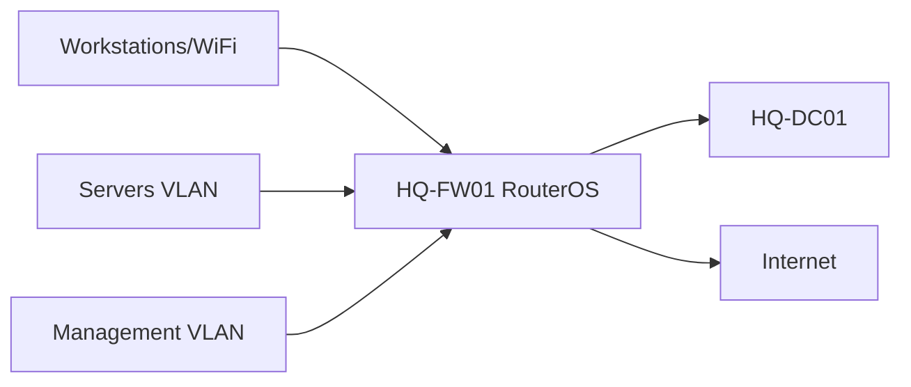

# Firewall Rule Matrix

## Document Control

| Field | Value |
|---|---|
| Document ID | GEIL-PLAT-FW-MATRIX-001 |
| Owner | Infrastructure Engineering |
| Status | Draft |
| Version | 1.0 |
| Last Reviewed | 2026-06-30 |
| Review Cycle | Quarterly |
| Classification | Internal Confidential |

!!! note "Canonical GNTECH values"

    Forest: `corp.gntech.me`; NetBIOS: `GNTECH`; primary UPN suffix: `gntech.me`; Microsoft 365 primary domain: `gntech.me`; hybrid identity plane: Microsoft Entra ID; primary firewall: MikroTik CHR `HQ-FW01`.


## Purpose

Provide the canonical firewall policy matrix for `HQ-FW01` MikroTik CHR / RouterOS so Microsoft Core services are deployed with explicit, auditable network flows.

## Architecture Overview



## Pilot finding: DHCP relay is not enough

During pilot deployment, VLAN 30 clients successfully received DHCP leases and DNS option `172.20.20.11`, but could not reach `HQ-DC01`. Ping, DNS queries, and domain join failed because the firewall only allowed `172.20.30.10` to communicate with `172.20.20.11`; all other workstation addresses were blocked by the default deny forward rule.

Temporary validation proved the root cause by allowing `172.20.30.0/24` to reach `172.20.20.11`. That broad validation rule is not the production recommendation. Production policy must allow only the required Active Directory service ports from client VLANs to domain controllers.

## Rule matrix

| Source | Destination | Protocol | Ports | Purpose | Approval | Future owner | Validation |
|---|---|---|---|---|---|---|---|
| VLAN 30 Workstations | `HQ-DC01` | TCP/UDP | 53 | DNS resolution | Identity/Network | Microsoft Core | `Resolve-DnsName corp.gntech.me -Server 172.20.20.11` |
| VLAN 30 Workstations | `HQ-DC01` | TCP/UDP | 88 | Kerberos authentication | Identity | Microsoft Core | Domain logon succeeds |
| VLAN 30 Workstations | `HQ-DC01` | TCP/UDP | 389 | LDAP domain controller discovery | Identity | Microsoft Core | `nltest /dsgetdc:corp.gntech.me` |
| VLAN 30 Workstations | `HQ-DC01` | TCP | 445 | SMB/GPO/SYSVOL | Identity | Microsoft Core | `Test-Path \corp.gntech.me\SYSVOL` |
| VLAN 30 Workstations | `HQ-DC01` | TCP | 135 | RPC Endpoint Mapper | Identity | Microsoft Core | `gpupdate /force` starts without RPC failure |
| VLAN 30 Workstations | `HQ-DC01` | TCP | 49152-65535 | Dynamic RPC for AD/GPO operations | Identity | Microsoft Core | Domain join and Group Policy processing succeed |
| VLAN 30 Workstations | `HQ-DC01` | UDP | 123 | NTP/time synchronization | Identity | Microsoft Core | `w32tm /stripchart /computer:HQ-DC01.corp.gntech.me /samples:3` |
| VLAN 30 Workstations | `HQ-DC01` | TCP | 3268 | Global Catalog | Identity | Microsoft Core | Directory lookup succeeds during domain operations |
| VLAN 30 Workstations | `HQ-DC01` | TCP | 3269 | Global Catalog SSL | Identity | Microsoft Core | Secure GC lookup succeeds when enabled |
| VLAN 30 Workstations | `HQ-DC01` | TCP | 636 | Optional LDAPS | Identity | Microsoft Core | `Test-NetConnection HQ-DC01.corp.gntech.me -Port 636` only after LDAPS is enabled |
| VLAN 20 Servers | `HQ-DC01` | TCP/UDP | 53,88,389,445 | Domain member operations | Identity | Microsoft Core | Member server secure channel validates |
| VLAN 10 Management | `HQ-FW01` | TCP | 8291,22,443 | WinBox/SSH/HTTPS management | Network | Platform | Approved admin source reaches RouterOS |
| VLAN 20 Servers | Internet | TCP | 80,443 | Updates and Microsoft cloud endpoints | Platform/Security | Operations | `Test-NetConnection` to update endpoints |
| VLAN 30 Workstations | Internet | TCP | 80,443 | User/cloud services | Security | Endpoint | Browser and M365 sign-in validates |
| Guest VLAN 70 | Internet | TCP/UDP | 53,80,443 | Internet-only guest access | Network/Security | Network | Guest cannot reach internal RFC1918 |
| `HQ-DC01` | Microsoft cloud | TCP | 443 | Future Entra sync/cloud health | Identity | Cloud | Entra Connect health after deployment |
| NPS server | Network devices | UDP | 1812,1813 | RADIUS authentication/accounting | Network/Identity | NPS | NPS event log and test auth |

## RouterOS production example

Add these accept rules before the final default deny forward rule. Keep LDAPS disabled unless the PKI/LDAPS guide has enabled and validated LDAPS on `HQ-DC01`.

```routeros
/ip firewall filter add chain=forward action=accept src-address=172.20.30.0/24 dst-address=172.20.20.11 protocol=tcp dst-port=53,88,389,445,135,49152-65535,3268,3269 place-before=[find comment="Default deny unapproved forwarding"] comment="Allow VLAN30 clients to HQ-DC01 AD TCP"
/ip firewall filter add chain=forward action=accept src-address=172.20.30.0/24 dst-address=172.20.20.11 protocol=udp dst-port=53,88,389,123 place-before=[find comment="Default deny unapproved forwarding"] comment="Allow VLAN30 clients to HQ-DC01 AD UDP"
/ip firewall filter add chain=forward action=accept disabled=yes src-address=172.20.30.0/24 dst-address=172.20.20.11 protocol=tcp dst-port=636 place-before=[find comment="Default deny unapproved forwarding"] comment="OPTIONAL LDAPS VLAN30 to HQ-DC01 if enabled"
```

Do not replace these rules with a permanent broad `src-address=172.20.30.0/24 dst-address=172.20.20.11 action=accept` rule. That broad form is allowed only as a temporary pilot diagnostic and must be removed after proving firewall causality.

## RouterOS validation examples

```routeros
/ip firewall filter print where comment~"GEIL"
/ip firewall nat print
/ip route print
```

Expected result: allow rules appear before deny rules, NAT exists for approved internet-bound traffic, and no guest rule permits internal access.

## Stop conditions

STOP if a rule references an interface list before it exists, permits Guest to internal networks, or allows Any/Any management access.

## Rollback

Use Safe Mode before changing RouterOS firewall policy. Export before changes:

```routeros
/export file=HQ-FW01-before-firewall-change
```

Remove or disable only the newly added rule if validation fails.

## Evidence Collection

Capture firewall filter output, NAT output, route output, source/destination validation, and failed-deny evidence for guest isolation.

## Troubleshooting

| Symptom | Cause | Fix |
|---|---|---|
| Windows cannot reach internet | LAN-to-WAN rule or NAT missing | Validate forward allow and NAT. |
| Domain logon fails after DHCP succeeds | DHCP relay delivered an address but AD/DC service ports are blocked | Validate DNS, Kerberos, LDAP, SMB, RPC, NTP, and GC rules to `HQ-DC01` before default deny. |
| Guest reaches internal network | Missing deny or wrong rule order | Move deny before broad allow. |

## Next Guide

Use this with [Enterprise Port Reference](enterprise-port-reference.md) before Microsoft Core service deployment.
