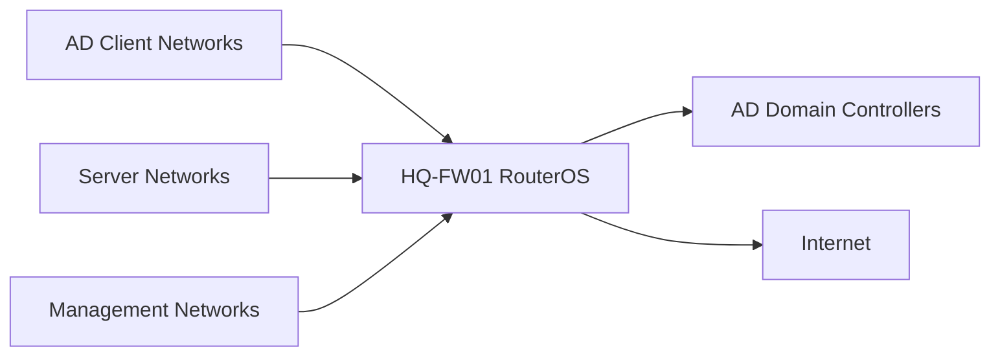

# Firewall Rule Matrix

## Document Control

| Field | Value |
|---|---|
| Document ID | GEIL-PLAT-FW-MATRIX-001 |
| Owner | Infrastructure Engineering |
| Status | Draft |
| Version | 2.0 |
| Last Reviewed | 2026-07-01 |
| Review Cycle | Quarterly |
| Classification | Internal Confidential |

!!! note "Canonical GNTECH values"

    Forest: `corp.gntech.me`; NetBIOS: `GNTECH`; primary UPN suffix: `gntech.me`; Microsoft 365 primary domain: `gntech.me`; hybrid identity plane: Microsoft Entra ID; primary firewall: MikroTik CHR `HQ-FW01`.

!!! note "HQ-FW01 firewall source of truth"

    Authoritative MikroTik firewall rules are maintained in [HQ-FW01 Firewall Policy](../network/mikrotik/hq-fw01-firewall-policy.md).

## Purpose

Provide a platform-level firewall policy matrix for `HQ-FW01` MikroTik CHR / RouterOS while avoiding duplicated rule definitions.

Authoritative current `HQ-FW01` operational firewall rules are maintained in [HQ-FW01 Firewall Policy](../network/mikrotik/hq-fw01-firewall-policy.md). Detailed Active Directory client-to-domain-controller requirements are authoritative in [Active Directory Network Requirements](active-directory-network-requirements.md). This matrix points to those shared standards instead of redefining rule details in multiple guides.

## Architecture Overview



## Pilot finding: DHCP relay is not enough

During pilot deployment, VLAN30 clients received DHCP leases and DNS option `172.20.20.11`, but could not reach `HQ-DC01` because the firewall only allowed the former single management workstation address `172.20.30.10` to communicate with the domain controller. DHCP relay, routing, and internet access were correct; the failure was forward-chain firewall policy.

Production policy must use RouterOS address lists and least-privilege Active Directory service rules from [Active Directory Network Requirements](active-directory-network-requirements.md). Do not keep broad pilot rules as production policy.

## Shared address-list model

| Address list | Purpose | Current members |
|---|---|---|
| `AD-DomainControllers` | Domain controller service targets | `172.20.20.11` (`HQ-DC01`) |
| `AD-ClientNetworks` | Networks allowed to consume domain services | `172.20.30.0/24` |
| `ManagementNetworks` | Approved administration sources | `172.20.10.0/24` |
| `ServerNetworks` | Server VLAN and future member-server networks | `172.20.20.0/24` |

## Rule matrix

| Source | Destination | Policy | Purpose | Authoritative reference | Validation |
|---|---|---|---|---|---|
| `AD-ClientNetworks` | `AD-DomainControllers` | Least-privilege AD service ports | DNS, Kerberos, LDAP, SMB/SYSVOL/NETLOGON, RPC, NTP, GC, optional LDAPS | [HQ-FW01 Firewall Policy](../network/mikrotik/hq-fw01-firewall-policy.md), [Active Directory Network Requirements](active-directory-network-requirements.md) | DNS, domain join, SYSVOL, NETLOGON, `gpupdate`, `gpresult` |
| `ManagementNetworks` | `HQ-FW01` | Approved management ports only | WinBox/SSH/HTTPS management | MikroTik CHR implementation guide | Approved admin source reaches RouterOS |
| VLAN 20 Servers | Internet | TCP 80/443 | Updates and Microsoft cloud endpoints | Enterprise Port Reference | `Test-NetConnection` to update endpoints |
| VLAN 10 Management | Infrastructure management targets | Approved management ports | Remote administration | Network Architecture / Windows 11 Management Workstation | Only `HQ-MGMT01` and future management workstations originate management traffic |
| `ManagementNetworks` | VLAN 30 Workstations | TCP `5985` | WinRM / PowerShell Remoting | [Enterprise WinRM Management](../microsoft-core/administration/enterprise-winrm-management.md) | `Test-NetConnection`, `Test-WSMan`, `Invoke-Command` from `HQ-MGMT01` |
| VLAN 30 Workstations | Internet | TCP 80/443 | User/cloud services | Endpoint guides | Browser and M365 sign-in validates |
| Guest VLAN 70 | Internet only | DNS/HTTP/HTTPS; deny internal RFC1918 | Internet-only guest access | MikroTik CHR implementation guide | Guest cannot reach internal RFC1918 |
| `HQ-DC01` | Microsoft cloud | TCP 443 | Future Entra sync/cloud health | Entra ID Hybrid Identity | Entra Connect health after deployment |
| NPS server | Network devices | UDP 1812/1813 | RADIUS authentication/accounting | NPS RADIUS 802.1X | NPS event log and test auth |

## RouterOS validation examples

Run on: `HQ-FW01`

When: execute at this point in the procedure after the stated prerequisites are true and before continuing to the next step.

Expected outcome: the command completes successfully and the following expected result or validation section confirms the change.

```routeros
/ip firewall address-list print where list~"AD-|ManagementNetworks|ServerNetworks"
/ip firewall filter print stats where comment~"AD "
/ip firewall filter print where comment="Default deny unapproved forwarding"
/ip firewall nat print
/ip route print
```

Expected result: address lists exist before rules reference them, AD service rules appear before the default deny rule, NAT exists for approved internet-bound traffic, and no guest rule permits internal access.

## Stop conditions

STOP if a rule references an address list or interface list before it exists, permits Guest to internal networks, allows Any/Any management access, or leaves a temporary broad VLAN-to-DC pilot rule enabled.

## Rollback

Use Safe Mode before changing RouterOS firewall policy. Export before changes:

Run on: `HQ-FW01`

When: execute at this point in the procedure after the stated prerequisites are true and before continuing to the next step.

Expected outcome: the command completes successfully and the following expected result or validation section confirms the change.

```routeros
/export file=HQ-FW01-before-firewall-change
```

Remove or disable only the newly added rule if validation fails.

## Evidence Collection

Capture firewall address-list output, filter output with counters, NAT output, route output, source/destination validation, and failed-deny evidence for guest isolation.

## Troubleshooting

| Symptom | Cause | Fix |
|---|---|---|
| Windows cannot reach internet | LAN-to-WAN rule or NAT missing | Validate forward allow and NAT. |
| DHCP works but domain join fails | AD client-to-domain-controller service rules missing or below default deny | Apply [Active Directory Network Requirements](active-directory-network-requirements.md) address-list model and validate DNS/SYSVOL/NETLOGON/GPUpdate. |
| Guest reaches internal network | Missing deny or wrong rule order | Move deny before broad allow. |

## Next Guide

Use this with [Enterprise Port Reference](enterprise-port-reference.md), [Active Directory Network Requirements](active-directory-network-requirements.md), and Microsoft Core implementation guides.
