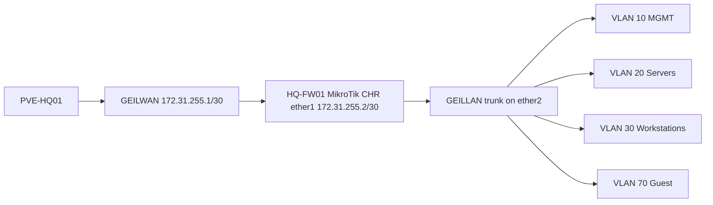

# MikroTik CHR HQ Foundation Implementation Guide

## Document Control

| Field | Value |
|---|---|
| Document ID | GEIL-PLAT-MTK-HQ-IMPL-001 |
| Owner | Infrastructure Engineering |
| Status | Approved |
| Version | 2.2 |
| Last Reviewed | 2026-06-29 |
| Review Cycle | Quarterly |
| Classification | Internal Confidential |

!!! note "Adaptation"

    This guide uses canonical GEIL values from the [Environment Specification](../project/environment-specification.md). `HQ-FW01` is MikroTik CHR / RouterOS. `ether1` connects to `GEILWAN`, `ether2` connects to `GEILLAN`, CHR WAN is `172.31.255.2/30`, and internal VLAN gateways use `172.20.x.1/24`.

## Purpose

Deploy `HQ-FW01` as a MikroTik CHR firewall/router for the Phase 1 HQ foundation. This guide supersedes all active OPNsense deployment instructions.

## Learning Objectives

After completing this guide you will understand:

- Why GEIL uses MikroTik CHR for Phase 1 edge security.
- How RouterOS interfaces, interface lists, VLANs, NAT, firewall rules, DNS, and DHCP relay work together.
- How to import CHR into Proxmox with safe VirtIO NIC mapping.
- How to use RouterOS Safe Mode to reduce lockout risk.
- How to validate RouterOS configuration after every risky stage.
- How to export, back up, troubleshoot, and roll back the firewall.

## What You Will Build

By the end of this guide you will have:

- ✓ `HQ-FW01` running MikroTik CHR.
- ✓ `ether1` mapped to `GEILWAN` with `172.31.255.2/30`.
- ✓ `ether2` mapped to `GEILLAN` as the VLAN trunk parent.
- ✓ RouterOS interface lists created before use.
- ✓ VLAN interfaces and gateway IPs for VLANs 10,20,30,40,50,60,70,80,90,100.
- ✓ NAT masquerade to `GEILWAN`.
- ✓ Baseline firewall policy with management allow and guest isolation.
- ✓ DHCP relay commands prepared but disabled until `HQ-DC01` DHCP scopes exist.
- ✓ RouterOS export, Proxmox snapshots, and validation evidence captured.

## Estimated Time

60-120 minutes, excluding MikroTik CHR image download time.

## Difficulty

Advanced. RouterOS CLI is direct and order-sensitive. Interface lists, VLAN interfaces, and firewall rules must exist before they are referenced.

## Risk Level

High. `HQ-FW01` is the routing and security boundary. Incorrect service restrictions or firewall rules can lock out management access.

## Service Impact

Maintenance window recommended. Phase 1 has no production users yet, but a firewall error can block deployment validation.

## Prerequisites

- [MikroTik CHR HQ Foundation LLD](mikrotik-chr-hq-foundation-lld.md) reviewed.
- [Proxmox HQ Foundation Implementation](proxmox-hq-foundation-implementation.md) completed.
- `GEILWAN` exists on `PVE-HQ01` and is visible in the Proxmox GUI.
- `GEILLAN` exists on `PVE-HQ01`, is VLAN-aware, and is visible in the Proxmox GUI.
- `GEILWAN` Proxmox side is `172.31.255.1/30`.
- No GEIL VM is attached to `PROD`, `TEST`, `eno1`, or `VSW4001`.
- MikroTik CHR image has been downloaded from MikroTik and extracted.
- Proxmox privileged access is available.
- Proxmox console access to `HQ-FW01` is available.
- Approved password manager is ready for the RouterOS admin password.

## Expected Starting State

- `HQ-FW01` does not exist, or exists only as a disposable test VM.
- `GEILWAN` and `GEILLAN` have already been validated on `PVE-HQ01`.
- DHCP relay is not enabled on any firewall.
- No firewall rules depend on VLAN interfaces that do not exist.

## Expected Ending State

- `HQ-FW01` runs MikroTik CHR.
- RouterOS identity is `HQ-FW01`.
- Interface lists exist before any services or firewall rules reference them.
- Management restrictions are applied only after MGMT and management workstation access are validated.
- VLAN gateways, NAT, firewall policy, exports, and snapshots are complete.

## Architecture Overview



!!! warning "Copy/paste firewall lockout risk"

    Do not paste all firewall and service-hardening commands at once. Use RouterOS Safe Mode, validate after each block, and keep the Proxmox console open. Apply management restrictions only after the `MGMT` interface list exists, has members, and management access is confirmed.

!!! enterprise "Enterprise pattern"

    Enterprises treat firewall management as a privileged control plane. Rules are staged, validated from an approved management network, exported, and backed by console access before broad deny rules are applied.

!!! implementation "GEIL deployment note"

    This guide corrects the original CHR draft where `MGMT` was referenced before the interface list existed. Interface lists are now created first, VLAN members are added only after VLAN interfaces exist, and service restrictions are applied after management access is validated.

## Background Knowledge

### What is RouterOS Safe Mode?

Safe Mode automatically reverts changes if the management session disconnects. Use it when changing firewall rules, MAC server restrictions, or management services.

### What is an interface list?

An interface list is a named group of interfaces. RouterOS firewall rules and services can reference the list. The list must exist before it can be referenced.

### What is a VLAN interface?

A VLAN interface is a tagged logical interface on `ether2`. It must exist before an IP address or interface-list membership can reference it.

### What is DHCP relay?

DHCP relay forwards DHCP requests from a client VLAN to a DHCP server on another VLAN. GEIL prepares relay for VLANs 30, 40, and 60 but does not enable relay until Windows DHCP scopes exist on `HQ-DC01`. DHCP relay only delivers address configuration; it does not allow clients to communicate with Active Directory services after they receive an address. Forward-chain firewall rules must also allow the required client-to-domain-controller service ports.


## Detailed Operator Walkthrough

This section expands the deployment into the exact operator actions to perform before using the copy/paste command blocks.

!!! danger "Keep console access open"

    Keep `PVE-HQ01 -> HQ-FW01 -> Console` open during the entire firewall deployment. Do not rely only on WinBox or SSH until service restrictions and firewall rules are validated.

### Download and prepare the CHR image

1. Open the MikroTik download page from an administrative workstation.
2. Select **Cloud Hosted Router**.
3. Download the current stable CHR raw disk image, usually named similar to `chr-<version>.img.zip`.
4. Verify that the downloaded file is from MikroTik and is not a RouterOS package-only file.
5. Copy the ZIP to `PVE-HQ01` using SCP or the Proxmox shell upload method.
6. Extract the image so the final path is:

```text
/var/lib/vz/template/iso/mikrotik/chr.img
```

Example on `PVE-HQ01`:

Run on: `HQ-FW01`

When: execute at this point in the procedure after the stated prerequisites are true and before continuing to the next step.

Expected outcome: the command completes successfully and the following expected result or validation section confirms the change.

```bash
mkdir -p /var/lib/vz/template/iso/mikrotik
cd /var/lib/vz/template/iso/mikrotik
# Copy chr-<version>.img.zip into this directory first.
unzip chr-*.img.zip
mv chr-*.img chr.img
ls -lh chr.img
```

Expected result:

- `chr.img` exists.
- The file size is non-zero.
- The image is stored outside Git.

!!! warning "Do not use an ISO workflow"

    MikroTik CHR is imported as a disk image. Do not attach it as an ISO installer. If the VM boots to a blank disk or PXE prompt, the CHR disk was not imported or selected as the boot disk correctly.

### Proxmox VM settings to verify

Use these settings for `HQ-FW01`:

| Setting | Value | Why |
|---|---|---|
| VM ID | `100` | Canonical Phase 1 firewall VM ID |
| Name | `HQ-FW01` | Canonical firewall name |
| Firmware | SeaBIOS or Proxmox default | CHR boots reliably with standard VM firmware |
| Machine | Proxmox default | Keep simple for Phase 1 |
| CPU | 2 cores | Enough for Phase 1 routing and firewall testing |
| Memory | 2048 MB | Enough for CHR and evidence collection |
| Disk | Imported `chr.img` on `local-lvm` | CHR boot disk |
| NIC 1 | VirtIO on `GEILWAN` | RouterOS `ether1`, WAN/transit |
| NIC 2 | VirtIO on `GEILLAN` | RouterOS `ether2`, internal VLAN trunk |
| Start at boot | Optional during lab build | Enable later after baseline is stable |

!!! warning "NIC order matters"

    In this guide `net0` becomes RouterOS `ether1` and must connect to `GEILWAN`. `net1` becomes RouterOS `ether2` and must connect to `GEILLAN`. If these are reversed, WAN and LAN policy will be wrong.

### First RouterOS login workflow

1. Start `HQ-FW01` from Proxmox.
2. Open `PVE-HQ01 -> HQ-FW01 -> Console`.
3. Log in with the default MikroTik CHR credentials shown by RouterOS.
4. Immediately set the admin password in Step 3.
5. Do not restrict services yet.
6. Do not paste firewall rules yet.
7. Run `/interface/print` and confirm two Ethernet interfaces exist.

Expected first interface state:

```text
ether1  connected to GEILWAN
ether2  connected to GEILLAN trunk
```

If you are unsure which interface is which, stop and verify `qm config 100` before configuring firewall rules.

### Safe Mode workflow

Use Safe Mode only after the initial router identity, interface lists, VLAN interfaces, and management reachability have been validated.

1. Open RouterOS terminal from console, SSH, or WinBox.
2. Press `Ctrl+X`.
3. Confirm the prompt indicates Safe Mode.
4. Run one small command block.
5. Validate access.
6. Press `Ctrl+X` again to commit the safe-mode changes only after validation succeeds.

If the management session disconnects while Safe Mode is active, RouterOS reverts the uncommitted changes.

!!! tip "Recommended paste size"

    Paste no more than one numbered step at a time. For firewall rules, paste the input-chain foundation, validate, then paste the WAN drop, validate, then paste forwarding rules.

### WinBox and GUI cross-checks

RouterOS CLI is authoritative in this guide, but WinBox screenshots are useful evidence.

Capture these WinBox locations after CLI validation:

| WinBox location | Expected result |
|---|---|
| Interfaces | `ether1`, `ether2`, and VLAN interfaces are visible |
| Interface List | `WAN`, `LAN`, `MGMT`, `SERVERS`, `WORKSTATIONS`, `GUEST` exist |
| IP -> Addresses | `172.31.255.2/30` and all `172.20.x.1/24` gateways exist |
| IP -> Routes | Default route via `172.31.255.1` exists |
| IP -> DNS | Forwarders are configured |
| IP -> Firewall -> Filter Rules | Input and forward rules are in documented order |
| IP -> Firewall -> NAT | Masquerade rule uses `WAN` list |
| IP -> DHCP Relay | Relay is absent or disabled until scopes exist |

### Do-not-proceed gates

Stop and fix the current step if any of these occur:

- `GEILWAN` or `GEILLAN` is missing from `qm config 100`.
- `/interface/list/print` does not show all required lists before service restrictions.
- `/interface/vlan/print` does not show all VLAN interfaces before IP assignment.
- `/ip/address/print` does not show `172.31.255.2/30` on `ether1`.
- You cannot reach the management path before service restrictions.
- DHCP relay appears enabled before Windows DHCP scopes exist.
- VLAN 70 appears in DHCP relay configuration.

## Step-by-Step Procedure

### Step 1: Validate Proxmox bridge prerequisites

#### Goal

Confirm Proxmox bridge objects exist before creating `HQ-FW01`.

#### Why this step matters

VM NIC mapping is safe only after the bridge names are known and visible.

#### Commands

Run on `PVE-HQ01`:

Run on: `HQ-FW01`

When: execute at this point in the procedure after the stated prerequisites are true and before continuing to the next step.

Expected outcome: the command completes successfully and the following expected result or validation section confirms the change.

```bash
ip -brief addr show GEILWAN
ip -brief addr show GEILLAN
bridge vlan show dev GEILLAN
```

#### Expected result

You should now see:

- `GEILWAN` with `172.31.255.1/30`.
- `GEILLAN` present.
- `GEILLAN` carrying VLANs 10,20,30,40,50,60,70,80,90,100.

#### Validation

Also verify in the GUI: `PVE-HQ01 -> System -> Network`.

#### Evidence

Capture command output and a Proxmox Network screenshot.

#### Rollback

Do not continue. Return to [Proxmox HQ Foundation Implementation](proxmox-hq-foundation-implementation.md) and fix bridge configuration first.

#### Next step

Import the CHR image.

### Step 2: Import CHR image and create VM

#### Goal — Step 2: Import CHR image and create VM

Create `HQ-FW01` with the CHR disk and correct NIC mapping.

#### Why this step matters — Step 2: Import CHR image and create VM

A wrong NIC mapping reverses WAN/LAN policy and can expose internal networks or break validation.

#### Commands — Step 2: Import CHR image and create VM

Run on `PVE-HQ01` after copying the extracted CHR `.img` file to `/var/lib/vz/template/iso/mikrotik/chr.img`:

Run on: `HQ-FW01`

When: execute at this point in the procedure after the stated prerequisites are true and before continuing to the next step.

Expected outcome: the command completes successfully and the following expected result or validation section confirms the change.

```bash
mkdir -p /var/lib/vz/template/iso/mikrotik
qm create 100 --name HQ-FW01 --memory 2048 --cores 2 --net0 virtio,bridge=GEILWAN --net1 virtio,bridge=GEILLAN
qm importdisk 100 /var/lib/vz/template/iso/mikrotik/chr.img local-lvm
qm set 100 --scsihw virtio-scsi-pci --scsi0 local-lvm:vm-100-disk-0
qm set 100 --boot order=scsi0
qm set 100 --serial0 socket --vga serial0
qm config 100
```

#### Expected result — Step 2: Import CHR image and create VM

You should now see:

- VM 100 named `HQ-FW01`.
- `net0` on `GEILWAN`.
- `net1` on `GEILLAN`.
- CHR disk attached as boot disk.

#### Validation — Step 2: Import CHR image and create VM

Run on: `HQ-FW01`

When: execute at this point in the procedure after the stated prerequisites are true and before continuing to the next step.

Expected outcome: the command completes successfully and the following expected result or validation section confirms the change.

```bash
qm config 100 | egrep 'name|net0|net1|scsi0|boot'
```

#### Evidence — Step 2: Import CHR image and create VM

Capture `qm config 100` output.

#### Rollback — Step 2: Import CHR image and create VM

Run on: `HQ-FW01`

When: execute at this point in the procedure after the stated prerequisites are true and before continuing to the next step.

Expected outcome: the command completes successfully and the following expected result or validation section confirms the change.

```bash
qm stop 100
qm destroy 100 --purge
```

#### Next step — Step 2: Import CHR image and create VM

Boot CHR and perform non-network-locking hardening.

### Step 3: Set identity and admin password only

#### Goal — Step 3: Set identity and admin password only

Secure the default account and set the router identity without referencing interface lists that do not exist yet.

#### Why this step matters — Step 3: Set identity and admin password only

This step is safe because it does not restrict management services or firewall access.

#### Commands — Step 3: Set identity and admin password only

Run from the RouterOS console:

Run on: `HQ-FW01`

When: execute at this point in the procedure after the stated prerequisites are true and before continuing to the next step.

Expected outcome: the command completes successfully and the following expected result or validation section confirms the change.

```routeros
/user set admin password=<PASSWORD>
/system identity set name=HQ-FW01
/system identity print
```

#### Expected result — Step 3: Set identity and admin password only

You should now see identity `HQ-FW01`.

#### Validation — Step 3: Set identity and admin password only

Run on: `HQ-FW01`

When: execute at this point in the procedure after the stated prerequisites are true and before continuing to the next step.

Expected outcome: the command completes successfully and the following expected result or validation section confirms the change.

```routeros
/user print
/system identity print
```

#### Evidence — Step 3: Set identity and admin password only

Capture sanitized `/system identity print` output. Do not capture or commit the password.

#### Rollback — Step 3: Set identity and admin password only

Use the Proxmox console to reset the password if the password was mistyped before management service restrictions are applied.

#### Next step — Step 3: Set identity and admin password only

Create interface lists.

### Step 4: Create interface lists before referencing them

#### Goal — Step 4: Create interface lists before referencing them

Create RouterOS interface lists in the correct order.

#### Why this step matters — Step 4: Create interface lists before referencing them

RouterOS commands that reference a missing interface list fail or partially apply, which can leave the firewall in an inconsistent state.

#### Commands — Step 4: Create interface lists before referencing them

Run on: `HQ-FW01`

When: execute at this point in the procedure after the stated prerequisites are true and before continuing to the next step.

Expected outcome: the command completes successfully and the following expected result or validation section confirms the change.

```routeros
/interface list add name=WAN comment="External/transit interfaces"
/interface list add name=LAN comment="Internal non-guest interfaces"
/interface list add name=MGMT comment="Approved firewall management interfaces"
/interface list add name=SERVERS comment="Server VLAN interfaces"
/interface list add name=WORKSTATIONS comment="Workstation VLAN interfaces"
/interface list add name=GUEST comment="Guest-only VLAN interfaces"
/interface list member add list=WAN interface=ether1
```

#### Expected result — Step 4: Create interface lists before referencing them

You should now see all required interface lists.

#### Validation — Step 4: Create interface lists before referencing them

Run on: `HQ-FW01`

When: execute at this point in the procedure after the stated prerequisites are true and before continuing to the next step.

Expected outcome: the command completes successfully and the following expected result or validation section confirms the change.

```routeros
/interface/list/print
/interface/list/member/print
```

#### Evidence — Step 4: Create interface lists before referencing them

Capture interface list output.

#### Rollback — Step 4: Create interface lists before referencing them

Run on: `HQ-FW01`

When: execute at this point in the procedure after the stated prerequisites are true and before continuing to the next step.

Expected outcome: the command completes successfully and the following expected result or validation section confirms the change.

```routeros
/interface list member remove [find]
/interface list remove [find name=WAN]
/interface list remove [find name=LAN]
/interface list remove [find name=MGMT]
/interface list remove [find name=SERVERS]
/interface list remove [find name=WORKSTATIONS]
/interface list remove [find name=GUEST]
```

#### Next step — Step 4: Create interface lists before referencing them

Configure WAN and default route.

### Step 5: Configure WAN IP, default route, and DNS

#### Goal — Step 5: Configure WAN IP, default route, and DNS

Make CHR reachable on the GEILWAN transit network.

#### Commands — Step 5: Configure WAN IP, default route, and DNS

Run on: `HQ-FW01`

When: execute at this point in the procedure after the stated prerequisites are true and before continuing to the next step.

Expected outcome: the command completes successfully and the following expected result or validation section confirms the change.

```routeros
/ip address add address=172.31.255.2/30 interface=ether1 comment="GEILWAN CHR WAN"
/ip route add dst-address=0.0.0.0/0 gateway=172.31.255.1 comment="Default route via GEILWAN Proxmox peer"
/ip dns set servers=1.1.1.1,1.0.0.1 allow-remote-requests=yes
```

#### Expected result — Step 5: Configure WAN IP, default route, and DNS

You should now see `172.31.255.2/30` on `ether1` and default route via `172.31.255.1`.

#### Validation — Step 5: Configure WAN IP, default route, and DNS

Run on: `HQ-FW01`

When: execute at this point in the procedure after the stated prerequisites are true and before continuing to the next step.

Expected outcome: the command completes successfully and the following expected result or validation section confirms the change.

```routeros
/ip/address/print
/ip/route/print
/ip/dns/print
/ping 172.31.255.1 count=4
```

#### Evidence — Step 5: Configure WAN IP, default route, and DNS

Capture address, route, DNS, and ping output.

#### Rollback — Step 5: Configure WAN IP, default route, and DNS

Run on: `HQ-FW01`

When: execute at this point in the procedure after the stated prerequisites are true and before continuing to the next step.

Expected outcome: the command completes successfully and the following expected result or validation section confirms the change.

```routeros
/ip route remove [find comment="Default route via GEILWAN Proxmox peer"]
/ip address remove [find comment="GEILWAN CHR WAN"]
```

#### Next step — Step 5: Configure WAN IP, default route, and DNS

Create VLAN interfaces.

### Step 6: Create VLAN interfaces on ether2

#### Goal — Step 6: Create VLAN interfaces on ether2

Create the VLAN interface objects before assigning IPs or interface-list membership.

#### Commands — Step 6: Create VLAN interfaces on ether2

Run on: `HQ-FW01`

When: execute at this point in the procedure after the stated prerequisites are true and before continuing to the next step.

Expected outcome: the command completes successfully and the following expected result or validation section confirms the change.

```routeros
/interface vlan add name=vlan10-mgmt interface=ether2 vlan-id=10
/interface vlan add name=vlan20-servers interface=ether2 vlan-id=20
/interface vlan add name=vlan30-workstations interface=ether2 vlan-id=30
/interface vlan add name=vlan40-printers interface=ether2 vlan-id=40
/interface vlan add name=vlan50-voice interface=ether2 vlan-id=50
/interface vlan add name=vlan60-corpwifi interface=ether2 vlan-id=60
/interface vlan add name=vlan70-guestwifi interface=ether2 vlan-id=70
/interface vlan add name=vlan80-dmz interface=ether2 vlan-id=80
/interface vlan add name=vlan90-backup interface=ether2 vlan-id=90
/interface vlan add name=vlan100-hypervisors interface=ether2 vlan-id=100
```

#### Expected result — Step 6: Create VLAN interfaces on ether2

You should now see ten VLAN interfaces on `ether2`.

#### Validation — Step 6: Create VLAN interfaces on ether2

Run on: `HQ-FW01`

When: execute at this point in the procedure after the stated prerequisites are true and before continuing to the next step.

Expected outcome: the command completes successfully and the following expected result or validation section confirms the change.

```routeros
/interface/print
/interface/vlan/print
```

#### Rollback — Step 6: Create VLAN interfaces on ether2

Run on: `HQ-FW01`

When: execute at this point in the procedure after the stated prerequisites are true and before continuing to the next step.

Expected outcome: the command completes successfully and the following expected result or validation section confirms the change.

```routeros
/interface vlan remove [find interface=ether2]
```

#### Next step — Step 6: Create VLAN interfaces on ether2

Assign gateway IP addresses.

### Step 7: Assign VLAN gateway IP addresses

#### Goal — Step 7: Assign VLAN gateway IP addresses

Assign canonical gateway IPs only after VLAN interfaces exist.

#### Commands — Step 7: Assign VLAN gateway IP addresses

Run on: `HQ-FW01`

When: execute at this point in the procedure after the stated prerequisites are true and before continuing to the next step.

Expected outcome: the command completes successfully and the following expected result or validation section confirms the change.

```routeros
/ip address add address=172.20.10.1/24 interface=vlan10-mgmt comment="VLAN10 Management gateway"
/ip address add address=172.20.20.1/24 interface=vlan20-servers comment="VLAN20 Servers gateway"
/ip address add address=172.20.30.1/24 interface=vlan30-workstations comment="VLAN30 Workstations gateway"
/ip address add address=172.20.40.1/24 interface=vlan40-printers comment="VLAN40 Printers gateway"
/ip address add address=172.20.50.1/24 interface=vlan50-voice comment="VLAN50 Voice gateway"
/ip address add address=172.20.60.1/24 interface=vlan60-corpwifi comment="VLAN60 Corporate WiFi gateway"
/ip address add address=172.20.70.1/24 interface=vlan70-guestwifi comment="VLAN70 Guest WiFi gateway"
/ip address add address=172.20.80.1/24 interface=vlan80-dmz comment="VLAN80 DMZ gateway"
/ip address add address=172.20.90.1/24 interface=vlan90-backup comment="VLAN90 Backup gateway"
/ip address add address=172.20.100.1/24 interface=vlan100-hypervisors comment="VLAN100 Hypervisors gateway"
```

#### Validation — Step 7: Assign VLAN gateway IP addresses

Run on: `HQ-FW01`

When: execute at this point in the procedure after the stated prerequisites are true and before continuing to the next step.

Expected outcome: the command completes successfully and the following expected result or validation section confirms the change.

```routeros
/ip/address/print
```

#### Rollback — Step 7: Assign VLAN gateway IP addresses

Run on: `HQ-FW01`

When: execute at this point in the procedure after the stated prerequisites are true and before continuing to the next step.

Expected outcome: the command completes successfully and the following expected result or validation section confirms the change.

```routeros
/ip address remove [find comment~"gateway"]
```

#### Next step — Step 7: Assign VLAN gateway IP addresses

Add VLAN interfaces to interface lists.

### Step 8: Add VLAN interfaces to interface lists

#### Goal — Step 8: Add VLAN interfaces to interface lists

Populate lists only after the VLAN interfaces exist.

#### Commands — Step 8: Add VLAN interfaces to interface lists

Run on: `HQ-FW01`

When: execute at this point in the procedure after the stated prerequisites are true and before continuing to the next step.

Expected outcome: the command completes successfully and the following expected result or validation section confirms the change.

```routeros
/interface list member add list=MGMT interface=vlan10-mgmt
/interface list member add list=SERVERS interface=vlan20-servers
/interface list member add list=WORKSTATIONS interface=vlan30-workstations
/interface list member add list=GUEST interface=vlan70-guestwifi
/interface list member add list=LAN interface=vlan10-mgmt
/interface list member add list=LAN interface=vlan20-servers
/interface list member add list=LAN interface=vlan30-workstations
/interface list member add list=LAN interface=vlan40-printers
/interface list member add list=LAN interface=vlan50-voice
/interface list member add list=LAN interface=vlan60-corpwifi
/interface list member add list=LAN interface=vlan80-dmz
/interface list member add list=LAN interface=vlan90-backup
/interface list member add list=LAN interface=vlan100-hypervisors
```

#### Validation — Step 8: Add VLAN interfaces to interface lists

Run on: `HQ-FW01`

When: execute at this point in the procedure after the stated prerequisites are true and before continuing to the next step.

Expected outcome: the command completes successfully and the following expected result or validation section confirms the change.

```routeros
/interface/list/member/print
```

#### Rollback — Step 8: Add VLAN interfaces to interface lists

Run on: `HQ-FW01`

When: execute at this point in the procedure after the stated prerequisites are true and before continuing to the next step.

Expected outcome: the command completes successfully and the following expected result or validation section confirms the change.

```routeros
/interface list member remove [find list=LAN]
/interface list member remove [find list=MGMT]
/interface list member remove [find list=SERVERS]
/interface list member remove [find list=WORKSTATIONS]
/interface list member remove [find list=GUEST]
```

#### Next step — Step 8: Add VLAN interfaces to interface lists

Validate management reachability before restricting services.

### Step 9: Validate management path before restrictions

#### Goal — Step 9: Validate management path before restrictions

Confirm an approved management source can reach RouterOS before limiting management services to the `MGMT` list.

#### Validation — Step 9: Validate management path before restrictions

From an approved management context, validate WinBox or SSH reachability to `172.20.10.1` when the network path exists. From RouterOS, print current state:

Run on: `HQ-FW01`

When: execute at this point in the procedure after the stated prerequisites are true and before continuing to the next step.

Expected outcome: the command completes successfully and the following expected result or validation section confirms the change.

```routeros
/interface/list/print
/interface/list/member/print
/ip/address/print
/ip/service/print
```

#### Expected result — Step 9: Validate management path before restrictions

- `MGMT` list exists and contains `vlan10-mgmt`.
- `HQ-MGMT01` on Management VLAN 10 or an approved management network has a path to `172.20.10.1` when VLAN 10 connectivity is available.

#### Rollback — Step 9: Validate management path before restrictions

Do not apply service restrictions until this validation succeeds.

#### Next step — Step 9: Validate management path before restrictions

Enter Safe Mode and restrict services.

### Step 10: Enter Safe Mode and restrict RouterOS services

#### Goal — Step 10: Enter Safe Mode and restrict RouterOS services

Disable unnecessary services and restrict management after lists and management path exist.

#### Why this step matters — Step 10: Enter Safe Mode and restrict RouterOS services

This was the critical order issue found during deployment. `MGMT` must exist and contain the intended interface before any command references it.

#### Procedure

In a RouterOS terminal, press `Ctrl+X` to enter Safe Mode before running the block below. Keep the Proxmox console open.

#### Commands — Step 10: Enter Safe Mode and restrict RouterOS services

Run on: `HQ-FW01`

When: execute at this point in the procedure after the stated prerequisites are true and before continuing to the next step.

Expected outcome: the command completes successfully and the following expected result or validation section confirms the change.

```routeros
/ip service disable telnet,ftp,www,api,api-ssl
/ip service set ssh address=172.20.10.0/24
/ip service set winbox address=172.20.10.0/24
/ip neighbor discovery-settings set discover-interface-list=MGMT
/tool mac-server set allowed-interface-list=MGMT
/tool mac-server mac-winbox set allowed-interface-list=MGMT
```

#### Validation — Step 10: Enter Safe Mode and restrict RouterOS services

Run on: `HQ-FW01`

When: execute at this point in the procedure after the stated prerequisites are true and before continuing to the next step.

Expected outcome: the command completes successfully and the following expected result or validation section confirms the change.

```routeros
/ip/service/print
/ip/neighbor/discovery-settings/print
/tool/mac-server/print
/tool/mac-server/mac-winbox/print
```

#### Evidence — Step 10: Enter Safe Mode and restrict RouterOS services

Capture sanitized service and MAC-server output.

#### Rollback — Step 10: Enter Safe Mode and restrict RouterOS services

If management disconnects, Safe Mode should revert the changes. If using console, manually relax the settings:

Run on: `HQ-FW01`

When: execute at this point in the procedure after the stated prerequisites are true and before continuing to the next step.

Expected outcome: the command completes successfully and the following expected result or validation section confirms the change.

```routeros
/ip service enable ssh,winbox
/tool mac-server set allowed-interface-list=all
/tool mac-server mac-winbox set allowed-interface-list=all
```

#### Next step — Step 10: Enter Safe Mode and restrict RouterOS services

Configure NAT and firewall filters.

### Step 11: Configure NAT masquerade

#### Commands — Step 11: Configure NAT masquerade

Run on: `HQ-FW01`

When: execute at this point in the procedure after the stated prerequisites are true and before continuing to the next step.

Expected outcome: the command completes successfully and the following expected result or validation section confirms the change.

```routeros
/ip firewall nat add chain=srcnat out-interface-list=WAN action=masquerade comment="GEIL outbound masquerade to GEILWAN"
```

#### Validation — Step 11: Configure NAT masquerade

Run on: `HQ-FW01`

When: execute at this point in the procedure after the stated prerequisites are true and before continuing to the next step.

Expected outcome: the command completes successfully and the following expected result or validation section confirms the change.

```routeros
/ip/firewall/nat/print
```

#### Rollback — Step 11: Configure NAT masquerade

Run on: `HQ-FW01`

When: execute at this point in the procedure after the stated prerequisites are true and before continuing to the next step.

Expected outcome: the command completes successfully and the following expected result or validation section confirms the change.

```routeros
/ip firewall nat remove [find comment="GEIL outbound masquerade to GEILWAN"]
```

#### Next step — Step 11: Configure NAT masquerade

Apply firewall rules in small blocks.

### Step 12: Apply baseline firewall rules in safe order

#### Goal — Step 12: Apply baseline firewall rules in safe order

Allow required management and established traffic, block guest-to-internal traffic, and deny unapproved forwarding.

#### Commands: input chain foundation

Run on: `HQ-FW01`

When: execute at this point in the procedure after the stated prerequisites are true and before continuing to the next step.

Expected outcome: the command completes successfully and the following expected result or validation section confirms the change.

```routeros
/ip firewall filter add chain=input connection-state=established,related action=accept comment="Accept established/related to router"
/ip firewall filter add chain=input connection-state=invalid action=drop comment="Drop invalid to router"
/ip firewall filter add chain=input src-address=172.20.10.0/24 action=accept comment="Allow management VLAN to router"
/ip firewall filter add chain=input src-address=172.20.10.10 action=accept comment="Allow HQ-MGMT01 to router"
```

Validate before adding drops:

Run on: `HQ-FW01`

When: execute at this point in the procedure after the stated prerequisites are true and before continuing to the next step.

Expected outcome: the command completes successfully and the following expected result or validation section confirms the change.

```routeros
/ip/firewall/filter/print
```

#### Commands: WAN input drop

Run on: `HQ-FW01`

When: execute at this point in the procedure after the stated prerequisites are true and before continuing to the next step.

Expected outcome: the command completes successfully and the following expected result or validation section confirms the change.

```routeros
/ip firewall filter add chain=input in-interface-list=WAN action=drop comment="Drop WAN access to router"
```

#### Commands: forwarding policy

Run on: `HQ-FW01`

When: execute at this point in the procedure after the stated prerequisites are true and before continuing to the next step.

Expected outcome: the command completes successfully and the following expected result or validation section confirms the change.

```routeros
/ip firewall filter add chain=forward connection-state=established,related action=accept comment="Accept established/related forwarding"
/ip firewall filter add chain=forward connection-state=invalid action=drop comment="Drop invalid forwarding"
/ip firewall filter add chain=forward src-address=172.20.70.0/24 dst-address=172.20.0.0/16 action=drop comment="Block guest to internal GEIL"
/ip firewall filter add chain=forward src-address=172.20.70.0/24 out-interface-list=WAN action=accept comment="Allow guest to internet only"
/ip firewall filter add chain=forward in-interface-list=LAN out-interface-list=WAN action=accept comment="Allow GEIL LAN to internet"
/ip firewall filter add chain=forward src-address=172.20.10.10 dst-address=172.20.100.11 protocol=tcp dst-port=8006 action=accept comment="Allow HQ-MGMT01 to Proxmox"
/ip firewall address-list add list=AD-DomainControllers address=172.20.20.11 comment="HQ-DC01 domain controller"
/ip firewall address-list add list=AD-ClientNetworks address=172.20.30.0/24 comment="VLAN30 Workstations domain clients"
/ip firewall address-list add list=ManagementNetworks address=172.20.10.0/24 comment="VLAN10 Management"
/ip firewall address-list add list=ManagementNetworks address=172.20.10.0/24 comment="VLAN10 approved management workstations"
/ip firewall address-list add list=ServerNetworks address=172.20.20.0/24 comment="VLAN20 Servers"
/ip firewall filter add chain=forward action=accept src-address-list=AD-ClientNetworks dst-address-list=AD-DomainControllers protocol=tcp dst-port=53,88,389,445,135,49152-65535,3268,3269 comment="AD TCP clients to DCs"
/ip firewall filter add chain=forward action=accept src-address-list=AD-ClientNetworks dst-address-list=AD-DomainControllers protocol=udp dst-port=53,88,389,123 comment="AD UDP clients to DCs"
/ip firewall filter add chain=forward action=accept disabled=yes src-address-list=AD-ClientNetworks dst-address-list=AD-DomainControllers protocol=tcp dst-port=636 comment="OPTIONAL AD LDAPS clients to DCs if enabled"
/ip firewall filter add chain=forward action=accept src-address-list=ManagementNetworks dst-address=172.20.30.0/24 protocol=tcp dst-port=5985 comment="WinRM management to workstations"
/ip firewall filter add chain=forward action=drop comment="Default deny unapproved forwarding"
```

#### Validation — Step 12: Apply baseline firewall rules in safe order

Run on: `HQ-FW01`

When: execute at this point in the procedure after the stated prerequisites are true and before continuing to the next step.

Expected outcome: the command completes successfully and the following expected result or validation section confirms the change.

```routeros
/ip/firewall/filter/print stats
```

#### Expected output — Step 12: Apply baseline firewall rules in safe order

`/ip/firewall/filter/print stats` must show the forwarding rules in this order before the final drop rule:

```text
chain=forward action=accept connection-state=established,related comment="Accept established/related forwarding"
chain=forward action=drop connection-state=invalid comment="Drop invalid forwarding"
chain=forward action=drop src-address=172.20.70.0/24 dst-address=172.20.0.0/16 comment="Block guest to internal GEIL"
chain=forward action=accept src-address=172.20.70.0/24 out-interface-list=WAN comment="Allow guest to internet only"
chain=forward action=accept in-interface-list=LAN out-interface-list=WAN comment="Allow GEIL LAN to internet"
chain=forward action=accept src-address=172.20.10.10 dst-address=172.20.100.11 protocol=tcp dst-port=8006 comment="Allow HQ-MGMT01 to Proxmox"
chain=forward action=accept src-address-list=AD-ClientNetworks dst-address-list=AD-DomainControllers protocol=tcp dst-port=53,88,389,445,135,49152-65535,3268,3269 comment="AD TCP clients to DCs"
chain=forward action=accept src-address-list=AD-ClientNetworks dst-address-list=AD-DomainControllers protocol=udp dst-port=53,88,389,123 comment="AD UDP clients to DCs"
chain=forward action=accept disabled=yes src-address-list=AD-ClientNetworks dst-address-list=AD-DomainControllers protocol=tcp dst-port=636 comment="OPTIONAL AD LDAPS clients to DCs if enabled"
chain=forward action=accept src-address-list=ManagementNetworks dst-address=172.20.30.0/24 protocol=tcp dst-port=5985 comment="WinRM management to workstations"
chain=forward action=drop comment="Default deny unapproved forwarding"
```

!!! implementation "Field deployment lesson"

    During Phase 1 deployment, Windows internet validation failed because the firewall allowed guest internet and management access but did not yet include a general `LAN -> WAN` forwarding rule. Do not continue to Windows deployment unless the `Allow GEIL LAN to internet` rule exists before the default deny rule.


!!! warning "DHCP relay is not Active Directory connectivity"

    Pilot validation proved that DHCP relay can succeed while domain join still fails. A VLAN 30 client received an address and DNS server option `172.20.20.11`, but DNS queries and domain join failed because the old design treated `172.20.30.10` as the only management/client source allowed to reach `HQ-DC01`; all other workstation addresses hit the default deny rule. Production policy must allow required AD service ports from `172.20.30.0/24` to `172.20.20.11` before the default deny rule.

!!! implementation "WinRM inter-VLAN authorization"

    WinRM source authorization is enforced here and on the Windows Defender Firewall, not with WinRM `IPv4Filter`. MikroTik must allow Management VLAN sources to reach workstation targets on TCP `5985` before the default deny rule. Do not allow guest or untrusted VLANs to reach WinRM.


!!! warning "Block VLAN30 administration before broad pilot allows"

    Pilot firewall validation confirmed that VLAN30 Workstations must reach `HQ-DC01` for AD DS services but must not reach Domain Controller administration ports. Add a drop for VLAN30-to-`HQ-DC01` TCP `3389,5985` before any broad or temporary VLAN30-to-`HQ-DC01` allow rule. If `HQ-W11-001` can reach `HQ-DC01` on TCP `3389` or TCP `5985`, check MikroTik rule order first.

#### Temporary pilot validation rule — do not keep for production

If a pilot client receives DHCP but cannot query DNS or contact AD, this broad rule can prove that the firewall is the blocker. Remove it immediately after validation and replace it with the least-privilege production rules above.

Run on: `HQ-FW01`

When: execute at this point in the procedure after the stated prerequisites are true and before continuing to the next step.

Expected outcome: the command completes successfully and the following expected result or validation section confirms the change.

```routeros
/ip firewall filter add chain=forward action=drop src-address=172.20.30.0/24 dst-address=172.20.20.11 protocol=tcp dst-port=3389,5985 place-before=[find comment="Default deny unapproved forwarding"] comment="DROP VLAN30 to HQ-DC01 admin ports"
/ip firewall filter add chain=forward action=accept src-address=172.20.30.0/24 dst-address=172.20.20.11 place-before=[find comment="Default deny unapproved forwarding"] comment="TEMP PILOT ONLY allow VLAN30 to HQ-DC01"
/ip firewall filter remove [find comment="TEMP PILOT ONLY allow VLAN30 to HQ-DC01"]
```

#### Production Active Directory service policy

The production rules use RouterOS address lists so future domain controllers or client VLANs can be added without creating a new rule set for every VLAN. The authoritative service list, port rationale, and validation commands live in [Active Directory Network Requirements](active-directory-network-requirements.md).

| Address list | Current members |
|---|---|
| `AD-DomainControllers` | `172.20.20.11` (`HQ-DC01`) |
| `AD-ClientNetworks` | `172.20.30.0/24` (VLAN30 Workstations) |
| `ManagementNetworks` | `172.20.10.0/24`, `172.20.30.10` |
| `ServerNetworks` | `172.20.20.0/24` |

Do not duplicate AD service-port rationale in this guide. Use [Active Directory Network Requirements](active-directory-network-requirements.md) as the single source of truth.

#### If validation fails — Step 12: Apply baseline firewall rules in safe order

STOP. Do not continue to DHCP, Windows Server, or Active Directory deployment.

Check:

- `LAN` interface list exists.
- Non-guest VLANs are members of `LAN`.
- `WAN` interface list contains `ether1`.
- `Allow GEIL LAN to internet` appears before `Default deny unapproved forwarding`.
- NAT masquerade exists.
- `AD-DomainControllers` and `AD-ClientNetworks` address lists exist, and AD service rules using those lists appear before `Default deny unapproved forwarding`.

Continue only if successful.

#### Rollback — Step 12: Apply baseline firewall rules in safe order

Remove the most recent bad rule by comment, for example:

Run on: `HQ-FW01`

When: execute at this point in the procedure after the stated prerequisites are true and before continuing to the next step.

Expected outcome: the command completes successfully and the following expected result or validation section confirms the change.

```routeros
/ip firewall filter remove [find comment="Default deny unapproved forwarding"]
```

#### Next step — Step 12: Apply baseline firewall rules in safe order

Prepare DHCP relay without enabling it. Remember: relay validation proves address assignment only; DNS and domain join require the address-list based Active Directory service rules from [Active Directory Network Requirements](active-directory-network-requirements.md).

### Step 13: Prepare and enable DHCP relay only after Windows scopes exist

#### Goal — Step 13: Prepare and enable DHCP relay only after Windows scopes exist

Configure DHCP relay safely for approved VLANs after the matching Windows DHCP scopes exist on `HQ-DC01`.

#### Why this step matters — Step 13: Prepare and enable DHCP relay only after Windows scopes exist

DHCP relay is handled by the router itself. In the GEIL pilot deployment, DHCP relay did not work until DHCP traffic to the relay process was allowed in `chain=input` before the default input deny rule. Forward-chain rules alone did not allow the router-local relay process to receive client requests.

#### Commands — Step 13: Prepare and enable DHCP relay only after Windows scopes exist

Do not enable relay until `HQ-DC01` is authorized and the matching scope exists. For Phase 1, only VLAN 30 is enabled. VLAN 40 and VLAN 60 must remain disabled until their scopes are created.

Run on: `HQ-FW01`

When: execute at this point in the procedure after the stated prerequisites are true and before continuing to the next step.

Expected outcome: the command completes successfully and the following expected result or validation section confirms the change.

```routeros
/ip dhcp-relay disable [find name="relay-vlan40"]
/ip dhcp-relay disable [find name="relay-vlan60"]
/ip dhcp-relay remove [find name="relay-vlan30"]
/ip dhcp-relay add name=relay-vlan30 interface=vlan30-workstations dhcp-server=172.20.20.11 local-address=172.20.30.1 disabled=no
```

Add the required input-chain firewall rules before the default input deny rule:

Run on: `HQ-FW01`

When: execute at this point in the procedure after the stated prerequisites are true and before continuing to the next step.

Expected outcome: the command completes successfully and the following expected result or validation section confirms the change.

```routeros
/ip firewall filter remove [find comment~"ALLOW DHCP client requests VLAN30"]
/ip firewall filter remove [find comment~"ALLOW DHCP server replies to CHR relay"]
/ip firewall filter add chain=input action=accept protocol=udp in-interface=vlan30-workstations src-address=0.0.0.0/32 dst-address=255.255.255.255 dst-port=67 place-before=[find comment="Default deny unapproved traffic to router"] comment="ALLOW DHCP client requests VLAN30 to CHR relay"
/ip firewall filter add chain=input action=accept protocol=udp src-address=172.20.20.11 dst-address=172.20.30.1 src-port=67 dst-port=67 place-before=[find comment="Default deny unapproved traffic to router"] comment="ALLOW DHCP server replies to CHR relay"
```

Never create relay for VLAN 70 Guest WiFi.

#### Validation — Step 13: Prepare and enable DHCP relay only after Windows scopes exist

Run on: `HQ-FW01`

When: execute at this point in the procedure after the stated prerequisites are true and before continuing to the next step.

Expected outcome: the command completes successfully and the following expected result or validation section confirms the change.

```routeros
/ip/dhcp-relay/print
/ip/firewall/filter/print where comment~"DHCP"
```

Expected result:

- `relay-vlan30` is enabled.
- `local-address` is `172.20.30.1`.
- `relay-vlan40` and `relay-vlan60` are disabled until their scopes exist.
- DHCP input rules appear before `Default deny unapproved traffic to router`.

From a VLAN 30 client:

Run on: `HQ-FW01`

When: execute at this point in the procedure after the stated prerequisites are true and before continuing to the next step.

Expected outcome: the command completes successfully and the following expected result or validation section confirms the change.

```bash
dhclient -r eth0
dhclient -v eth0
ip -4 a
ip route
cat /etc/resolv.conf
```

From `HQ-DC01`:

Run on: `HQ-FW01`

When: execute at this point in the procedure after the stated prerequisites are true and before continuing to the next step.

Expected outcome: the command completes successfully and the following expected result or validation section confirms the change.

```powershell
Get-DhcpServerv4Lease -ScopeId 172.20.30.0 -AllLeases
```

#### Rollback — Step 13: Prepare and enable DHCP relay only after Windows scopes exist

Run on: `HQ-FW01`

When: execute at this point in the procedure after the stated prerequisites are true and before continuing to the next step.

Expected outcome: the command completes successfully and the following expected result or validation section confirms the change.

```routeros
/ip dhcp-relay disable [find name="relay-vlan30"]
/ip dhcp-relay remove [find name="relay-vlan30"]
/ip firewall filter remove [find comment~"ALLOW DHCP client requests VLAN30"]
/ip firewall filter remove [find comment~"ALLOW DHCP server replies to CHR relay"]
```

#### Next step — Step 13: Prepare and enable DHCP relay only after Windows scopes exist

Export and snapshot.


### Step 14: Export configuration and capture snapshots

#### Commands — Step 14: Export configuration and capture snapshots

RouterOS export:

Run on: `HQ-FW01`

When: execute at this point in the procedure after the stated prerequisites are true and before continuing to the next step.

Expected outcome: the command completes successfully and the following expected result or validation section confirms the change.

```routeros
/export hide-sensitive file=HQ-FW01-baseline
/file/print where name~"HQ-FW01-baseline"
```

Proxmox snapshots:

Run on: `HQ-FW01`

When: execute at this point in the procedure after the stated prerequisites are true and before continuing to the next step.

Expected outcome: the command completes successfully and the following expected result or validation section confirms the change.

```bash
qm snapshot 100 CP-FW-CHR-IMPORTED --description "HQ-FW01 CHR imported and booted"
qm snapshot 100 CP-FW-WAN-LAN --description "HQ-FW01 WAN and LAN trunk validated"
qm snapshot 100 CP-FW-VLANS --description "HQ-FW01 VLAN gateways configured"
qm snapshot 100 CP-FW-BASELINE-RULES --description "HQ-FW01 RouterOS baseline firewall rules"
qm listsnapshot 100
```

## Validation after each major stage

Run this final validation bundle from RouterOS:

Run on: `HQ-FW01`

When: execute at this point in the procedure after the stated prerequisites are true and before continuing to the next step.

Expected outcome: the command completes successfully and the following expected result or validation section confirms the change.

```routeros
/system/identity/print
/interface/print
/interface/list/print
/interface/list/member/print
/interface/vlan/print
/ip/address/print
/ip/route/print
/ip/dns/print
/ip/firewall/filter/print
/ip/firewall/nat/print
/ip/neighbor/discovery-settings/print
/tool/mac-server/print
/tool/mac-server/mac-winbox/print
/ip/dhcp-relay/print
```

Expected results:

- Interface lists exist before services reference them.
- VLAN interfaces exist before IP addresses reference them.
- `ether1` has `172.31.255.2/30`.
- Default route uses `172.31.255.1`.
- Guest WiFi has an explicit deny to `172.20.0.0/16`.
- NAT masquerade uses the `WAN` interface list.
- DHCP relay is absent or disabled until DHCP scopes exist.

## Evidence to capture

- `qm config 100` output.
- `/interface/print` output.
- `/interface/list/print` and `/interface/list/member/print` output.
- `/ip/address/print` output.
- `/ip/route/print` output.
- `/ip/dns/print` output.
- `/ip/firewall/filter/print stats` output.
- `/ip/firewall/nat/print` output.
- `/ip/neighbor/discovery-settings/print` output.
- `/tool/mac-server/print` and `/tool/mac-server/mac-winbox/print` output.
- `/export hide-sensitive` file stored outside Git.
- Proxmox snapshot inventory.

!!! example "Screenshot Required"

    Capture RouterOS/WinBox interface list, VLAN list, firewall filter rules, NAT rule, route table, and file/export screens after validation. Store sanitized screenshots under `docs/assets/images/mikrotik-chr-hq-foundation-implementation/` if they do not contain secrets.

## Common Mistakes

| Mistake | Symptom | Fix |
|---|---|---|
| Referencing `MGMT` before creating it | RouterOS command fails or applies inconsistently | Create interface lists in Step 4 first |
| Restricting services before management path works | WinBox/SSH lockout | Use Safe Mode and Proxmox console rollback |
| Assigning IPs before VLAN interfaces exist | `/ip address add` fails | Create VLAN interfaces first |
| Enabling DHCP relay before scopes exist | Clients receive no lease or bad state | Keep relay disabled until scopes exist |
| Guest allow rule above guest deny | Guest reaches internal networks | Place guest-to-internal deny above internet allow |

## Troubleshooting

| Symptom | Likely Cause | Fix |
|---|---|---|
| Cannot reach `172.31.255.1` | `ether1` not on `GEILWAN` or wrong IP | Check `qm config 100` and `/ip/address/print` |
| VLAN gateway unreachable | `ether2` not on `GEILLAN` or VLAN trunk issue | Check Proxmox bridge and `/interface/vlan/print` |
| Management lockout | Input or MAC-server restriction applied too early | Use Proxmox console; Safe Mode should revert if session dropped |
| Guest reaches internal | Guest deny missing or below allow | Move guest deny above internet allow |
| DNS queries fail from router | DNS servers or default route wrong | Check `/ip/dns/print`, `/ip/route/print`, and ping upstream |

## Rollback

Use the least destructive rollback that restores access:

1. Safe Mode auto-revert for management-session disconnects.
2. Remove the last bad rule by comment.
3. Restore a Proxmox snapshot.
4. Rebuild VM 100 before production use if configuration becomes untrusted.

Snapshot rollback example:

Run on: `HQ-FW01`

When: execute at this point in the procedure after the stated prerequisites are true and before continuing to the next step.

Expected outcome: the command completes successfully and the following expected result or validation section confirms the change.

```bash
qm shutdown 100
qm rollback 100 CP-FW-VLANS
qm start 100
```

Full rebuild before production use:

Run on: `HQ-FW01`

When: execute at this point in the procedure after the stated prerequisites are true and before continuing to the next step.

Expected outcome: the command completes successfully and the following expected result or validation section confirms the change.

```bash
qm stop 100
qm destroy 100 --purge
```

## Deployment Validation

Complete this validation before moving to Windows Server deployment.

### RouterOS gateway validation

#### Goal — RouterOS gateway validation

Prove that the firewall can reach its Proxmox transit peer, the internet, and DNS names.

#### Commands — RouterOS gateway validation

Run on: `HQ-FW01`

When: execute at this point in the procedure after the stated prerequisites are true and before continuing to the next step.

Expected outcome: the command completes successfully and the following expected result or validation section confirms the change.

```routeros
/ping 172.31.255.1 count=4
```

Run on: `HQ-FW01`

When: execute at this point in the procedure after the stated prerequisites are true and before continuing to the next step.

Expected outcome: the command completes successfully and the following expected result or validation section confirms the change.

```routeros
/ping 1.1.1.1 count=4
```

Run on: `HQ-FW01`

When: execute at this point in the procedure after the stated prerequisites are true and before continuing to the next step.

Expected outcome: the command completes successfully and the following expected result or validation section confirms the change.

```routeros
/ping cloudflare.com count=4
```

#### Expected result — RouterOS gateway validation

```text
sent=4 received=4 packet-loss=0%
```

DNS validation is successful only when `cloudflare.com` resolves and replies.

#### If validation fails — RouterOS gateway validation

STOP. Do not continue to Windows deployment.

- If `172.31.255.1` fails, fix `GEILWAN`, `ether1`, or the default route.
- If `1.1.1.1` fails, fix NAT or upstream routing.
- If `cloudflare.com` fails but `1.1.1.1` succeeds, fix RouterOS DNS settings.

Continue only if successful.

### LAN-to-WAN validation

#### Goal — LAN-to-WAN validation

Prove that internal GEIL networks can use the firewall for internet access before Windows setup begins.

#### Commands — LAN-to-WAN validation

Run on: `HQ-FW01`

When: execute at this point in the procedure after the stated prerequisites are true and before continuing to the next step.

Expected outcome: the command completes successfully and the following expected result or validation section confirms the change.

```routeros
/ip/firewall/filter/print where comment="Allow GEIL LAN to internet"
```

Run on: `HQ-FW01`

When: execute at this point in the procedure after the stated prerequisites are true and before continuing to the next step.

Expected outcome: the command completes successfully and the following expected result or validation section confirms the change.

```routeros
/ip/firewall/nat/print where comment="GEIL outbound masquerade to GEILWAN"
```

#### Expected result — LAN-to-WAN validation

```text
chain=forward action=accept in-interface-list=LAN out-interface-list=WAN comment="Allow GEIL LAN to internet"
chain=srcnat action=masquerade out-interface-list=WAN comment="GEIL outbound masquerade to GEILWAN"
```

#### If validation fails — LAN-to-WAN validation

STOP. Do not continue to Windows Server baseline. This was a real Phase 1 deployment defect: Windows internet access fails when the LAN-to-WAN rule is missing or placed after the default deny rule.

Continue only if successful.

### DHCP relay validation

#### Goal — DHCP relay validation

Prove that DHCP relay is not active before Windows DHCP scopes exist.

#### Commands — DHCP relay validation

Run on: `HQ-FW01`

When: execute at this point in the procedure after the stated prerequisites are true and before continuing to the next step.

Expected outcome: the command completes successfully and the following expected result or validation section confirms the change.

```routeros
/ip/dhcp-relay/print
```

#### Expected result — DHCP relay validation

Before `HQ-DC01` DHCP scopes exist, every relay entry must be disabled, or the list must be empty:

```text
# no enabled relay entries
```

#### If validation fails — DHCP relay validation

STOP. Disable relay before continuing.

Run on: `HQ-FW01`

When: execute at this point in the procedure after the stated prerequisites are true and before continuing to the next step.

Expected outcome: the command completes successfully and the following expected result or validation section confirms the change.

```routeros
/ip dhcp-relay disable [find]
```

Continue only if successful.

## Knowledge Check

1. Why must interface lists be created before `/ip service`, `/tool mac-server`, or firewall rules reference them?
2. Why should service restrictions wait until management access is validated?
3. Why is DHCP relay added disabled first and never configured for VLAN 70?
4. Which validation command proves VLAN interfaces exist before gateway IPs are assigned?
5. What does RouterOS Safe Mode protect against during firewall changes?


## DQI Operator Workflow Upgrade

!!! success "Documentation Quality Initiative improvement"

    This guide was upgraded under the GEIL Documentation Quality Initiative and reviewed against the [Deployment Style Guide](../governance/deployment-style-guide.md). The current quality score is **96/100**.

### Operator workflow for this guide

Use this guide as a sequence of small execution units:

1. Read the goal and why it matters.
2. Confirm the prerequisites and starting state.
3. Execute only the current command block or GUI action.
4. Validate immediately.
5. Capture evidence.
6. Continue only when the expected ending state is true.

### First-time operator focus

This guide now emphasizes RouterOS object order, Safe Mode, management validation, VLAN gateway configuration, NAT, firewall policy, DHCP relay disabled-first handling. The operator should not need to infer execution order from surrounding context.

### Step contract reminder

Before every risky action, confirm:

| Field | Operator question |
|---|---|
| Goal | What one thing am I changing now? |
| Why this matters | Why does the enterprise need this? |
| Estimated time | How long should this section take? |
| Risk level | What can break? |
| Prerequisites | Which object must already exist? |
| Starting state | What must be true before I run the command? |
| Expected ending state | What proves I am done? |

### Local troubleshooting pattern

If a step fails:

1. Stop at the failed step.
2. Do not continue to dependent steps.
3. Run the validation command again.
4. Compare the result with the expected output.
5. Use the rollback for the current step before trying a different approach.
6. Record the failure and correction as implementation evidence.

### Screenshot placement rule

When a GUI action appears in this guide, capture the screenshot at that point in the workflow, not at the end of deployment. The screenshot should show the field/value or status that proves the step succeeded.

## Next Guide

Continue to:

- [Phase 1 Validation Plan](phase-1-validation-plan.md)


## Audit Correction Notes

!!! success "Execution-order audit"

    This guide was audited for command order, object dependencies, canonical GEIL values, rollback coverage, validation gates, and active MikroTik CHR firewall references. Follow dependency order exactly: validate prerequisites, create objects, validate objects, apply dependent settings, then capture evidence.

- Audit focus: Deploy RouterOS in dependency order: lists, interfaces, addresses, management validation, service restriction, NAT, firewall, relay preparation.
- Active Phase 1 firewall implementation: MikroTik CHR / RouterOS on `HQ-FW01`.
- OPNsense is superseded and must not be used for active Phase 1 deployment.

## Expected Results

- Commands complete without referencing missing objects.
- Canonical GEIL values are visible in outputs.
- No active OPNsense deployment path remains for Phase 1 firewall work.
- `10.10.x.x` remains limited to existing non-GEIL `PROD`/`TEST` references only.
