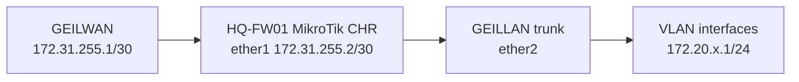

# MikroTik CHR HQ Foundation Implementation Guide

## Document Control

| Field | Value |
|---|---|
| Document ID | GEIL-PLAT-MTK-HQ-IMPL-001 |
| Owner | Infrastructure Engineering |
| Status | Approved |
| Version | 1.0 |
| Last Reviewed | 2026-06-29 |
| Review Cycle | Quarterly |
| Classification | Internal Confidential |

!!! note "Adaptation"

    This guide uses canonical GEIL values from the [Environment Specification](../project/environment-specification.md). `HQ-FW01` is MikroTik CHR / RouterOS, `ether1` is `GEILWAN`, `ether2` is `GEILLAN`, WAN is `172.31.255.2/30`, and internal VLAN gateways use `172.20.x.1/24`.

## Purpose

Deploy `HQ-FW01` as a MikroTik CHR firewall/router for the Phase 1 HQ foundation. This guide replaces the previous MikroTik CHR implementation guide.

## Learning Objectives

After completing this guide you will understand:

- Why GEIL uses MikroTik CHR for Phase 1 edge security.
- How RouterOS interfaces, VLANs, interface lists, firewall filters, NAT, DNS, and DHCP relay work together.
- How to import a CHR image into Proxmox and map VirtIO NICs.
- How to validate RouterOS configuration with CLI commands.
- How to export configuration and roll back safely.

## What You Will Build

By the end of this guide you will have:

- ✓ `HQ-FW01` running MikroTik CHR.
- ✓ `ether1` connected to `GEILWAN` with `172.31.255.2/30`.
- ✓ `ether2` connected to `GEILLAN` as the VLAN trunk parent.
- ✓ VLAN interfaces and gateways for GEIL VLANs 10-100.
- ✓ RouterOS interface lists for WAN, LAN, MGMT, SERVERS, WORKSTATIONS, and GUEST.
- ✓ Baseline NAT and firewall policy.
- ✓ DHCP relay prepared but disabled until `HQ-DC01` DHCP exists.
- ✓ Export, snapshot, validation, and evidence captured.

## Estimated Time

60-120 minutes, excluding MikroTik CHR image download time.

## Difficulty

Advanced. RouterOS CLI is powerful and direct; incorrect firewall order can lock out management or overexpose internal networks.

## Risk Level

High. `HQ-FW01` is the enterprise routing and security boundary. Take snapshots before firewall policy changes.

## Service Impact

Maintenance window recommended. Phase 1 has no production users yet, but firewall mistakes can interrupt deployment and validation.

## Prerequisites

- [MikroTik CHR HQ Foundation LLD](mikrotik-chr-hq-foundation-lld.md) reviewed.
- [Proxmox HQ Foundation Implementation](proxmox-hq-foundation-implementation.md) completed.
- `GEILWAN` exists on `PVE-HQ01` as `172.31.255.1/30`.
- `GEILLAN` exists on `PVE-HQ01` as a VLAN-aware trunk.
- CHR image downloaded from MikroTik.
- Proxmox privileged access.
- Console access to `HQ-FW01`.
- Approved password manager ready for RouterOS admin credentials.

## Architecture Overview



!!! enterprise "Enterprise pattern"

    Medium and large enterprises separate firewall routing, security policy, NAT, management access, and guest isolation into explicit control planes. RouterOS implements these with interfaces, interface lists, firewall chains, NAT rules, and exports.

!!! implementation "GEIL deployment note"

    The active Phase 1 firewall implementation changed from MikroTik CHR to MikroTik CHR because the implementation owner has RouterOS operational experience. This reduces build friction while preserving the Enterprise Edge Security capability.

## Background Knowledge

### What is MikroTik CHR?

Cloud Hosted Router is MikroTik RouterOS packaged as a virtual router. It runs as a VM on Proxmox and provides routing, firewall, NAT, DNS forwarding, and DHCP relay features.

### What is an interface list?

An interface list groups interfaces for firewall and NAT rules. GEIL uses lists such as `WAN`, `LAN`, `MGMT`, `SERVERS`, `WORKSTATIONS`, and `GUEST` so rules express intent instead of only interface names.

### What is masquerade NAT?

Masquerade rewrites internal source addresses when traffic leaves through the WAN/transit interface. GEIL uses it for outbound bootstrap connectivity.

### What is DHCP relay?

DHCP relay forwards DHCP broadcasts from client VLANs to a DHCP server on another subnet. GEIL prepares relay to `HQ-DC01` but does not enable it until scopes exist.

## Step-by-Step Procedure

### Step 1: Download and import CHR image

#### Goal

Import MikroTik CHR into Proxmox as the boot disk for `HQ-FW01`.

#### Why this step matters

CHR is delivered as a disk image, not a traditional ISO installer. Importing it correctly creates a predictable RouterOS VM.

#### Commands

On `PVE-HQ01`, after downloading and extracting the CHR image:

```bash
mkdir -p /var/lib/vz/template/iso/mikrotik
# Copy the extracted CHR .img file into the path above before continuing.
qm create 100 --name HQ-FW01 --memory 2048 --cores 2 --net0 virtio,bridge=GEILWAN --net1 virtio,bridge=GEILLAN
qm importdisk 100 /var/lib/vz/template/iso/mikrotik/chr.img local-lvm
qm set 100 --scsihw virtio-scsi-pci --scsi0 local-lvm:vm-100-disk-0
qm set 100 --boot order=scsi0
qm set 100 --serial0 socket --vga serial0
qm config 100
```

#### Expected result

You should now see `HQ-FW01` with two VirtIO NICs and an imported CHR disk.

#### Validation

```bash
qm config 100 | egrep 'name|net0|net1|scsi0|boot'
```

#### Evidence

Capture `qm config 100` output.

#### Rollback

```bash
qm stop 100
qm destroy 100 --purge
```

#### Next step

Boot CHR and set credentials.

### Step 2: Initial RouterOS hardening

#### Goal

Secure the default RouterOS instance before enabling enterprise routing.

#### Why this step matters

Default services and default credentials are unsafe for an enterprise firewall.

#### Commands

Run from the RouterOS console:

```routeros
/user set admin password=<PASSWORD>
/system identity set name=HQ-FW01
/ip service disable telnet,ftp,www,api,api-ssl
/ip service set ssh address=172.20.10.0/24,172.20.30.10/32
/ip service set winbox address=172.20.10.0/24,172.20.30.10/32
/ip neighbor discovery-settings set discover-interface-list=MGMT
/tool mac-server set allowed-interface-list=MGMT
/tool mac-server mac-winbox set allowed-interface-list=MGMT
```

`<PASSWORD>` must be generated and stored in the approved password manager. Do not commit it to Git.

#### Expected result

You should now see RouterOS identity `HQ-FW01`; unnecessary services are disabled.

#### Validation

```routeros
/system identity print
/ip service print
```

#### Evidence

Capture sanitized `/ip service print` output.

#### Rollback

Use Proxmox console to restore service access or roll back to `CP-FW-CHR-IMPORTED`.

#### Next step

Name interfaces and create interface lists.

### Step 3: Name interfaces and create interface lists

#### Commands

```routeros
/interface ethernet set [find default-name=ether1] name=ether1 comment=GEILWAN
/interface ethernet set [find default-name=ether2] name=ether2 comment="GEILLAN trunk"
/interface list add name=WAN
/interface list add name=LAN
/interface list add name=MGMT
/interface list add name=SERVERS
/interface list add name=WORKSTATIONS
/interface list add name=GUEST
/interface list member add list=WAN interface=ether1
/interface list member add list=LAN interface=ether2
```

#### Validation

```routeros
/interface print
/interface list print
/interface list member print
```

### Step 4: Configure WAN IP, default route, and DNS

```routeros
/ip address add address=172.31.255.2/30 interface=ether1 comment="GEILWAN CHR WAN"
/ip route add dst-address=0.0.0.0/0 gateway=172.31.255.1 comment="Default route via GEILWAN Proxmox peer"
/ip dns set servers=1.1.1.1,1.0.0.1 allow-remote-requests=yes
```

Validation:

```routeros
/ip address print where interface=ether1
/ip route print where dst-address=0.0.0.0/0
/ping 172.31.255.1 count=4
```

### Step 5: Create VLAN interfaces and assign gateways

```routeros
/interface vlan add name=vlan10-mgmt interface=ether2 vlan-id=10
/interface vlan add name=vlan20-servers interface=ether2 vlan-id=20
/interface vlan add name=vlan30-workstations interface=ether2 vlan-id=30
/interface vlan add name=vlan40-printers interface=ether2 vlan-id=40
/interface vlan add name=vlan50-voice interface=ether2 vlan-id=50
/interface vlan add name=vlan60-corpwifi interface=ether2 vlan-id=60
/interface vlan add name=vlan70-guestwifi interface=ether2 vlan-id=70
/interface vlan add name=vlan80-dmz interface=ether2 vlan-id=80
/interface vlan add name=vlan90-backup interface=ether2 vlan-id=90
/interface vlan add name=vlan100-hypervisors interface=ether2 vlan-id=100
/ip address add address=172.20.10.1/24 interface=vlan10-mgmt comment="VLAN10 Management gateway"
/ip address add address=172.20.20.1/24 interface=vlan20-servers comment="VLAN20 Servers gateway"
/ip address add address=172.20.30.1/24 interface=vlan30-workstations comment="VLAN30 Workstations gateway"
/ip address add address=172.20.40.1/24 interface=vlan40-printers comment="VLAN40 Printers gateway"
/ip address add address=172.20.50.1/24 interface=vlan50-voice comment="VLAN50 Voice gateway"
/ip address add address=172.20.60.1/24 interface=vlan60-corpwifi comment="VLAN60 Corporate WiFi gateway"
/ip address add address=172.20.70.1/24 interface=vlan70-guestwifi comment="VLAN70 Guest WiFi gateway"
/ip address add address=172.20.80.1/24 interface=vlan80-dmz comment="VLAN80 DMZ gateway"
/ip address add address=172.20.90.1/24 interface=vlan90-backup comment="VLAN90 Backup gateway"
/ip address add address=172.20.100.1/24 interface=vlan100-hypervisors comment="VLAN100 Hypervisors gateway"
/interface list member add list=MGMT interface=vlan10-mgmt
/interface list member add list=SERVERS interface=vlan20-servers
/interface list member add list=WORKSTATIONS interface=vlan30-workstations
/interface list member add list=GUEST interface=vlan70-guestwifi
/interface list member add list=LAN interface=vlan10-mgmt
/interface list member add list=LAN interface=vlan20-servers
/interface list member add list=LAN interface=vlan30-workstations
/interface list member add list=LAN interface=vlan40-printers
/interface list member add list=LAN interface=vlan50-voice
/interface list member add list=LAN interface=vlan60-corpwifi
/interface list member add list=LAN interface=vlan80-dmz
/interface list member add list=LAN interface=vlan90-backup
/interface list member add list=LAN interface=vlan100-hypervisors
```

Validation:

```routeros
/interface vlan print
/ip address print where address~"172.20"
```

### Step 6: Configure NAT masquerade

```routeros
/ip firewall nat add chain=srcnat out-interface-list=WAN action=masquerade comment="GEIL outbound masquerade to GEILWAN"
/ip firewall nat print
```

### Step 7: Configure baseline firewall rules

```routeros
/ip firewall filter add chain=input connection-state=established,related action=accept comment="Accept established/related to router"
/ip firewall filter add chain=input connection-state=invalid action=drop comment="Drop invalid to router"
/ip firewall filter add chain=input src-address=172.20.10.0/24 action=accept comment="Allow management VLAN to router"
/ip firewall filter add chain=input src-address=172.20.30.10 action=accept comment="Allow HQ-MGMT01 to router"
/ip firewall filter add chain=input in-interface-list=WAN action=drop comment="Drop WAN access to router"
/ip firewall filter add chain=forward connection-state=established,related action=accept comment="Accept established/related forwarding"
/ip firewall filter add chain=forward connection-state=invalid action=drop comment="Drop invalid forwarding"
/ip firewall filter add chain=forward src-address=172.20.70.0/24 dst-address=172.20.0.0/16 action=drop comment="Block guest to internal GEIL"
/ip firewall filter add chain=forward src-address=172.20.70.0/24 out-interface-list=WAN action=accept comment="Allow guest to internet only"
/ip firewall filter add chain=forward src-address=172.20.30.10 dst-address=172.20.100.11 protocol=tcp dst-port=8006 action=accept comment="Allow HQ-MGMT01 to Proxmox"
/ip firewall filter add chain=forward src-address=172.20.30.10 dst-address=172.20.20.11 action=accept comment="Allow HQ-MGMT01 to HQ-DC01 management prep"
/ip firewall filter add chain=forward action=drop comment="Default deny unapproved forwarding"
```

Validation:

```routeros
/ip firewall filter print stats
```

### Step 8: Prepare DHCP relay without enabling prematurely

Record the future relay commands but do not run them until `HQ-DC01` DHCP scopes exist:

```routeros
# Future only after DHCP scopes exist:
# /ip dhcp-relay add name=relay-vlan30 interface=vlan30-workstations dhcp-server=172.20.20.11 disabled=yes
# /ip dhcp-relay add name=relay-vlan40 interface=vlan40-printers dhcp-server=172.20.20.11 disabled=yes
# /ip dhcp-relay add name=relay-vlan60 interface=vlan60-corpwifi dhcp-server=172.20.20.11 disabled=yes
```

Validation:

```routeros
/ip dhcp-relay print
```

Expected result: no active relay sends Guest WiFi or other VLAN traffic to AD DHCP before scopes exist.

### Step 9: Export configuration and capture snapshots

RouterOS export:

```routeros
/export hide-sensitive file=HQ-FW01-baseline
/file print where name~"HQ-FW01-baseline"
```

Proxmox snapshots:

```bash
qm snapshot 100 CP-FW-CHR-IMPORTED --description "HQ-FW01 CHR imported and booted"
qm snapshot 100 CP-FW-WAN-LAN --description "HQ-FW01 WAN and LAN trunk validated"
qm snapshot 100 CP-FW-VLANS --description "HQ-FW01 VLAN gateways configured"
qm snapshot 100 CP-FW-BASELINE-RULES --description "HQ-FW01 RouterOS baseline firewall rules"
qm listsnapshot 100
```

## Validation commands

```routeros
/system identity print
/interface print
/interface vlan print
/interface list member print
/ip address print
/ip route print
/ip firewall nat print
/ip firewall filter print stats
/ip service print
/ping 172.31.255.1 count=4
```

## Troubleshooting

| Symptom | Likely Cause | Fix |
|---|---|---|
| Cannot reach `172.31.255.1` | `ether1` not on `GEILWAN` or wrong IP | Check `qm config 100` and `/ip address print` |
| VLAN gateway unreachable | `ether2` not on `GEILLAN` or VLAN trunk issue | Check Proxmox bridge and `/interface vlan print` |
| Management lockout | Firewall input rule missing | Use Proxmox console and add MGMT/HQ-MGMT01 allow |
| Guest reaches internal | Guest deny rule missing or below allow | Move guest deny above broad allows |
| No outbound internet | NAT missing or default route wrong | Check `/ip firewall nat print` and `/ip route print` |

## Rollback

RouterOS command rollback is rule-by-rule using `remove [find comment="..."]` where practical. For major failures, use Proxmox snapshot rollback from console:

```bash
qm shutdown 100
qm rollback 100 CP-FW-VLANS
qm start 100
```

For full rebuild before production use:

```bash
qm stop 100
qm destroy 100 --purge
```

## Evidence Collection

!!! example "Screenshot Required"

    Capture RouterOS/WinBox interface list, VLAN list, firewall filter rules, NAT rule, route table, and file/export screens after validation. Store sanitized screenshots under `docs/assets/images/mikrotik-chr-hq-foundation-implementation/` if they do not contain secrets.


Capture:

- `qm config 100` output.
- RouterOS `/system identity print`.
- RouterOS `/interface print`.
- RouterOS `/interface vlan print`.
- RouterOS `/ip address print`.
- RouterOS `/ip route print`.
- RouterOS `/ip firewall filter print stats`.
- RouterOS `/ip firewall nat print`.
- RouterOS `/export hide-sensitive` file stored outside Git.
- Proxmox snapshot inventory for VM 100.

## Knowledge Check

1. Why is `ether1` connected to `GEILWAN` instead of directly to an existing Proxmox public interface?
2. Why does GEIL use interface lists in RouterOS firewall rules?
3. Why must Guest WiFi be blocked from `172.20.0.0/16` before broad internet access is allowed?
4. Why is DHCP relay prepared but not enabled before `HQ-DC01` DHCP scopes exist?
5. Why should RouterOS exports use `hide-sensitive`?

## Next Guide

Continue to:

- [Phase 1 Validation Plan](phase-1-validation-plan.md)
