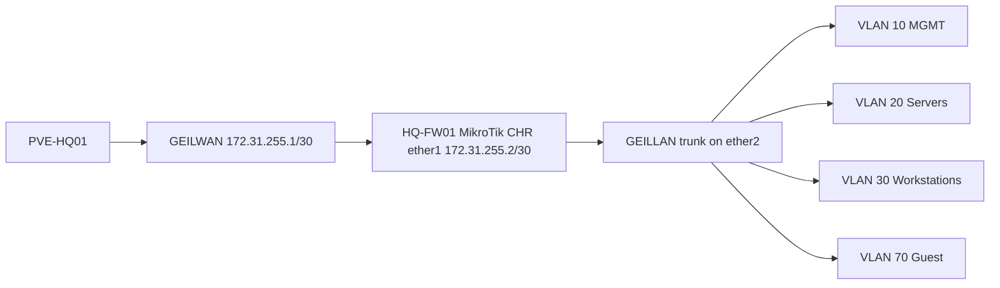

# MikroTik CHR HQ Foundation Implementation Guide

## Document Control

| Field | Value |
|---|---|
| Document ID | GEIL-PLAT-MTK-HQ-IMPL-001 |
| Owner | Infrastructure Engineering |
| Status | Approved |
| Version | 2.1 |
| Last Reviewed | 2026-06-29 |
| Review Cycle | Quarterly |
| Classification | Internal Confidential |

!!! note "Adaptation"

    This guide uses canonical GEIL values from the [Environment Specification](../project/environment-specification.md). `HQ-FW01` is MikroTik CHR / RouterOS. `ether1` connects to `GEILWAN`, `ether2` connects to `GEILLAN`, CHR WAN is `172.31.255.2/30`, and internal VLAN gateways use `172.20.x.1/24`.

## Purpose

Deploy `HQ-FW01` as a MikroTik CHR firewall/router for the Phase 1 HQ foundation. This guide supersedes all active OPNsense deployment instructions.

## Learning Objectives

After completing this guide you will understand:

- Why GEIL uses MikroTik CHR for Phase 1 edge security.
- How RouterOS interfaces, interface lists, VLANs, NAT, firewall rules, DNS, and DHCP relay work together.
- How to import CHR into Proxmox with safe VirtIO NIC mapping.
- How to use RouterOS Safe Mode to reduce lockout risk.
- How to validate RouterOS configuration after every risky stage.
- How to export, back up, troubleshoot, and roll back the firewall.

## What You Will Build

By the end of this guide you will have:

- ✓ `HQ-FW01` running MikroTik CHR.
- ✓ `ether1` mapped to `GEILWAN` with `172.31.255.2/30`.
- ✓ `ether2` mapped to `GEILLAN` as the VLAN trunk parent.
- ✓ RouterOS interface lists created before use.
- ✓ VLAN interfaces and gateway IPs for VLANs 10,20,30,40,50,60,70,80,90,100.
- ✓ NAT masquerade to `GEILWAN`.
- ✓ Baseline firewall policy with management allow and guest isolation.
- ✓ DHCP relay commands prepared but disabled until `HQ-DC01` DHCP scopes exist.
- ✓ RouterOS export, Proxmox snapshots, and validation evidence captured.

## Estimated Time

60-120 minutes, excluding MikroTik CHR image download time.

## Difficulty

Advanced. RouterOS CLI is direct and order-sensitive. Interface lists, VLAN interfaces, and firewall rules must exist before they are referenced.

## Risk Level

High. `HQ-FW01` is the routing and security boundary. Incorrect service restrictions or firewall rules can lock out management access.

## Service Impact

Maintenance window recommended. Phase 1 has no production users yet, but a firewall error can block deployment validation.

## Prerequisites

- [MikroTik CHR HQ Foundation LLD](mikrotik-chr-hq-foundation-lld.md) reviewed.
- [Proxmox HQ Foundation Implementation](proxmox-hq-foundation-implementation.md) completed.
- `GEILWAN` exists on `PVE-HQ01` and is visible in the Proxmox GUI.
- `GEILLAN` exists on `PVE-HQ01`, is VLAN-aware, and is visible in the Proxmox GUI.
- `GEILWAN` Proxmox side is `172.31.255.1/30`.
- No GEIL VM is attached to `PROD`, `TEST`, `eno1`, or `VSW4001`.
- MikroTik CHR image has been downloaded from MikroTik and extracted.
- Proxmox privileged access is available.
- Proxmox console access to `HQ-FW01` is available.
- Approved password manager is ready for the RouterOS admin password.

## Expected Starting State

- `HQ-FW01` does not exist, or exists only as a disposable test VM.
- `GEILWAN` and `GEILLAN` have already been validated on `PVE-HQ01`.
- DHCP relay is not enabled on any firewall.
- No firewall rules depend on VLAN interfaces that do not exist.

## Expected Ending State

- `HQ-FW01` runs MikroTik CHR.
- RouterOS identity is `HQ-FW01`.
- Interface lists exist before any services or firewall rules reference them.
- Management restrictions are applied only after MGMT and management workstation access are validated.
- VLAN gateways, NAT, firewall policy, exports, and snapshots are complete.

## Architecture Overview



!!! warning "Copy/paste firewall lockout risk"

    Do not paste all firewall and service-hardening commands at once. Use RouterOS Safe Mode, validate after each block, and keep the Proxmox console open. Apply management restrictions only after the `MGMT` interface list exists, has members, and management access is confirmed.

!!! enterprise "Enterprise pattern"

    Enterprises treat firewall management as a privileged control plane. Rules are staged, validated from an approved management network, exported, and backed by console access before broad deny rules are applied.

!!! implementation "GEIL deployment note"

    This guide corrects the original CHR draft where `MGMT` was referenced before the interface list existed. Interface lists are now created first, VLAN members are added only after VLAN interfaces exist, and service restrictions are applied after management access is validated.

## Background Knowledge

### What is RouterOS Safe Mode?

Safe Mode automatically reverts changes if the management session disconnects. Use it when changing firewall rules, MAC server restrictions, or management services.

### What is an interface list?

An interface list is a named group of interfaces. RouterOS firewall rules and services can reference the list. The list must exist before it can be referenced.

### What is a VLAN interface?

A VLAN interface is a tagged logical interface on `ether2`. It must exist before an IP address or interface-list membership can reference it.

### What is DHCP relay?

DHCP relay forwards DHCP requests from a client VLAN to a DHCP server on another VLAN. GEIL prepares relay for VLANs 30, 40, and 60 but does not enable relay until Windows DHCP scopes exist on `HQ-DC01`.


## Detailed Operator Walkthrough

This section expands the deployment into the exact operator actions to perform before using the copy/paste command blocks.

!!! danger "Keep console access open"

    Keep `PVE-HQ01 -> HQ-FW01 -> Console` open during the entire firewall deployment. Do not rely only on WinBox or SSH until service restrictions and firewall rules are validated.

### Download and prepare the CHR image

1. Open the MikroTik download page from an administrative workstation.
2. Select **Cloud Hosted Router**.
3. Download the current stable CHR raw disk image, usually named similar to `chr-<version>.img.zip`.
4. Verify that the downloaded file is from MikroTik and is not a RouterOS package-only file.
5. Copy the ZIP to `PVE-HQ01` using SCP or the Proxmox shell upload method.
6. Extract the image so the final path is:

```text
/var/lib/vz/template/iso/mikrotik/chr.img
```

Example on `PVE-HQ01`:

```bash
mkdir -p /var/lib/vz/template/iso/mikrotik
cd /var/lib/vz/template/iso/mikrotik
# Copy chr-<version>.img.zip into this directory first.
unzip chr-*.img.zip
mv chr-*.img chr.img
ls -lh chr.img
```

Expected result:

- `chr.img` exists.
- The file size is non-zero.
- The image is stored outside Git.

!!! warning "Do not use an ISO workflow"

    MikroTik CHR is imported as a disk image. Do not attach it as an ISO installer. If the VM boots to a blank disk or PXE prompt, the CHR disk was not imported or selected as the boot disk correctly.

### Proxmox VM settings to verify

Use these settings for `HQ-FW01`:

| Setting | Value | Why |
|---|---|---|
| VM ID | `100` | Canonical Phase 1 firewall VM ID |
| Name | `HQ-FW01` | Canonical firewall name |
| Firmware | SeaBIOS or Proxmox default | CHR boots reliably with standard VM firmware |
| Machine | Proxmox default | Keep simple for Phase 1 |
| CPU | 2 cores | Enough for Phase 1 routing and firewall testing |
| Memory | 2048 MB | Enough for CHR and evidence collection |
| Disk | Imported `chr.img` on `local-lvm` | CHR boot disk |
| NIC 1 | VirtIO on `GEILWAN` | RouterOS `ether1`, WAN/transit |
| NIC 2 | VirtIO on `GEILLAN` | RouterOS `ether2`, internal VLAN trunk |
| Start at boot | Optional during lab build | Enable later after baseline is stable |

!!! warning "NIC order matters"

    In this guide `net0` becomes RouterOS `ether1` and must connect to `GEILWAN`. `net1` becomes RouterOS `ether2` and must connect to `GEILLAN`. If these are reversed, WAN and LAN policy will be wrong.

### First RouterOS login workflow

1. Start `HQ-FW01` from Proxmox.
2. Open `PVE-HQ01 -> HQ-FW01 -> Console`.
3. Log in with the default MikroTik CHR credentials shown by RouterOS.
4. Immediately set the admin password in Step 3.
5. Do not restrict services yet.
6. Do not paste firewall rules yet.
7. Run `/interface/print` and confirm two Ethernet interfaces exist.

Expected first interface state:

```text
ether1  connected to GEILWAN
ether2  connected to GEILLAN trunk
```

If you are unsure which interface is which, stop and verify `qm config 100` before configuring firewall rules.

### Safe Mode workflow

Use Safe Mode only after the initial router identity, interface lists, VLAN interfaces, and management reachability have been validated.

1. Open RouterOS terminal from console, SSH, or WinBox.
2. Press `Ctrl+X`.
3. Confirm the prompt indicates Safe Mode.
4. Run one small command block.
5. Validate access.
6. Press `Ctrl+X` again to commit the safe-mode changes only after validation succeeds.

If the management session disconnects while Safe Mode is active, RouterOS reverts the uncommitted changes.

!!! tip "Recommended paste size"

    Paste no more than one numbered step at a time. For firewall rules, paste the input-chain foundation, validate, then paste the WAN drop, validate, then paste forwarding rules.

### WinBox and GUI cross-checks

RouterOS CLI is authoritative in this guide, but WinBox screenshots are useful evidence.

Capture these WinBox locations after CLI validation:

| WinBox location | Expected result |
|---|---|
| Interfaces | `ether1`, `ether2`, and VLAN interfaces are visible |
| Interface List | `WAN`, `LAN`, `MGMT`, `SERVERS`, `WORKSTATIONS`, `GUEST` exist |
| IP -> Addresses | `172.31.255.2/30` and all `172.20.x.1/24` gateways exist |
| IP -> Routes | Default route via `172.31.255.1` exists |
| IP -> DNS | Forwarders are configured |
| IP -> Firewall -> Filter Rules | Input and forward rules are in documented order |
| IP -> Firewall -> NAT | Masquerade rule uses `WAN` list |
| IP -> DHCP Relay | Relay is absent or disabled until scopes exist |

### Do-not-proceed gates

Stop and fix the current step if any of these occur:

- `GEILWAN` or `GEILLAN` is missing from `qm config 100`.
- `/interface/list/print` does not show all required lists before service restrictions.
- `/interface/vlan/print` does not show all VLAN interfaces before IP assignment.
- `/ip/address/print` does not show `172.31.255.2/30` on `ether1`.
- You cannot reach the management path before service restrictions.
- DHCP relay appears enabled before Windows DHCP scopes exist.
- VLAN 70 appears in DHCP relay configuration.

## Step-by-Step Procedure

### Step 1: Validate Proxmox bridge prerequisites

#### Goal

Confirm Proxmox bridge objects exist before creating `HQ-FW01`.

#### Why this step matters

VM NIC mapping is safe only after the bridge names are known and visible.

#### Commands

Run on `PVE-HQ01`:

```bash
ip -brief addr show GEILWAN
ip -brief addr show GEILLAN
bridge vlan show dev GEILLAN
```

#### Expected result

You should now see:

- `GEILWAN` with `172.31.255.1/30`.
- `GEILLAN` present.
- `GEILLAN` carrying VLANs 10,20,30,40,50,60,70,80,90,100.

#### Validation

Also verify in the GUI: `PVE-HQ01 -> System -> Network`.

#### Evidence

Capture command output and a Proxmox Network screenshot.

#### Rollback

Do not continue. Return to [Proxmox HQ Foundation Implementation](proxmox-hq-foundation-implementation.md) and fix bridge configuration first.

#### Next step

Import the CHR image.

### Step 2: Import CHR image and create VM

#### Goal

Create `HQ-FW01` with the CHR disk and correct NIC mapping.

#### Why this step matters

A wrong NIC mapping reverses WAN/LAN policy and can expose internal networks or break validation.

#### Commands

Run on `PVE-HQ01` after copying the extracted CHR `.img` file to `/var/lib/vz/template/iso/mikrotik/chr.img`:

```bash
mkdir -p /var/lib/vz/template/iso/mikrotik
qm create 100 --name HQ-FW01 --memory 2048 --cores 2 --net0 virtio,bridge=GEILWAN --net1 virtio,bridge=GEILLAN
qm importdisk 100 /var/lib/vz/template/iso/mikrotik/chr.img local-lvm
qm set 100 --scsihw virtio-scsi-pci --scsi0 local-lvm:vm-100-disk-0
qm set 100 --boot order=scsi0
qm set 100 --serial0 socket --vga serial0
qm config 100
```

#### Expected result

You should now see:

- VM 100 named `HQ-FW01`.
- `net0` on `GEILWAN`.
- `net1` on `GEILLAN`.
- CHR disk attached as boot disk.

#### Validation

```bash
qm config 100 | egrep 'name|net0|net1|scsi0|boot'
```

#### Evidence

Capture `qm config 100` output.

#### Rollback

```bash
qm stop 100
qm destroy 100 --purge
```

#### Next step

Boot CHR and perform non-network-locking hardening.

### Step 3: Set identity and admin password only

#### Goal

Secure the default account and set the router identity without referencing interface lists that do not exist yet.

#### Why this step matters

This step is safe because it does not restrict management services or firewall access.

#### Commands

Run from the RouterOS console:

```routeros
/user set admin password=<PASSWORD>
/system identity set name=HQ-FW01
/system identity print
```

#### Expected result

You should now see identity `HQ-FW01`.

#### Validation

```routeros
/user print
/system identity print
```

#### Evidence

Capture sanitized `/system identity print` output. Do not capture or commit the password.

#### Rollback

Use the Proxmox console to reset the password if the password was mistyped before management service restrictions are applied.

#### Next step

Create interface lists.

### Step 4: Create interface lists before referencing them

#### Goal

Create RouterOS interface lists in the correct order.

#### Why this step matters

RouterOS commands that reference a missing interface list fail or partially apply, which can leave the firewall in an inconsistent state.

#### Commands

```routeros
/interface list add name=WAN comment="External/transit interfaces"
/interface list add name=LAN comment="Internal non-guest interfaces"
/interface list add name=MGMT comment="Approved firewall management interfaces"
/interface list add name=SERVERS comment="Server VLAN interfaces"
/interface list add name=WORKSTATIONS comment="Workstation VLAN interfaces"
/interface list add name=GUEST comment="Guest-only VLAN interfaces"
/interface list member add list=WAN interface=ether1
```

#### Expected result

You should now see all required interface lists.

#### Validation

```routeros
/interface/list/print
/interface/list/member/print
```

#### Evidence

Capture interface list output.

#### Rollback

```routeros
/interface list member remove [find]
/interface list remove [find name=WAN]
/interface list remove [find name=LAN]
/interface list remove [find name=MGMT]
/interface list remove [find name=SERVERS]
/interface list remove [find name=WORKSTATIONS]
/interface list remove [find name=GUEST]
```

#### Next step

Configure WAN and default route.

### Step 5: Configure WAN IP, default route, and DNS

#### Goal

Make CHR reachable on the GEILWAN transit network.

#### Commands

```routeros
/ip address add address=172.31.255.2/30 interface=ether1 comment="GEILWAN CHR WAN"
/ip route add dst-address=0.0.0.0/0 gateway=172.31.255.1 comment="Default route via GEILWAN Proxmox peer"
/ip dns set servers=1.1.1.1,1.0.0.1 allow-remote-requests=yes
```

#### Expected result

You should now see `172.31.255.2/30` on `ether1` and default route via `172.31.255.1`.

#### Validation

```routeros
/ip/address/print
/ip/route/print
/ip/dns/print
/ping 172.31.255.1 count=4
```

#### Evidence

Capture address, route, DNS, and ping output.

#### Rollback

```routeros
/ip route remove [find comment="Default route via GEILWAN Proxmox peer"]
/ip address remove [find comment="GEILWAN CHR WAN"]
```

#### Next step

Create VLAN interfaces.

### Step 6: Create VLAN interfaces on ether2

#### Goal

Create the VLAN interface objects before assigning IPs or interface-list membership.

#### Commands

```routeros
/interface vlan add name=vlan10-mgmt interface=ether2 vlan-id=10
/interface vlan add name=vlan20-servers interface=ether2 vlan-id=20
/interface vlan add name=vlan30-workstations interface=ether2 vlan-id=30
/interface vlan add name=vlan40-printers interface=ether2 vlan-id=40
/interface vlan add name=vlan50-voice interface=ether2 vlan-id=50
/interface vlan add name=vlan60-corpwifi interface=ether2 vlan-id=60
/interface vlan add name=vlan70-guestwifi interface=ether2 vlan-id=70
/interface vlan add name=vlan80-dmz interface=ether2 vlan-id=80
/interface vlan add name=vlan90-backup interface=ether2 vlan-id=90
/interface vlan add name=vlan100-hypervisors interface=ether2 vlan-id=100
```

#### Expected result

You should now see ten VLAN interfaces on `ether2`.

#### Validation

```routeros
/interface/print
/interface/vlan/print
```

#### Rollback

```routeros
/interface vlan remove [find interface=ether2]
```

#### Next step

Assign gateway IP addresses.

### Step 7: Assign VLAN gateway IP addresses

#### Goal

Assign canonical gateway IPs only after VLAN interfaces exist.

#### Commands

```routeros
/ip address add address=172.20.10.1/24 interface=vlan10-mgmt comment="VLAN10 Management gateway"
/ip address add address=172.20.20.1/24 interface=vlan20-servers comment="VLAN20 Servers gateway"
/ip address add address=172.20.30.1/24 interface=vlan30-workstations comment="VLAN30 Workstations gateway"
/ip address add address=172.20.40.1/24 interface=vlan40-printers comment="VLAN40 Printers gateway"
/ip address add address=172.20.50.1/24 interface=vlan50-voice comment="VLAN50 Voice gateway"
/ip address add address=172.20.60.1/24 interface=vlan60-corpwifi comment="VLAN60 Corporate WiFi gateway"
/ip address add address=172.20.70.1/24 interface=vlan70-guestwifi comment="VLAN70 Guest WiFi gateway"
/ip address add address=172.20.80.1/24 interface=vlan80-dmz comment="VLAN80 DMZ gateway"
/ip address add address=172.20.90.1/24 interface=vlan90-backup comment="VLAN90 Backup gateway"
/ip address add address=172.20.100.1/24 interface=vlan100-hypervisors comment="VLAN100 Hypervisors gateway"
```

#### Validation

```routeros
/ip/address/print
```

#### Rollback

```routeros
/ip address remove [find comment~"gateway"]
```

#### Next step

Add VLAN interfaces to interface lists.

### Step 8: Add VLAN interfaces to interface lists

#### Goal

Populate lists only after the VLAN interfaces exist.

#### Commands

```routeros
/interface list member add list=MGMT interface=vlan10-mgmt
/interface list member add list=SERVERS interface=vlan20-servers
/interface list member add list=WORKSTATIONS interface=vlan30-workstations
/interface list member add list=GUEST interface=vlan70-guestwifi
/interface list member add list=LAN interface=vlan10-mgmt
/interface list member add list=LAN interface=vlan20-servers
/interface list member add list=LAN interface=vlan30-workstations
/interface list member add list=LAN interface=vlan40-printers
/interface list member add list=LAN interface=vlan50-voice
/interface list member add list=LAN interface=vlan60-corpwifi
/interface list member add list=LAN interface=vlan80-dmz
/interface list member add list=LAN interface=vlan90-backup
/interface list member add list=LAN interface=vlan100-hypervisors
```

#### Validation

```routeros
/interface/list/member/print
```

#### Rollback

```routeros
/interface list member remove [find list=LAN]
/interface list member remove [find list=MGMT]
/interface list member remove [find list=SERVERS]
/interface list member remove [find list=WORKSTATIONS]
/interface list member remove [find list=GUEST]
```

#### Next step

Validate management reachability before restricting services.

### Step 9: Validate management path before restrictions

#### Goal

Confirm an approved management source can reach RouterOS before limiting management services to the `MGMT` list.

#### Validation

From an approved management context, validate WinBox or SSH reachability to `172.20.10.1` when the network path exists. From RouterOS, print current state:

```routeros
/interface/list/print
/interface/list/member/print
/ip/address/print
/ip/service/print
```

#### Expected result

- `MGMT` list exists and contains `vlan10-mgmt`.
- `HQ-MGMT01` or approved management network has a path to `172.20.10.1` when VLAN 10/30 connectivity is available.

#### Rollback

Do not apply service restrictions until this validation succeeds.

#### Next step

Enter Safe Mode and restrict services.

### Step 10: Enter Safe Mode and restrict RouterOS services

#### Goal

Disable unnecessary services and restrict management after lists and management path exist.

#### Why this step matters

This was the critical order issue found during deployment. `MGMT` must exist and contain the intended interface before any command references it.

#### Procedure

In a RouterOS terminal, press `Ctrl+X` to enter Safe Mode before running the block below. Keep the Proxmox console open.

#### Commands

```routeros
/ip service disable telnet,ftp,www,api,api-ssl
/ip service set ssh address=172.20.10.0/24,172.20.30.10/32
/ip service set winbox address=172.20.10.0/24,172.20.30.10/32
/ip neighbor discovery-settings set discover-interface-list=MGMT
/tool mac-server set allowed-interface-list=MGMT
/tool mac-server mac-winbox set allowed-interface-list=MGMT
```

#### Validation

```routeros
/ip/service/print
/ip/neighbor/discovery-settings/print
/tool/mac-server/print
/tool/mac-server/mac-winbox/print
```

#### Evidence

Capture sanitized service and MAC-server output.

#### Rollback

If management disconnects, Safe Mode should revert the changes. If using console, manually relax the settings:

```routeros
/ip service enable ssh,winbox
/tool mac-server set allowed-interface-list=all
/tool mac-server mac-winbox set allowed-interface-list=all
```

#### Next step

Configure NAT and firewall filters.

### Step 11: Configure NAT masquerade

#### Commands

```routeros
/ip firewall nat add chain=srcnat out-interface-list=WAN action=masquerade comment="GEIL outbound masquerade to GEILWAN"
```

#### Validation

```routeros
/ip/firewall/nat/print
```

#### Rollback

```routeros
/ip firewall nat remove [find comment="GEIL outbound masquerade to GEILWAN"]
```

#### Next step

Apply firewall rules in small blocks.

### Step 12: Apply baseline firewall rules in safe order

#### Goal

Allow required management and established traffic, block guest-to-internal traffic, and deny unapproved forwarding.

#### Commands: input chain foundation

```routeros
/ip firewall filter add chain=input connection-state=established,related action=accept comment="Accept established/related to router"
/ip firewall filter add chain=input connection-state=invalid action=drop comment="Drop invalid to router"
/ip firewall filter add chain=input src-address=172.20.10.0/24 action=accept comment="Allow management VLAN to router"
/ip firewall filter add chain=input src-address=172.20.30.10 action=accept comment="Allow HQ-MGMT01 to router"
```

Validate before adding drops:

```routeros
/ip/firewall/filter/print
```

#### Commands: WAN input drop

```routeros
/ip firewall filter add chain=input in-interface-list=WAN action=drop comment="Drop WAN access to router"
```

#### Commands: forwarding policy

```routeros
/ip firewall filter add chain=forward connection-state=established,related action=accept comment="Accept established/related forwarding"
/ip firewall filter add chain=forward connection-state=invalid action=drop comment="Drop invalid forwarding"
/ip firewall filter add chain=forward src-address=172.20.70.0/24 dst-address=172.20.0.0/16 action=drop comment="Block guest to internal GEIL"
/ip firewall filter add chain=forward src-address=172.20.70.0/24 out-interface-list=WAN action=accept comment="Allow guest to internet only"
/ip firewall filter add chain=forward src-address=172.20.30.10 dst-address=172.20.100.11 protocol=tcp dst-port=8006 action=accept comment="Allow HQ-MGMT01 to Proxmox"
/ip firewall filter add chain=forward src-address=172.20.30.10 dst-address=172.20.20.11 action=accept comment="Allow HQ-MGMT01 to HQ-DC01 management prep"
/ip firewall filter add chain=forward action=drop comment="Default deny unapproved forwarding"
```

#### Validation

```routeros
/ip/firewall/filter/print stats
```

#### Rollback

Remove the most recent bad rule by comment, for example:

```routeros
/ip firewall filter remove [find comment="Default deny unapproved forwarding"]
```

#### Next step

Prepare DHCP relay without enabling it.

### Step 13: Prepare DHCP relay commands but keep disabled

#### Goal

Document the future relay configuration without sending traffic before DHCP scopes exist.

#### Commands

Do not run until `HQ-DC01` DHCP scopes exist. When ready, add them disabled first:

```routeros
/ip dhcp-relay add name=relay-vlan30 interface=vlan30-workstations dhcp-server=172.20.20.11 disabled=yes
/ip dhcp-relay add name=relay-vlan40 interface=vlan40-printers dhcp-server=172.20.20.11 disabled=yes
/ip dhcp-relay add name=relay-vlan60 interface=vlan60-corpwifi dhcp-server=172.20.20.11 disabled=yes
```

Never create relay for VLAN 70 Guest WiFi.

#### Validation

```routeros
/ip/dhcp-relay/print
```

Expected result before DHCP scopes exist: no enabled relay entries.

#### Rollback

```routeros
/ip dhcp-relay remove [find]
```

#### Next step

Export and snapshot.

### Step 14: Export configuration and capture snapshots

#### Commands

RouterOS export:

```routeros
/export hide-sensitive file=HQ-FW01-baseline
/file/print where name~"HQ-FW01-baseline"
```

Proxmox snapshots:

```bash
qm snapshot 100 CP-FW-CHR-IMPORTED --description "HQ-FW01 CHR imported and booted"
qm snapshot 100 CP-FW-WAN-LAN --description "HQ-FW01 WAN and LAN trunk validated"
qm snapshot 100 CP-FW-VLANS --description "HQ-FW01 VLAN gateways configured"
qm snapshot 100 CP-FW-BASELINE-RULES --description "HQ-FW01 RouterOS baseline firewall rules"
qm listsnapshot 100
```

## Validation after each major stage

Run this final validation bundle from RouterOS:

```routeros
/system/identity/print
/interface/print
/interface/list/print
/interface/list/member/print
/interface/vlan/print
/ip/address/print
/ip/route/print
/ip/dns/print
/ip/firewall/filter/print
/ip/firewall/nat/print
/ip/neighbor/discovery-settings/print
/tool/mac-server/print
/tool/mac-server/mac-winbox/print
/ip/dhcp-relay/print
```

Expected results:

- Interface lists exist before services reference them.
- VLAN interfaces exist before IP addresses reference them.
- `ether1` has `172.31.255.2/30`.
- Default route uses `172.31.255.1`.
- Guest WiFi has an explicit deny to `172.20.0.0/16`.
- NAT masquerade uses the `WAN` interface list.
- DHCP relay is absent or disabled until DHCP scopes exist.

## Evidence to capture

- `qm config 100` output.
- `/interface/print` output.
- `/interface/list/print` and `/interface/list/member/print` output.
- `/ip/address/print` output.
- `/ip/route/print` output.
- `/ip/dns/print` output.
- `/ip/firewall/filter/print stats` output.
- `/ip/firewall/nat/print` output.
- `/ip/neighbor/discovery-settings/print` output.
- `/tool/mac-server/print` and `/tool/mac-server/mac-winbox/print` output.
- `/export hide-sensitive` file stored outside Git.
- Proxmox snapshot inventory.

!!! example "Screenshot Required"

    Capture RouterOS/WinBox interface list, VLAN list, firewall filter rules, NAT rule, route table, and file/export screens after validation. Store sanitized screenshots under `docs/assets/images/mikrotik-chr-hq-foundation-implementation/` if they do not contain secrets.

## Common Mistakes

| Mistake | Symptom | Fix |
|---|---|---|
| Referencing `MGMT` before creating it | RouterOS command fails or applies inconsistently | Create interface lists in Step 4 first |
| Restricting services before management path works | WinBox/SSH lockout | Use Safe Mode and Proxmox console rollback |
| Assigning IPs before VLAN interfaces exist | `/ip address add` fails | Create VLAN interfaces first |
| Enabling DHCP relay before scopes exist | Clients receive no lease or bad state | Keep relay disabled until scopes exist |
| Guest allow rule above guest deny | Guest reaches internal networks | Place guest-to-internal deny above internet allow |

## Troubleshooting

| Symptom | Likely Cause | Fix |
|---|---|---|
| Cannot reach `172.31.255.1` | `ether1` not on `GEILWAN` or wrong IP | Check `qm config 100` and `/ip/address/print` |
| VLAN gateway unreachable | `ether2` not on `GEILLAN` or VLAN trunk issue | Check Proxmox bridge and `/interface/vlan/print` |
| Management lockout | Input or MAC-server restriction applied too early | Use Proxmox console; Safe Mode should revert if session dropped |
| Guest reaches internal | Guest deny missing or below allow | Move guest deny above internet allow |
| DNS queries fail from router | DNS servers or default route wrong | Check `/ip/dns/print`, `/ip/route/print`, and ping upstream |

## Rollback

Use the least destructive rollback that restores access:

1. Safe Mode auto-revert for management-session disconnects.
2. Remove the last bad rule by comment.
3. Restore a Proxmox snapshot.
4. Rebuild VM 100 before production use if configuration becomes untrusted.

Snapshot rollback example:

```bash
qm shutdown 100
qm rollback 100 CP-FW-VLANS
qm start 100
```

Full rebuild before production use:

```bash
qm stop 100
qm destroy 100 --purge
```

## Knowledge Check

1. Why must interface lists be created before `/ip service`, `/tool mac-server`, or firewall rules reference them?
2. Why should service restrictions wait until management access is validated?
3. Why is DHCP relay added disabled first and never configured for VLAN 70?
4. Which validation command proves VLAN interfaces exist before gateway IPs are assigned?
5. What does RouterOS Safe Mode protect against during firewall changes?

## Next Guide

Continue to:

- [Phase 1 Validation Plan](phase-1-validation-plan.md)


## Audit Correction Notes

!!! success "Execution-order audit"

    This guide was audited for command order, object dependencies, canonical GEIL values, rollback coverage, validation gates, and active MikroTik CHR firewall references. Follow dependency order exactly: validate prerequisites, create objects, validate objects, apply dependent settings, then capture evidence.

- Audit focus: Deploy RouterOS in dependency order: lists, interfaces, addresses, management validation, service restriction, NAT, firewall, relay preparation.
- Active Phase 1 firewall implementation: MikroTik CHR / RouterOS on `HQ-FW01`.
- OPNsense is superseded and must not be used for active Phase 1 deployment.

## Expected Results

- Commands complete without referencing missing objects.
- Canonical GEIL values are visible in outputs.
- No active OPNsense deployment path remains for Phase 1 firewall work.
- `10.10.x.x` remains limited to existing non-GEIL `PROD`/`TEST` references only.
