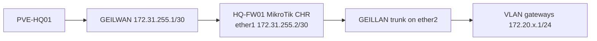

# MikroTik CHR HQ Foundation LLD

## Document Control

| Field | Value |
|---|---|
| Document ID | GEIL-PLAT-MTK-HQ-LLD-001 |
| Owner | Infrastructure Engineering |
| Status | Approved |
| Version | 1.0 |
| Last Reviewed | 2026-06-29 |
| Review Cycle | Quarterly |
| Classification | Internal Confidential |

## Purpose

This Low-Level Design translates the Enterprise Lab Network HLD into deployable specifications for `HQ-FW01` running MikroTik CHR / RouterOS. It supersedes the previous OPNsense-specific Phase 1 firewall LLD while preserving the same enterprise edge security and networking capability.

## Scope

Included:

- `HQ-FW01` MikroTik CHR VM design on `PVE-HQ01`.
- VirtIO NIC mapping to `GEILWAN` and `GEILLAN`.
- RouterOS interface naming and interface lists.
- GEILWAN transit addressing and default route.
- VLAN interfaces and gateway IPs.
- Baseline firewall, NAT, DNS, management, guest isolation, and DHCP relay preparation decisions.
- Snapshot, export, rollback, validation, and evidence requirements.

Excluded:

- Microsoft AD DS, DNS, and DHCP server implementation.
- Site-to-site VPN.
- RouterOS high availability.
- Certificate lifecycle management.

## Required HLD references

- [Enterprise Lab Blueprint HLD](../architecture/enterprise-lab-blueprint.md)
- [Enterprise Lab Network HLD](../architecture/enterprise-lab-network-hld.md)
- [Enterprise Lab Identity HLD](../architecture/enterprise-lab-identity-hld.md)
- [Enterprise Lab Operations HLD](../architecture/enterprise-lab-operations-hld.md)
- [Environment Specification](../project/environment-specification.md)
- [ADR-0002 Use MikroTik CHR for Phase 1 HQ Firewall](../governance/adrs/ADR-0002-mikrotik-chr-phase-1-firewall.md)

## Architecture overview

!!! implementation "Architecture change"

    `HQ-FW01` remains the canonical firewall name, and the active platform is MikroTik CHR / RouterOS. OPNsense is retained only as an alternative/superseded historical runbook set and must not be used for active Phase 1 deployment.

## VM specification

| Setting | Value |
|---|---|
| VM name | `HQ-FW01` |
| Platform | MikroTik CHR / RouterOS |
| vCPU | 2 |
| Memory | 1-2 GB minimum; 4 GB preferred for lab headroom |
| Disk | 1-4 GB CHR disk image |
| NIC model | VirtIO |
| NIC 1 | `ether1` -> `GEILWAN` |
| NIC 2 | `ether2` -> `GEILLAN` |
| Boot | Imported CHR image disk |

## Interface design

| RouterOS Interface | Proxmox Bridge | Purpose |
|---|---|---|
| `ether1` | `GEILWAN` | WAN/transit side |
| `ether2` | `GEILLAN` | VLAN-aware LAN trunk parent |

## GEILWAN transit

| Endpoint | IP | Notes |
|---|---|---|
| Proxmox `GEILWAN` | `172.31.255.1/30` | Transit peer/default route for CHR |
| `HQ-FW01` `ether1` | `172.31.255.2/30` | RouterOS WAN/transit address |
| RouterOS default route | `0.0.0.0/0` via `172.31.255.1` | Phase 1 upstream path |

## VLAN gateway design

All VLAN interfaces are created on `ether2`.

| VLAN | Name | RouterOS Interface | Gateway | Interface List |
|---:|---|---|---|---|
| 10 | Management | `vlan10-mgmt` | `172.20.10.1/24` | `MGMT`, `LAN` |
| 20 | Servers | `vlan20-servers` | `172.20.20.1/24` | `SERVERS`, `LAN` |
| 30 | Workstations | `vlan30-workstations` | `172.20.30.1/24` | `WORKSTATIONS`, `LAN` |
| 40 | Printers | `vlan40-printers` | `172.20.40.1/24` | `LAN` |
| 50 | Voice | `vlan50-voice` | `172.20.50.1/24` | `LAN` |
| 60 | Corporate WiFi | `vlan60-corpwifi` | `172.20.60.1/24` | `LAN` |
| 70 | Guest WiFi | `vlan70-guestwifi` | `172.20.70.1/24` | `GUEST` |
| 80 | DMZ | `vlan80-dmz` | `172.20.80.1/24` | `LAN` |
| 90 | Backup | `vlan90-backup` | `172.20.90.1/24` | `LAN` |
| 100 | Hypervisors | `vlan100-hypervisors` | `172.20.100.1/24` | `LAN` |

## Firewall baseline

Active Directory client-to-domain-controller policy uses the address-list architecture in [Active Directory Network Requirements](active-directory-network-requirements.md): `AD-DomainControllers`, `AD-ClientNetworks`, `ManagementNetworks`, and `ServerNetworks`. Do not create a separate firewall rule set per client VLAN.

Baseline posture:

- Drop invalid traffic.
- Allow established and related traffic.
- Allow management only from approved management networks.
- Block Guest WiFi to internal `172.20.0.0/16`.
- Allow Guest WiFi to internet only through NAT.
- Default deny other unapproved inter-zone flows.

## DNS and NAT decisions

- RouterOS may use DNS forwarding for firewall lookups and controlled bootstrap use.
- Domain clients must use AD DNS after `HQ-DC01` DNS exists.
- NAT masquerade applies outbound traffic leaving `ether1`/`WAN`.

## DHCP relay decision

Prepare relay for VLAN 30 only after the Windows DHCP scope exists and `HQ-DC01` is authorized. VLAN 40 and VLAN 60 relay definitions may be staged but must remain disabled until their scopes exist. VLAN 70 must never relay to AD DHCP.

MikroTik CHR processes DHCP relay as router-local traffic. DHCP relay firewall allowances must be placed in `chain=input` before the default input deny rule. Forward-chain rules alone are not sufficient for client broadcast requests to reach the local relay process.

## Rollback checkpoints

| Checkpoint | Purpose |
|---|---|
| `CP-FW-CHR-IMPORTED` | CHR image imported and VM boots |
| `CP-FW-WAN-LAN` | WAN/default route and LAN trunk validated |
| `CP-FW-VLANS` | VLAN gateways created |
| `CP-FW-BASELINE-RULES` | Firewall/NAT baseline validated |

## Acceptance criteria

- `HQ-FW01` runs MikroTik CHR.
- `ether1` is attached to `GEILWAN` and has `172.31.255.2/30`.
- `ether2` is attached to `GEILLAN`.
- VLAN gateways exist for VLANs 10,20,30,40,50,60,70,80,90,100.
- NAT masquerade exists for outbound internet/transit traffic.
- Guest WiFi cannot reach `172.20.0.0/16`.
- RouterOS export exists in protected storage outside Git.
