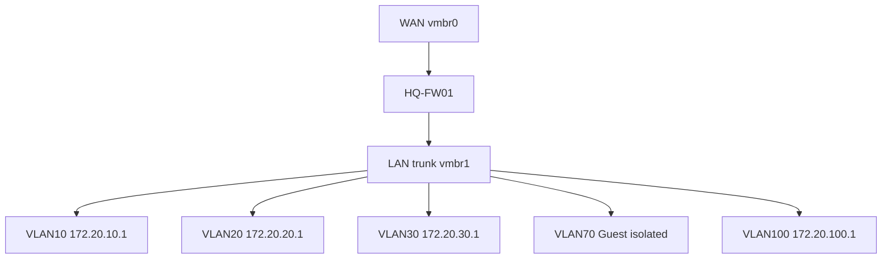

# OPNsense HQ Foundation Implementation Runbook

## Document Control

| Field | Value |
|---|---|
| Document ID | GEIL-PLAT-OPN-HQ-IMPL-001 |
| Owner | Infrastructure Engineering |
| Status | Approved |
| Version | 1.0 |
| Last Reviewed | 2026-06-29 |
| Review Cycle | Quarterly |
| Classification | Internal Confidential |

## Purpose

This runbook implements the `HQ-FW01` OPNsense foundation for GEIL Phase 1. It converts the approved E02.R03 OPNsense LLD into deployment steps for WAN/LAN assignment, VLAN interface creation, gateways, baseline firewall rules, DNS resolver/forwarding decisions, DHCP relay preparation, validation, rollback, and evidence capture.

## Scope

Included:

- `HQ-FW01` installation and initial access.
- WAN and LAN/trunk assignment.
- VLAN interface creation for VLANs 10,20,30,40,50,60,70,80,90,100.
- Gateway/interface address configuration.
- DNS resolver and forwarding decision.
- Baseline firewall rules.
- DHCP relay preparation.
- Management access validation.
- Snapshot and configuration export checkpoints.
- Rollback and troubleshooting.

Excluded:

- AD DS, DNS, and DHCP role installation on `HQ-DC01`.
- Certificate Lifecycle Management.
- NPS or 802.1X implementation.
- Site-to-site VPN and future regional routing.

## Related HLD/LLD references

This implementation runbook is subordinate to the approved HLD and LLD baseline:

- [Enterprise Lab Blueprint HLD](../architecture/enterprise-lab-blueprint.md)
- [Enterprise Lab Network HLD](../architecture/enterprise-lab-network-hld.md)
- [Proxmox HQ Foundation LLD](proxmox-hq-foundation-lld.md)
- [OPNsense HQ Foundation LLD](opnsense-hq-foundation-lld.md)
- [Phase 1 Build Plan](phase-1-build-plan.md)
- [Phase 1 Validation Plan](phase-1-validation-plan.md)
- [Environment Specification](../project/environment-specification.md)


!!! note "Adaptation"

    This runbook uses canonical GNTECH values from the Environment Specification. VLAN gateways follow the canonical gateway pattern for the approved VLAN list: VLAN 10 uses `172.20.10.1`, VLAN 20 uses `172.20.20.1`, VLAN 30 uses `172.20.30.1`, VLAN 40 uses `172.20.40.1`, VLAN 50 uses `172.20.50.1`, VLAN 60 uses `172.20.60.1`, VLAN 70 uses `172.20.70.1`, VLAN 80 uses `172.20.80.1`, VLAN 90 uses `172.20.90.1`, and VLAN 100 uses `172.20.100.1`. `HQ-FW01` is the Phase 1 routing and firewall control point.

## Prerequisites

| Requirement | Value / Decision |
|---|---|
| Proxmox host | `PVE-HQ01` operational |
| Firewall VM shell | `HQ-FW01` exists with WAN `vmbr0` and LAN trunk `vmbr1` |
| OPNsense ISO | Uploaded to Proxmox ISO storage |
| Console access | Proxmox console to `HQ-FW01` |
| Management client | `HQ-MGMT01` after workstation deployment |
| WAN addressing | ISP DHCP or `<PUBLIC_IP>` if static WAN is assigned |
| Internal VLAN plan | Canonical `172.20.0.0/16` VLAN allocation |

`<PUBLIC_IP>` is used only for ISP static WAN addressing. Replace it with the ISP-assigned address/prefix and do not commit ISP credentials.

## Required access

| Access | Required For | Notes |
|---|---|---|
| Proxmox console to `HQ-FW01` | Install, assign interfaces, recover access | Required before firewall web UI is available |
| OPNsense administrative account | Configure firewall | Password must be stored in approved password manager, not Git |
| `HQ-MGMT01` browser access | Validate web management path | Used after VLAN 30 and management rules exist |
| Protected storage location | Store `HQ-FW01-baseline.xml` | Do not store secrets or config exports in Git |

## Required ISO/files

| File | Purpose |
|---|---|
| OPNsense ISO | Install `HQ-FW01` |
| `HQ-FW01-baseline.xml` | Configuration export created after validation |
| Phase 1 validation evidence | Stored with implementation record outside Git if it contains sensitive details |

## Visual implementation summary

The full VLAN/security zone model is a complex architecture visual and should be migrated to a dedicated asset under `docs/assets/diagrams/opnsense-hq-foundation-lld/` per the [Visual Documentation Standard](../governance/visual-documentation-standard.md). The simplified Mermaid below is retained for implementation flow.



## Exact OPNsense deployment steps

### Step 1: Install OPNsense on `HQ-FW01`

1. Start the `HQ-FW01` VM from the OPNsense ISO.
2. Complete the standard OPNsense installation to the 40 GB virtual disk.
3. Reboot from disk.
4. Remove or disconnect the installation ISO after successful boot.

Expected result:

- `HQ-FW01` boots into OPNsense from local VM disk.

Checkpoint from Proxmox:

```bash
qm snapshot 100 CP-FW-INSTALLED --description "HQ-FW01 clean OPNsense install before VLAN policy"
```

### Step 2: Assign WAN and LAN interfaces

At the OPNsense console:

1. Assign the adapter connected to `vmbr0` as `WAN`.
2. Assign the adapter connected to `vmbr1` as the LAN/trunk parent.
3. Do not attach non-firewall guests to `vmbr0`.

Expected result:

| OPNsense Interface | Proxmox Bridge | Purpose |
|---|---|---|
| `WAN` | `vmbr0` | ISP/WAN side |
| LAN parent | `vmbr1` | Internal VLAN trunk |

Validation:

- WAN shows link state according to ISP handoff.
- LAN parent exists and is available for VLAN creation.

### Step 3: Configure VLAN interfaces

In OPNsense web UI or console-assisted GUI:

1. Navigate to Interfaces -> Other Types -> VLAN.
2. Create VLANs on the LAN trunk parent for each canonical VLAN.
3. Assign each VLAN as an interface.
4. Name interfaces using the interface names below.

| Interface Name | VLAN | Static IPv4 |
|---|---:|---|
| `MGMT` | 10 | `172.20.10.1/24` |
| `SERVERS` | 20 | `172.20.20.1/24` |
| `WORKSTATIONS` | 30 | `172.20.30.1/24` |
| `PRINTERS` | 40 | `172.20.40.1/24` |
| `VOICE` | 50 | `172.20.50.1/24` |
| `CORPWIFI` | 60 | `172.20.60.1/24` |
| `GUESTWIFI` | 70 | `172.20.70.1/24` |
| `DMZ` | 80 | `172.20.80.1/24` |
| `BACKUP` | 90 | `172.20.90.1/24` |
| `HYPERVISORS` | 100 | `172.20.100.1/24` |

Checkpoint from Proxmox after interface validation:

```bash
qm snapshot 100 CP-FW-VLANS --description "HQ-FW01 VLAN gateways configured"
```

## Gateway configuration

`HQ-FW01` is the default gateway for every Phase 1 VLAN.

| VLAN | Gateway |
|---:|---|
| 10 | `172.20.10.1` |
| 20 | `172.20.20.1` |
| 30 | `172.20.30.1` |
| 40 | `172.20.40.1` |
| 50 | `172.20.50.1` |
| 60 | `172.20.60.1` |
| 70 | `172.20.70.1` |
| 80 | `172.20.80.1` |
| 90 | `172.20.90.1` |
| 100 | `172.20.100.1` |

WAN gateway is learned from ISP DHCP unless GNTECH receives static WAN addressing. Static WAN values use `<PUBLIC_IP>` only until the ISP-provided address is known.

## DNS resolver/forwarding decision

Phase 1 has two DNS states:

| State | Decision |
|---|---|
| Before `HQ-DC01` AD DNS exists | `HQ-FW01` may provide temporary DNS forwarding for installation/bootstrap only |
| After `HQ-DC01` AD DNS exists | Domain clients use `172.20.20.11` and future `172.20.20.12` for DNS |

Rules:

- `corp.gntech.me` resolution is authoritative on AD DNS after `HQ-DC01` is promoted.
- `HQ-FW01` must not become the long-term resolver for domain clients.
- Guest WiFi may use firewall-controlled public resolver policy.
- Prevent uncontrolled client DNS egress after domain DNS is available.

## Baseline firewall rules

Apply default deny between internal zones and then add minimum approved flows.

| Rule | Interface | Source | Destination | Service | Action | Description |
|---|---|---|---|---|---|---|
| 1 | `MGMT` | `172.20.10.0/24` | `172.20.10.1` | HTTPS | Allow | Firewall management from management zone |
| 2 | `WORKSTATIONS` | `172.20.30.10` | `172.20.10.1` | HTTPS | Allow | `HQ-MGMT01` firewall management |
| 3 | `WORKSTATIONS` | `172.20.30.10` | `172.20.100.11` | TCP 8006 | Allow | `HQ-MGMT01` Proxmox management |
| 4 | `WORKSTATIONS` | `172.20.30.10` | `172.20.20.11` | RDP/WinRM as approved | Allow | `HQ-MGMT01` management of `HQ-DC01` |
| 5 | `WORKSTATIONS` | `172.20.30.0/24` | `172.20.20.11` | DNS/Kerberos/LDAP/SMB/NTP after AD exists | Allow | Domain client prerequisites |
| 6 | `CORPWIFI` | `172.20.60.0/24` | `172.20.20.11` | DNS/Kerberos/LDAP/NTP after AD exists | Allow | Corporate WiFi domain access |
| 7 | `GUESTWIFI` | `172.20.70.0/24` | WAN | HTTP/HTTPS/DNS policy | Allow | Guest internet access |
| 8 | `GUESTWIFI` | `172.20.70.0/24` | `172.20.0.0/16` | Any | Deny | Guest internal isolation |
| 9 | All internal | Any | Any | Any | Deny | Explicit default deny |

Implementation notes:

- Place specific allow rules above deny rules.
- Log guest-to-internal denies during validation.
- Restrict management rules to `HQ-MGMT01` where possible rather than the full workstation VLAN.
- Add no DMZ allow rules during Phase 1 unless approved by architecture review.

## DHCP relay preparation

Do not enable AD DHCP relay until `HQ-DC01` has the DHCP role and scopes.

Preparation decisions:

| VLAN | Relay Target | Timing |
|---:|---|---|
| 30 | `172.20.20.11` | After `WORKSTATIONS-HQ` DHCP scope exists |
| 40 | `172.20.20.11` | After `PRINTERS-HQ` DHCP scope exists |
| 60 | `172.20.20.11` | After `CORPWIFI-HQ` DHCP scope exists |
| 70 | None to AD DHCP | Guest DHCP remains isolated |

After `HQ-DC01` DHCP is ready, configure relay only for the approved VLANs and validate leases.

## Management access validation

From `HQ-MGMT01`:

```powershell
Test-NetConnection 172.20.10.1 -Port 443
Test-NetConnection 172.20.100.11 -Port 8006
Test-NetConnection 172.20.20.11 -Port 3389
```

From a guest VLAN 70 test client:

```powershell
Test-NetConnection 172.20.20.11 -Port 53
Test-NetConnection 172.20.100.11 -Port 8006
```

Expected result:

- `HQ-MGMT01` reaches approved management destinations.
- Guest VLAN 70 cannot reach internal destinations.

## Snapshot checkpoints and configuration export

After baseline policy validation:

```bash
qm snapshot 100 CP-FW-BASELINE-RULES --description "HQ-FW01 baseline firewall rules validated"
```

From OPNsense:

1. Navigate to System -> Configuration -> Backups.
2. Download configuration backup.
3. Save as `HQ-FW01-baseline.xml` in protected storage outside Git.

## Rollback procedures

### Revert firewall VM to clean install

```bash
qm rollback 100 CP-FW-INSTALLED
```

Use when VLAN/interface configuration is unrecoverable.

### Revert to VLAN gateway baseline

```bash
qm rollback 100 CP-FW-VLANS
```

Use when firewall rules break management or routing.

### Restore OPNsense configuration export

1. Open OPNsense console or web UI.
2. Navigate to System -> Configuration -> Backups.
3. Restore `HQ-FW01-baseline.xml` from protected storage.
4. Reboot if required.
5. Re-run management validation.

## Validation commands

From Proxmox:

```bash
qm config 100
qm listsnapshot 100
```

From `HQ-MGMT01`:

```powershell
Test-NetConnection 172.20.10.1 -Port 443
Test-NetConnection 172.20.100.11 -Port 8006
Test-NetConnection 172.20.20.11 -Port 3389
Test-NetConnection 172.20.70.1 -Port 53
```

From OPNsense diagnostics:

- Confirm interfaces are up.
- Confirm firewall log shows expected denies for Guest WiFi to internal networks.
- Confirm WAN has a default route.

## Troubleshooting

| Symptom | Likely Cause | Action |
|---|---|---|
| Cannot reach OPNsense web UI | Management allow rule missing or wrong VLAN | Use console, verify `MGMT` and `WORKSTATIONS` rules |
| VLAN gateway not reachable | VLAN tag missing on trunk or interface disabled | Check Proxmox `vmbr1`, OPNsense VLAN parent, and interface enablement |
| Guest can reach internal network | Missing deny rule or rule order problem | Move guest deny above broader allow; retest and capture logs |
| No WAN connectivity | WAN adapter mapped to wrong bridge or ISP issue | Verify `HQ-FW01` net0 on `vmbr0` and WAN status |
| Domain client cannot resolve names | DNS still pointing to firewall after AD DNS exists | Update DHCP options or static DNS to `172.20.20.11` |
| DHCP relay not working | Relay enabled before DHCP role/scope exists | Keep relay disabled until `HQ-DC01` DHCP is implemented |

## Evidence to capture

- Screenshot/export of `HQ-FW01` interface assignments.
- VLAN interface list with IP addresses.
- Firewall rule export or screenshots for baseline rules.
- OPNsense route table showing WAN default route.
- `HQ-FW01-baseline.xml` stored outside Git.
- Firewall log evidence for Guest WiFi deny tests.
- PowerShell validation transcript from `HQ-MGMT01`.
- Snapshot list showing `CP-FW-INSTALLED`, `CP-FW-VLANS`, and `CP-FW-BASELINE-RULES`.

## Completion criteria

This runbook is complete when:

1. `HQ-FW01` owns all canonical VLAN gateways.
2. WAN/LAN assignments match the LLD.
3. Baseline firewall policy is applied and validated.
4. Guest WiFi is isolated from internal networks.
5. `HQ-MGMT01` can reach approved management destinations.
6. DHCP relay decisions are documented and relay is not enabled prematurely.
7. OPNsense config export and snapshots exist.
8. Evidence is captured for the implementation record.
