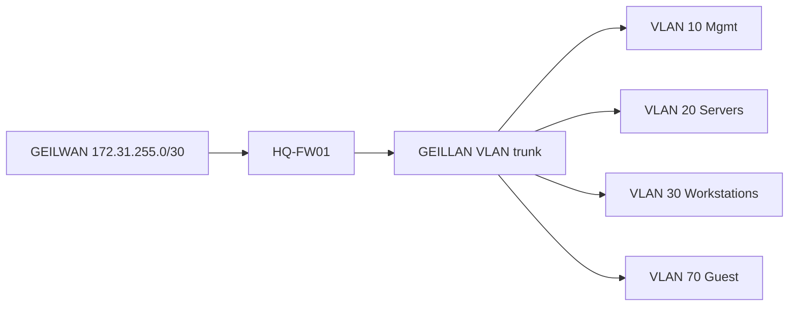
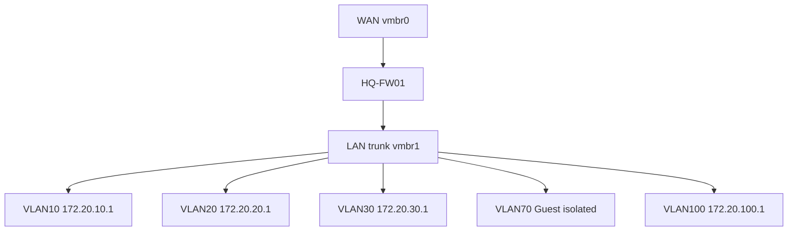
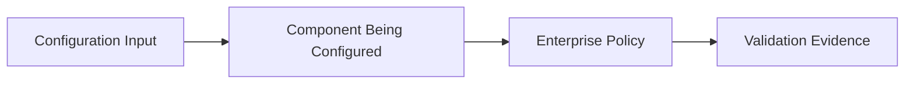

# OPNsense HQ Foundation Implementation Runbook

## Document Control

| Field | Value |
|---|---|
| Document ID | GEIL-PLAT-OPN-HQ-IMPL-001 |
| Owner | Infrastructure Engineering |
| Status | Superseded |
| Version | 2.1 |
| Last Reviewed | 2026-06-29 |
| Review Cycle | Quarterly |
| Classification | Internal Confidential |

## Superseded Notice

!!! warning "Superseded"

    This OPNsense document is retained for historical reference and alternative-implementation comparison only. The active Phase 1 firewall implementation is MikroTik CHR. Use [mikrotik-chr-hq-foundation-implementation.md](mikrotik-chr-hq-foundation-implementation.md) for current deployment work.

## Purpose

This runbook implements the `HQ-FW01` OPNsense foundation for GEIL Phase 1. It converts the approved E02.R03 OPNsense LLD into deployment steps for WAN/LAN assignment, VLAN interface creation, gateways, baseline firewall rules, DNS resolver/forwarding decisions, DHCP relay preparation, validation, rollback, and evidence capture.

## Scope

Included:

- `HQ-FW01` installation and initial access.
- WAN and LAN/trunk assignment.
- VLAN interface creation for VLANs 10,20,30,40,50,60,70,80,90,100.
- Gateway/interface address configuration.
- DNS resolver and forwarding decision.
- Baseline firewall rules.
- DHCP relay preparation.
- Management access validation.
- Snapshot and configuration export checkpoints.
- Rollback and troubleshooting.

Excluded:

- AD DS, DNS, and DHCP role installation on `HQ-DC01`.
- Certificate Lifecycle Management.
- NPS or 802.1X implementation.
- Site-to-site VPN and future regional routing.

## Related HLD/LLD references

This implementation runbook is subordinate to the approved HLD and LLD baseline:

- [Enterprise Lab Blueprint HLD](../architecture/enterprise-lab-blueprint.md)
- [Enterprise Lab Network HLD](../architecture/enterprise-lab-network-hld.md)
- [Proxmox HQ Foundation LLD](proxmox-hq-foundation-lld.md)
- [OPNsense HQ Foundation LLD](opnsense-hq-foundation-lld.md)
- [Phase 1 Build Plan](phase-1-build-plan.md)
- [Phase 1 Validation Plan](phase-1-validation-plan.md)
- [Environment Specification](../project/environment-specification.md)


!!! note "Adaptation"

    This runbook uses canonical GNTECH values from the Environment Specification. VLAN gateways follow the canonical gateway pattern for the approved VLAN list: VLAN 10 uses `172.20.10.1`, VLAN 20 uses `172.20.20.1`, VLAN 30 uses `172.20.30.1`, VLAN 40 uses `172.20.40.1`, VLAN 50 uses `172.20.50.1`, VLAN 60 uses `172.20.60.1`, VLAN 70 uses `172.20.70.1`, VLAN 80 uses `172.20.80.1`, VLAN 90 uses `172.20.90.1`, and VLAN 100 uses `172.20.100.1`. `HQ-FW01` is the Phase 1 routing and firewall control point.


## Learning Objectives

After completing this guide you will understand:

- Why `HQ-FW01` is the Phase 1 routing and firewall control point.
- How WAN, LAN trunk, VLAN gateways, DNS forwarding, NAT, and firewall policy work together.
- How to build VLAN interfaces for the canonical GEIL network model.
- How to validate management access and guest isolation.
- How to export the firewall configuration and roll back risky changes.

## What You Will Build

By the end of this guide you will have:

- ✓ `HQ-FW01` installed and booting from disk.
- ✓ WAN configured on `GEILWAN` as `172.31.255.2/30`.
- ✓ LAN trunk configured on `GEILLAN`.
- ✓ VLAN gateways created for VLANs 10,20,30,40,50,60,70,80,90,100.
- ✓ Baseline firewall rules for management access and guest isolation.
- ✓ DNS forwarding and DHCP relay decisions documented.
- ✓ Snapshots and `HQ-FW01-baseline.xml` evidence captured.

## Estimated Time

60-120 minutes, excluding OPNsense ISO download time.

## Difficulty

Advanced.

This guide configures the enterprise firewall boundary. Incorrect interface mapping or firewall rule order can block management access or expose internal networks.

## Risk Level

High.

Firewall rules and interface assignments affect every later GEIL service. Take snapshots before VLAN and firewall policy changes.

## Service Impact

Maintenance window recommended.

The initial GEIL firewall has no production users yet, but management access can be interrupted during configuration.

## Architecture Overview

`HQ-FW01` sits between `GEILWAN` and `GEILLAN`. It owns the GEIL VLAN gateways and enforces inter-zone policy. Proxmox does not route between GEIL VLANs.



!!! info "Architecture references"

    Read [Enterprise Lab Network HLD](../architecture/enterprise-lab-network-hld.md), [OPNsense HQ Foundation LLD](opnsense-hq-foundation-lld.md), and [Phase 1 Validation Plan](phase-1-validation-plan.md) before using this guide.

## Background Knowledge

### What is a firewall gateway?

A firewall gateway is the IP address clients use to reach other networks. In GEIL, `HQ-FW01` owns every VLAN `.1` gateway.

### What is a VLAN interface?

A VLAN interface is a logical firewall interface attached to a tagged VLAN on the LAN trunk.

### What is DHCP relay?

DHCP relay forwards DHCP requests from a VLAN to a DHCP server on another subnet. GEIL prepares relay but does not enable it until `HQ-DC01` DHCP scopes exist.

### What is guest isolation?

Guest isolation prevents guest clients from reaching internal enterprise networks such as servers, management, backup, and hypervisors.

## Guide Screenshot Requirements

!!! example "Screenshot Required: Interface assignments"

    Path: `Interfaces -> Assignments`

    Expected result:

    - WAN is attached to the `GEILWAN` adapter.
    - LAN/trunk parent is attached to the `GEILLAN` adapter.

    Store final screenshots under `docs/assets/images/opnsense-hq-foundation-implementation/`.

!!! example "Screenshot Required: VLAN interfaces"

    Path: `Interfaces -> Other Types -> VLAN`

    Expected result:

    - VLANs 10,20,30,40,50,60,70,80,90,100 exist on the LAN trunk parent.

!!! example "Screenshot Required: Guest isolation rule"

    Path: `Firewall -> Rules -> GUESTWIFI`

    Expected result:

    - Deny rule from VLAN 70 to `172.20.0.0/16` is present and logged.

## Why This Step Matters

The firewall is the enterprise policy boundary. Correct OPNsense configuration ensures that management systems can reach required infrastructure while guest, DMZ, and future restricted networks cannot bypass policy.

## Knowledge Check

1. Why does `HQ-FW01` use `172.31.255.2/30` on WAN instead of a `172.20.x.x` address?
2. Why must VLAN 70 not relay DHCP to AD DHCP servers?
3. Why should guest deny rules be placed above broad allow rules?
4. What evidence proves that `HQ-FW01` owns the VLAN gateways?
5. Why is `HQ-FW01-baseline.xml` stored outside Git?

## Next Guide

Continue to:

- [Phase 1 Validation Plan](phase-1-validation-plan.md)

## Prerequisites

| Requirement | Value / Decision |
|---|---|
| Proxmox host | `PVE-HQ01` operational |
| Firewall VM shell | `HQ-FW01` exists with WAN `vmbr0` and LAN trunk `vmbr1` |
| OPNsense ISO | Uploaded to Proxmox ISO storage |
| Console access | Proxmox console to `HQ-FW01` |
| Management client | `HQ-MGMT01` after workstation deployment |
| WAN addressing | ISP DHCP or `<PUBLIC_IP>` if static WAN is assigned |
| Internal VLAN plan | Canonical `172.20.0.0/16` VLAN allocation |

`<PUBLIC_IP>` is used only for ISP static WAN addressing. Replace it with the ISP-assigned address/prefix and do not commit ISP credentials.

## Required access

| Access | Required For | Notes |
|---|---|---|
| Proxmox console to `HQ-FW01` | Install, assign interfaces, recover access | Required before firewall web UI is available |
| OPNsense administrative account | Configure firewall | Password must be stored in approved password manager, not Git |
| `HQ-MGMT01` browser access | Validate web management path | Used after VLAN 10 management rules exist |
| Protected storage location | Store `HQ-FW01-baseline.xml` | Do not store secrets or config exports in Git |

## Required ISO/files

| File | Purpose |
|---|---|
| OPNsense ISO | Install `HQ-FW01` |
| `HQ-FW01-baseline.xml` | Configuration export created after validation |
| Phase 1 validation evidence | Stored with implementation record outside Git if it contains sensitive details |

## Visual implementation summary

The full VLAN/security zone model is a complex architecture visual and should be migrated to a dedicated asset under `docs/assets/diagrams/opnsense-hq-foundation-lld/` per the [Visual Documentation Standard](../governance/visual-documentation-standard.md). The simplified Mermaid below is retained for implementation flow.



## Exact OPNsense deployment steps

### Step 1: Install OPNsense on `HQ-FW01`

1. Start the `HQ-FW01` VM from the OPNsense ISO.
2. Complete the standard OPNsense installation to the 40 GB virtual disk.
3. Reboot from disk.
4. Remove or disconnect the installation ISO after successful boot.

Expected result:

- `HQ-FW01` boots into OPNsense from local VM disk.

Checkpoint from Proxmox:

```bash
qm snapshot 100 CP-FW-INSTALLED --description "HQ-FW01 clean OPNsense install before VLAN policy"
```

### Step 2: Assign WAN and LAN interfaces

At the OPNsense console:

1. Assign the adapter connected to `vmbr0` as `WAN`.
2. Assign the adapter connected to `vmbr1` as the LAN/trunk parent.
3. Do not attach non-firewall guests to `vmbr0`.

Expected result:

| OPNsense Interface | Proxmox Bridge | Purpose |
|---|---|---|
| `WAN` | `vmbr0` | ISP/WAN side |
| LAN parent | `vmbr1` | Internal VLAN trunk |

Validation:

- WAN shows link state according to ISP handoff.
- LAN parent exists and is available for VLAN creation.

### Step 3: Configure VLAN interfaces

In OPNsense web UI or console-assisted GUI:

1. Navigate to Interfaces -> Other Types -> VLAN.
2. Create VLANs on the LAN trunk parent for each canonical VLAN.
3. Assign each VLAN as an interface.
4. Name interfaces using the interface names below.

| Interface Name | VLAN | Static IPv4 |
|---|---:|---|
| `MGMT` | 10 | `172.20.10.1/24` |
| `SERVERS` | 20 | `172.20.20.1/24` |
| `WORKSTATIONS` | 30 | `172.20.30.1/24` |
| `PRINTERS` | 40 | `172.20.40.1/24` |
| `VOICE` | 50 | `172.20.50.1/24` |
| `CORPWIFI` | 60 | `172.20.60.1/24` |
| `GUESTWIFI` | 70 | `172.20.70.1/24` |
| `DMZ` | 80 | `172.20.80.1/24` |
| `BACKUP` | 90 | `172.20.90.1/24` |
| `HYPERVISORS` | 100 | `172.20.100.1/24` |

Checkpoint from Proxmox after interface validation:

```bash
qm snapshot 100 CP-FW-VLANS --description "HQ-FW01 VLAN gateways configured"
```

## Gateway configuration

`HQ-FW01` is the default gateway for every Phase 1 VLAN.

| VLAN | Gateway |
|---:|---|
| 10 | `172.20.10.1` |
| 20 | `172.20.20.1` |
| 30 | `172.20.30.1` |
| 40 | `172.20.40.1` |
| 50 | `172.20.50.1` |
| 60 | `172.20.60.1` |
| 70 | `172.20.70.1` |
| 80 | `172.20.80.1` |
| 90 | `172.20.90.1` |
| 100 | `172.20.100.1` |

WAN gateway is learned from ISP DHCP unless GNTECH receives static WAN addressing. Static WAN values use `<PUBLIC_IP>` only until the ISP-provided address is known.

## DNS resolver/forwarding decision

Phase 1 has two DNS states:

| State | Decision |
|---|---|
| Before `HQ-DC01` AD DNS exists | `HQ-FW01` may provide temporary DNS forwarding for installation/bootstrap only |
| After `HQ-DC01` AD DNS exists | Domain clients use `172.20.20.11` and future `172.20.20.12` for DNS |

Rules:

- `corp.gntech.me` resolution is authoritative on AD DNS after `HQ-DC01` is promoted.
- `HQ-FW01` must not become the long-term resolver for domain clients.
- Guest WiFi may use firewall-controlled public resolver policy.
- Prevent uncontrolled client DNS egress after domain DNS is available.

## Baseline firewall rules

Apply default deny between internal zones and then add minimum approved flows.

| Rule | Interface | Source | Destination | Service | Action | Description |
|---|---|---|---|---|---|---|
| 1 | `MGMT` | `172.20.10.0/24` | `172.20.10.1` | HTTPS | Allow | Firewall management from management zone |
| 2 | `MGMT` | `172.20.10.10` | `172.20.10.1` | HTTPS | Allow | `HQ-MGMT01` firewall management |
| 3 | `MGMT` | `172.20.10.10` | `172.20.100.11` | TCP 8006 | Allow | `HQ-MGMT01` Proxmox management |
| 4 | `MGMT` | `172.20.10.10` | `172.20.20.11` | RDP/WinRM as approved | Allow | `HQ-MGMT01` management of `HQ-DC01` |
| 5 | `WORKSTATIONS` | `172.20.30.0/24` | `172.20.20.11` | DNS/Kerberos/LDAP/SMB/NTP after AD exists | Allow | Domain client prerequisites |
| 6 | `CORPWIFI` | `172.20.60.0/24` | `172.20.20.11` | DNS/Kerberos/LDAP/NTP after AD exists | Allow | Corporate WiFi domain access |
| 7 | `GUESTWIFI` | `172.20.70.0/24` | WAN | HTTP/HTTPS/DNS policy | Allow | Guest internet access |
| 8 | `GUESTWIFI` | `172.20.70.0/24` | `172.20.0.0/16` | Any | Deny | Guest internal isolation |
| 9 | All internal | Any | Any | Any | Deny | Explicit default deny |

Implementation notes:

- Place specific allow rules above deny rules.
- Log guest-to-internal denies during validation.
- Restrict management rules to `HQ-MGMT01` where possible rather than the full workstation VLAN.
- Add no DMZ allow rules during Phase 1 unless approved by architecture review.

## DHCP relay preparation

Do not enable AD DHCP relay until `HQ-DC01` has the DHCP role and scopes.

Preparation decisions:

| VLAN | Relay Target | Timing |
|---:|---|---|
| 30 | `172.20.20.11` | After `WORKSTATIONS-HQ` DHCP scope exists |
| 40 | `172.20.20.11` | After `PRINTERS-HQ` DHCP scope exists |
| 60 | `172.20.20.11` | After `CORPWIFI-HQ` DHCP scope exists |
| 70 | None to AD DHCP | Guest DHCP remains isolated |

After `HQ-DC01` DHCP is ready, configure relay only for the approved VLANs and validate leases.

## Management access validation

From `HQ-MGMT01`:

```powershell
Test-NetConnection 172.20.10.1 -Port 443
Test-NetConnection 172.20.100.11 -Port 8006
Test-NetConnection 172.20.20.11 -Port 3389
```

From a guest VLAN 70 test client:

```powershell
Test-NetConnection 172.20.20.11 -Port 53
Test-NetConnection 172.20.100.11 -Port 8006
```

Expected result:

- `HQ-MGMT01` reaches approved management destinations.
- Guest VLAN 70 cannot reach internal destinations.

## Snapshot checkpoints and configuration export

After baseline policy validation:

```bash
qm snapshot 100 CP-FW-BASELINE-RULES --description "HQ-FW01 baseline firewall rules validated"
```

From OPNsense:

1. Navigate to System -> Configuration -> Backups.
2. Download configuration backup.
3. Save as `HQ-FW01-baseline.xml` in protected storage outside Git.

## Rollback procedures

### Revert firewall VM to clean install

```bash
qm rollback 100 CP-FW-INSTALLED
```

Use when VLAN/interface configuration is unrecoverable.

### Revert to VLAN gateway baseline

```bash
qm rollback 100 CP-FW-VLANS
```

Use when firewall rules break management or routing.

### Restore OPNsense configuration export

1. Open OPNsense console or web UI.
2. Navigate to System -> Configuration -> Backups.
3. Restore `HQ-FW01-baseline.xml` from protected storage.
4. Reboot if required.
5. Re-run management validation.

## Validation commands

From Proxmox:

```bash
qm config 100
qm listsnapshot 100
```

From `HQ-MGMT01`:

```powershell
Test-NetConnection 172.20.10.1 -Port 443
Test-NetConnection 172.20.100.11 -Port 8006
Test-NetConnection 172.20.20.11 -Port 3389
Test-NetConnection 172.20.70.1 -Port 53
```

From OPNsense diagnostics:

- Confirm interfaces are up.
- Confirm firewall log shows expected denies for Guest WiFi to internal networks.
- Confirm WAN has a default route.

## Troubleshooting

| Symptom | Likely Cause | Action |
|---|---|---|
| Cannot reach OPNsense web UI | Management allow rule missing or wrong VLAN | Use console, verify `MGMT` and `WORKSTATIONS` rules |
| VLAN gateway not reachable | VLAN tag missing on trunk or interface disabled | Check Proxmox `vmbr1`, OPNsense VLAN parent, and interface enablement |
| Guest can reach internal network | Missing deny rule or rule order problem | Move guest deny above broader allow; retest and capture logs |
| No WAN connectivity | WAN adapter mapped to wrong bridge or ISP issue | Verify `HQ-FW01` net0 on `vmbr0` and WAN status |
| Domain client cannot resolve names | DNS still pointing to firewall after AD DNS exists | Update DHCP options or static DNS to `172.20.20.11` |
| DHCP relay not working | Relay enabled before DHCP role/scope exists | Keep relay disabled until `HQ-DC01` DHCP is implemented |

## Evidence to capture

- Screenshot/export of `HQ-FW01` interface assignments.
- VLAN interface list with IP addresses.
- Firewall rule export or screenshots for baseline rules.
- OPNsense route table showing WAN default route.
- `HQ-FW01-baseline.xml` stored outside Git.
- Firewall log evidence for Guest WiFi deny tests.
- PowerShell validation transcript from `HQ-MGMT01`.
- Snapshot list showing `CP-FW-INSTALLED`, `CP-FW-VLANS`, and `CP-FW-BASELINE-RULES`.

## Completion criteria

This runbook is complete when:

1. `HQ-FW01` owns all canonical VLAN gateways.
2. WAN/LAN assignments match the LLD.
3. Baseline firewall policy is applied and validated.
4. Guest WiFi is isolated from internal networks.
5. `HQ-MGMT01` can reach approved management destinations.
6. DHCP relay decisions are documented and relay is not enabled prematurely.
7. OPNsense config export and snapshots exist.
8. Evidence is captured for the implementation record.


## Deployment operator checklist

### Exact objective

Deploy `HQ-FW01` as the GEIL routing and firewall boundary without touching the existing Proxmox `PROD` and `TEST` networks. `HQ-FW01` must use `GEILWAN` for WAN transit and `GEILLAN` for the VLAN-aware LAN trunk.

### Before you begin

1. Confirm `PVE-HQ01` has `GEILWAN` and `GEILLAN` visible in the Proxmox GUI.
2. Confirm `HQ-FW01` VM has two NICs only: WAN on `GEILWAN`, LAN on `GEILLAN`.
3. Confirm no `HQ-FW01` adapter is attached to `PROD`, `TEST`, `eno1`, or `VSW4001`.
4. Confirm you have Proxmox console access to `HQ-FW01`.
5. Confirm you can revert to `CP-FW-INSTALLED` if OPNsense configuration locks out management.

!!! warning "Operator Notes"

    `GEILWAN` is the Proxmox-to-OPNsense WAN transit network. Configure `GEILWAN` on Proxmox as `172.31.255.1/30` and configure the `HQ-FW01` WAN interface as `172.31.255.2/30`. This is not the GEIL enterprise LAN. GEIL enterprise VLANs still use `172.20.0.0/16` behind `HQ-FW01`.

### Expected starting state

- `HQ-FW01` VM exists.
- NIC 1 is on `GEILWAN`.
- NIC 2 is on `GEILLAN`.
- OPNsense ISO is attached or OPNsense is already installed.
- No VLAN interfaces are required to exist yet.

### Expected ending state

- `HQ-FW01` WAN is `172.31.255.2/30` on GEILWAN.
- `HQ-FW01` LAN trunk carries VLANs 10,20,30,40,50,60,70,80,90,100.
- VLAN gateways use canonical `172.20.x.1/24` addresses.
- Baseline firewall rules enforce management access and guest isolation.
- DNS forwarding is limited to bootstrap needs and does not replace AD DNS.
- DHCP relay is prepared but not enabled until `HQ-DC01` DHCP scopes exist.
- `HQ-FW01-baseline.xml` is exported outside Git.

## Copy/Paste Implementation Blocks

### Step 1: Confirm VM NIC mapping from Proxmox

Run on `PVE-HQ01`:

```bash
qm config 100 | egrep 'name|net0|net1'
```

Expected output pattern:

```text
name: HQ-FW01
net0: virtio=...,bridge=GEILWAN
net1: virtio=...,bridge=GEILLAN
```

Rollback if incorrect:

```bash
qm stop 100
qm set 100 --net0 virtio,bridge=GEILWAN
qm set 100 --net1 virtio,bridge=GEILLAN
qm config 100 | egrep 'net0|net1'
```

### Step 2: Configure WAN interface

GUI path:

```text
OPNsense Console -> Assign interfaces
OPNsense Web UI -> Interfaces -> WAN
```

WAN settings:

| Setting | Value |
|---|---|
| Interface | WAN |
| Address family | IPv4 |
| IPv4 configuration type | Static IPv4 for GEILWAN transit |
| IPv4 address | `172.31.255.2/30` |
| Upstream gateway | `172.31.255.1` if using Proxmox transit as upstream for lab bootstrap |

Validation from OPNsense diagnostics or console:

```text
WAN address: 172.31.255.2/30
WAN gateway/transit peer: 172.31.255.1
```

Rollback:

- Revert WAN assignment from console if web UI access fails.
- Restore `CP-FW-INSTALLED` if interface mapping becomes unrecoverable.

### Step 3: Configure LAN trunk parent

GUI path:

```text
Interfaces -> Assignments
```

Actions:

1. Confirm the second NIC is assigned as the LAN/trunk parent.
2. Do not assign production services to the untagged parent.
3. Use the parent only for VLAN child interfaces.

Validation:

- Parent interface is up.
- VLAN child interfaces can be created on the parent.

### Step 4: Create VLAN interfaces

GUI path:

```text
Interfaces -> Other Types -> VLAN -> Add
```

Create these VLANs on the LAN trunk parent:

| VLAN | Interface Name | Address |
|---:|---|---|
| 10 | `MGMT` | `172.20.10.1/24` |
| 20 | `SERVERS` | `172.20.20.1/24` |
| 30 | `WORKSTATIONS` | `172.20.30.1/24` |
| 40 | `PRINTERS` | `172.20.40.1/24` |
| 50 | `VOICE` | `172.20.50.1/24` |
| 60 | `CORPWIFI` | `172.20.60.1/24` |
| 70 | `GUESTWIFI` | `172.20.70.1/24` |
| 80 | `DMZ` | `172.20.80.1/24` |
| 90 | `BACKUP` | `172.20.90.1/24` |
| 100 | `HYPERVISORS` | `172.20.100.1/24` |

Validation after each VLAN:

- Interface is enabled.
- Static IPv4 address is correct.
- The interface appears in the OPNsense interface list.

Rollback after a bad VLAN:

- Disable the incorrect VLAN interface.
- Delete the incorrect VLAN child.
- Recreate it with the correct VLAN ID and IP address.

### Step 5: DNS resolver / forwarding setup

GUI path:

```text
Services -> Unbound DNS -> General
```

Bootstrap decision:

- Before AD DNS exists, `HQ-FW01` may temporarily forward DNS for bootstrap only.
- After `HQ-DC01` AD DNS exists, domain clients must use `172.20.20.11` and future `172.20.20.12`.
- Guest WiFi DNS must remain isolated from AD DNS.

Validation:

```text
Workstation bootstrap DNS works before AD.
Domain DNS plan points to HQ-DC01 after AD DNS exists.
Guest DNS does not depend on HQ-DC01.
```

### Step 6: NAT behavior

GUI path:

```text
Firewall -> NAT -> Outbound
```

Phase 1 decision:

- Use automatic or hybrid outbound NAT only for approved internal networks during bootstrap.
- Do not NAT guest traffic into internal GEIL networks.
- Do not create port forwards during Phase 1 unless an ADR approves them.

Validation:

- Internal networks can reach required bootstrap internet destinations if allowed.
- Guest WiFi can reach internet only.
- No unsolicited inbound WAN forwards exist.

### Step 7: Baseline firewall rules

GUI path:

```text
Firewall -> Rules -> <Interface>
```

Create rules in this order:

1. Allow `HQ-MGMT01` `172.20.10.10` to `HQ-FW01` management `172.20.10.1` on HTTPS.
2. Allow `HQ-MGMT01` `172.20.10.10` to `PVE-HQ01` `172.20.100.11` on TCP 8006.
3. Allow approved management flows from `HQ-MGMT01` to `HQ-DC01` `172.20.20.11`.
4. Allow workstation-to-domain prerequisite flows only when `HQ-DC01` services exist.
5. Allow guest WiFi to internet.
6. Deny guest WiFi to `172.20.0.0/16` and log the deny.
7. Deny all other inter-zone traffic unless explicitly approved.

Validation from `HQ-MGMT01`:

```powershell
Test-NetConnection 172.20.10.1 -Port 443
Test-NetConnection 172.20.100.11 -Port 8006
Test-NetConnection 172.20.20.11 -Port 3389
```

Guest isolation validation from VLAN 70:

```powershell
Test-NetConnection 172.20.20.11 -Port 53
Test-NetConnection 172.20.100.11 -Port 8006
```

Expected result:

- Management tests from `HQ-MGMT01` pass when target services are listening.
- Guest tests to internal networks fail and are visible in firewall logs.

Rollback after risky firewall step:

- Use Proxmox console to access OPNsense.
- Disable the last changed rule or restore `CP-FW-VLANS`.
- Reapply rules one at a time with validation.

### Step 8: DHCP relay preparation

GUI path:

```text
Services -> DHCP Relay
```

Do not enable relay until DHCP scopes exist on `HQ-DC01`.

Prepared relay targets:

| VLAN | Future relay target | State now |
|---:|---|---|
| 30 | `172.20.20.11` | Prepared / disabled |
| 40 | `172.20.20.11` | Prepared / disabled |
| 60 | `172.20.20.11` | Prepared / disabled |
| 70 | None | Must not relay to AD DHCP |

Evidence:

- Screenshot showing DHCP relay is disabled or not yet configured for AD scopes.
- Note that relay enablement is blocked until DHCP scopes exist.

### Step 9: Backup/export configuration

GUI path:

```text
System -> Configuration -> Backups
```

Actions:

1. Download the configuration after baseline validation.
2. Save as `HQ-FW01-baseline.xml` in protected storage outside Git.
3. Record storage path in the E02.R05 evidence package.

Do not commit OPNsense configuration XML to Git.

### Step 10: Snapshot checkpoints

From `PVE-HQ01`:

```bash
qm snapshot 100 CP-FW-INSTALLED --description "HQ-FW01 clean install"
qm snapshot 100 CP-FW-VLANS --description "HQ-FW01 VLAN interfaces and gateways"
qm snapshot 100 CP-FW-BASELINE-RULES --description "HQ-FW01 baseline firewall rules validated"
qm listsnapshot 100
```

Expected result:

- All three snapshots appear for VM 100.

## Validation Evidence

Capture:

- OPNsense interface list.
- VLAN interface list with IP addresses.
- Firewall rule screenshots.
- NAT outbound mode screenshot.
- DNS resolver/forwarding screenshot.
- DHCP relay disabled/prepared screenshot.
- Firewall logs proving guest isolation.
- `qm config 100` and `qm listsnapshot 100` outputs.
- `HQ-FW01-baseline.xml` storage record, not the XML itself.

## Common errors

| Error | Cause | Fix |
|---|---|---|
| OPNsense WAN uses 172.20.x.x | WAN attached to LAN bridge or wrong interface assigned | Reassign WAN to GEILWAN and configure `172.31.255.2/30` |
| LAN VLANs unavailable | LAN adapter not on `GEILLAN` | Correct VM net1 to `GEILLAN` |
| Management lockout | Rule order or missing allow from `HQ-MGMT01` | Use console and restore `CP-FW-VLANS` or fix rule order |
| Guest reaches internal services | Guest deny missing or below allow rule | Add/log deny from VLAN 70 to `172.20.0.0/16` above broad allows |
| DHCP relay sends guest traffic to AD | VLAN 70 included in relay | Remove VLAN 70 from relay immediately |
| DNS remains on firewall after AD | DHCP/static DNS not updated | Move domain clients to `172.20.20.11` after AD DNS exists |

## Acceptance criteria for this runbook

- `HQ-FW01` WAN uses `172.31.255.2/30` on `GEILWAN`.
- `HQ-FW01` VLAN interfaces exist for all canonical GEIL VLANs.
- `HQ-FW01` is the gateway for `172.20.10.0/24` through `172.20.100.0/24` canonical VLANs.
- Baseline firewall rules allow management and deny guest-to-internal access.
- DNS forwarding is documented as bootstrap-only for domain clients.
- DHCP relay is not enabled prematurely.
- `HQ-FW01-baseline.xml` is exported to protected storage outside Git.
- Required snapshots exist.
- Validation evidence is ready for E02.R05 acceptance.


## Educational Enterprise Context

### What you are building

You are building the OPNsense HQ firewall foundation as part of the GEIL enterprise learning and deployment platform.

### Why this component exists

`HQ-FW01` is the routed security boundary for GEIL. It exists so VLANs can communicate only through explicit firewall policy.

### How this component interacts with the rest of the enterprise

GEIL uses `GEILWAN` for firewall WAN transit and `GEILLAN` as a VLAN trunk. VLAN gateways live on `HQ-FW01`, not on Proxmox.

### Internal workflow



The internal workflow is intentionally simple: define the value, apply it to the component, let the component enforce or provide the service, then capture evidence proving the expected behavior.

!!! enterprise "Enterprise pattern"

    Medium and large enterprises usually centralize inter-zone policy at firewalls or routed security gateways. GEIL starts with one firewall VM and can later evolve to redundant firewalls.

!!! implementation "GEIL deployment note"

    The GEIL deployment separates the firewall WAN transit `172.31.255.0/30` from enterprise networks under `172.20.0.0/16` to avoid mixing edge transit with internal VLAN addressing.

### Real-world enterprise usage

In real enterprises, this pattern is used to make infrastructure repeatable, auditable, and recoverable. The guide teaches the manual implementation first so future automation has a known-good target state.

### Design decisions specific to GEIL

| Decision | GEIL Position | Why it matters |
|---|---|---|
| Canonical values | Values come from the Environment Specification | Prevents conflicting hostnames, IP addresses, and service names |
| Evidence-first deployment | Each major step produces validation evidence | Makes acceptance and troubleshooting objective |
| Rollback before risk | Risky changes require checkpoints or exports | Protects the deployment from lockout or destructive mistakes |
| Simple first design | Phase 1 favors clear single-site patterns | Builds a foundation that can scale later without ambiguity |

### Alternatives considered

| Alternative | Why GEIL does not use it first |
|---|---|
| Ad hoc configuration | Hard to audit, teach, or reproduce |
| Full automation before learning | Hides the enterprise concepts from new operators |
| Untracked local notes | Cannot be reviewed, validated, or reused |
| Skipping evidence capture | Makes acceptance subjective |

### Security considerations

- Use approved administrative accounts only.
- Do not store passwords, private keys, firewall exports, or sensitive screenshots in Git.
- Apply least privilege and explicit allow rules.
- Treat management paths as privileged infrastructure.

### Performance considerations

- Validate the component under the expected Phase 1 workload before adding dependent services.
- Avoid broad troubleshooting changes that mask resource, latency, or policy issues.
- Record baseline behavior so future performance regressions are visible.

### Scalability considerations

- Keep names, VLANs, and service boundaries aligned with the HLD/LLD.
- Prefer patterns that can add a second node, second site, or automated deployment later.
- Do not hard-code temporary bootstrap decisions into long-term architecture.

### Operational considerations

- Capture screenshots and command output during deployment.
- Record known exceptions immediately.
- Re-run validation after every rollback or remediation.
- Update this guide when real deployment discovers a better operator note.

### Explanation depth for important values

| Value Type | What it is | Why GEIL uses it | What happens if it changes | Customizable? |
|---|---|---|---|---|
| Hostname | Stable component identity | Enables deterministic docs, DNS, logs, and evidence | Cross-references and monitoring become wrong | Only through Environment Specification |
| IP address | Stable network endpoint | Supports firewall rules, DNS, DHCP, and tests | Connectivity and validation can fail | Only through HLD/LLD update |
| VLAN or bridge name | Network boundary | Keeps traffic segmented and understandable | Traffic may land in the wrong zone | Only through network design update |
| Snapshot/export name | Recovery checkpoint | Makes rollback auditable | Operators may restore the wrong state | Naming can expand but not lose meaning |

### Frequently Asked Questions

#### Why does GEIL explain concepts before commands?

Because an engineer who understands the reason behind a command can troubleshoot safely when the environment differs from the happy path.

#### Can these values be customized?

Yes, but only by updating the Environment Specification and dependent HLD/LLD documents first. Implementation guides consume canonical values; they do not redefine them.

#### Why is evidence collection mandatory?

Evidence proves that implementation matched the design. It also gives future operators a baseline for troubleshooting and audits.

#### Why include rollback in every guide?

Enterprise infrastructure changes can fail even when the design is correct. Rollback guidance prevents panic-driven fixes and protects dependent services.

### Key takeaways

- GEIL guides are learning artifacts and deployment controls.
- The operator should understand why the component exists before configuring it.
- Validation and evidence are part of the implementation, not afterthoughts.
- Canonical values must come from the Environment Specification and HLD/LLD baseline.


## Deployment Validation

This guide is superseded for active Phase 1 deployment.

```text
STOP. Do not use this guide to deploy the active GEIL Phase 1 firewall.
```

Use the MikroTik CHR implementation guide for active deployment. Keep this page only as historical/alternative reference.

## Deployment Verified

| Field | Value |
|---|---|
| Validated on | Not yet field validated. Must pass this guide, the code-block audit, and clean-environment review before production execution. |
| Windows Server version | Not yet field validated |
| RouterOS version | Not applicable unless the guide explicitly configures RouterOS |
| Proxmox version | Not applicable unless the guide explicitly configures Proxmox |
| Deployment date | Not yet field validated |
| Deployment notes | Not yet field validated. Must pass this guide, the code-block audit, and clean-environment review before production execution. |
| Known caveats | Treat as documentation-ready but not field-proven until deployment evidence is captured. |
