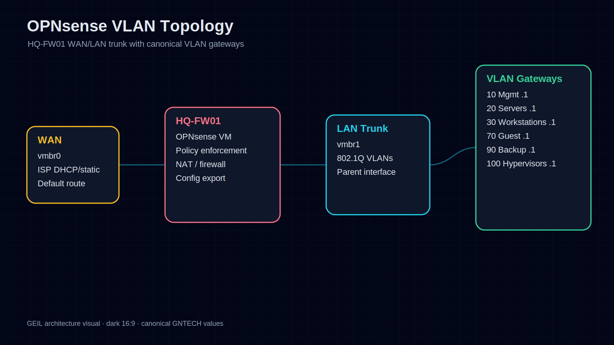
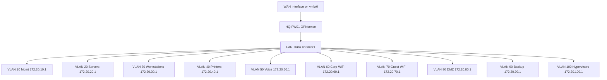
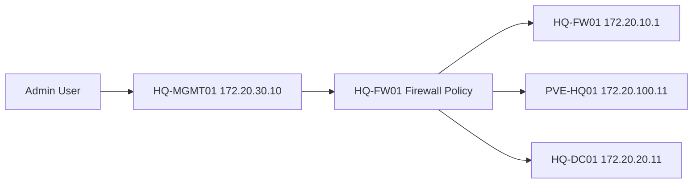

# OPNsense HQ Foundation LLD

## Document Control

| Field | Value |
|---|---|
| Document ID | GEIL-PLAT-OPN-HQ-LLD-001 |
| Owner | Infrastructure Engineering |
| Status | Approved |
| Version | 1.0 |
| Last Reviewed | 2026-06-29 |
| Review Cycle | Quarterly |
| Classification | Internal Confidential |

## Purpose

This Low-Level Design translates the E02.R02 Enterprise Lab Network HLD into deployable specifications for `HQ-FW01`, the OPNsense firewall VM for the initial HQ environment.

It defines the VM design, interface assignments, VLAN gateways, initial routing decision, DHCP relay decision, baseline firewall policy, management access path, and rollback checkpoints.

## Required HLD references

This LLD is derived from and subordinate to the E02.R02 High-Level Design baseline:

- [Enterprise Lab Blueprint HLD](../architecture/enterprise-lab-blueprint.md)
- [Enterprise Lab Network HLD](../architecture/enterprise-lab-network-hld.md)
- [Enterprise Lab Identity HLD](../architecture/enterprise-lab-identity-hld.md)
- [Enterprise Lab Operations HLD](../architecture/enterprise-lab-operations-hld.md)
- [Environment Specification](../project/environment-specification.md)

!!! note "Adaptation"

    This design uses the canonical GNTECH VLANs and addresses from [Environment Specification](../project/environment-specification.md). Do not replace known values with placeholders.

## `HQ-FW01` VM specification

| Item | Design Decision |
|---|---|
| VM name | `HQ-FW01` |
| Platform | OPNsense VM on `PVE-HQ01` |
| vCPU | 2 |
| Memory | 4 GB |
| Disk | 40 GB |
| Adapter 1 | WAN on `vmbr0` |
| Adapter 2 | LAN trunk on `vmbr1` |
| Management IP | `172.20.10.1` on VLAN 10 gateway interface |
| Role | Default gateway, firewall policy, NAT, DHCP relay where required, DNS forwarding if approved |

## Readable visual asset: OPNsense VLAN Topology

This visual presents the `HQ-FW01` WAN/LAN trunk and VLAN gateway model in a readable architecture format. It avoids the excessive fan-out that makes the full VLAN list difficult to read when rendered only as Mermaid.

!!! note "Adaptation"

    This visual uses canonical GNTECH VLAN gateway values and `HQ-FW01`. Other environments must update the Environment Specification and regenerate the visual before implementation.

## OPNsense interface and VLAN topology

## Interface assignments

| OPNsense Interface | Proxmox Attachment | VLAN | IP / Role |
|---|---|---:|---|
| `WAN` | `vmbr0` | none | ISP DHCP or `<PUBLIC_IP>` if static WAN is assigned |
| `LAN_TRUNK` parent | `vmbr1` | trunk | Parent for internal VLANs; no untagged client services |
| `MGMT` | `LAN_TRUNK` | 10 | `172.20.10.1/24` |
| `SERVERS` | `LAN_TRUNK` | 20 | `172.20.20.1/24` |
| `WORKSTATIONS` | `LAN_TRUNK` | 30 | `172.20.30.1/24` |
| `PRINTERS` | `LAN_TRUNK` | 40 | `172.20.40.1/24` |
| `VOICE` | `LAN_TRUNK` | 50 | `172.20.50.1/24` |
| `CORPWIFI` | `LAN_TRUNK` | 60 | `172.20.60.1/24` |
| `GUESTWIFI` | `LAN_TRUNK` | 70 | `172.20.70.1/24` |
| `DMZ` | `LAN_TRUNK` | 80 | `172.20.80.1/24` |
| `BACKUP` | `LAN_TRUNK` | 90 | `172.20.90.1/24` |
| `HYPERVISORS` | `LAN_TRUNK` | 100 | `172.20.100.1/24` |

`<PUBLIC_IP>` is allowed only if GNTECH receives a static ISP address. Replace it with the ISP-assigned address and prefix; do not commit ISP credentials.

## Initial routing decision

`HQ-FW01` is the only default gateway for Phase 1 VLANs. Inter-VLAN routing is centralized on `HQ-FW01` so security policy is enforceable from the first deployment.

Routing decisions:

- Default route: WAN gateway learned from ISP DHCP or configured static WAN gateway.
- Internal routes: directly connected VLAN interfaces on `HQ-FW01`.
- No layer-3 switching between VLANs during Phase 1.
- No guest access to internal routes.
- Future regional routes require architecture review before implementation.

## Initial DHCP relay decision

| VLAN | DHCP Source | Relay on `HQ-FW01` | Rationale |
|---:|---|---|---|
| 10 | Static only | No | Management infrastructure uses static addressing |
| 20 | Static only initially | No | Servers use static addressing |
| 30 | `HQ-DC01` DHCP scope | Yes, after DHCP role exists | Workstations receive central DHCP options |
| 40 | `HQ-DC01` DHCP scope | Yes, after DHCP role exists | Printers receive managed leases or reservations |
| 50 | Future voice DHCP | Deferred | Voice platform not in Phase 1 deployment |
| 60 | `HQ-DC01` DHCP scope | Yes, after DHCP role exists | Corporate WiFi receives internal DNS/domain options |
| 70 | OPNsense DHCP or isolated guest DHCP | No relay to AD DHCP | Guest WiFi is isolated and must not depend on AD |
| 80 | Static initially | No | DMZ services are explicitly assigned |
| 90 | Static only | No | Backup infrastructure uses static addressing |
| 100 | Static only | No | Hypervisors use static addressing |

## Baseline firewall rules

Default stance: deny inter-zone traffic unless explicitly allowed.

| Source | Destination | Service | Action | Reason |
|---|---|---|---|---|
| `MGMT` | `HYPERVISORS` `172.20.100.11` | HTTPS/SSH as approved | Allow | Manage `PVE-HQ01` from approved admin path |
| `MGMT` | `HQ-FW01` `172.20.10.1` | HTTPS | Allow | Manage firewall from approved admin path |
| `MGMT` | `SERVERS` | RDP/WinRM/management ports as approved | Allow | Administer `HQ-DC01` and future servers |
| `WORKSTATIONS` | `SERVERS` `172.20.20.11` | DNS, Kerberos, LDAP, SMB, NTP, DHCP relay responses | Allow | Domain join and normal domain operation |
| `CORPWIFI` | `SERVERS` `172.20.20.11` | DNS, Kerberos, LDAP, NTP as approved | Allow | Corporate WiFi domain access |
| `GUESTWIFI` | Internet | HTTP/HTTPS/DNS policy | Allow | Guest internet access |
| `GUESTWIFI` | RFC1918/internal VLANs | Any | Deny | Guest isolation |
| Any internal | `BACKUP` | Backup protocols from approved sources | Allow by exception | Backup transport only |
| Any internal | `DMZ` | Explicit published service flows | Deny until approved | No implicit DMZ trust |
| Any | Any | Any | Deny | Default deny |

## Management access flow

## Snapshot and rollback checkpoints

| Checkpoint | Timing | Rollback Use |
|---|---|---|
| `CP-FW-INSTALLED` | OPNsense installed, before VLANs | Return to clean firewall VM |
| `CP-FW-VLANS` | VLAN interfaces configured, before firewall hardening | Restore known gateway topology |
| `CP-FW-BASELINE-RULES` | Baseline rules applied and validated | Restore working Phase 1 policy |
| Config export `HQ-FW01-baseline.xml` | After baseline validation | Recover firewall config independent of VM snapshot |

## Validation requirements

1. `HQ-FW01` responds on `172.20.10.1` from approved management path.
2. Every VLAN gateway responds from a test VM on the matching VLAN.
3. Guest WiFi VLAN cannot reach `172.20.0.0/16` internal destinations.
4. `HQ-MGMT01` can reach `PVE-HQ01` and `HQ-DC01` over approved management flows.
5. `HQ-W11-001` can reach `HQ-DC01` for DNS and domain join prerequisites after AD DS exists.
6. Baseline OPNsense config export exists outside the VM.

## Related documents

- [Proxmox HQ Foundation LLD](proxmox-hq-foundation-lld.md)
- [Phase 1 Build Plan](phase-1-build-plan.md)
- [Phase 1 Validation Plan](phase-1-validation-plan.md)
