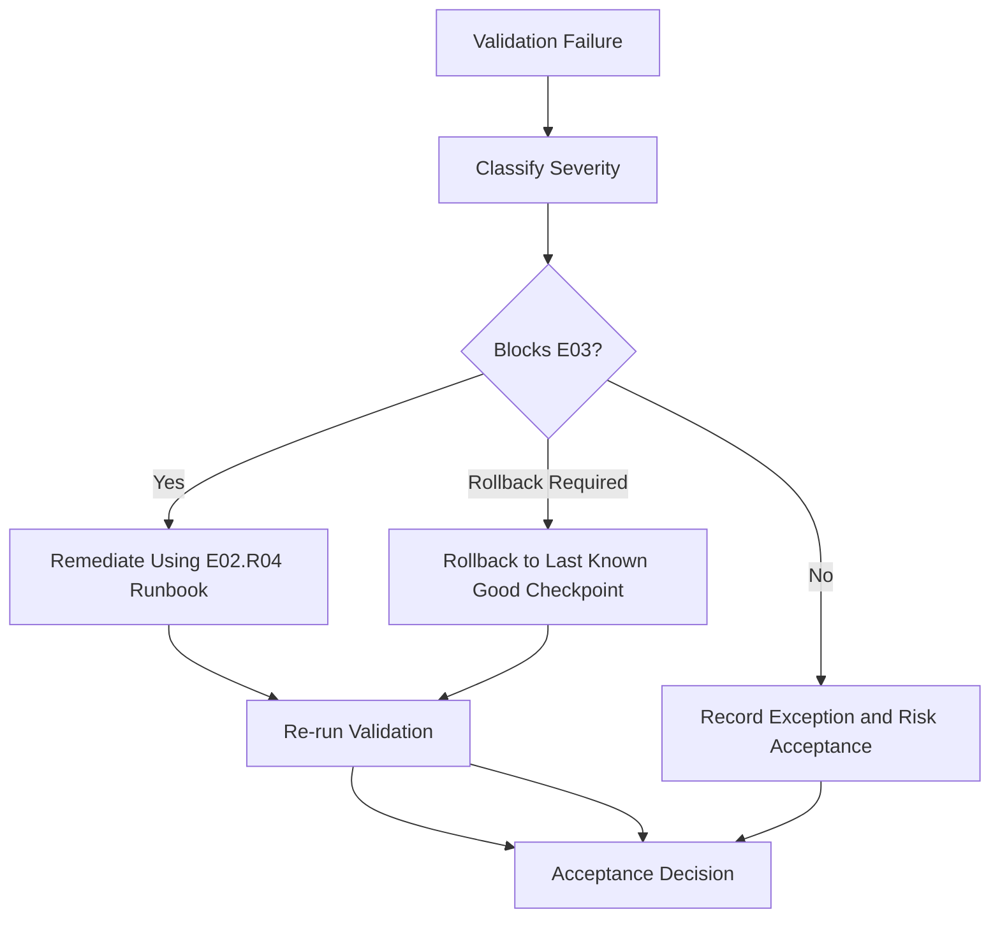

# Phase 1 Acceptance Package

## Document Control

| Field | Value |
|---|---|
| Document ID | GEIL-PLAT-PH1-ACCEPT-001 |
| Owner | Infrastructure Engineering |
| Status | Approved |
| Version | 1.1 |
| Last Reviewed | 2026-06-29 |
| Review Cycle | Quarterly |
| Classification | Internal Confidential |

## Purpose

This document defines the formal evidence and acceptance package required to prove that E02.R04 HQ Foundation Implementation Runbooks were completed correctly before GEIL moves into Microsoft identity services.

The package is a quality gate. E03 Microsoft identity, DNS/DHCP implementation, PKI, NPS, or Certificate Lifecycle Management must not start until the acceptance package is complete, reviewed, and signed off or all exceptions are explicitly accepted.

## Scope

Included:

- Evidence rules for `PVE-HQ01`, `HQ-FW01`, `HQ-DC01`, `HQ-MGMT01`, and `HQ-W11-001` foundation readiness.
- Screenshot and command-output evidence requirements.
- Proxmox host and VM evidence.
- Proxmox network bridge evidence.
- RouterOS interface, VLAN gateway, firewall, routing, DNS forwarding, and DHCP relay readiness evidence.
- Snapshot and rollback readiness evidence.
- Known exceptions register.
- Acceptance criteria and sign-off section.
- Remediation workflow when validation fails.

Excluded:

- AD DS promotion of `HQ-DC01`.
- Microsoft DNS/DHCP role implementation.
- PKI, NPS, Certificate Lifecycle Management, or Microsoft cloud integration.
- Production workload acceptance beyond the Phase 1 HQ foundation.

## Required HLD/LLD references

This acceptance package validates the implementation against the approved architecture and low-level design baseline:

- [Enterprise Lab Blueprint HLD](../architecture/enterprise-lab-blueprint.md)
- [Enterprise Lab Network HLD](../architecture/enterprise-lab-network-hld.md)
- [Proxmox HQ Foundation LLD](proxmox-hq-foundation-lld.md)
- [MikroTik CHR HQ Foundation LLD](mikrotik-chr-hq-foundation-lld.md)
- [Phase 1 Build Plan](phase-1-build-plan.md)
- [Phase 1 Validation Plan](phase-1-validation-plan.md)
- [Environment Specification](../project/environment-specification.md)

## Required implementation runbook references

The following runbooks must be complete before acceptance:

- [Proxmox HQ Foundation Implementation Runbook](proxmox-hq-foundation-implementation.md)
- [MikroTik CHR HQ Foundation Implementation Guide](mikrotik-chr-hq-foundation-implementation.md)

!!! note "Adaptation"

    This acceptance package uses canonical GNTECH values from the Environment Specification, including `PVE-HQ01`, `HQ-FW01`, `HQ-DC01`, `HQ-MGMT01`, `HQ-W11-001`, `corp.gntech.me`, and `172.20.0.0/16`. Do not replace these values inside GEIL documents unless the Environment Specification changes first.

## Evidence collection rules

1. Evidence must prove the implemented state, not only the intended design.
2. Evidence must be captured after final validation, not before rollback or rule changes.
3. Evidence containing secrets, tokens, private keys, passwords, API keys, serial numbers, or full configuration exports must not be committed to Git.
4. Evidence stored outside Git must be referenced by evidence ID, storage location, capture date, and owner.
5. Screenshots must show the relevant object name, IP address, interface, rule, or checkpoint.
6. Command output must include the command, host, execution context, date, and expected-result note.
7. If a validation cannot be completed, record it in the known exceptions register before sign-off.
8. Any accepted exception must have owner, risk, compensating control, and remediation date.

## Evidence package naming

Recommended evidence package identifier:

```text
GEIL-E02R05-HQ-FOUNDATION-ACCEPTANCE-YYYYMMDD
```

Recommended evidence storage layout outside Git:

```text
GEIL-E02R05-HQ-FOUNDATION-ACCEPTANCE-YYYYMMDD/
  01-proxmox/
  02-network-bridges/
  03-mikrotik-chr/
  04-validation/
  05-rollback/
  06-exceptions/
  acceptance-record.md
```

## Screenshot requirements

| ID | Screenshot | Required Detail | Source |
|---|---|---|---|
| SS-001 | Proxmox node summary | `PVE-HQ01`, version, node status | Proxmox UI |
| SS-002 | Proxmox network view | `vmbr0`, `vmbr1`, `vmbr100`; VLAN-aware state for `vmbr1` | Proxmox UI |
| SS-003 | `HQ-FW01` hardware | net0 on `vmbr0`, net1 on `vmbr1` | Proxmox UI |
| SS-004 | `HQ-DC01` hardware | net0 on `vmbr1` with VLAN tag 20 | Proxmox UI |
| SS-005 | `HQ-MGMT01` hardware | net0 on `vmbr1` with VLAN tag 30 | Proxmox UI |
| SS-006 | `HQ-W11-001` hardware | net0 on `vmbr1` with VLAN tag 30 | Proxmox UI |
| SS-007 | RouterOS interface assignments | WAN and LAN trunk parent are visible | RouterOS CLI / WinBox |
| SS-008 | RouterOS VLAN interfaces | VLAN interfaces 10,20,30,40,50,60,70,80,90,100 | RouterOS CLI / WinBox |
| SS-009 | MikroTik CHR firewall rules | Baseline allow and deny rules | RouterOS CLI / WinBox |
| SS-010 | RouterOS routes | WAN default route and connected internal routes | RouterOS CLI / WinBox |
| SS-011 | RouterOS export backup page | Evidence that `HQ-FW01-baseline.xml` was exported | RouterOS CLI / WinBox |
| SS-012 | Snapshot inventory | Required VM checkpoints exist | Proxmox UI |

## Command output requirements

| ID | Host / Context | Command | Expected Evidence |
|---|---|---|---|
| CMD-001 | `PVE-HQ01` shell | `hostname` | Returns `PVE-HQ01` |
| CMD-002 | `PVE-HQ01` shell | `ip -brief addr` | Shows expected bridge addresses including `172.20.100.11` |
| CMD-003 | `PVE-HQ01` shell | `ip route` | Default route uses `172.20.100.1` |
| CMD-004 | `PVE-HQ01` shell | `bridge vlan show` | `vmbr1` carries VLANs 10,20,30,40,50,60,70,80,90,100 |
| CMD-005 | `PVE-HQ01` shell | `qm config 100` | `HQ-FW01` uses `vmbr0` and `vmbr1` |
| CMD-006 | `PVE-HQ01` shell | `qm config 110` | `HQ-DC01` uses VLAN tag 20 |
| CMD-007 | `PVE-HQ01` shell | `qm config 120` | `HQ-MGMT01` uses VLAN tag 30 |
| CMD-008 | `PVE-HQ01` shell | `qm config 121` | `HQ-W11-001` uses VLAN tag 30 |
| CMD-009 | `PVE-HQ01` shell | `qm listsnapshot 100` | `CP-FW-INSTALLED`, `CP-FW-VLANS`, `CP-FW-BASELINE-RULES` exist |
| CMD-010 | `PVE-HQ01` shell | `qm listsnapshot 110` | `CP-DC01-OS` exists |
| CMD-011 | `PVE-HQ01` shell | `qm listsnapshot 120` | `CP-MGMT01-OS` exists |
| CMD-012 | `PVE-HQ01` shell | `qm listsnapshot 121` | `CP-W11-001-OS` exists |
| CMD-013 | `HQ-MGMT01` PowerShell | `Test-NetConnection 172.20.10.1 -Port 443` | Succeeds |
| CMD-014 | `HQ-MGMT01` PowerShell | `Test-NetConnection 172.20.100.11 -Port 8006` | Succeeds |
| CMD-015 | `HQ-MGMT01` PowerShell | `Test-NetConnection 172.20.20.11 -Port 3389` | Succeeds only when the OS/firewall allows administrative access |
| CMD-016 | VLAN 70 test context | `Test-NetConnection 172.20.20.11 -Port 53` | Fails or is blocked by firewall policy |
| CMD-017 | VLAN 70 test context | `Test-NetConnection 172.20.100.11 -Port 8006` | Fails or is blocked by firewall policy |

## Proxmox evidence

| Evidence ID | Requirement | Pass Criteria | Evidence Location |
|---|---|---|---|
| PVE-001 | `PVE-HQ01` identity | Hostname and UI show `PVE-HQ01` | |
| PVE-002 | Host version | Proxmox version captured | |
| PVE-003 | Management IP | `172.20.100.11/24` configured | |
| PVE-004 | Default gateway | `172.20.100.1` configured | |
| PVE-005 | ISO storage | Required ISOs present or documented as staged | |
| PVE-006 | VM inventory | `HQ-FW01`, `HQ-DC01`, `HQ-MGMT01`, `HQ-W11-001` exist | |

## Network bridge evidence

| Evidence ID | Requirement | Pass Criteria | Evidence Location |
|---|---|---|---|
| BR-001 | `vmbr0` WAN bridge | Exists and is used only by `HQ-FW01` WAN | |
| BR-002 | `vmbr1` LAN trunk | Exists and is VLAN-aware | |
| BR-003 | `vmbr1` VLAN set | Carries VLANs 10,20,30,40,50,60,70,80,90,100 | |
| BR-004 | `vmbr100` management | Exists or approved equivalent management design is documented | |
| BR-005 | No Proxmox inter-VLAN routing | Inter-VLAN routing remains on `HQ-FW01` | |

## MikroTik CHR evidence

| Evidence ID | Requirement | Pass Criteria | Evidence Location |
|---|---|---|---|
| OPN-001 | `HQ-FW01` VM installation | MikroTik CHR boots from VM disk | |
| OPN-002 | WAN assignment | WAN is mapped to `vmbr0` | |
| OPN-003 | LAN trunk assignment | LAN trunk parent is mapped to `vmbr1` | |
| OPN-004 | Management access | RouterOS CLI / WinBox reachable from approved path | |
| OPN-005 | Config export | `HQ-FW01-baseline.xml` exported and stored outside Git | |

## VLAN gateway evidence

| VLAN | Interface | Gateway | Evidence Required |
|---:|---|---|---|
| 10 | `MGMT` | `172.20.10.1/24` | Interface screenshot and connectivity test |
| 20 | `SERVERS` | `172.20.20.1/24` | Interface screenshot and connectivity test |
| 30 | `WORKSTATIONS` | `172.20.30.1/24` | Interface screenshot and connectivity test |
| 40 | `PRINTERS` | `172.20.40.1/24` | Interface screenshot or deferred-use note |
| 50 | `VOICE` | `172.20.50.1/24` | Interface screenshot or deferred-use note |
| 60 | `CORPWIFI` | `172.20.60.1/24` | Interface screenshot or deferred-use note |
| 70 | `GUESTWIFI` | `172.20.70.1/24` | Interface screenshot and isolation test |
| 80 | `DMZ` | `172.20.80.1/24` | Interface screenshot or deferred-use note |
| 90 | `BACKUP` | `172.20.90.1/24` | Interface screenshot and reservation for `PBS-HQ01` |
| 100 | `HYPERVISORS` | `172.20.100.1/24` | Interface screenshot and `PVE-HQ01` reachability |

## Firewall rule evidence

Required evidence:

1. Default deny posture between zones.
2. Management allow rules from approved sources.
3. `HQ-MGMT01` access to `HQ-FW01`, `PVE-HQ01`, and `HQ-DC01` as approved.
4. Guest WiFi deny rules to `172.20.0.0/16`.
5. No DMZ implicit allow rules.
6. Rule order showing specific allows above denies.
7. Firewall log evidence for at least one guest-to-internal deny test.

## Routing evidence

| Evidence ID | Requirement | Pass Criteria | Evidence Location |
|---|---|---|---|
| RT-001 | WAN default route | `HQ-FW01` has an active WAN default route | |
| RT-002 | Internal connected routes | RouterOS lists connected routes for canonical VLANs | |
| RT-003 | No layer-3 switching | Core switching does not bypass `HQ-FW01` policy | |
| RT-004 | No regional routes | No future regional routes exist in Phase 1 unless approved | |

## DNS forwarding evidence

| State | Required Evidence | Acceptance Criteria |
|---|---|---|
| Before AD DNS | Temporary resolver/forwarding behavior is documented | Bootstrap name resolution works without becoming permanent design |
| After AD DNS | Domain client DNS points to `172.20.20.11` and future `172.20.20.12` | `HQ-FW01` is not the long-term DNS resolver for domain clients |
| Guest WiFi | Guest DNS policy is isolated from AD DNS | Guest clients do not depend on `HQ-DC01` |

If AD DNS is not yet deployed, record the current state as `Pre-AD DNS` and require follow-up validation in the Microsoft identity release.

## DHCP relay readiness evidence

Relay must not be enabled prematurely. Required readiness evidence:

| VLAN | Future Relay Target | Required Evidence |
|---:|---|---|
| 30 | `172.20.20.11` | Relay disabled or staged until `WORKSTATIONS-HQ` scope exists |
| 40 | `172.20.20.11` | Relay disabled or staged until `PRINTERS-HQ` scope exists |
| 60 | `172.20.20.11` | Relay disabled or staged until `CORPWIFI-HQ` scope exists |
| 70 | None | Guest DHCP remains isolated and does not relay to AD DHCP |

Acceptance criteria:

- Relay configuration does not send guest traffic to AD DHCP.
- Relay enablement is deferred until DHCP scopes exist on `HQ-DC01`.
- Any temporary DHCP arrangement is documented with owner and expiry.

## Snapshot checkpoint evidence

| Checkpoint | Target | Required Evidence |
|---|---|---|
| `CP-PVE-BASELINE` | `PVE-HQ01` config export | `/etc/network/interfaces` baseline and version output captured |
| `CP-FW-INSTALLED` | `HQ-FW01` | Proxmox snapshot inventory |
| `CP-FW-VLANS` | `HQ-FW01` | Proxmox snapshot inventory |
| `CP-FW-BASELINE-RULES` | `HQ-FW01` | Proxmox snapshot inventory |
| `CP-DC01-OS` | `HQ-DC01` | Proxmox snapshot inventory |
| `CP-MGMT01-OS` | `HQ-MGMT01` | Proxmox snapshot inventory |
| `CP-W11-001-OS` | `HQ-W11-001` | Proxmox snapshot inventory |

## Rollback readiness evidence

Rollback readiness is accepted only when:

1. `PVE-HQ01` network baseline export exists.
2. `HQ-FW01-baseline.xml` exists outside Git in protected storage.
3. Required VM snapshots exist or an approved equivalent recovery method is documented.
4. Console access to `PVE-HQ01` is available for emergency management recovery.
5. Rollback owner is identified.
6. Rollback test or table-top validation is recorded.

## Known exceptions register

Use this register for any validation gap. Do not leave rows blank in the final acceptance record; mark `None` if there are no exceptions.

| Exception ID | Area | Description | Risk | Compensating Control | Owner | Remediation Date | Accepted By |
|---|---|---|---|---|---|---|---|
| EX-001 | None | No known exception at document publication time | None | None | Infrastructure Engineering | Not applicable | Not applicable |

## Acceptance criteria

E02.R05 is accepted only when all criteria are met:

1. Required HLD, LLD, build, validation, and implementation runbook references are linked.
2. `PVE-HQ01` host, network, and bridge evidence is complete.
3. `HQ-FW01` interface, VLAN, gateway, firewall, route, DNS, and DHCP relay readiness evidence is complete.
4. VM shell evidence exists for `HQ-DC01`, `HQ-MGMT01`, and `HQ-W11-001`.
5. Guest isolation evidence proves VLAN 70 cannot reach internal `172.20.0.0/16` resources.
6. Management path evidence proves `HQ-MGMT01` can reach approved management targets.
7. Snapshot and rollback readiness evidence is complete.
8. Known exceptions are either closed or formally accepted.
9. No evidence containing secrets is committed to Git.
10. `mkdocs build --strict` passes after all documentation updates.

## Sign-off section

| Role | Name | Decision | Date | Notes |
|---|---|---|---|---|
| Infrastructure Engineering Owner |  | Approved / Rejected |  |  |
| Security Reviewer |  | Approved / Rejected |  |  |
| Operations Reviewer |  | Approved / Rejected |  |  |
| Project Sponsor |  | Approved / Rejected |  |  |

Sign-off decision values:

- Approved: E02.R04 implementation evidence is accepted and E03 planning may begin.
- Approved with Exceptions: E03 planning may begin only for areas not affected by accepted exceptions.
- Rejected: Remediation is required before moving forward.

## Remediation workflow if validation fails



Remediation rules:

1. P0 failures that affect management access, routing, firewall policy, or rollback readiness block E03.
2. Remediation must use the approved E02.R04 implementation runbooks.
3. Any rollback must use the documented checkpoint or config export.
4. Retest evidence must replace failed evidence in the final package.
5. Accepted exceptions must be visible in the known exceptions register.

## Final acceptance record template

```text
Acceptance Package: GEIL-E02R05-HQ-FOUNDATION-ACCEPTANCE-YYYYMMDD
Environment: GNTECH HQ
Validated Release: E02.R04 HQ Foundation Implementation Runbook
Accepted Release: E02.R05 HQ Foundation Evidence and Acceptance Package
Decision: Approved / Approved with Exceptions / Rejected
Evidence Location: protected evidence repository path
Known Exceptions: None / see exceptions register
Next Authorized Release: E03.R04 Certificate Lifecycle Management or approved successor
```

## Related documents

- [Proxmox HQ Foundation Implementation Runbook](proxmox-hq-foundation-implementation.md)
- [MikroTik CHR HQ Foundation Implementation Guide](mikrotik-chr-hq-foundation-implementation.md)
- [Phase 1 Validation Plan](phase-1-validation-plan.md)
- [Enterprise Lab Blueprint HLD](../architecture/enterprise-lab-blueprint.md)
- [Enterprise Lab Network HLD](../architecture/enterprise-lab-network-hld.md)
- [Environment Specification](../project/environment-specification.md)


## Operator evidence capture checklist

### Exact objective

Create a complete acceptance record that a future engineer can use to prove E02.R04 was implemented correctly without relying on memory or informal notes.

### Evidence required for discovered deployment conditions

| Evidence ID | Requirement | Expected Evidence |
|---|---|---|
| OP-001 | Existing Proxmox network preserved | Screenshot or text export showing `eno1`, `VSW4001`, `PROD`, and `TEST` unchanged |
| OP-002 | GEILWAN configured | `ip -brief addr show GEILWAN` showing `172.31.255.1/30` |
| OP-003 | HQ-FW01 WAN configured | MikroTik CHR screenshot showing WAN `172.31.255.2/30` |
| OP-004 | GEILLAN GUI visibility | Proxmox Network screenshot showing `GEILLAN` from `/etc/network/interfaces` |
| OP-005 | GEIL does not use 10.10.x.x | VM config output showing GEIL VMs do not attach to `PROD` or `TEST` |
| OP-006 | Documentation build hygiene | `git ls-files site | wc -l` returns `0` |

### Acceptance operator notes

!!! warning "Operator Notes"

    Do not accept E02.R05 if the GEIL deployment modified `eno1`, `VSW4001`, `PROD`, or `TEST` without an approved change record. Do not accept E02.R05 if GEIL workloads use `10.10.x.x` networks. GEIL enterprise addressing must remain `172.20.0.0/16`, with the local firewall WAN transit using `172.31.255.0/30`.

### Remediation examples

| Failed Evidence | Remediation |
|---|---|
| `GEILWAN` not visible in GUI | Move bridge definition into `/etc/network/interfaces`; run `ifreload -a`; recapture screenshot |
| `HQ-FW01` WAN not `172.31.255.2/30` | Correct MikroTik CHR WAN settings; validate against `GEILWAN` `172.31.255.1/30` |
| GEIL VM attached to `PROD` or `TEST` | Stop VM, change NIC bridge to `GEILLAN`, set VLAN tag, recapture `qm config` |
| `site/` tracked by Git | Remove from Git tracking and confirm `.gitignore` excludes `site/` |
