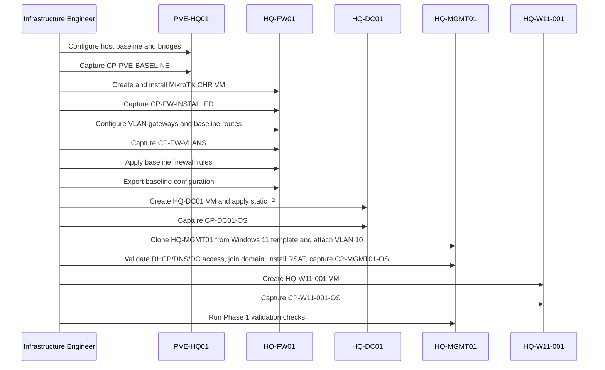
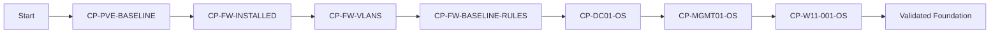
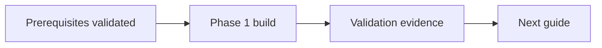

# Phase 1 Build Plan

## Document Control

| Field | Value |
|---|---|
| Document ID | GEIL-PLAT-PH1-BUILD-001 |
| Owner | Infrastructure Engineering |
| Status | Approved |
| Version | 1.1 |
| Last Reviewed | 2026-06-29 |
| Review Cycle | Quarterly |
| Classification | Internal Confidential |

## Purpose

This document defines the implementation-ready Phase 1 deployment sequence for the initial HQ environment. It translates the E02.R03 LLD into an ordered build plan with checkpoints, dependencies, and rollback gates.


## Required HLD references

This LLD is derived from and subordinate to the E02.R02 High-Level Design baseline:

- [Enterprise Lab Blueprint HLD](../architecture/enterprise-lab-blueprint.md)
- [Enterprise Lab Network HLD](../architecture/enterprise-lab-network-hld.md)
- [Enterprise Lab Identity HLD](../architecture/enterprise-lab-identity-hld.md)
- [Enterprise Lab Operations HLD](../architecture/enterprise-lab-operations-hld.md)
- [Environment Specification](../project/environment-specification.md)


## Build scope

Phase 1 deploys the initial HQ foundation:

- `PVE-HQ01` Proxmox bridge/VLAN baseline.
- `HQ-FW01` MikroTik CHR VM, interfaces, VLAN gateways, and baseline rules.
- `HQ-DC01` VM shell and static network settings.
- `HQ-MGMT01` Windows 11 Enterprise management workstation / initial PAW deployed from the golden template.
- `HQ-W11-001` Windows 11 Enterprise standard user/client validation VM deployed from the golden template.
- Initial routing and DHCP relay decisions.
- Snapshot and rollback checkpoints.

Phase 1 does not start Certificate Lifecycle Management and does not introduce additional Microsoft services beyond initial VM/network readiness.

## Phase 1 deployment sequence



## Deployment gates

| Gate | Exit Criteria | Rollback if Failed |
|---|---|---|
| G1 Host Network Baseline | `PVE-HQ01` reachable on `172.20.100.11`; bridges match LLD | Restore previous Proxmox network config from console |
| G2 Firewall Install | `HQ-FW01` boots with WAN and LAN adapters | Revert or recreate `HQ-FW01` VM |
| G3 VLAN Gateways | VLAN gateways exist and respond on expected addresses | Revert to `CP-FW-INSTALLED` |
| G4 Baseline Firewall Policy | Management, server, workstation, guest, backup, hypervisor zones follow baseline rules | Revert to `CP-FW-VLANS` |
| G5 Server VM Shell | `HQ-DC01` has static `172.20.20.11` and uses expected gateway | Revert `HQ-DC01` to clean OS snapshot |
| G6 Management Workstation | `HQ-MGMT01` is Windows 11 Enterprise, cloned from the golden template, attached to VLAN 10, domain joined after network validation, RSAT-enabled, and reaches approved management targets | Revert `HQ-MGMT01` to clean clone snapshot |
| G7 Client VM | `HQ-W11-001` exists on VLAN 30 and can obtain/reach expected network path when DHCP is available | Revert `HQ-W11-001` to clean OS snapshot |

## Detailed build plan

### Step 1: Prepare `PVE-HQ01`

Design inputs:

- Hostname: `PVE-HQ01`.
- Management IP: `172.20.100.11/24`.
- Gateway: `172.20.100.1`.
- Bridges: `vmbr0`, `vmbr1`, `vmbr100`.

Expected result:

- Proxmox host management is available only through the approved management path.
- `vmbr1` is VLAN-aware.
- No inter-VLAN routing is performed by Proxmox.

Checkpoint:

- Record host bridge configuration.
- Capture `CP-PVE-BASELINE` as configuration evidence.

### Step 2: Deploy `HQ-FW01`

Design inputs:

- VM name: `HQ-FW01`.
- WAN: `vmbr0`.
- LAN trunk: `vmbr1`.
- Management gateway: `172.20.10.1`.

Expected result:

- MikroTik CHR boots and presents separate WAN and LAN/trunk interfaces.

Checkpoint:

- Snapshot `CP-FW-INSTALLED` before VLAN configuration.

### Step 3: Configure VLAN gateways on `HQ-FW01`

Configure gateways from the Environment Specification:

| VLAN | Gateway |
|---:|---|
| 10 | `172.20.10.1` |
| 20 | `172.20.20.1` |
| 30 | `172.20.30.1` |
| 40 | `172.20.40.1` |
| 50 | `172.20.50.1` |
| 60 | `172.20.60.1` |
| 70 | `172.20.70.1` |
| 80 | `172.20.80.1` |
| 90 | `172.20.90.1` |
| 100 | `172.20.100.1` |

Checkpoint:

- Snapshot `CP-FW-VLANS`.

### Step 4: Apply baseline firewall policy

Apply the policy from [MikroTik CHR HQ Foundation LLD](mikrotik-chr-hq-foundation-lld.md). Default posture is deny between zones unless explicitly allowed.

Checkpoint:

- Snapshot `CP-FW-BASELINE-RULES`.
- Export `HQ-FW01-baseline.rsc` to protected storage.

### Step 5: Create `HQ-DC01`

VM specification:

| Item | Value |
|---|---|
| VM name | `HQ-DC01` |
| OS | Windows Server 2025 |
| VLAN | 20 Servers |
| IP | `172.20.20.11/24` |
| Gateway | `172.20.20.1` |
| DNS before AD DS | Temporary upstream resolver through `HQ-FW01` |
| DNS after AD DS | `172.20.20.11`; future `172.20.20.12` |

Checkpoint:

- Snapshot `CP-DC01-OS` after OS installation, updates, VMware/virtio tools as applicable, and static IP configuration.

### Step 6: Deploy `HQ-MGMT01` management workstation

`HQ-MGMT01` is the dedicated Windows 11 Enterprise management workstation / initial PAW. Do not deploy it as Windows Server and do not use Windows Server as a daily admin workstation. Deploy it from the workgroup-only Windows 11 golden template, attach it to `GEILLAN` VLAN 10, validate management-network addressing, DNS, and domain-controller access, join `corp.gntech.me`, move it to the Management Workstations OU, install RSAT/admin tools, and use it to administer `HQ-DC01` and future servers.

VM specification:

| Item | Value |
|---|---|
| VM name | `HQ-MGMT01` |
| OS | Windows 11 Enterprise |
| VLAN | 10 Management |
| IP | `172.20.10.10/24` |
| Gateway | `172.20.10.1` |
| DNS before AD DS | Temporary upstream resolver through `HQ-FW01` |
| DNS after AD DS | `172.20.20.11`; future `172.20.20.12` |

Checkpoint:

- Snapshot `CP-MGMT01-OS` after clone, VLAN10 management validation, domain join, RSAT installation, and management tooling baseline.

Detailed procedure: [Windows 11 Management Workstation](windows-11-management-workstation.md).

### Step 7: Create `HQ-W11-001`

VM specification:

| Item | Value |
|---|---|
| VM name | `HQ-W11-001` |
| OS | Windows 11 Enterprise |
| VLAN | 30 Workstations |
| Addressing | DHCP reservation or dynamic lease in `172.20.30.0/24` after DHCP exists |
| Gateway | `172.20.30.1` |
| DNS after DHCP | `172.20.20.11`; future `172.20.20.12` |

Checkpoint:

- Snapshot `CP-W11-001-OS` after OS installation and updates.

## Phase 1 rollback checkpoints



## Initial routing decision

- `HQ-FW01` performs all routing for Phase 1 VLANs.
- Proxmox and guest systems do not route between VLANs.
- Default gateway per VLAN is the `.1` address on `HQ-FW01`.
- Future routing changes require architecture review and may require an ADR.

## Initial DHCP relay decision

- DHCP relay is deferred until `HQ-DC01` hosts DHCP scopes.
- VLAN 30, 40, and 60 will relay to `172.20.20.11` when DHCP exists.
- VLAN 70 uses isolated guest DHCP and must not relay to AD DHCP.
- Infrastructure VLANs use static addressing.

## Handoff to validation

After build steps are complete, execute [Phase 1 Validation Plan](phase-1-validation-plan.md). Do not proceed to E03 implementation work until validation passes or exceptions are captured.


## Operator-focused execution detail

### Exact objective

Execute the Phase 1 foundation build in a safe order that preserves existing Proxmox connectivity while adding GEIL-specific bridge, firewall, VM, validation, and rollback controls.

### Before you begin

- Review [Proxmox HQ Foundation Implementation Runbook](proxmox-hq-foundation-implementation.md).
- Review [MikroTik CHR HQ Foundation Implementation Guide](mikrotik-chr-hq-foundation-implementation.md).
- Confirm `eno1`, `VSW4001`, `PROD`, and `TEST` are non-GEIL objects and are not modified.
- Confirm `GEILWAN` uses `172.31.255.1/30` and `HQ-FW01` WAN uses `172.31.255.2/30`.

!!! warning "Operator Notes"

    The build plan must not assume a clean Proxmox host. The discovered host already has direct `eno1` networking and existing `PROD`/`TEST` bridges using `10.10.x.x`. The GEIL build is additive. Do not repurpose existing public or non-GEIL bridges.

### Step-by-step execution checklist

| Step | Action | Validation | Rollback |
|---:|---|---|---|
| 1 | Back up `/etc/network/interfaces` | Backup file exists in `/root` | Restore backup and run `ifreload -a` |
| 2 | Add `GEILWAN` and `GEILLAN` to `/etc/network/interfaces` | `ip -brief addr` and Proxmox GUI show bridges | Restore previous interfaces file |
| 3 | Create `HQ-FW01` attached to `GEILWAN` and `GEILLAN` | `qm config 100` shows correct bridges | Destroy/recreate VM before configuration |
| 4 | Configure MikroTik CHR WAN `172.31.255.2/30` | WAN status shows expected address | Reassign WAN from console |
| 5 | Create VLAN gateways on `HQ-FW01` | Each VLAN interface shows `172.20.x.1/24` | Revert `CP-FW-VLANS` |
| 6 | Apply baseline firewall rules | Management pass, guest deny | Disable last rule or revert snapshot |
| 7 | Create VM shells | `qm config` shows correct VLAN tags | Stop/destroy VM shell before OS role install |
| 8 | Capture snapshots and exports | Snapshot/config export inventory complete | Re-run checkpoint capture |
| 9 | Run Phase 1 validation | All P0 validation passes | Follow remediation workflow |

### Copy/Paste evidence bundle

Run on `PVE-HQ01` after core build:

```bash
mkdir -p /root/geil-e02r04-evidence
ip -brief addr > /root/geil-e02r04-evidence/ip-brief.txt
ip route > /root/geil-e02r04-evidence/ip-route.txt
bridge vlan show > /root/geil-e02r04-evidence/bridge-vlan-show.txt
qm config 100 > /root/geil-e02r04-evidence/qm-config-100-HQ-FW01.txt
qm config 110 > /root/geil-e02r04-evidence/qm-config-110-HQ-DC01.txt
qm config 120 > /root/geil-e02r04-evidence/qm-config-120-HQ-MGMT01.txt
qm config 121 > /root/geil-e02r04-evidence/qm-config-121-HQ-W11-001.txt
qm listsnapshot 100 > /root/geil-e02r04-evidence/qm-snapshots-100-HQ-FW01.txt
```

Acceptance handoff:

- Transfer evidence to the E02.R05 protected evidence package.
- Do not commit host evidence, config exports, screenshots, or MikroTik CHR XML files to Git.


## Audit Correction Notes

!!! success "Execution-order audit"

    This guide was audited for command order, object dependencies, canonical GEIL values, rollback coverage, validation gates, and active MikroTik CHR firewall references. Follow dependency order exactly: validate prerequisites, create objects, validate objects, apply dependent settings, then capture evidence.

- Audit focus: Build additive GEIL infrastructure without touching existing `eno1`, `VSW4001`, `PROD`, or `TEST`.
- Active Phase 1 firewall implementation: MikroTik CHR / RouterOS on `HQ-FW01`.
- OPNsense is superseded and must not be used for active Phase 1 deployment.

## Learning Objectives

After completing this guide you will understand:

- What the `Phase 1 build` workstream changes.
- Why the sequence matters.
- Which validations prove the change worked.
- How to recover safely if a step fails.

## What You Will Build

By the end of this guide you will have:

- ✓ Completed the `Phase 1 build` workstream.
- ✓ Captured validation evidence.
- ✓ Preserved rollback or recovery options.

## Estimated Time

30-90 minutes depending on prerequisite readiness and evidence capture.

## Difficulty

Intermediate. Follow the documented order and validate after each major stage.

## Risk Level

Medium. The risk is controlled by validating prerequisites, splitting commands into small blocks, and keeping rollback options available.

## Service Impact

Maintenance window recommended when the guide changes network, identity, firewall, or policy behavior. Read-only validation steps have no service impact.

## Prerequisites

- Canonical GEIL values reviewed in [Environment Specification](../project/environment-specification.md).
- Previous dependency completed where applicable.
- Administrative access and console recovery path available.
- Secrets stored in the approved password manager, not Git.

## Expected Starting State

- Required prerequisite guide is complete.
- No command in this guide references an object before it exists.
- Existing public/non-GEIL resources remain unchanged.

## Expected Ending State

- `Phase 1 build` is complete and validated.
- Evidence is captured.
- Rollback or recovery path remains documented.

## Architecture Overview



## Background Knowledge

This guide follows the GEIL educational method: teach the purpose, validate prerequisites, apply changes in dependency order, validate immediately, and preserve recovery paths.

## Step-by-Step Procedure

Follow the procedure sections in this document in order. Do not skip validation gates or combine risky command blocks.

## Validation after each major stage

Validate immediately after each change block. Do not continue when expected output does not match the guide.

## Expected Results

- Commands complete without referencing missing objects.
- Canonical GEIL values are visible in outputs.
- No active OPNsense deployment path remains for Phase 1 firewall work.
- `10.10.x.x` remains limited to existing non-GEIL `PROD`/`TEST` references only.

## Evidence to capture

- Command output proving prerequisite state.
- Command output proving ending state.
- Relevant GUI screenshots where applicable.
- Rollback checkpoint or export evidence where applicable.

## Common Mistakes

| Mistake | Impact | Correction |
|---|---|---|
| Running steps out of order | Commands fail or partial state is created | Return to the last validation gate |
| Referencing missing objects | Invalid commands or unsafe defaults | Create and validate the object first |
| Skipping rollback capture | Recovery is slower | Capture snapshot/export before risky changes |

## Deployment Validation

Before executing the next implementation guide, confirm that the build sequence has not been changed.

```text
1. Proxmox protected-network validation complete.
2. GEILWAN and GEILLAN validated.
3. HQ-FW01 RouterOS validation complete, including LAN-to-WAN rule and NAT.
4. Windows Server baseline complete before AD DS.
5. AD DS health complete before DNS/DHCP.
6. DHCP scopes exist before DHCP relay is enabled.
```

If any item is false, STOP. Do not continue to the next guide until the failed prerequisite is corrected.

## Troubleshooting

Start with read-only validation. Confirm prerequisites, object existence, canonical values, and logs before changing configuration.

## Rollback

Use the least destructive rollback first: remove the last bad change, disable rather than delete, restore export/snapshot only when targeted rollback is insufficient.

## Knowledge Check

1. What prerequisite must exist before this guide can run safely?
2. Which validation proves the main change worked?
3. What rollback action is safest if the last command fails?

## Next Guide

Continue to:

- [Phase 1 Validation Plan](phase-1-validation-plan.md)

## Deployment Verified

| Field | Value |
|---|---|
| Validated on | Not yet field validated. Must pass this guide, the code-block audit, and clean-environment review before production execution. |
| Windows Server version | Not yet field validated |
| RouterOS version | Not applicable unless the guide explicitly configures RouterOS |
| Proxmox version | Not applicable unless the guide explicitly configures Proxmox |
| Deployment date | Not yet field validated |
| Deployment notes | Not yet field validated. Must pass this guide, the code-block audit, and clean-environment review before production execution. |
| Known caveats | Treat as documentation-ready but not field-proven until deployment evidence is captured. |
