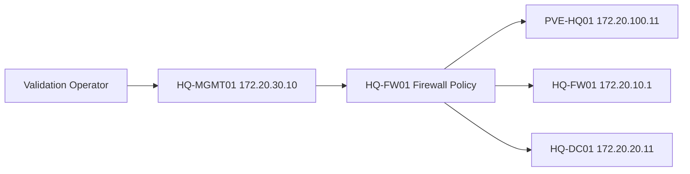
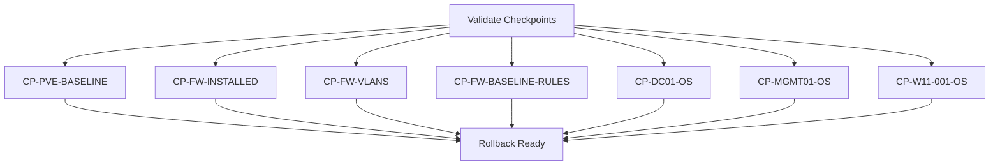

# Phase 1 Validation Plan

## Document Control

| Field | Value |
|---|---|
| Document ID | GEIL-PLAT-PH1-VAL-001 |
| Owner | Infrastructure Engineering |
| Status | Approved |
| Version | 1.1 |
| Last Reviewed | 2026-06-29 |
| Review Cycle | Quarterly |
| Classification | Internal Confidential |

## Purpose

This document defines the Phase 1 validation checklist for E02.R03 HQ Foundation Low-Level Design and Build Plan.

Validation proves that the initial HQ foundation is ready to support later implementation documents. It does not validate AD DS, PKI, or additional Microsoft services beyond the network and VM readiness required for those future releases.


## Required HLD references

This LLD is derived from and subordinate to the E02.R02 High-Level Design baseline:

- [Enterprise Lab Blueprint HLD](../architecture/enterprise-lab-blueprint.md)
- [Enterprise Lab Network HLD](../architecture/enterprise-lab-network-hld.md)
- [Enterprise Lab Identity HLD](../architecture/enterprise-lab-identity-hld.md)
- [Enterprise Lab Operations HLD](../architecture/enterprise-lab-operations-hld.md)
- [Environment Specification](../project/environment-specification.md)


## Validation principles

- Validate against the HLD first, then the LLD.
- Validate from the expected management path, not only from local consoles.
- Record failures as build defects before moving to later releases.
- Do not proceed to Certificate Lifecycle Management until E02.R03 validation is complete.

## Phase 1 validation checklist

| ID | Area | Validation | Expected Result | Evidence |
|---|---|---|---|---|
| VAL-001 | Proxmox host | `PVE-HQ01` reachable from `HQ-MGMT01` over approved management path | Proxmox UI/API reachable at `172.20.100.11` only through allowed path | Screenshot or command transcript |
| VAL-002 | Bridge design | Proxmox bridges match LLD | `vmbr0`, `vmbr1`, and management bridge exist; `vmbr1` is VLAN-aware | Bridge configuration export |
| VAL-003 | WAN isolation | Only `HQ-FW01` is attached to WAN bridge | No non-firewall VM has `vmbr0` attachment | VM hardware inventory |
| VAL-004 | MikroTik CHR gateways | Every Phase 1 VLAN gateway exists on `HQ-FW01` | `.1` gateway responds per VLAN test context | Ping or interface status evidence |
| VAL-005 | Server VLAN | `HQ-DC01` has static `172.20.20.11/24` | Gateway is `172.20.20.1`; no DHCP dependency | OS network screenshot or command output |
| VAL-006 | Management workstation | `HQ-MGMT01` has static `172.20.30.10/24` | Gateway is `172.20.30.1`; management targets reachable | Command output |
| VAL-007 | First client | `HQ-W11-001` is connected to VLAN 30 | Client can reach VLAN 30 gateway; DHCP state documented | Command output |
| VAL-008 | Guest isolation | VLAN 70 cannot reach internal RFC1918 VLANs | Access to `172.20.20.11`, `172.20.30.10`, and `172.20.100.11` is denied | Firewall log or test output |
| VAL-009 | Management access | `HQ-MGMT01` can reach `HQ-FW01`, `PVE-HQ01`, and `HQ-DC01` as allowed | Required management flows pass; unrelated flows deny | Test output |
| VAL-010 | Backup path readiness | `PBS-HQ01` network path is reserved on VLAN 90 | Gateway `172.20.90.1` exists and `172.20.90.10` is reserved | IPAM or environment evidence |
| VAL-011 | Snapshots | Required checkpoints exist | All checkpoints listed in the build plan are present or config exports exist | Snapshot inventory |
| VAL-012 | Config export | `HQ-FW01` baseline config exported | Export is stored outside the firewall VM and protected | Export location record |
| VAL-013 | Documentation alignment | Build documents reference HLD and Environment Specification | Cross-references are present and MkDocs strict build passes | MkDocs build output |

## Management access flow validation



Validation pass criteria:

- Required management flows pass from `HQ-MGMT01`.
- Unapproved flows from guest, printer, voice, and DMZ zones are denied.
- Firewall logs show expected denies where practical.

## Network validation matrix

| Source Zone | Destination | Expected Result |
|---|---|---|
| Management VLAN 10 | `HQ-FW01` management | Allow |
| Workstations VLAN 30 / `HQ-MGMT01` | `PVE-HQ01` `172.20.100.11` | Allow by management rule |
| Workstations VLAN 30 / `HQ-MGMT01` | `HQ-DC01` `172.20.20.11` | Allow required management and domain-prep flows |
| Workstations VLAN 30 / `HQ-W11-001` | `HQ-DC01` DNS/domain prerequisites | Allow after AD DS/DNS exists |
| Guest VLAN 70 | Any `172.20.0.0/16` internal address | Deny |
| DMZ VLAN 80 | Server VLAN 20 | Deny until explicit service approval |
| Backup VLAN 90 | Non-backup clients | Deny unless approved |
| Hypervisor VLAN 100 | Internet | Deny unless update path is explicitly approved |

## Snapshot and rollback checkpoint validation



## Validation failure handling

| Failure Type | Action |
|---|---|
| Management lockout | Use local console, restore last known bridge/firewall configuration, document failure. |
| VLAN gateway missing | Revert `HQ-FW01` to `CP-FW-VLANS` or reapply VLAN interface design. |
| Incorrect VM VLAN tag | Correct Proxmox VM network tag and retest source/destination matrix. |
| Guest isolation failure | Disable affected allow rule, verify deny, and create a firewall rule defect. |
| Snapshot missing | Create checkpoint before proceeding or document why equivalent config export is sufficient. |
| Static IP mismatch | Correct OS network settings to canonical values before continuing. |

## Phase 1 readiness decision

E02.R03 is ready for closure only when:

1. All P0 validations pass.
2. Any exception has an owner, risk statement, and remediation date.
3. `mkdocs build --strict` passes.
4. Roadmap, backlog, document index, release assignment, and changelog are updated.
5. Source files are committed and pushed to `origin/main`.

## Related documents

- [Proxmox HQ Foundation LLD](proxmox-hq-foundation-lld.md)
- [MikroTik CHR HQ Foundation LLD](mikrotik-chr-hq-foundation-lld.md)
- [Phase 1 Build Plan](phase-1-build-plan.md)


## Operator validation procedure

### Exact objective

Validate that the HQ foundation was implemented as designed and that no legacy Proxmox network objects were modified during the GEIL deployment.

### Before you begin

- Execute validation from `HQ-MGMT01` where possible.
- Use `PVE-HQ01` console only for host-local checks.
- Record every command and result in the E02.R05 evidence package.

### Additional validation tests for discovered deployment conditions

| ID | Validation | Command / Check | Expected Result |
|---|---|---|---|
| VAL-014 | Existing public access untouched | Review `/etc/network/interfaces` and Proxmox Network GUI | `eno1`, `VSW4001`, `PROD`, and `TEST` unchanged |
| VAL-015 | GEILWAN exists | `ip -brief addr show GEILWAN` | Shows `172.31.255.1/30` |
| VAL-016 | GEILLAN visible | Proxmox UI -> node -> System -> Network | `GEILLAN` visible and VLAN-aware |
| VAL-017 | HQ-FW01 WAN transit | MikroTik CHR WAN page | WAN is `172.31.255.2/30` |
| VAL-018 | No GEIL workload on 10.10.x.x | `qm config 100 110 120 121` manually reviewed | GEIL VMs do not use `PROD` or `TEST` |

### Copy/Paste validation commands

Run on `PVE-HQ01`:

```bash
ip -brief addr show GEILWAN
ip -brief addr show GEILLAN
bridge vlan show dev GEILLAN
qm config 100 | egrep 'name|net0|net1'
qm config 110 | egrep 'name|net0'
qm config 120 | egrep 'name|net0'
qm config 121 | egrep 'name|net0'
git -C /home/gntech/geil ls-files site | wc -l
```

Expected result:

- `GEILWAN` shows `172.31.255.1/30`.
- `GEILLAN` is present and VLAN-aware.
- `HQ-FW01` has `GEILWAN` and `GEILLAN`.
- GEIL guest VMs use `GEILLAN` with VLAN tags.
- Git tracked `site/` file count is `0`.

### Validation failure rollback guidance

- If GEIL bridges are missing from GUI, move definitions into `/etc/network/interfaces`, run `ifreload -a`, and recheck.
- If public access breaks, restore `/root/interfaces.rollback-before-geil` from console.
- If `HQ-FW01` is on the wrong bridge, stop the VM and correct `net0`/`net1`.
- If guest isolation fails, disable broad allow rules and restore `CP-FW-VLANS` if management access is at risk.
