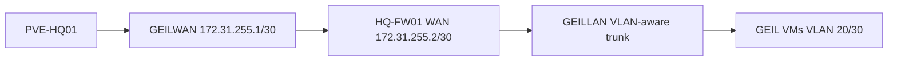
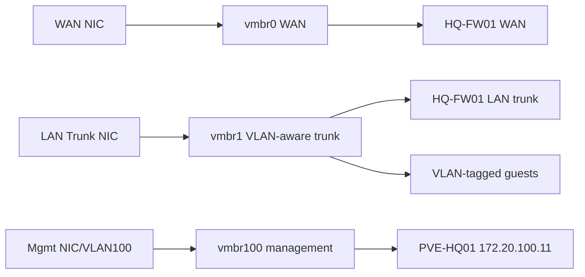
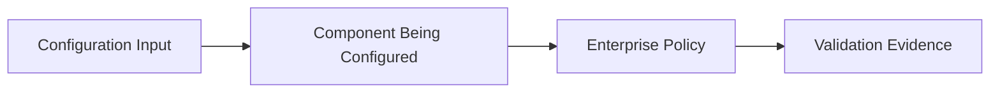

# Proxmox HQ Foundation Implementation Runbook

## Document Control

| Field | Value |
|---|---|
| Document ID | GEIL-PLAT-PVE-HQ-IMPL-001 |
| Owner | Infrastructure Engineering |
| Status | Approved |
| Version | 2.1 |
| Last Reviewed | 2026-06-29 |
| Review Cycle | Quarterly |
| Classification | Internal Confidential |

## Purpose

This runbook implements the `PVE-HQ01` Proxmox VE foundation for GEIL Phase 1. It converts the approved E02.R03 Low-Level Design into executable deployment steps for the initial HQ virtualization and network bridge baseline.

The runbook is implementation-ready but does not store credentials, license keys, private ISO checksums, or secrets in Git.

## Scope

Included:

- `PVE-HQ01` host identity and management baseline.
- Proxmox bridge configuration for WAN, VLAN trunk, and hypervisor management.
- VLAN-aware bridge configuration.
- Initial VM shell creation for `HQ-FW01`, `HQ-DC01`, `HQ-MGMT01`, and `HQ-W11-001`.
- Snapshot checkpoints.
- Management access validation.
- Rollback procedures.
- Troubleshooting and evidence capture.

Excluded:

- AD DS installation.
- PKI, NPS, or Certificate Lifecycle Management.
- Proxmox cluster creation.
- Proxmox Backup Server job configuration.
- Production application workload deployment.

## Related HLD/LLD references

This implementation runbook is subordinate to the approved HLD and LLD baseline:

- [Enterprise Lab Blueprint HLD](../architecture/enterprise-lab-blueprint.md)
- [Enterprise Lab Network HLD](../architecture/enterprise-lab-network-hld.md)
- [Proxmox HQ Foundation LLD](proxmox-hq-foundation-lld.md)
- [MikroTik CHR HQ Foundation LLD](mikrotik-chr-hq-foundation-lld.md)
- [Phase 1 Build Plan](phase-1-build-plan.md)
- [Phase 1 Validation Plan](phase-1-validation-plan.md)
- [Environment Specification](../project/environment-specification.md)


!!! note "Adaptation"

    This runbook uses canonical GNTECH values including `PVE-HQ01`, `HQ-FW01`, `HQ-DC01`, `HQ-MGMT01`, `HQ-W11-001`, `172.20.100.11`, `172.20.100.1`, and `corp.gntech.me`. Other organizations must update their environment specification before adapting commands or screenshots.


## Learning Objectives

After completing this guide you will understand:

- Why `PVE-HQ01` is the virtualization anchor for the HQ foundation.
- How `GEILWAN` and `GEILLAN` isolate GEIL traffic from existing Proxmox networks.
- How to create bridge configuration safely without breaking current public access.
- How to create GEIL VM shells with correct bridge and VLAN assignments.
- How to validate bridge visibility in both Linux and the Proxmox GUI.
- How to roll back a risky host networking change.

## What You Will Build

By the end of this guide you will have:

- ✓ `GEILWAN` configured as the `172.31.255.1/30` transit bridge.
- ✓ `GEILLAN` configured as the VLAN-aware GEIL trunk.
- ✓ Existing `eno1`, `VSW4001`, `PROD`, and `TEST` networks preserved.
- ✓ `HQ-FW01` attached to `GEILWAN` and `GEILLAN`.
- ✓ `HQ-DC01`, `HQ-MGMT01`, and `HQ-W11-001` VM shells attached to `GEILLAN` with correct VLAN tags.
- ✓ Rollback file and validation evidence captured.

## Estimated Time

45-90 minutes, excluding ISO upload and guest OS installation time.

## Difficulty

Advanced.

This guide changes Proxmox host networking. It is safe when performed exactly as written, but a bridge or interface mistake can break remote access.

## Risk Level

High.

Host networking changes can interrupt management access. Create the rollback copy and confirm console access before applying bridge changes.

## Service Impact

Maintenance window recommended.

The GEIL bridge additions are designed to be additive, but a mistake in `/etc/network/interfaces` can interrupt access to existing workloads.

## Architecture Overview

`PVE-HQ01` hosts the Phase 1 GEIL infrastructure. `GEILWAN` connects only the Proxmox host and `HQ-FW01` WAN side. `GEILLAN` carries internal GEIL VLANs to `HQ-FW01` and GEIL VMs. Existing non-GEIL bridges remain untouched.



!!! info "Architecture references"

    Read [Enterprise Lab Network HLD](../architecture/enterprise-lab-network-hld.md), [Proxmox HQ Foundation LLD](proxmox-hq-foundation-lld.md), and [Phase 1 Build Plan](phase-1-build-plan.md) before using this guide.

## Background Knowledge

### What is a Linux bridge?

A Linux bridge is a software switch. Proxmox uses bridges to connect VMs to physical or virtual networks.

### What is a VLAN-aware bridge?

A VLAN-aware bridge carries multiple VLANs across one bridge. VMs can attach to the bridge with specific VLAN tags.

### What is GEILWAN?

`GEILWAN` is not the public internet interface. It is a small transit bridge between `PVE-HQ01` and the `HQ-FW01` WAN interface.

### What is GEILLAN?

`GEILLAN` is the internal GEIL trunk. It carries the canonical GEIL VLANs behind `HQ-FW01`.

## Guide Screenshot Requirements

!!! example "Screenshot Required: Proxmox network list before changes"

    Path: `PVE-HQ01 -> System -> Network`

    Expected result:

    - Existing `eno1`, `VSW4001`, `PROD`, and `TEST` are visible if present.
    - They are recorded before GEIL changes.

    Store final screenshots under `docs/assets/images/proxmox-hq-foundation-implementation/`.

!!! example "Screenshot Required: Proxmox network list after changes"

    Path: `PVE-HQ01 -> System -> Network`

    Expected result:

    - `GEILWAN` exists.
    - `GEILLAN` exists and is VLAN-aware.
    - Existing `PROD` and `TEST` remain unchanged.

## Why This Step Matters

The Proxmox bridge layer determines whether every later GEIL component is isolated, reachable, and recoverable. If the foundation bridges are wrong, MikroTik CHR, Active Directory, DHCP relay, management access, and evidence collection will all fail or produce misleading results.

## Knowledge Check

1. Why is `HQ-FW01` connected to `GEILWAN` instead of directly to `eno1`?
2. Why should `GEILWAN` and `GEILLAN` be defined in `/etc/network/interfaces` instead of only `/etc/network/interfaces.d/`?
3. What command proves that `GEILLAN` is carrying VLANs 10 through 100?
4. Which existing Proxmox objects must not be modified during GEIL setup?
5. Why must `site/` remain untracked in Git after documentation validation?

## Next Guide

Continue to:

- [MikroTik CHR HQ Foundation Implementation Guide](mikrotik-chr-hq-foundation-implementation.md)

## Prerequisites

| Requirement | Value / Decision |
|---|---|
| Physical host installed | `PVE-HQ01` |
| Proxmox VE ISO | Current approved Proxmox VE ISO from vendor source |
| MikroTik CHR image uploaded | Required before creating `HQ-FW01` |
| Windows Server ISO uploaded | Required before creating `HQ-DC01` |
| Windows 11 Enterprise ISO uploaded | Required before creating `HQ-MGMT01` and `HQ-W11-001` |
| VirtIO drivers ISO | Required for Windows guests if virtio devices are used |
| Management network | VLAN 100 Hypervisors |
| Proxmox management IP | `172.20.100.11/24` |
| Default gateway | `172.20.100.1` |
| Approved admin source | `HQ-MGMT01` after deployment; local console during bootstrap |

## Required access

| Access | Required For | Notes |
|---|---|---|
| Physical or remote console to `PVE-HQ01` | Initial install and emergency rollback | Required before firewall routing exists |
| Proxmox root or equivalent privileged account | Host network and VM configuration | Password must be stored in approved password manager, not Git |
| ISO upload access | Upload installation media | Use Proxmox local ISO storage |
| Console access to VMs | Guest OS installation | Use Proxmox console until management network is validated |

## Required ISO/files

| File | Purpose | Storage Location |
|---|---|---|
| Proxmox VE ISO | Install `PVE-HQ01` | Physical installer, not committed |
| MikroTik CHR image | Install `HQ-FW01` | Proxmox ISO storage |
| Windows Server 2025 ISO | Install `HQ-DC01` | Proxmox ISO storage |
| Windows 11 Enterprise ISO | Install `HQ-MGMT01`, `HQ-W11-001` | Proxmox ISO storage |
| VirtIO driver ISO | Windows guest storage/network drivers | Proxmox ISO storage |
| `HQ-FW01-baseline.xml` | Post-validation firewall config export | Protected admin storage after MikroTik CHR build |

## Visual implementation summary

The detailed Proxmox bridge design is complex enough that future visual asset migration should create a dedicated 16:9 diagram under `docs/assets/diagrams/proxmox-hq-foundation-lld/`. Until that asset exists, the simplified Mermaid below is retained for implementation sequence clarity.



## Exact Proxmox configuration steps

### Step 1: Install and name `PVE-HQ01`

1. Install Proxmox VE on the approved host hardware.
2. Set hostname to `PVE-HQ01`.
3. Set management address to `172.20.100.11/24`.
4. Set gateway to `172.20.100.1`.
5. During bootstrap, use a temporary resolver only until `HQ-DC01` DNS exists.

Validation command from the Proxmox console:

```bash
hostname
ip addr
ip route
```

Expected result:

- Hostname is `PVE-HQ01`.
- Management address includes `172.20.100.11/24`.
- Default route points to `172.20.100.1`.

### Step 2: Configure Proxmox bridge baseline

Back up the current network configuration before changes:

```bash
cp /etc/network/interfaces /root/interfaces.pre-geil-e02r04
```

Apply the bridge design below, adjusting only physical NIC names to match the hardware discovered with `ip link`. Do not change canonical bridge names.

```text
auto lo
iface lo inet loopback

iface eno1 inet manual
# WAN uplink for HQ-FW01 only

auto vmbr0
iface vmbr0 inet manual
    bridge-ports eno1
    bridge-stp off
    bridge-fd 0

iface eno2 inet manual
# Internal LAN VLAN trunk

auto vmbr1
iface vmbr1 inet manual
    bridge-ports eno2
    bridge-stp off
    bridge-fd 0
    bridge-vlan-aware yes
    bridge-vids 10 20 30 40 50 60 70 80 90 100

iface eno3 inet manual
# Hypervisor management uplink, or use a tagged design if hardware requires it

auto vmbr100
iface vmbr100 inet static
    address 172.20.100.11/24
    gateway 172.20.100.1
    bridge-ports eno3
    bridge-stp off
    bridge-fd 0
```

If the hardware has only two NICs, `vmbr100` may be implemented as a VLAN-aware management design on the trunk, but the design exception must be recorded before production use.

Apply networking safely from console access:

```bash
ifreload -a
```

Validation commands:

```bash
ip -brief addr
bridge vlan show
ip route
```

Expected result:

- `vmbr0`, `vmbr1`, and `vmbr100` exist.
- `vmbr1` is VLAN-aware and permits VLANs 10,20,30,40,50,60,70,80,90,100.
- `vmbr100` owns `172.20.100.11/24`.
- Default route points to `172.20.100.1`.

### Step 3: Upload required ISOs

From the Proxmox UI:

1. Open `PVE-HQ01`.
2. Open local ISO storage.
3. Upload:
   - MikroTik CHR image.
   - Windows Server 2025 ISO.
   - Windows 11 Enterprise ISO.
   - VirtIO driver ISO.

Validation:

```bash
ls -lh /var/lib/vz/template/iso
```

Expected result:

- Required ISO files are visible on local ISO storage.

### Step 4: Create `HQ-FW01` VM shell

Create the firewall VM with these settings:

| Setting | Value |
|---|---|
| VM name | `HQ-FW01` |
| vCPU | 2 |
| Memory | 4096 MB |
| Disk | 40 GB |
| BIOS | OVMF or SeaBIOS per tested MikroTik CHR baseline |
| Boot disk | Imported MikroTik CHR image |
| net0 | `vmbr0`, no VLAN tag, WAN |
| net1 | `vmbr1`, no VLAN tag, LAN trunk |

Example Proxmox CLI pattern, using an approved unused VM ID such as `100`:

```bash
qm create 100 --name HQ-FW01 --memory 4096 --cores 2 --net0 virtio,bridge=vmbr0 --net1 virtio,bridge=vmbr1
qm set 100 --scsihw virtio-scsi-pci --scsi0 local-lvm:40
qm set 100 --ide2 local-lvm:vm-100-disk-0
qm set 100 --boot order=ide2\;scsi0
```

`MikroTik CHR-ISO-FILENAME.iso` must be replaced with the uploaded MikroTik CHR image filename from local Proxmox storage.

Checkpoint:

- Do not start dependent guests until `HQ-FW01` installs successfully.
- Snapshot after MikroTik CHR installation as `CP-FW-INSTALLED`.

### Step 5: Create `HQ-DC01` VM shell

| Setting | Value |
|---|---|
| VM name | `HQ-DC01` |
| OS | Windows Server 2025 |
| vCPU | 2 |
| Memory | 6144 MB |
| Disk | 100 GB |
| Network | `vmbr1`, VLAN tag 20 |
| Static IP after OS install | `172.20.20.11/24` |
| Gateway | `172.20.20.1` |

Example:

```bash
qm create 110 --name HQ-DC01 --memory 6144 --cores 2 --net0 virtio,bridge=vmbr1,tag=20
qm set 110 --scsihw virtio-scsi-pci --scsi0 local-lvm:100
qm set 110 --ide2 local:iso/Windows-Server-2025-ISO-FILENAME.iso,media=cdrom
qm set 110 --ide3 local:iso/virtio-win-ISO-FILENAME.iso,media=cdrom
qm set 110 --boot order=ide2\;scsi0
```

### Step 6: Create `HQ-MGMT01` VM shell

| Setting | Value |
|---|---|
| VM name | `HQ-MGMT01` |
| OS | Windows 11 Enterprise |
| vCPU | 2 |
| Memory | 8192 MB |
| Disk | 100 GB |
| Network | `vmbr1`, VLAN tag 30 |
| Static IP after OS install | `172.20.30.10/24` |
| Gateway | `172.20.30.1` |

Example:

```bash
qm create 120 --name HQ-MGMT01 --memory 8192 --cores 2 --net0 virtio,bridge=vmbr1,tag=30
qm set 120 --scsihw virtio-scsi-pci --scsi0 local-lvm:100
qm set 120 --ide2 local:iso/Windows-11-Enterprise-ISO-FILENAME.iso,media=cdrom
qm set 120 --ide3 local:iso/virtio-win-ISO-FILENAME.iso,media=cdrom
qm set 120 --boot order=ide2\;scsi0
```

### Step 7: Create `HQ-W11-001` VM shell

| Setting | Value |
|---|---|
| VM name | `HQ-W11-001` |
| OS | Windows 11 Enterprise |
| vCPU | 2 |
| Memory | 6144 MB |
| Disk | 80 GB |
| Network | `vmbr1`, VLAN tag 30 |
| Addressing | DHCP after DHCP exists, otherwise temporary VLAN 30 test settings |

Example:

```bash
qm create 121 --name HQ-W11-001 --memory 6144 --cores 2 --net0 virtio,bridge=vmbr1,tag=30
qm set 121 --scsihw virtio-scsi-pci --scsi0 local-lvm:80
qm set 121 --ide2 local:iso/Windows-11-Enterprise-ISO-FILENAME.iso,media=cdrom
qm set 121 --ide3 local:iso/virtio-win-ISO-FILENAME.iso,media=cdrom
qm set 121 --boot order=ide2\;scsi0
```

## Snapshot checkpoints

Create checkpoints at the defined gates:

```bash
qm snapshot 100 CP-FW-INSTALLED --description "HQ-FW01 clean MikroTik CHR install before VLAN policy"
qm snapshot 100 CP-FW-VLANS --description "HQ-FW01 VLAN gateways configured"
qm snapshot 100 CP-FW-BASELINE-RULES --description "HQ-FW01 baseline firewall rules validated"
qm snapshot 110 CP-DC01-OS --description "HQ-DC01 clean Windows Server 2025 OS before AD DS"
qm snapshot 120 CP-MGMT01-OS --description "HQ-MGMT01 clean Windows 11 Enterprise OS"
qm snapshot 121 CP-W11-001-OS --description "HQ-W11-001 clean Windows 11 Enterprise OS"
```

For host configuration, capture the Proxmox network baseline:

```bash
cp /etc/network/interfaces /root/interfaces.CP-PVE-BASELINE
pveversion -v > /root/pveversion.CP-PVE-BASELINE.txt
```

## Management access validation

From `HQ-MGMT01` after MikroTik CHR and workstation network configuration:

```powershell
Test-NetConnection 172.20.10.1 -Port 443
Test-NetConnection 172.20.100.11 -Port 8006
Test-NetConnection 172.20.20.11 -Port 3389
```

Expected result:

- `172.20.10.1:443` succeeds for firewall management.
- `172.20.100.11:8006` succeeds for Proxmox management.
- `172.20.20.11:3389` succeeds only after `HQ-DC01` allows administrative access.

## Rollback procedures

### Roll back Proxmox bridge configuration

Use local console access and restore the pre-change configuration:

```bash
cp /root/interfaces.pre-geil-e02r04 /etc/network/interfaces
ifreload -a
```

Validation:

```bash
ip -brief addr
ip route
```

### Roll back VM network attachment

```bash
qm config 100
qm set 100 --net0 virtio,bridge=vmbr0
qm set 100 --net1 virtio,bridge=vmbr1
```

### Roll back a VM checkpoint

```bash
qm rollback 100 CP-FW-INSTALLED
```

Use the appropriate VM ID and checkpoint name from the build evidence.

## Troubleshooting

| Symptom | Likely Cause | Action |
|---|---|---|
| Proxmox UI unreachable | Incorrect bridge, gateway, or physical NIC mapping | Use console, inspect `ip route`, restore prior `/etc/network/interfaces` |
| VMs cannot reach VLAN gateway | Missing VLAN tag or `vmbr1` not VLAN-aware | Check `qm config VMID` using the affected numeric VM ID and run `bridge vlan show` |
| `HQ-FW01` WAN receives no address | Wrong WAN NIC or upstream issue | Verify `vmbr0` physical NIC mapping and ISP handoff |
| Windows installer cannot see disk | VirtIO driver missing | Mount VirtIO ISO and load storage driver |
| Windows guest has no network | VirtIO network driver missing or wrong VLAN tag | Install VirtIO driver and verify VM `tag` |
| Management path works from console but not `HQ-MGMT01` | Firewall rule missing | Validate MikroTik CHR management allow rules |

## Evidence to capture

- Photo or export showing `PVE-HQ01` host identity and version.
- `/etc/network/interfaces` after bridge baseline.
- `ip -brief addr`, `ip route`, and `bridge vlan show` output.
- Proxmox VM hardware screenshots or `qm config` output for each VM.
- Snapshot list for `HQ-FW01`, `HQ-DC01`, `HQ-MGMT01`, and `HQ-W11-001`.
- Validation transcript from `HQ-MGMT01`.

## Completion criteria

This runbook is complete when:

1. `PVE-HQ01` is reachable at `172.20.100.11` through the approved path.
2. `vmbr1` is VLAN-aware and carries the canonical VLAN set.
3. `HQ-FW01` has WAN and LAN trunk adapters.
4. VM shells exist with correct names, sizing, and VLAN tags.
5. Required checkpoints exist.
6. Evidence is captured and linked to the implementation record.


## Deployment operator checklist

### Exact objective

Deploy the GEIL-safe Proxmox foundation without disrupting the existing Proxmox public/access configuration or the existing non-GEIL bridges. The operator must add GEIL-specific bridge definitions and VM shells while preserving current production access.

### Before you begin

1. Confirm you have console or out-of-band access to `PVE-HQ01`.
2. Confirm you can recover `/etc/network/interfaces` from local console if SSH or GUI access breaks.
3. Confirm the current host uses `eno1` directly and that existing `PROD` and `TEST` bridges exist for non-GEIL workloads.
4. Confirm GEIL uses `172.20.0.0/16` internally and `172.31.255.0/30` for the local Proxmox-to-MikroTik CHR WAN transit.
5. Do not proceed if you cannot identify `eno1`, `VSW4001`, `PROD`, and `TEST` in the current host configuration.

!!! warning "Operator Notes"

    Real deployment discovery showed that the existing Proxmox host uses `eno1` directly, not `vmbr0`. Existing bridges `PROD` and `TEST` use `10.10.x.x` addressing and must not be touched. GEIL must use `172.20.0.0/16` for enterprise networks. The GEIL WAN transit network is `172.31.255.0/30`, with `GEILWAN` using `172.31.255.1/30` and `HQ-FW01` WAN using `172.31.255.2/30`. Do not modify `eno1`, `VSW4001`, `PROD`, or `TEST` during GEIL setup.

### Assumptions

| Item | Assumption |
|---|---|
| Existing host access | Existing public/management access is already working and must not be broken. |
| Existing bridges | `PROD` and `TEST` are non-GEIL bridges and remain unchanged. |
| Existing direct NIC | `eno1` is already in use by the host and remains unchanged. |
| GEIL WAN transit | `GEILWAN` is a Proxmox bridge with `172.31.255.1/30`. |
| Firewall WAN | `HQ-FW01` WAN uses `172.31.255.2/30`. |
| GEIL LAN | `GEILLAN` is VLAN-aware and carries GEIL VLANs 10,20,30,40,50,60,70,80,90,100. |

### Expected starting state

- `PVE-HQ01` is reachable by the existing access path.
- `/etc/network/interfaces` contains existing host networking.
- `eno1`, `VSW4001`, `PROD`, and `TEST` may already exist and are not GEIL objects.
- `GEILWAN` and `GEILLAN` may not exist yet.
- `HQ-FW01` may not exist yet.

### Expected ending state

- Existing access through `eno1`, `VSW4001`, `PROD`, and `TEST` still works.
- `GEILWAN` exists and is visible in the Proxmox GUI.
- `GEILLAN` exists, is VLAN-aware, and is visible in the Proxmox GUI.
- `HQ-FW01` has WAN attached to `GEILWAN` and LAN trunk attached to `GEILLAN`.
- GEIL VM NICs use `GEILLAN` with explicit VLAN tags.
- `site/` remains untracked in Git after documentation validation.

## Copy/Paste Implementation Blocks

### Step 1: Verify current network configuration

Run from `PVE-HQ01` console or SSH before changing anything:

```bash
hostname
ip -brief addr
ip route
bridge link
bridge vlan show
cp /etc/network/interfaces /root/interfaces.pre-geil.$(date +%Y%m%d-%H%M%S)
```

Expected result:

- Hostname returns `PVE-HQ01`.
- Existing public/access configuration remains visible.
- Existing `PROD` and `TEST` bridges, if present, are identified but not modified.
- A timestamped backup of `/etc/network/interfaces` exists in `/root`.

Validation evidence to capture:

```bash
ip -brief addr | tee /root/geil-pre-network-ip-brief.txt
ip route | tee /root/geil-pre-network-routes.txt
bridge vlan show | tee /root/geil-pre-bridge-vlans.txt
```

Rollback after this step:

No rollback is required because this step is read-only except for creating backup/evidence files.

### Step 2: Back up `/etc/network/interfaces`

Create a named rollback copy before editing:

```bash
cp /etc/network/interfaces /root/interfaces.rollback-before-geil
ls -l /root/interfaces.rollback-before-geil
```

Expected result:

- `/root/interfaces.rollback-before-geil` exists.

Rollback command if later networking fails:

```bash
cp /root/interfaces.rollback-before-geil /etc/network/interfaces
ifreload -a
```

If `ifreload -a` fails or remote access is broken, use the physical or out-of-band console and reboot only after confirming the restored file is correct.

### Step 3: Add GEIL bridge definitions to `/etc/network/interfaces`

!!! warning "Operator Notes"

    Proxmox GUI may not show Linux bridge definitions placed only in `/etc/network/interfaces.d/`. For GEIL, place `GEILWAN` and `GEILLAN` definitions directly in `/etc/network/interfaces` so the bridges are visible and maintainable from the Proxmox GUI. Do not move or rewrite existing non-GEIL bridge definitions.

Open the file:

```bash
nano /etc/network/interfaces
```

Append this GEIL block below existing configuration. Do not edit `eno1`, `VSW4001`, `PROD`, or `TEST`.

```text
# =========================================================
# GEIL Phase 1 network bridges
# Do not use 10.10.x.x for GEIL. GEIL uses 172.20.0.0/16.
# GEILWAN is a local transit segment between PVE-HQ01 and HQ-FW01.
# =========================================================

auto GEILWAN
iface GEILWAN inet static
    address 172.31.255.1/30
    bridge-ports none
    bridge-stp off
    bridge-fd 0
    bridge-comment GEIL WAN transit to HQ-FW01

auto GEILLAN
iface GEILLAN inet manual
    bridge-ports none
    bridge-stp off
    bridge-fd 0
    bridge-vlan-aware yes
    bridge-vids 10 20 30 40 50 60 70 80 90 100
    bridge-comment GEIL VLAN-aware LAN trunk
```

Why this design is used:

- `GEILWAN` is an isolated /30 transit network for the virtual firewall WAN side.
- `GEILLAN` is a VLAN-aware internal bridge for GEIL networks.
- Existing public networking is preserved.
- No GEIL bridge uses the existing `10.10.x.x` PROD/TEST networks.

### Step 4: Validate and apply bridge configuration

Validate syntax and apply:

```bash
ifquery --list
ifreload -a
ip -brief addr show GEILWAN
ip -brief addr show GEILLAN
bridge vlan show dev GEILLAN
```

Expected result:

- `GEILWAN` appears with `172.31.255.1/30`.
- `GEILLAN` appears as a bridge.
- `bridge vlan show dev GEILLAN` lists VLANs 10,20,30,40,50,60,70,80,90,100.

Rollback after this risky step:

```bash
cp /root/interfaces.rollback-before-geil /etc/network/interfaces
ifreload -a
ip -brief addr
```

### Step 5: Verify bridge visibility in the Proxmox GUI

GUI path:

```text
Proxmox UI -> Datacenter -> PVE-HQ01 -> System -> Network
```

Expected result:

- `GEILWAN` is visible.
- `GEILLAN` is visible.
- `GEILLAN` shows VLAN-aware behavior.
- Existing `PROD` and `TEST` bridges remain unchanged.

Evidence to capture:

- Screenshot of Proxmox Network page showing `GEILWAN` and `GEILLAN`.
- Screenshot or text export confirming `PROD` and `TEST` were not modified.

### Step 6: Create `HQ-FW01` using GEIL bridges

GUI path:

```text
Proxmox UI -> Create VM
```

Use these settings:

| Setting | Value |
|---|---|
| VM name | `HQ-FW01` |
| vCPU | 2 |
| Memory | 4096 MB |
| Disk | 40 GB |
| NIC 1 | Bridge `GEILWAN`, no VLAN tag |
| NIC 2 | Bridge `GEILLAN`, no VLAN tag |
| ISO | Approved MikroTik CHR image |

CLI equivalent pattern:

```bash
qm create 100 --name HQ-FW01 --memory 4096 --cores 2 \
  --net0 virtio,bridge=GEILWAN \
  --net1 virtio,bridge=GEILLAN
qm set 100 --scsihw virtio-scsi-pci --scsi0 local-lvm:40
qm set 100 --ide2 local-lvm:vm-100-disk-0
qm set 100 --boot order=ide2\;scsi0
qm config 100
```

Validation:

- `qm config 100` shows `net0` on `GEILWAN`.
- `qm config 100` shows `net1` on `GEILLAN`.
- No `HQ-FW01` adapter is attached to `PROD` or `TEST`.

Rollback:

```bash
qm stop 100
qm destroy 100 --purge
```

Use rollback only before the VM contains required configuration or after exporting any required evidence.

### Step 7: Create GEIL guest VM shells

Attach GEIL guests to `GEILLAN` with explicit VLAN tags:

```bash
qm create 110 --name HQ-DC01 --memory 6144 --cores 2 --net0 virtio,bridge=GEILLAN,tag=20
qm set 110 --scsihw virtio-scsi-pci --scsi0 local-lvm:100

qm create 120 --name HQ-MGMT01 --memory 8192 --cores 2 --net0 virtio,bridge=GEILLAN,tag=30
qm set 120 --scsihw virtio-scsi-pci --scsi0 local-lvm:100

qm create 121 --name HQ-W11-001 --memory 6144 --cores 2 --net0 virtio,bridge=GEILLAN,tag=30
qm set 121 --scsihw virtio-scsi-pci --scsi0 local-lvm:80
```

Validation:

```bash
qm config 110 | grep net0
qm config 120 | grep net0
qm config 121 | grep net0
```

Expected output includes:

- `bridge=GEILLAN,tag=20` for `HQ-DC01`.
- `bridge=GEILLAN,tag=30` for `HQ-MGMT01`.
- `bridge=GEILLAN,tag=30` for `HQ-W11-001`.

## Validation Evidence

Capture these commands after implementation:

```bash
ip -brief addr | tee /root/geil-post-network-ip-brief.txt
ip route | tee /root/geil-post-network-routes.txt
bridge vlan show | tee /root/geil-post-bridge-vlans.txt
qm config 100 | tee /root/geil-hq-fw01-qm-config.txt
qm config 110 | tee /root/geil-hq-dc01-qm-config.txt
qm config 120 | tee /root/geil-hq-mgmt01-qm-config.txt
qm config 121 | tee /root/geil-hq-w11-001-qm-config.txt
```

Expected evidence:

- Existing public access remains intact.
- `GEILWAN` has `172.31.255.1/30`.
- `GEILLAN` is VLAN-aware.
- `HQ-FW01` uses `GEILWAN` and `GEILLAN`.
- GEIL guests use `GEILLAN` and correct VLAN tags.

## Git validation for documentation operators

When editing GEIL documentation during deployment, verify generated MkDocs output is not tracked:

```bash
cd /home/gntech/geil
git ls-files site | wc -l
git status --short site || true
```

Expected result:

- `git ls-files site | wc -l` returns `0`.
- `site/` is not staged.

## Common errors

| Error | Cause | Fix |
|---|---|---|
| Bridge not visible in Proxmox GUI | Bridge defined only in `/etc/network/interfaces.d/` | Move GEIL bridge definitions into `/etc/network/interfaces` and run `ifreload -a` |
| Public access breaks | Existing `eno1`, `VSW4001`, `PROD`, or `TEST` changed | Restore `/root/interfaces.rollback-before-geil` from console |
| GEIL VM lands on 10.10.x.x | VM attached to `PROD` or `TEST` instead of `GEILLAN` | Move VM NIC to `GEILLAN` with correct VLAN tag |
| VLAN tags ignored | Bridge is not VLAN-aware | Confirm `bridge-vlan-aware yes` on `GEILLAN` |
| HQ-FW01 WAN cannot reach transit | Wrong bridge on net0 | Set net0 to `GEILWAN`; confirm `172.31.255.2/30` inside MikroTik CHR |

## Acceptance criteria for this runbook

- `GEILWAN` and `GEILLAN` exist in `/etc/network/interfaces` and Proxmox GUI.
- `GEILWAN` uses `172.31.255.1/30`.
- `HQ-FW01` WAN is attached to `GEILWAN` and configured later as `172.31.255.2/30`.
- `GEILLAN` is VLAN-aware and carries the canonical GEIL VLAN list.
- Existing `eno1`, `VSW4001`, `PROD`, and `TEST` remain unchanged.
- GEIL VM shells are attached to the correct GEIL bridges and VLAN tags.
- Rollback file `/root/interfaces.rollback-before-geil` exists.
- Evidence files listed above are captured.


## Educational Enterprise Context

### What you are building

You are building the Proxmox HQ foundation as part of the GEIL enterprise learning and deployment platform.

### Why this component exists

`PVE-HQ01` provides the compute and virtual switching substrate for GEIL. It exists so GEIL can run the firewall, domain controller, management workstation, and client systems in a controlled virtual environment.

### How this component interacts with the rest of the enterprise

GEIL uses additive bridges named `GEILWAN` and `GEILLAN` to avoid disturbing existing `eno1`, `VSW4001`, `PROD`, and `TEST` objects.

### Internal workflow



The internal workflow is intentionally simple: define the value, apply it to the component, let the component enforce or provide the service, then capture evidence proving the expected behavior.

!!! enterprise "Enterprise pattern"

    Large enterprises often separate virtualization management, workload networks, backup networks, and edge firewall transit networks. GEIL models that separation with a small number of explicit bridges before introducing automation.

!!! implementation "GEIL deployment note"

    GEIL bridge definitions are placed directly in `/etc/network/interfaces` because deployment testing showed bridges defined only in `/etc/network/interfaces.d/` might not appear in the Proxmox GUI.

### Real-world enterprise usage

In real enterprises, this pattern is used to make infrastructure repeatable, auditable, and recoverable. The guide teaches the manual implementation first so future automation has a known-good target state.

### Design decisions specific to GEIL

| Decision | GEIL Position | Why it matters |
|---|---|---|
| Canonical values | Values come from the Environment Specification | Prevents conflicting hostnames, IP addresses, and service names |
| Evidence-first deployment | Each major step produces validation evidence | Makes acceptance and troubleshooting objective |
| Rollback before risk | Risky changes require checkpoints or exports | Protects the deployment from lockout or destructive mistakes |
| Simple first design | Phase 1 favors clear single-site patterns | Builds a foundation that can scale later without ambiguity |

### Alternatives considered

| Alternative | Why GEIL does not use it first |
|---|---|
| Ad hoc configuration | Hard to audit, teach, or reproduce |
| Full automation before learning | Hides the enterprise concepts from new operators |
| Untracked local notes | Cannot be reviewed, validated, or reused |
| Skipping evidence capture | Makes acceptance subjective |

### Security considerations

- Use approved administrative accounts only.
- Do not store passwords, private keys, firewall exports, or sensitive screenshots in Git.
- Apply least privilege and explicit allow rules.
- Treat management paths as privileged infrastructure.

### Performance considerations

- Validate the component under the expected Phase 1 workload before adding dependent services.
- Avoid broad troubleshooting changes that mask resource, latency, or policy issues.
- Record baseline behavior so future performance regressions are visible.

### Scalability considerations

- Keep names, VLANs, and service boundaries aligned with the HLD/LLD.
- Prefer patterns that can add a second node, second site, or automated deployment later.
- Do not hard-code temporary bootstrap decisions into long-term architecture.

### Operational considerations

- Capture screenshots and command output during deployment.
- Record known exceptions immediately.
- Re-run validation after every rollback or remediation.
- Update this guide when real deployment discovers a better operator note.

### Explanation depth for important values

| Value Type | What it is | Why GEIL uses it | What happens if it changes | Customizable? |
|---|---|---|---|---|
| Hostname | Stable component identity | Enables deterministic docs, DNS, logs, and evidence | Cross-references and monitoring become wrong | Only through Environment Specification |
| IP address | Stable network endpoint | Supports firewall rules, DNS, DHCP, and tests | Connectivity and validation can fail | Only through HLD/LLD update |
| VLAN or bridge name | Network boundary | Keeps traffic segmented and understandable | Traffic may land in the wrong zone | Only through network design update |
| Snapshot/export name | Recovery checkpoint | Makes rollback auditable | Operators may restore the wrong state | Naming can expand but not lose meaning |

### Frequently Asked Questions

#### Why does GEIL explain concepts before commands?

Because an engineer who understands the reason behind a command can troubleshoot safely when the environment differs from the happy path.

#### Can these values be customized?

Yes, but only by updating the Environment Specification and dependent HLD/LLD documents first. Implementation guides consume canonical values; they do not redefine them.

#### Why is evidence collection mandatory?

Evidence proves that implementation matched the design. It also gives future operators a baseline for troubleshooting and audits.

#### Why include rollback in every guide?

Enterprise infrastructure changes can fail even when the design is correct. Rollback guidance prevents panic-driven fixes and protects dependent services.

### Key takeaways

- GEIL guides are learning artifacts and deployment controls.
- The operator should understand why the component exists before configuring it.
- Validation and evidence are part of the implementation, not afterthoughts.
- Canonical values must come from the Environment Specification and HLD/LLD baseline.
