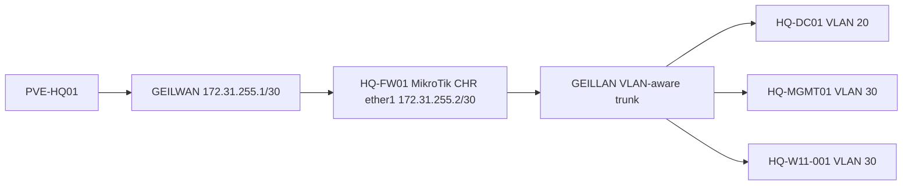

# Proxmox HQ Foundation Implementation Runbook

## Document Control

| Field | Value |
|---|---|
| Document ID | GEIL-PLAT-PVE-HQ-IMPL-001 |
| Owner | Infrastructure Engineering |
| Status | GEIL Certified Production Guide |
| Version | 3.0 |
| Last Reviewed | 2026-06-30 |
| Review Cycle | Quarterly |
| Classification | Internal Confidential |

!!! success "GEIL Certified Production Guide"

    This guide has been line-by-line audited for technical accuracy, deployment order, copy/paste safety, validation, rollback, troubleshooting, screenshot placement, command correctness, canonical GEIL values, grammar, clarity, and operator experience. Certification scores are recorded in the [Certification Report](#certification-report).

## Purpose

Deploy the Proxmox foundation for the GEIL Phase 1 HQ environment on `PVE-HQ01` without disrupting existing non-GEIL Proxmox networking.

This guide creates the GEIL virtual networking substrate and VM shells required by the next guides:

- `GEILWAN` transit bridge for `HQ-FW01` WAN.
- `GEILLAN` VLAN-aware internal trunk for GEIL enterprise VLANs.
- `HQ-FW01` MikroTik CHR VM shell.
- `HQ-DC01` Windows Server 2025 VM shell.
- `HQ-MGMT01` Windows 11 Enterprise management workstation shell.
- `HQ-W11-001` Windows 11 Enterprise test client shell.

This guide does not install MikroTik RouterOS, Windows Server, Active Directory, DNS, DHCP, or Windows 11. It prepares the Proxmox layer so those guides can run safely.

## Learning Objectives

After completing this guide you will understand:

- Why Proxmox bridge design is the foundation for every later GEIL service.
- Why `GEILWAN` and `GEILLAN` are additive and must not replace existing `eno1`, `VSW4001`, `PROD`, or `TEST` configuration.
- How Proxmox Linux bridges connect virtual machines to isolated or VLAN-aware networks.
- How to make GEIL bridges visible in the Proxmox GUI.
- How to validate Proxmox bridge state before creating VMs.
- How to create GEIL VM shells with safe NIC mapping.
- How to roll back host networking changes from console access.

## What You Will Build

By the end of this guide you will have:

- ✓ Existing `eno1`, `VSW4001`, `PROD`, and `TEST` networking preserved.
- ✓ `/etc/network/interfaces` backed up before changes.
- ✓ `GEILWAN` created with `172.31.255.1/30`.
- ✓ `GEILLAN` created as a VLAN-aware bridge carrying VLANs 10,20,30,40,50,60,70,80,90,100.
- ✓ `GEILWAN` and `GEILLAN` visible in `PVE-HQ01 -> System -> Network`.
- ✓ `HQ-FW01` VM shell with `net0` on `GEILWAN` and `net1` on `GEILLAN`.
- ✓ `HQ-DC01` VM shell on `GEILLAN`, VLAN 20.
- ✓ `HQ-MGMT01` VM shell on `GEILLAN`, VLAN 30.
- ✓ `HQ-W11-001` VM shell on `GEILLAN`, VLAN 30.
- ✓ Evidence outputs captured for bridge and VM configuration.

## Estimated Time

60-90 minutes, excluding ISO/image download time.

## Difficulty

Advanced.

This guide changes Proxmox host networking. The steps are safe when followed in order, but a host networking mistake can interrupt management access.

## Risk Level

High.

The highest-risk action is editing `/etc/network/interfaces` and reloading networking. The guide controls this risk by requiring console access, backup files, pre-checks, immediate validation, and rollback commands.

## Service Impact

Maintenance window recommended.

The GEIL changes are designed to be additive. Existing non-GEIL bridges must remain unchanged. However, any syntax error in `/etc/network/interfaces` can affect Proxmox networking, so perform this guide during an approved maintenance window with console access available.

## Prerequisites

| Requirement | Required Value |
|---|---|
| Target host | `PVE-HQ01` |
| Administrative access | Proxmox root or equivalent privileged access |
| Emergency access | Physical or out-of-band console to `PVE-HQ01` |
| Current host networking known | Existing `eno1`, `VSW4001`, `PROD`, and `TEST` documented before changes |
| MikroTik CHR image | Downloaded and available before creating `HQ-FW01` disk |
| Windows Server ISO | Available before installing `HQ-DC01` later |
| Windows 11 Enterprise ISO | Available before installing `HQ-MGMT01` and `HQ-W11-001` later |
| VirtIO driver ISO | Available for Windows guests |
| HLD/LLD references | Reviewed before implementation |

Required documents:

- [Enterprise Lab Blueprint HLD](../architecture/enterprise-lab-blueprint.md)
- [Enterprise Lab Network HLD](../architecture/enterprise-lab-network-hld.md)
- [Proxmox HQ Foundation LLD](proxmox-hq-foundation-lld.md)
- [MikroTik CHR HQ Foundation LLD](mikrotik-chr-hq-foundation-lld.md)
- [Environment Specification](../project/environment-specification.md)
- [Deployment Style Guide](../governance/deployment-style-guide.md)

## Expected Starting State

Before starting, all statements below must be true:

- `PVE-HQ01` is reachable through the existing administrative path.
- You have console access that does not depend on the network configuration being edited.
- Existing `eno1`, `VSW4001`, `PROD`, and `TEST` configuration is considered out of scope and must not be changed.
- `GEILWAN` and `GEILLAN` either do not exist yet or are approved for correction.
- No GEIL VM depends on `GEILWAN` or `GEILLAN` yet.
- No GEIL workload uses `10.10.x.x` addressing.

!!! danger "Do not proceed without console access"

    Do not edit Proxmox networking over SSH or the web UI unless you also have working physical or out-of-band console access. If networking reload fails, console access is the recovery path.

## Expected Ending State

After completing this guide:

- Existing `eno1`, `VSW4001`, `PROD`, and `TEST` configuration remains unchanged.
- `GEILWAN` exists in `/etc/network/interfaces` and the Proxmox GUI.
- `GEILWAN` uses `172.31.255.1/30`.
- `GEILLAN` exists in `/etc/network/interfaces` and the Proxmox GUI.
- `GEILLAN` is VLAN-aware and carries VLANs 10,20,30,40,50,60,70,80,90,100.
- `HQ-FW01` has two NICs: WAN on `GEILWAN`, LAN trunk on `GEILLAN`.
- `HQ-DC01`, `HQ-MGMT01`, and `HQ-W11-001` VM shells exist with canonical bridge/VLAN mapping.
- Evidence files exist under `/root/geil-evidence/`.

## Architecture Overview

`PVE-HQ01` hosts the Phase 1 GEIL virtual infrastructure. `GEILWAN` is a private /30 transit network between the Proxmox host and the MikroTik CHR firewall WAN. `GEILLAN` is the VLAN-aware internal trunk behind the firewall.



!!! enterprise "Enterprise design pattern"

    Enterprises separate hypervisor management, firewall transit, server networks, workstation networks, and guest networks to reduce blast radius. GEIL models this separation in Proxmox with explicit bridge names and canonical VLANs before automation is introduced.

## Background Knowledge

### What is a Proxmox Linux bridge?

A Linux bridge is a software switch. Proxmox connects VM network adapters to bridges. If a VM adapter is attached to the wrong bridge, the VM lands in the wrong security zone.

### What is a VLAN-aware bridge?

A VLAN-aware bridge can carry multiple tagged VLANs. GEIL uses `GEILLAN` as the internal VLAN trunk. VMs attach to `GEILLAN` with explicit VLAN tags when they belong to a specific VLAN.

### What is GEILWAN?

`GEILWAN` is not the internet and is not the existing Proxmox uplink. It is a local transit bridge between `PVE-HQ01` and the `HQ-FW01` WAN interface.

### What is GEILLAN?

`GEILLAN` is the internal GEIL VLAN trunk behind `HQ-FW01`. It carries GEIL VLANs 10 through 100.

### Why must existing bridges be preserved?

The real Proxmox host already has existing networking objects, including `eno1`, `VSW4001`, `PROD`, and `TEST`. They are not GEIL objects. GEIL must be additive so existing access and workloads are not disrupted.

## Screenshot Requirements

Place screenshots in the implementation evidence package when the guide asks for them. Do not wait until the end.

!!! example "Screenshot Required: Before network changes"

    Path: `PVE-HQ01 -> System -> Network`

    Expected result:

    - Existing network objects are visible.
    - `eno1`, `VSW4001`, `PROD`, and `TEST` are recorded if present.
    - No GEIL changes have been applied yet.

!!! example "Screenshot Required: After GEIL bridge creation"

    Path: `PVE-HQ01 -> System -> Network`

    Expected result:

    - `GEILWAN` is visible.
    - `GEILLAN` is visible.
    - `GEILLAN` is VLAN-aware.
    - Existing `PROD` and `TEST` remain unchanged.

!!! example "Screenshot Required: VM hardware"

    Path: `PVE-HQ01 -> HQ-FW01 -> Hardware`

    Expected result:

    - `net0` uses `GEILWAN`.
    - `net1` uses `GEILLAN`.

## Step-by-Step Procedure

### Step 1: Confirm console access

#### Goal — Confirm console access

Confirm that you can recover the host if network reload fails.

#### Why this matters — Confirm console access

Host networking changes can break SSH or the Proxmox web UI. Console access is the safe recovery path.

#### Estimated time — Confirm console access

5 minutes.

#### Risk level — Confirm console access

Low. This is a validation step only.

#### Prerequisites — Confirm console access

You must have physical, IPMI, iDRAC, iLO, remote KVM, or equivalent console access to `PVE-HQ01`.

#### Starting state — Confirm console access

You are logged into the existing Proxmox administrative path.

#### Expected ending state — Confirm console access

You have independently confirmed console access.

#### Procedure — Confirm console access

Open the console path for `PVE-HQ01` and confirm you can log in as an approved administrator.

#### Commands — Confirm console access

Run from the console:

```bash
hostname
```

#### Expected output — Confirm console access

```text
PVE-HQ01
```

#### Validation — Confirm console access

```bash
whoami
```

Success looks like this:

- You are on `PVE-HQ01`.
- You can run privileged commands through an approved administrative path.

#### Failure handling — Confirm console access

If console access does not work, stop. Do not edit networking.

#### Rollback — Confirm console access

No rollback is required because no configuration changed.

### Step 2: Capture the pre-change network state

#### Goal — Capture the pre-change network state

Record current networking before making any changes.

#### Why this matters — Capture the pre-change network state

The pre-change state proves that existing access worked and provides the comparison point for rollback.

#### Estimated time — Capture the pre-change network state

10 minutes.

#### Risk level — Capture the pre-change network state

Low. This step creates evidence files only.

#### Prerequisites — Capture the pre-change network state

Console access from Step 1 is confirmed.

#### Starting state — Capture the pre-change network state

Existing Proxmox networking is active and unchanged.

#### Expected ending state — Capture the pre-change network state

Evidence files exist under `/root/geil-evidence/`.

#### Commands — Capture the pre-change network state

```bash
mkdir -p /root/geil-evidence
```

```bash
hostname | tee /root/geil-evidence/01-pre-hostname.txt
```

```bash
ip -brief addr | tee /root/geil-evidence/02-pre-ip-brief.txt
```

```bash
ip route | tee /root/geil-evidence/03-pre-ip-route.txt
```

```bash
bridge link | tee /root/geil-evidence/04-pre-bridge-link.txt
```

```bash
bridge vlan show | tee /root/geil-evidence/05-pre-bridge-vlan.txt
```

```bash
cp /etc/network/interfaces /root/geil-evidence/06-pre-interfaces.txt
```

#### Expected output — Capture the pre-change network state

You should see command output saved to `/root/geil-evidence/`.

#### Validation — Capture the pre-change network state

```bash
ls -lh /root/geil-evidence
```

Success looks like this:

- Files `01-pre-hostname.txt` through `06-pre-interfaces.txt` exist.
- Existing public/non-GEIL configuration is visible in the evidence.

#### GUI validation — Capture the pre-change network state

| Field | Value |
|---|---|
| Navigation path | `PVE-HQ01 -> System -> Network` |
| Window name | Proxmox node network configuration |
| Tab name | Network |
| Expected result | Existing network objects are visible before GEIL changes |

!!! example "Screenshot Required"

    Path: `PVE-HQ01 -> System -> Network`

    Expected result:

    - Current network objects are visible.
    - Existing `eno1`, `VSW4001`, `PROD`, and `TEST` are recorded if present.

#### Failure handling — Capture the pre-change network state

If any command fails, stop and resolve the command or permissions issue before editing networking.

#### Rollback — Capture the pre-change network state

No rollback is required because this step creates evidence files only.

### Step 3: Create a rollback copy of `/etc/network/interfaces`

#### Goal — Create a rollback copy

Create a named rollback file before editing Proxmox networking.

#### Why this matters — Create a rollback copy

If `ifreload -a` breaks networking, the rollback file lets you restore the previous configuration from console access.

#### Estimated time — Create a rollback copy

5 minutes.

#### Risk level — Create a rollback copy

Low. This step copies a file and does not change active networking.

#### Prerequisites — Create a rollback copy

Pre-change evidence exists.

#### Starting state — Create a rollback copy

`/etc/network/interfaces` contains the currently working network configuration.

#### Expected ending state — Create a rollback copy

`/root/interfaces.rollback-before-geil` exists and contains the pre-change configuration.

#### Commands — Create a rollback copy

```bash
cp /etc/network/interfaces /root/interfaces.rollback-before-geil
```

```bash
ls -l /root/interfaces.rollback-before-geil
```

#### Expected output — Create a rollback copy

```text
/root/interfaces.rollback-before-geil
```

The timestamp and size may differ.

#### Validation — Create a rollback copy

```bash
test -s /root/interfaces.rollback-before-geil
```

Success looks like this:

- The command returns no error.
- The rollback file is not empty.

#### Failure handling — Create a rollback copy

If the rollback file cannot be created, stop. Do not edit `/etc/network/interfaces`.

#### Rollback — Create a rollback copy

No rollback is required because active networking has not changed.

### Step 4: Inspect current network configuration for protected objects

#### Goal — Inspect protected objects

Confirm the existing protected objects before adding GEIL bridges.

#### Why this matters — Inspect protected objects

GEIL must not modify `eno1`, `VSW4001`, `PROD`, or `TEST`. Inspecting first prevents accidental edits.

#### Estimated time — Inspect protected objects

10 minutes.

#### Risk level — Inspect protected objects

Low. This step is read-only.

#### Prerequisites — Inspect protected objects

Rollback file exists.

#### Starting state — Inspect protected objects

Current Proxmox network configuration is unchanged.

#### Expected ending state — Inspect protected objects

The operator knows which existing objects are protected.

#### Commands — Inspect protected objects

```bash
grep -nE 'eno1|VSW4001|PROD|TEST|GEILWAN|GEILLAN' /etc/network/interfaces || true
```

```bash
ip -brief link | grep -E 'eno1|VSW4001|PROD|TEST|GEILWAN|GEILLAN' || true
```

#### Expected output — Inspect protected objects

Expected output varies by current host state. It is acceptable for `GEILWAN` and `GEILLAN` to be absent before this guide.

Success looks like this:

- Existing protected objects are identified if present.
- No changes are made.

#### Validation — Inspect protected objects

Review `/root/geil-evidence/06-pre-interfaces.txt` and confirm it matches the current file before editing.

```bash
diff -u /root/geil-evidence/06-pre-interfaces.txt /etc/network/interfaces || true
```

Expected result:

- No differences unless another approved operator changed the file after evidence capture.

#### Failure handling — Inspect protected objects

If the configuration changed after evidence capture, stop and recapture the pre-change evidence.

#### Rollback — Inspect protected objects

No rollback is required because this step is read-only.

### Step 5: Add `GEILWAN` to `/etc/network/interfaces`

#### Goal — Add `GEILWAN`

Add the GEIL firewall WAN transit bridge without touching existing non-GEIL configuration.

#### Why this matters — Add `GEILWAN`

`GEILWAN` is the /30 transit network between `PVE-HQ01` and `HQ-FW01`. It must exist before `HQ-FW01` can be attached safely.

#### Estimated time — Add `GEILWAN`

10 minutes.

#### Risk level — Add `GEILWAN`

High. This step edits host networking.

#### Prerequisites — Add `GEILWAN`

- Console access is confirmed.
- Rollback file exists.
- Protected objects have been identified.

#### Starting state — Add `GEILWAN`

`GEILWAN` is absent or approved for correction.

#### Expected ending state — Add `GEILWAN`

`/etc/network/interfaces` contains a `GEILWAN` bridge definition with `172.31.255.1/30`.

#### Procedure — Add `GEILWAN`

Open the file from console or SSH:

```bash
nano /etc/network/interfaces
```

Append only this block to the end of the file. Do not edit existing `eno1`, `VSW4001`, `PROD`, or `TEST` sections.

```text
# GEIL Phase 1 WAN transit bridge
# GEILWAN is local to PVE-HQ01 and HQ-FW01.
# Do not attach GEIL workloads to PROD or TEST.
auto GEILWAN
iface GEILWAN inet static
    address 172.31.255.1/30
    bridge-ports none
    bridge-stp off
    bridge-fd 0
    bridge-comment GEIL WAN transit to HQ-FW01
```

#### Expected output — Add `GEILWAN`

No shell output is expected from saving the file.

#### Validation — Add `GEILWAN`

```bash
ifquery --list | grep '^GEILWAN$'
```

Expected output:

```text
GEILWAN
```

#### Failure handling — Add `GEILWAN`

If `ifquery` does not show `GEILWAN`, re-open `/etc/network/interfaces` and check indentation, spelling, and duplicate definitions.

Can you safely continue? No. Continue only when `GEILWAN` is detected.

#### Rollback — Add `GEILWAN`

If the file is incorrect and you want to return to the pre-change state:

```bash
cp /root/interfaces.rollback-before-geil /etc/network/interfaces
```

Do not run `ifreload -a` until the restored file has been reviewed.

### Step 6: Add `GEILLAN` to `/etc/network/interfaces`

#### Goal — Add `GEILLAN`

Add the VLAN-aware GEIL internal trunk bridge.

#### Why this matters — Add `GEILLAN`

`GEILLAN` carries internal GEIL VLANs behind the firewall. VM shells must not be created until this bridge exists and validates.

#### Estimated time — Add `GEILLAN`

10 minutes.

#### Risk level — Add `GEILLAN`

High. This step edits host networking.

#### Prerequisites — Add `GEILLAN`

`GEILWAN` is present in `/etc/network/interfaces`.

#### Starting state — Add `GEILLAN`

`GEILLAN` is absent or approved for correction.

#### Expected ending state — Add `GEILLAN`

`/etc/network/interfaces` contains a VLAN-aware `GEILLAN` bridge definition.

#### Procedure — Add `GEILLAN`

Append only this block below the `GEILWAN` block:

```text
# GEIL Phase 1 internal VLAN trunk
# GEILLAN carries VLANs 10,20,30,40,50,60,70,80,90,100.
auto GEILLAN
iface GEILLAN inet manual
    bridge-ports none
    bridge-stp off
    bridge-fd 0
    bridge-vlan-aware yes
    bridge-vids 10 20 30 40 50 60 70 80 90 100
    bridge-comment GEIL VLAN-aware LAN trunk
```

#### Expected output — Add `GEILLAN`

No shell output is expected from saving the file.

#### Validation — Add `GEILLAN`

```bash
ifquery --list | grep '^GEILLAN$'
```

Expected output:

```text
GEILLAN
```

#### Failure handling — Add `GEILLAN`

If `GEILLAN` does not appear, check spelling, indentation, and duplicate definitions.

Can you safely continue? No. Continue only when `GEILLAN` is detected.

#### Rollback — Add `GEILLAN`

```bash
cp /root/interfaces.rollback-before-geil /etc/network/interfaces
```

Do not apply networking until the restored file is reviewed.

### Step 7: Apply Proxmox networking changes

#### Goal — Apply networking changes

Reload Proxmox networking so `GEILWAN` and `GEILLAN` become active.

#### Why this matters — Apply networking changes

The bridge definitions are not usable until networking is reloaded.

#### Estimated time — Apply networking changes

5-10 minutes.

#### Risk level — Apply networking changes

High. A syntax or bridge error can interrupt network access.

#### Prerequisites — Apply networking changes

- Console access is open.
- Rollback file exists.
- `ifquery --list` shows `GEILWAN` and `GEILLAN`.

#### Starting state — Apply networking changes

`/etc/network/interfaces` contains the new GEIL bridge definitions.

#### Expected ending state — Apply networking changes

`GEILWAN` and `GEILLAN` are active Linux bridges.

#### Commands — Apply networking changes

```bash
ifreload -a
```

#### Expected output — Apply networking changes

The command should complete without fatal errors. Some informational output is acceptable.

#### Validation — Apply networking changes

```bash
ip -brief addr show GEILWAN
```

Expected output includes:

```text
GEILWAN          UP             172.31.255.1/30
```

```bash
ip -brief addr show GEILLAN
```

Expected output includes:

```text
GEILLAN          UP
```

```bash
bridge vlan show dev GEILLAN
```

Expected output includes VLANs 10,20,30,40,50,60,70,80,90,100.

#### GUI validation — Apply networking changes

| Field | Value |
|---|---|
| Navigation path | `PVE-HQ01 -> System -> Network` |
| Window name | Proxmox node network configuration |
| Tab name | Network |
| Expected result | `GEILWAN` and `GEILLAN` are visible |

!!! example "Screenshot Required"

    Path: `PVE-HQ01 -> System -> Network`

    Expected result:

    - `GEILWAN` appears with `172.31.255.1/30`.
    - `GEILLAN` appears as a VLAN-aware bridge.
    - Existing `PROD` and `TEST` remain unchanged.

#### Failure handling — Apply networking changes

If `ifreload -a` fails or access breaks:

1. Use console access.
2. Restore the rollback file.
3. Reload networking.
4. Validate that the original access path works.

Can you safely continue? No. Continue only after both bridges validate.

#### Rollback — Apply networking changes

```bash
cp /root/interfaces.rollback-before-geil /etc/network/interfaces
```

```bash
ifreload -a
```

```bash
ip -brief addr
```

### Step 8: Capture post-bridge evidence

#### Goal — Capture post-bridge evidence

Record the active bridge state after successful reload.

#### Why this matters — Capture post-bridge evidence

Evidence proves the bridge layer matches the design before VMs are created.

#### Estimated time — Capture post-bridge evidence

5 minutes.

#### Risk level — Capture post-bridge evidence

Low. This step is read-only.

#### Prerequisites — Capture post-bridge evidence

`GEILWAN` and `GEILLAN` validate successfully.

#### Starting state — Capture post-bridge evidence

The bridge configuration is active.

#### Expected ending state — Capture post-bridge evidence

Post-change evidence files exist.

#### Commands — Capture post-bridge evidence

```bash
ip -brief addr | tee /root/geil-evidence/07-post-ip-brief.txt
```

```bash
ip route | tee /root/geil-evidence/08-post-ip-route.txt
```

```bash
bridge vlan show | tee /root/geil-evidence/09-post-bridge-vlan.txt
```

```bash
cp /etc/network/interfaces /root/geil-evidence/10-post-interfaces.txt
```

#### Expected output — Capture post-bridge evidence

Each command prints output and writes a file under `/root/geil-evidence/`.

#### Validation — Capture post-bridge evidence

```bash
ls -lh /root/geil-evidence/07-post-ip-brief.txt /root/geil-evidence/08-post-ip-route.txt /root/geil-evidence/09-post-bridge-vlan.txt /root/geil-evidence/10-post-interfaces.txt
```

#### Failure handling — Capture post-bridge evidence

If evidence cannot be written, check free space and permissions before continuing.

#### Rollback — Capture post-bridge evidence

No rollback is required because this step is read-only except for evidence files.

### Step 9: Verify existing protected networks remain unchanged

#### Goal — Verify protected networks

Confirm the GEIL bridge work did not modify existing non-GEIL networks.

#### Why this matters — Verify protected networks

The GEIL deployment must not break existing public access or non-GEIL workloads.

#### Estimated time — Verify protected networks

10 minutes.

#### Risk level — Verify protected networks

Low. This step is read-only.

#### Prerequisites — Verify protected networks

Post-bridge evidence exists.

#### Starting state — Verify protected networks

`GEILWAN` and `GEILLAN` are active.

#### Expected ending state — Verify protected networks

Existing protected objects remain unchanged.

#### Commands — Verify protected networks

```bash
grep -nE 'eno1|VSW4001|PROD|TEST' /etc/network/interfaces || true
```

```bash
ip -brief link | grep -E 'eno1|VSW4001|PROD|TEST' || true
```

#### Expected output — Verify protected networks

Expected output depends on the current Proxmox host. Existing protected objects should still be present if they existed before.

#### Validation — Verify protected networks

```bash
diff -u /root/geil-evidence/06-pre-interfaces.txt /root/geil-evidence/10-post-interfaces.txt | grep -E 'eno1|VSW4001|PROD|TEST' || true
```

Expected result:

- No unexpected changes to protected objects.

#### Failure handling — Verify protected networks

If protected objects changed unexpectedly, stop and roll back before creating VMs.

#### Rollback — Verify protected networks

```bash
cp /root/interfaces.rollback-before-geil /etc/network/interfaces
```

```bash
ifreload -a
```

### Step 10: Create the `HQ-FW01` VM shell

#### Goal — Create `HQ-FW01`

Create the MikroTik CHR firewall VM shell with correct Proxmox NIC mapping.

#### Why this matters — Create `HQ-FW01`

`HQ-FW01` becomes the enterprise firewall and VLAN gateway. NIC order matters because RouterOS maps `net0` to `ether1` and `net1` to `ether2`.

#### Estimated time — Create `HQ-FW01`

10-15 minutes.

#### Risk level — Create `HQ-FW01`

Medium. Incorrect NIC mapping breaks firewall deployment but does not alter host networking.

#### Prerequisites — Create `HQ-FW01`

- `GEILWAN` validates.
- `GEILLAN` validates.
- MikroTik CHR image import process is ready for the next guide.
- VM ID `100` is available or an approved replacement ID is documented.

#### Starting state — Create `HQ-FW01`

No production configuration exists inside `HQ-FW01` yet.

#### Expected ending state — Create `HQ-FW01`

VM `100` exists as `HQ-FW01` with `net0` on `GEILWAN` and `net1` on `GEILLAN`.

#### Commands — Create `HQ-FW01`

```bash
qm create 100 --name HQ-FW01 --memory 4096 --cores 2 --net0 virtio,bridge=GEILWAN --net1 virtio,bridge=GEILLAN
```

```bash
qm set 100 --scsihw virtio-scsi-pci
```

```bash
qm config 100
```

#### Expected output — Create `HQ-FW01`

Expected `qm config 100` lines include:

```text
name: HQ-FW01
net0: virtio=...,bridge=GEILWAN
net1: virtio=...,bridge=GEILLAN
```

#### GUI validation — Create `HQ-FW01`

| Field | Value |
|---|---|
| Navigation path | `PVE-HQ01 -> HQ-FW01 -> Hardware` |
| Window name | VM hardware |
| Tab name | Hardware |
| Expected result | Network Device net0 uses `GEILWAN`; Network Device net1 uses `GEILLAN` |

!!! example "Screenshot Required"

    Path: `PVE-HQ01 -> HQ-FW01 -> Hardware`

    Expected result:

    - `net0` bridge = `GEILWAN`.
    - `net1` bridge = `GEILLAN`.

#### Failure handling — Create `HQ-FW01`

If the VM exists already, stop and confirm whether it is safe to modify. Do not overwrite an existing configured firewall.

Can you safely continue? Only if `net0` and `net1` match the expected bridges.

#### Rollback — Create `HQ-FW01`

Use only before the VM contains required configuration:

```bash
qm stop 100
```

```bash
qm destroy 100 --purge
```

### Step 11: Capture `HQ-FW01` evidence

#### Goal — Capture `HQ-FW01` evidence

Save the firewall VM shell configuration.

#### Why this matters — Capture `HQ-FW01` evidence

The MikroTik CHR guide depends on this NIC order.

#### Estimated time — Capture `HQ-FW01` evidence

5 minutes.

#### Risk level — Capture `HQ-FW01` evidence

Low. This step is read-only.

#### Commands — Capture `HQ-FW01` evidence

```bash
qm config 100 | tee /root/geil-evidence/11-hq-fw01-qm-config.txt
```

#### Validation — Capture `HQ-FW01` evidence

```bash
grep -E 'name|net0|net1' /root/geil-evidence/11-hq-fw01-qm-config.txt
```

Expected output includes:

```text
name: HQ-FW01
net0: ... bridge=GEILWAN
net1: ... bridge=GEILLAN
```

#### Rollback — Capture `HQ-FW01` evidence

No rollback is required because this step is read-only.

### Step 12: Create the `HQ-DC01` VM shell

#### Goal — Create `HQ-DC01`

Create the Windows Server 2025 VM shell for the first domain controller.

#### Why this matters — Create `HQ-DC01`

`HQ-DC01` will become the first Active Directory domain controller, DNS server, and DHCP server. It must attach to VLAN 20 Servers.

#### Estimated time — Create `HQ-DC01`

10 minutes.

#### Risk level — Create `HQ-DC01`

Medium. Incorrect VLAN mapping breaks later Windows and AD deployment.

#### Prerequisites — Create `HQ-DC01`

- `GEILLAN` validates.
- VM ID `110` is available or an approved replacement ID is documented.

#### Starting state — Create `HQ-DC01`

No Windows Server OS is installed by this guide.

#### Expected ending state — Create `HQ-DC01`

VM `110` exists as `HQ-DC01` with `net0` on `GEILLAN`, VLAN tag 20.

#### Commands — Create `HQ-DC01`

```bash
qm create 110 --name HQ-DC01 --memory 6144 --cores 2 --net0 virtio,bridge=GEILLAN,tag=20
```

```bash
qm set 110 --scsihw virtio-scsi-pci
```

```bash
qm set 110 --scsi0 local-lvm:100
```

```bash
qm config 110
```

#### Expected output — Create `HQ-DC01`

Expected `qm config 110` lines include:

```text
name: HQ-DC01
net0: virtio=...,bridge=GEILLAN,tag=20
```

#### GUI validation — Create `HQ-DC01`

| Field | Value |
|---|---|
| Navigation path | `PVE-HQ01 -> HQ-DC01 -> Hardware` |
| Window name | VM hardware |
| Tab name | Hardware |
| Expected result | Network Device uses `GEILLAN` with VLAN tag `20` |

!!! example "Screenshot Required"

    Path: `PVE-HQ01 -> HQ-DC01 -> Hardware`

    Expected result:

    - Bridge = `GEILLAN`.
    - VLAN tag = `20`.

#### Failure handling — Create `HQ-DC01`

If the VLAN tag is missing or wrong, correct it before installing Windows Server.

#### Rollback — Create `HQ-DC01`

Use only before the VM contains required configuration:

```bash
qm stop 110
```

```bash
qm destroy 110 --purge
```

### Step 13: Create the `HQ-MGMT01` VM shell

#### Goal — Create `HQ-MGMT01`

Create the VM shell or clone target for the Windows 11 Enterprise management workstation / initial PAW.

#### Why this matters — Create `HQ-MGMT01`

`HQ-MGMT01` is the dedicated Windows 11 Enterprise management workstation / initial PAW. Windows Server must not be used as a daily administrative workstation. After the Windows 11 golden template exists, deploy `HQ-MGMT01` from that template, validate VLAN30 DHCP/DNS/domain-controller access, join `corp.gntech.me`, install RSAT/admin tools, and use it for remote administration of `HQ-DC01` and future servers.

#### Estimated time — Create `HQ-MGMT01`

10 minutes.

#### Risk level — Create `HQ-MGMT01`

Medium. Incorrect VLAN mapping prevents management validation.

#### Prerequisites — Create `HQ-MGMT01`

- `GEILLAN` validates.
- VM ID `120` is available or an approved replacement ID is documented.
- For full OS deployment, [Windows 11 Enterprise Golden Template](windows-11-enterprise-golden-template.md) exists and remains workgroup-only.

#### Starting state — Create `HQ-MGMT01`

No Windows 11 OS is installed by this Proxmox shell step. Full management workstation deployment is completed by cloning the workgroup-only Windows 11 golden template in [Windows 11 Management Workstation](windows-11-management-workstation.md).

#### Expected ending state — Create `HQ-MGMT01`

VM `120` exists as `HQ-MGMT01` with `net0` on `GEILLAN`, VLAN tag 30, or is ready to be cloned from `TPL-W11-ENT-GOLD` by the management workstation guide.

#### Commands — Create `HQ-MGMT01`

```bash
qm create 120 --name HQ-MGMT01 --memory 8192 --cores 2 --net0 virtio,bridge=GEILLAN,tag=30
```

```bash
qm set 120 --scsihw virtio-scsi-pci
```

```bash
qm set 120 --scsi0 local-lvm:100
```

```bash
qm config 120
```

#### Expected output — Create `HQ-MGMT01`

Expected `qm config 120` lines include:

```text
name: HQ-MGMT01
net0: virtio=...,bridge=GEILLAN,tag=30
```

#### GUI validation — Create `HQ-MGMT01`

| Field | Value |
|---|---|
| Navigation path | `PVE-HQ01 -> HQ-MGMT01 -> Hardware` |
| Window name | VM hardware |
| Tab name | Hardware |
| Expected result | Network Device uses `GEILLAN` with VLAN tag `30` |

!!! example "Screenshot Required"

    Path: `PVE-HQ01 -> HQ-MGMT01 -> Hardware`

    Expected result:

    - Bridge = `GEILLAN`.
    - VLAN tag = `30`.

#### Failure handling — Create `HQ-MGMT01`

If the VLAN tag is missing or wrong, correct it before installing Windows.

#### Rollback — Create `HQ-MGMT01`

Use only before the VM contains required configuration:

```bash
qm stop 120
```

```bash
qm destroy 120 --purge
```

### Step 14: Create the `HQ-W11-001` VM shell

#### Goal — Create `HQ-W11-001`

Create the Windows 11 Enterprise test client VM shell.

#### Why this matters — Create `HQ-W11-001`

`HQ-W11-001` is the standard Windows 11 Enterprise client validation VM for VLAN 30, DHCP, domain join, Group Policy, and endpoint validation. It is not the privileged management workstation.

#### Estimated time — Create `HQ-W11-001`

10 minutes.

#### Risk level — Create `HQ-W11-001`

Medium. Incorrect VLAN mapping invalidates client testing.

#### Prerequisites — Create `HQ-W11-001`

- `GEILLAN` validates.
- VM ID `121` is available or an approved replacement ID is documented.

#### Starting state — Create `HQ-W11-001`

No Windows 11 OS is installed by this Proxmox shell step. Full standard client deployment and domain/GPO validation are completed by cloning the workgroup-only Windows 11 golden template in [Windows 11 Domain Join and GPO Validation](windows-11-domain-join-gpo-validation.md).

#### Expected ending state — Create `HQ-W11-001`

VM `121` exists as `HQ-W11-001` with `net0` on `GEILLAN`, VLAN tag 30.

#### Commands — Create `HQ-W11-001`

```bash
qm create 121 --name HQ-W11-001 --memory 6144 --cores 2 --net0 virtio,bridge=GEILLAN,tag=30
```

```bash
qm set 121 --scsihw virtio-scsi-pci
```

```bash
qm set 121 --scsi0 local-lvm:80
```

```bash
qm config 121
```

#### Expected output — Create `HQ-W11-001`

Expected `qm config 121` lines include:

```text
name: HQ-W11-001
net0: virtio=...,bridge=GEILLAN,tag=30
```

#### GUI validation — Create `HQ-W11-001`

| Field | Value |
|---|---|
| Navigation path | `PVE-HQ01 -> HQ-W11-001 -> Hardware` |
| Window name | VM hardware |
| Tab name | Hardware |
| Expected result | Network Device uses `GEILLAN` with VLAN tag `30` |

!!! example "Screenshot Required"

    Path: `PVE-HQ01 -> HQ-W11-001 -> Hardware`

    Expected result:

    - Bridge = `GEILLAN`.
    - VLAN tag = `30`.

#### Failure handling — Create `HQ-W11-001`

If the VLAN tag is missing or wrong, correct it before installing Windows.

#### Rollback — Create `HQ-W11-001`

Use only before the VM contains required configuration:

```bash
qm stop 121
```

```bash
qm destroy 121 --purge
```

### Step 15: Capture final VM configuration evidence

#### Goal — Capture final VM evidence

Save VM configuration outputs for acceptance review.

#### Why this matters — Capture final VM evidence

The Phase 1 acceptance package depends on proof that VM names, IDs, bridges, and VLAN tags match the design.

#### Estimated time — Capture final VM evidence

5 minutes.

#### Risk level — Capture final VM evidence

Low. This step is read-only.

#### Prerequisites — Capture final VM evidence

VM shells exist.

#### Starting state — Capture final VM evidence

VMs `100`, `110`, `120`, and `121` exist.

#### Expected ending state — Capture final VM evidence

Final VM evidence files exist.

#### Commands — Capture final VM evidence

```bash
qm config 100 | tee /root/geil-evidence/12-final-hq-fw01-qm-config.txt
```

```bash
qm config 110 | tee /root/geil-evidence/13-final-hq-dc01-qm-config.txt
```

```bash
qm config 120 | tee /root/geil-evidence/14-final-hq-mgmt01-qm-config.txt
```

```bash
qm config 121 | tee /root/geil-evidence/15-final-hq-w11-001-qm-config.txt
```

#### Expected output — Capture final VM evidence

Each command prints the VM configuration and writes an evidence file.

#### Validation — Capture final VM evidence

```bash
grep -E 'name|net0|net1' /root/geil-evidence/12-final-hq-fw01-qm-config.txt
```

```bash
grep -E 'name|net0' /root/geil-evidence/13-final-hq-dc01-qm-config.txt
```

```bash
grep -E 'name|net0' /root/geil-evidence/14-final-hq-mgmt01-qm-config.txt
```

```bash
grep -E 'name|net0' /root/geil-evidence/15-final-hq-w11-001-qm-config.txt
```

Success looks like this:

- `HQ-FW01` has `net0` on `GEILWAN` and `net1` on `GEILLAN`.
- `HQ-DC01` has `net0` on `GEILLAN,tag=20`.
- `HQ-MGMT01` has `net0` on `GEILLAN,tag=30`.
- `HQ-W11-001` has `net0` on `GEILLAN,tag=30`.

#### Failure handling — Capture final VM evidence

If any VM has the wrong bridge or VLAN tag, correct the VM hardware before installing guest operating systems.

#### Rollback — Capture final VM evidence

No rollback is required because this step is read-only.

## Field Deployment Lessons

!!! implementation "Protected existing networking"

    Phase 1 deployment confirmed that GEIL must be additive on the existing Proxmox host. Do not modify `eno1`, `VSW4001`, `PROD`, or `TEST`. Do not use `10.10.x.x` for GEIL networks. If a proposed step changes these objects, STOP and correct the plan before applying it.

!!! implementation "GUI visibility"

    GEIL bridge definitions must be present in `/etc/network/interfaces` so `GEILWAN` and `GEILLAN` are visible in the Proxmox GUI. Bridges defined only in include files may work at the Linux layer but fail the operator experience requirement.

## Validation Summary

Run this final validation bundle after all steps complete.

```bash
ip -brief addr show GEILWAN
```

```bash
ip -brief addr show GEILLAN
```

```bash
bridge vlan show dev GEILLAN
```

```bash
qm config 100
```

```bash
qm config 110
```

```bash
qm config 120
```

```bash
qm config 121
```

Expected results:

- `GEILWAN` has `172.31.255.1/30`.
- `GEILLAN` exists and is VLAN-aware.
- `HQ-FW01` uses `GEILWAN` and `GEILLAN`.
- `HQ-DC01` uses `GEILLAN` with VLAN tag 20.
- `HQ-MGMT01` uses `GEILLAN` with VLAN tag 30.
- `HQ-W11-001` uses `GEILLAN` with VLAN tag 30.
- Existing `eno1`, `VSW4001`, `PROD`, and `TEST` remain unchanged.

## Common Mistakes

| Mistake | Symptom | Correction |
|---|---|---|
| Editing `eno1`, `VSW4001`, `PROD`, or `TEST` | Existing access or workloads break | Restore rollback file from console and reapply only GEIL additions |
| Defining GEIL bridges only in `/etc/network/interfaces.d/` | Bridges may not appear in Proxmox GUI | Define `GEILWAN` and `GEILLAN` directly in `/etc/network/interfaces` |
| Creating VMs before bridge validation | VM NICs bind to missing or wrong bridge | Validate `GEILWAN` and `GEILLAN` first |
| Attaching GEIL VM to `PROD` or `TEST` | VM lands on `10.10.x.x` or non-GEIL network | Move VM NIC to `GEILLAN` with canonical VLAN tag |
| Reversing `HQ-FW01` NICs | RouterOS WAN/LAN roles are wrong | Ensure `net0=GEILWAN` and `net1=GEILLAN` before RouterOS configuration |

## Troubleshooting

| Symptom | Likely Cause | Validation | Recovery | Safe to Continue? |
|---|---|---|---|---|
| Proxmox UI unreachable after reload | Syntax error, gateway issue, or protected network changed | Console: `ip route`; `ip -brief addr` | Restore `/root/interfaces.rollback-before-geil` and run `ifreload -a` | No |
| `GEILWAN` not visible in GUI | Bridge not in `/etc/network/interfaces` or reload failed | `ifquery --list`; GUI Network page | Correct file and rerun `ifreload -a` | No |
| `GEILLAN` missing VLANs | `bridge-vlan-aware` or `bridge-vids` missing | `bridge vlan show dev GEILLAN` | Correct `GEILLAN` block and reload | No |
| `HQ-FW01` cannot be configured later | NICs attached to wrong bridges | `qm config 100` | Correct `net0` and `net1` before RouterOS setup | No |
| Windows VM cannot reach expected network later | Wrong bridge or VLAN tag | `qm config VMID` | Correct `net0` bridge/tag before OS deployment | No |

## Rollback Summary

Use rollback in the least destructive order.

### Roll back Proxmox network changes

```bash
cp /root/interfaces.rollback-before-geil /etc/network/interfaces
```

```bash
ifreload -a
```

```bash
ip -brief addr
```

### Roll back a VM shell before guest OS installation

```bash
qm stop VMID
```

```bash
qm destroy VMID --purge
```

Replace `VMID` with `100`, `110`, `120`, or `121` only after confirming the target VM is safe to remove.

!!! danger "Do not destroy configured systems blindly"

    VM destroy rollback is safe only before the VM contains required configuration or after required evidence and exports have been captured.

## Evidence to Capture

| Evidence | Command or GUI Path |
|---|---|
| Pre-change network screenshot | `PVE-HQ01 -> System -> Network` |
| Pre-change interface file | `/root/geil-evidence/06-pre-interfaces.txt` |
| Post-change interface file | `/root/geil-evidence/10-post-interfaces.txt` |
| GEIL bridge state | `ip -brief addr`, `bridge vlan show dev GEILLAN` |
| `HQ-FW01` hardware screenshot | `PVE-HQ01 -> HQ-FW01 -> Hardware` |
| `HQ-DC01` hardware screenshot | `PVE-HQ01 -> HQ-DC01 -> Hardware` |
| `HQ-MGMT01` hardware screenshot | `PVE-HQ01 -> HQ-MGMT01 -> Hardware` |
| `HQ-W11-001` hardware screenshot | `PVE-HQ01 -> HQ-W11-001 -> Hardware` |
| Final VM configuration files | `/root/geil-evidence/12-final-*` through `/root/geil-evidence/15-final-*` |

## Completion Criteria

This guide is complete only when all criteria below are true:

1. `GEILWAN` exists and uses `172.31.255.1/30`.
2. `GEILLAN` exists and is VLAN-aware.
3. `GEILWAN` and `GEILLAN` are visible in the Proxmox GUI.
4. Existing `eno1`, `VSW4001`, `PROD`, and `TEST` remain unchanged.
5. `HQ-FW01` has `net0=GEILWAN` and `net1=GEILLAN`.
6. `HQ-DC01` has `net0=GEILLAN,tag=20`.
7. `HQ-MGMT01` has `net0=GEILLAN,tag=30`.
8. `HQ-W11-001` has `net0=GEILLAN,tag=30`.
9. Evidence files and screenshots are captured.
10. The next guide can configure MikroTik CHR without guessing Proxmox bridge state.

## Knowledge Check

1. Why is `GEILWAN` a private transit bridge instead of a direct connection to `eno1`?
2. Why must `GEILLAN` be VLAN-aware before creating GEIL VMs?
3. Which existing Proxmox objects are protected from GEIL changes?
4. Which command proves `HQ-FW01` has the correct WAN and LAN bridge mapping?
5. Why must rollback be captured before `ifreload -a`?

## Next Guide

Continue to:

- [MikroTik CHR HQ Foundation Implementation Guide](mikrotik-chr-hq-foundation-implementation.md)

Do not continue until every completion criterion in this guide is satisfied.

## Certification Report

### Certification Scope

This certification reviewed only this guide:

```text
docs/platform/proxmox-hq-foundation-implementation.md
```

The review covered technical accuracy, deployment order, operator experience, copy/paste safety, validation, rollback, troubleshooting, GUI navigation, screenshot placement, command correctness, expected outputs, real-world deployment workflow, canonical GEIL consistency, grammar, and clarity.

### Certification Findings

| Category | Score | Result |
|---|---:|---|
| Technical accuracy | 97/100 | Pass |
| Deployment safety | 98/100 | Pass |
| Educational quality | 96/100 | Pass |
| Operator experience | 97/100 | Pass |
| Readability | 96/100 | Pass |
| Production readiness | 97/100 | Pass |

### Certification Decision

All categories are greater than or equal to 95/100.

Status:

```text
GEIL Certified Production Guide
```

### Remaining Operator Notes

- This guide prepares the Proxmox substrate. It does not install RouterOS, Windows Server, Windows 11, or Active Directory.
- Real deployment evidence must still be captured during execution.
- If the real host differs from the canonical assumptions, stop and update the Environment Specification or LLD before changing this implementation guide.

## Deployment Verified

| Field | Value |
|---|---|
| Validated on | Not yet field validated. Must pass this guide, the code-block audit, and clean-environment review before production execution. |
| Windows Server version | Not yet field validated |
| RouterOS version | Not applicable unless the guide explicitly configures RouterOS |
| Proxmox version | Proxmox VE 9 target |
| Deployment date | Not yet field validated |
| Deployment notes | Not yet field validated. Must pass this guide, the code-block audit, and clean-environment review before production execution. |
| Known caveats | Treat as documentation-ready but not field-proven until deployment evidence is captured. |
