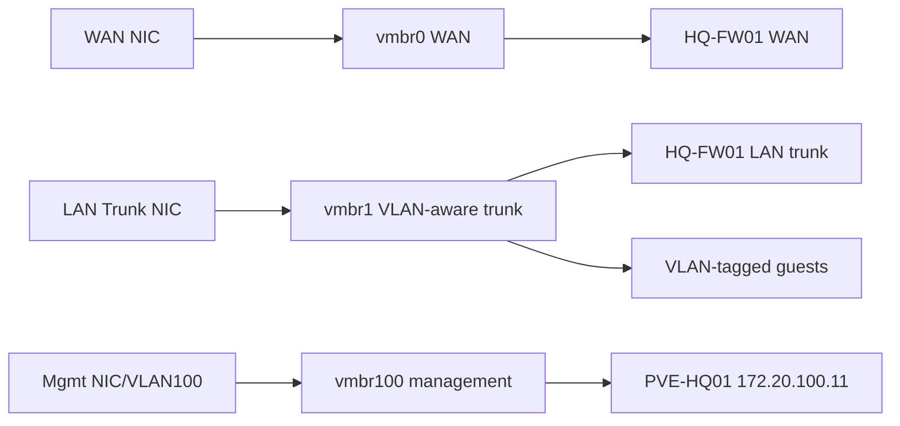

# Proxmox HQ Foundation Implementation Runbook

## Document Control

| Field | Value |
|---|---|
| Document ID | GEIL-PLAT-PVE-HQ-IMPL-001 |
| Owner | Infrastructure Engineering |
| Status | Approved |
| Version | 1.0 |
| Last Reviewed | 2026-06-29 |
| Review Cycle | Quarterly |
| Classification | Internal Confidential |

## Purpose

This runbook implements the `PVE-HQ01` Proxmox VE foundation for GEIL Phase 1. It converts the approved E02.R03 Low-Level Design into executable deployment steps for the initial HQ virtualization and network bridge baseline.

The runbook is implementation-ready but does not store credentials, license keys, private ISO checksums, or secrets in Git.

## Scope

Included:

- `PVE-HQ01` host identity and management baseline.
- Proxmox bridge configuration for WAN, VLAN trunk, and hypervisor management.
- VLAN-aware bridge configuration.
- Initial VM shell creation for `HQ-FW01`, `HQ-DC01`, `HQ-MGMT01`, and `HQ-W11-001`.
- Snapshot checkpoints.
- Management access validation.
- Rollback procedures.
- Troubleshooting and evidence capture.

Excluded:

- AD DS installation.
- PKI, NPS, or Certificate Lifecycle Management.
- Proxmox cluster creation.
- Proxmox Backup Server job configuration.
- Production application workload deployment.

## Related HLD/LLD references

This implementation runbook is subordinate to the approved HLD and LLD baseline:

- [Enterprise Lab Blueprint HLD](../architecture/enterprise-lab-blueprint.md)
- [Enterprise Lab Network HLD](../architecture/enterprise-lab-network-hld.md)
- [Proxmox HQ Foundation LLD](proxmox-hq-foundation-lld.md)
- [OPNsense HQ Foundation LLD](opnsense-hq-foundation-lld.md)
- [Phase 1 Build Plan](phase-1-build-plan.md)
- [Phase 1 Validation Plan](phase-1-validation-plan.md)
- [Environment Specification](../project/environment-specification.md)


!!! note "Adaptation"

    This runbook uses canonical GNTECH values including `PVE-HQ01`, `HQ-FW01`, `HQ-DC01`, `HQ-MGMT01`, `HQ-W11-001`, `172.20.100.11`, `172.20.100.1`, and `corp.gntech.me`. Other organizations must update their environment specification before adapting commands or screenshots.

## Prerequisites

| Requirement | Value / Decision |
|---|---|
| Physical host installed | `PVE-HQ01` |
| Proxmox VE ISO | Current approved Proxmox VE ISO from vendor source |
| OPNsense ISO uploaded | Required before creating `HQ-FW01` |
| Windows Server ISO uploaded | Required before creating `HQ-DC01` |
| Windows 11 Enterprise ISO uploaded | Required before creating `HQ-MGMT01` and `HQ-W11-001` |
| VirtIO drivers ISO | Required for Windows guests if virtio devices are used |
| Management network | VLAN 100 Hypervisors |
| Proxmox management IP | `172.20.100.11/24` |
| Default gateway | `172.20.100.1` |
| Approved admin source | `HQ-MGMT01` after deployment; local console during bootstrap |

## Required access

| Access | Required For | Notes |
|---|---|---|
| Physical or remote console to `PVE-HQ01` | Initial install and emergency rollback | Required before firewall routing exists |
| Proxmox root or equivalent privileged account | Host network and VM configuration | Password must be stored in approved password manager, not Git |
| ISO upload access | Upload installation media | Use Proxmox local ISO storage |
| Console access to VMs | Guest OS installation | Use Proxmox console until management network is validated |

## Required ISO/files

| File | Purpose | Storage Location |
|---|---|---|
| Proxmox VE ISO | Install `PVE-HQ01` | Physical installer, not committed |
| OPNsense ISO | Install `HQ-FW01` | Proxmox ISO storage |
| Windows Server 2025 ISO | Install `HQ-DC01` | Proxmox ISO storage |
| Windows 11 Enterprise ISO | Install `HQ-MGMT01`, `HQ-W11-001` | Proxmox ISO storage |
| VirtIO driver ISO | Windows guest storage/network drivers | Proxmox ISO storage |
| `HQ-FW01-baseline.xml` | Post-validation firewall config export | Protected admin storage after OPNsense build |

## Visual implementation summary

The detailed Proxmox bridge design is complex enough that future visual asset migration should create a dedicated 16:9 diagram under `docs/assets/diagrams/proxmox-hq-foundation-lld/`. Until that asset exists, the simplified Mermaid below is retained for implementation sequence clarity.



## Exact Proxmox configuration steps

### Step 1: Install and name `PVE-HQ01`

1. Install Proxmox VE on the approved host hardware.
2. Set hostname to `PVE-HQ01`.
3. Set management address to `172.20.100.11/24`.
4. Set gateway to `172.20.100.1`.
5. During bootstrap, use a temporary resolver only until `HQ-DC01` DNS exists.

Validation command from the Proxmox console:

```bash
hostname
ip addr
ip route
```

Expected result:

- Hostname is `PVE-HQ01`.
- Management address includes `172.20.100.11/24`.
- Default route points to `172.20.100.1`.

### Step 2: Configure Proxmox bridge baseline

Back up the current network configuration before changes:

```bash
cp /etc/network/interfaces /root/interfaces.pre-geil-e02r04
```

Apply the bridge design below, adjusting only physical NIC names to match the hardware discovered with `ip link`. Do not change canonical bridge names.

```text
auto lo
iface lo inet loopback

iface eno1 inet manual
# WAN uplink for HQ-FW01 only

auto vmbr0
iface vmbr0 inet manual
    bridge-ports eno1
    bridge-stp off
    bridge-fd 0

iface eno2 inet manual
# Internal LAN VLAN trunk

auto vmbr1
iface vmbr1 inet manual
    bridge-ports eno2
    bridge-stp off
    bridge-fd 0
    bridge-vlan-aware yes
    bridge-vids 10 20 30 40 50 60 70 80 90 100

iface eno3 inet manual
# Hypervisor management uplink, or use a tagged design if hardware requires it

auto vmbr100
iface vmbr100 inet static
    address 172.20.100.11/24
    gateway 172.20.100.1
    bridge-ports eno3
    bridge-stp off
    bridge-fd 0
```

If the hardware has only two NICs, `vmbr100` may be implemented as a VLAN-aware management design on the trunk, but the design exception must be recorded before production use.

Apply networking safely from console access:

```bash
ifreload -a
```

Validation commands:

```bash
ip -brief addr
bridge vlan show
ip route
```

Expected result:

- `vmbr0`, `vmbr1`, and `vmbr100` exist.
- `vmbr1` is VLAN-aware and permits VLANs 10,20,30,40,50,60,70,80,90,100.
- `vmbr100` owns `172.20.100.11/24`.
- Default route points to `172.20.100.1`.

### Step 3: Upload required ISOs

From the Proxmox UI:

1. Open `PVE-HQ01`.
2. Open local ISO storage.
3. Upload:
   - OPNsense ISO.
   - Windows Server 2025 ISO.
   - Windows 11 Enterprise ISO.
   - VirtIO driver ISO.

Validation:

```bash
ls -lh /var/lib/vz/template/iso
```

Expected result:

- Required ISO files are visible on local ISO storage.

### Step 4: Create `HQ-FW01` VM shell

Create the firewall VM with these settings:

| Setting | Value |
|---|---|
| VM name | `HQ-FW01` |
| vCPU | 2 |
| Memory | 4096 MB |
| Disk | 40 GB |
| BIOS | OVMF or SeaBIOS per tested OPNsense baseline |
| Boot ISO | OPNsense ISO |
| net0 | `vmbr0`, no VLAN tag, WAN |
| net1 | `vmbr1`, no VLAN tag, LAN trunk |

Example Proxmox CLI pattern, using an approved unused VM ID such as `100`:

```bash
qm create 100 --name HQ-FW01 --memory 4096 --cores 2 --net0 virtio,bridge=vmbr0 --net1 virtio,bridge=vmbr1
qm set 100 --scsihw virtio-scsi-pci --scsi0 local-lvm:40
qm set 100 --ide2 local:iso/OPNsense-ISO-FILENAME.iso,media=cdrom
qm set 100 --boot order=ide2\;scsi0
```

`OPNsense-ISO-FILENAME.iso` must be replaced with the uploaded OPNsense ISO filename from local Proxmox storage.

Checkpoint:

- Do not start dependent guests until `HQ-FW01` installs successfully.
- Snapshot after OPNsense installation as `CP-FW-INSTALLED`.

### Step 5: Create `HQ-DC01` VM shell

| Setting | Value |
|---|---|
| VM name | `HQ-DC01` |
| OS | Windows Server 2025 |
| vCPU | 2 |
| Memory | 6144 MB |
| Disk | 100 GB |
| Network | `vmbr1`, VLAN tag 20 |
| Static IP after OS install | `172.20.20.11/24` |
| Gateway | `172.20.20.1` |

Example:

```bash
qm create 110 --name HQ-DC01 --memory 6144 --cores 2 --net0 virtio,bridge=vmbr1,tag=20
qm set 110 --scsihw virtio-scsi-pci --scsi0 local-lvm:100
qm set 110 --ide2 local:iso/Windows-Server-2025-ISO-FILENAME.iso,media=cdrom
qm set 110 --ide3 local:iso/virtio-win-ISO-FILENAME.iso,media=cdrom
qm set 110 --boot order=ide2\;scsi0
```

### Step 6: Create `HQ-MGMT01` VM shell

| Setting | Value |
|---|---|
| VM name | `HQ-MGMT01` |
| OS | Windows 11 Enterprise |
| vCPU | 2 |
| Memory | 8192 MB |
| Disk | 100 GB |
| Network | `vmbr1`, VLAN tag 30 |
| Static IP after OS install | `172.20.30.10/24` |
| Gateway | `172.20.30.1` |

Example:

```bash
qm create 120 --name HQ-MGMT01 --memory 8192 --cores 2 --net0 virtio,bridge=vmbr1,tag=30
qm set 120 --scsihw virtio-scsi-pci --scsi0 local-lvm:100
qm set 120 --ide2 local:iso/Windows-11-Enterprise-ISO-FILENAME.iso,media=cdrom
qm set 120 --ide3 local:iso/virtio-win-ISO-FILENAME.iso,media=cdrom
qm set 120 --boot order=ide2\;scsi0
```

### Step 7: Create `HQ-W11-001` VM shell

| Setting | Value |
|---|---|
| VM name | `HQ-W11-001` |
| OS | Windows 11 Enterprise |
| vCPU | 2 |
| Memory | 6144 MB |
| Disk | 80 GB |
| Network | `vmbr1`, VLAN tag 30 |
| Addressing | DHCP after DHCP exists, otherwise temporary VLAN 30 test settings |

Example:

```bash
qm create 121 --name HQ-W11-001 --memory 6144 --cores 2 --net0 virtio,bridge=vmbr1,tag=30
qm set 121 --scsihw virtio-scsi-pci --scsi0 local-lvm:80
qm set 121 --ide2 local:iso/Windows-11-Enterprise-ISO-FILENAME.iso,media=cdrom
qm set 121 --ide3 local:iso/virtio-win-ISO-FILENAME.iso,media=cdrom
qm set 121 --boot order=ide2\;scsi0
```

## Snapshot checkpoints

Create checkpoints at the defined gates:

```bash
qm snapshot 100 CP-FW-INSTALLED --description "HQ-FW01 clean OPNsense install before VLAN policy"
qm snapshot 100 CP-FW-VLANS --description "HQ-FW01 VLAN gateways configured"
qm snapshot 100 CP-FW-BASELINE-RULES --description "HQ-FW01 baseline firewall rules validated"
qm snapshot 110 CP-DC01-OS --description "HQ-DC01 clean Windows Server 2025 OS before AD DS"
qm snapshot 120 CP-MGMT01-OS --description "HQ-MGMT01 clean Windows 11 Enterprise OS"
qm snapshot 121 CP-W11-001-OS --description "HQ-W11-001 clean Windows 11 Enterprise OS"
```

For host configuration, capture the Proxmox network baseline:

```bash
cp /etc/network/interfaces /root/interfaces.CP-PVE-BASELINE
pveversion -v > /root/pveversion.CP-PVE-BASELINE.txt
```

## Management access validation

From `HQ-MGMT01` after OPNsense and workstation network configuration:

```powershell
Test-NetConnection 172.20.10.1 -Port 443
Test-NetConnection 172.20.100.11 -Port 8006
Test-NetConnection 172.20.20.11 -Port 3389
```

Expected result:

- `172.20.10.1:443` succeeds for firewall management.
- `172.20.100.11:8006` succeeds for Proxmox management.
- `172.20.20.11:3389` succeeds only after `HQ-DC01` allows administrative access.

## Rollback procedures

### Roll back Proxmox bridge configuration

Use local console access and restore the pre-change configuration:

```bash
cp /root/interfaces.pre-geil-e02r04 /etc/network/interfaces
ifreload -a
```

Validation:

```bash
ip -brief addr
ip route
```

### Roll back VM network attachment

```bash
qm config 100
qm set 100 --net0 virtio,bridge=vmbr0
qm set 100 --net1 virtio,bridge=vmbr1
```

### Roll back a VM checkpoint

```bash
qm rollback 100 CP-FW-INSTALLED
```

Use the appropriate VM ID and checkpoint name from the build evidence.

## Troubleshooting

| Symptom | Likely Cause | Action |
|---|---|---|
| Proxmox UI unreachable | Incorrect bridge, gateway, or physical NIC mapping | Use console, inspect `ip route`, restore prior `/etc/network/interfaces` |
| VMs cannot reach VLAN gateway | Missing VLAN tag or `vmbr1` not VLAN-aware | Check `qm config VMID` using the affected numeric VM ID and run `bridge vlan show` |
| `HQ-FW01` WAN receives no address | Wrong WAN NIC or upstream issue | Verify `vmbr0` physical NIC mapping and ISP handoff |
| Windows installer cannot see disk | VirtIO driver missing | Mount VirtIO ISO and load storage driver |
| Windows guest has no network | VirtIO network driver missing or wrong VLAN tag | Install VirtIO driver and verify VM `tag` |
| Management path works from console but not `HQ-MGMT01` | Firewall rule missing | Validate OPNsense management allow rules |

## Evidence to capture

- Photo or export showing `PVE-HQ01` host identity and version.
- `/etc/network/interfaces` after bridge baseline.
- `ip -brief addr`, `ip route`, and `bridge vlan show` output.
- Proxmox VM hardware screenshots or `qm config` output for each VM.
- Snapshot list for `HQ-FW01`, `HQ-DC01`, `HQ-MGMT01`, and `HQ-W11-001`.
- Validation transcript from `HQ-MGMT01`.

## Completion criteria

This runbook is complete when:

1. `PVE-HQ01` is reachable at `172.20.100.11` through the approved path.
2. `vmbr1` is VLAN-aware and carries the canonical VLAN set.
3. `HQ-FW01` has WAN and LAN trunk adapters.
4. VM shells exist with correct names, sizing, and VLAN tags.
5. Required checkpoints exist.
6. Evidence is captured and linked to the implementation record.
