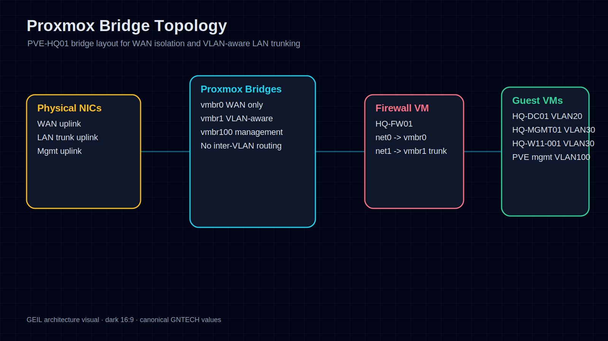
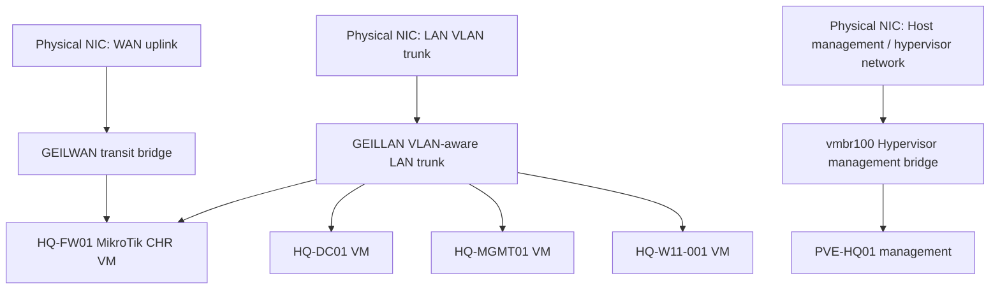

# Proxmox HQ Foundation LLD

## Document Control

| Field | Value |
|---|---|
| Document ID | GEIL-PLAT-PVE-HQ-LLD-001 |
| Owner | Infrastructure Engineering |
| Status | Approved |
| Version | 1.0 |
| Last Reviewed | 2026-06-29 |
| Review Cycle | Quarterly |
| Classification | Internal Confidential |

## Purpose

This Low-Level Design translates the E02.R02 Enterprise Lab Blueprint into deployable technical specifications for `PVE-HQ01`, the initial Proxmox VE host for the GNTECH HQ environment.

This document is implementation-ready design. It defines the host baseline, bridge/VLAN model, initial VM placement, management access path, snapshot checkpoints, and rollback expectations. It does not replace vendor installation documentation.

## Required HLD references

This LLD is derived from and subordinate to the E02.R02 High-Level Design baseline:

- [Enterprise Lab Blueprint HLD](../architecture/enterprise-lab-blueprint.md)
- [Enterprise Lab Network HLD](../architecture/enterprise-lab-network-hld.md)
- [Enterprise Lab Identity HLD](../architecture/enterprise-lab-identity-hld.md)
- [Enterprise Lab Operations HLD](../architecture/enterprise-lab-operations-hld.md)
- [Environment Specification](../project/environment-specification.md)

!!! note "Adaptation"

    This design uses canonical GNTECH values: `PVE-HQ01`, `HQ-FW01`, `HQ-DC01`, `HQ-MGMT01`, `HQ-W11-001`, `PBS-HQ01`, `corp.gntech.me`, and the `172.20.0.0/16` VLAN plan. Organizations adapting this design must update the environment specification first.

## Design scope

Included:

- `PVE-HQ01` Proxmox host baseline.
- Proxmox bridge and VLAN design.
- VM network attachment design for `HQ-FW01`, `HQ-DC01`, `HQ-MGMT01`, and `HQ-W11-001`.
- Initial management access model.
- Snapshot and rollback checkpoint requirements.

Excluded:

- Proxmox cluster creation.
- Ceph or shared-storage cluster design.
- Proxmox Backup Server job configuration.
- Guest OS installation procedures.

## `PVE-HQ01` host baseline

| Item | Design Decision |
|---|---|
| Hostname | `PVE-HQ01` |
| Platform | Proxmox VE |
| Site | `HQ` |
| Management VLAN | VLAN 100 Hypervisors |
| Management IP | `172.20.100.11/24` |
| Default gateway | `172.20.100.1` on `HQ-FW01` |
| DNS servers | `172.20.20.11`, future `172.20.20.12` after AD DNS is available |
| Search domain | `corp.gntech.me` after domain services are available |
| Time source | `HQ-DC01` after domain services are available; reliable upstream before AD deployment |
| Backup target | `PBS-HQ01` at `172.20.90.10` when backup release is active |
| Administrative access | From `HQ-MGMT01` through approved management path only |

## Readable visual asset: Proxmox Bridge Topology

This visual shows the `PVE-HQ01` bridge design as an implementation architecture asset. It highlights WAN isolation on `vmbr0`, VLAN-aware internal trunking on `vmbr1`, management on `vmbr100`, and the VM attachment model.

!!! note "Adaptation"

    This visual uses canonical GNTECH names `PVE-HQ01`, `HQ-FW01`, `HQ-DC01`, `HQ-MGMT01`, and `HQ-W11-001`. Adaptations must update the Environment Specification first.

## Proxmox bridge topology

## Bridge specifications

| Bridge | VLAN Aware | Purpose | Physical Link | Guest Use |
|---|---|---|---|---|
| `vmbr0` | No | WAN handoff to `HQ-FW01` | WAN uplink NIC | `HQ-FW01` WAN interface only |
| `vmbr1` | Yes | Internal VLAN trunk | LAN trunk NIC | `HQ-FW01` LAN trunk plus VLAN-tagged guests |
| `vmbr100` | Optional / untagged management | Hypervisor management | Management NIC or tagged trunk subinterface | Proxmox management only |

Design decisions:

- `HQ-FW01` owns all VLAN gateways.
- `PVE-HQ01` does not route between enterprise VLANs.
- Guest VMs attach to `vmbr1` with explicit VLAN tags.
- WAN traffic is isolated on `vmbr0` and is not shared with non-firewall guests.
- Hypervisor management is reachable through VLAN 100 only.

## VM network attachment design

| VM | Adapter | Bridge | VLAN Tag | Purpose |
|---|---:|---|---:|---|
| `HQ-FW01` | net0 | `vmbr0` | none | WAN |
| `HQ-FW01` | net1 | `vmbr1` | none / trunk | VLAN trunk for internal gateways |
| `HQ-DC01` | net0 | `vmbr1` | 20 | Server VLAN |
| `HQ-MGMT01` | net0 | `vmbr1` | 30 | Workstation VLAN |
| `HQ-W11-001` | net0 | `vmbr1` | 30 | Workstation VLAN |

## Initial VM specifications

| VM | Role | vCPU | Memory | Disk | Network | Notes |
|---|---|---:|---:|---:|---|---|
| `HQ-FW01` | MikroTik CHR firewall | 2 | 4 GB | 40 GB | WAN + LAN trunk | Must boot before internal routing works |
| `HQ-DC01` | Windows Server 2025 domain controller | 2 | 6 GB | 100 GB | VLAN 20 | Static IP `172.20.20.11` |
| `HQ-MGMT01` | Windows 11 Enterprise management workstation / initial PAW | 2 | 8 GB | 100 GB | VLAN 30 | Clone from Windows 11 golden template; static/reserved `172.20.30.10`; RSAT/admin tools after domain join |
| `HQ-W11-001` | Windows 11 Enterprise standard client validation VM | 2 | 6 GB | 80 GB | VLAN 30 | Clone from Windows 11 golden template; DHCP after DHCP is available |

## Management access path

Management rules:

- Routine Proxmox and Windows infrastructure administration originates from `HQ-MGMT01`, a Windows 11 Enterprise management workstation / initial PAW. Windows Server is not used as a daily admin workstation.
- Emergency console access may use the physical console of `PVE-HQ01`.
- Proxmox web UI exposure is restricted to approved management sources.
- Direct management access from Guest WiFi, DMZ, printers, voice, or normal client subnets is denied.

## Proxmox snapshot checkpoints

| Checkpoint | Target | Timing | Purpose | Rollback Action |
|---|---|---|---|---|
| `CP-PVE-BASELINE` | Host config export | After Proxmox network baseline | Recover bridge/network design | Restore `/etc/network/interfaces` backup and reapply networking from console |
| `CP-FW-INSTALLED` | `HQ-FW01` | After MikroTik CHR install, before VLAN policy | Return to clean firewall install |
| `CP-FW-VLANS` | `HQ-FW01` | After VLAN gateways and baseline rules | Return to working routing baseline |
| `CP-DC01-OS` | `HQ-DC01` | After Windows Server install, before AD DS | Return to clean server OS |
| `CP-MGMT01-OS` | `HQ-MGMT01` | After clone, VLAN30 validation, domain join, RSAT, and updates | Return to clean management workstation |
| `CP-W11-001-OS` | `HQ-W11-001` | After Windows 11 install and updates | Return to clean test client |

## Validation requirements

Before this LLD is considered implemented:

1. `PVE-HQ01` is reachable at `172.20.100.11` through the approved management path.
2. `vmbr0`, `vmbr1`, and management bridge design match this LLD.
3. `HQ-FW01` has isolated WAN and trunked LAN adapters.
4. VLAN-tagged VMs can reach only their intended gateway after firewall policy is applied.
5. Snapshots or equivalent rollback checkpoints exist before major configuration transitions.
6. `site/` and local VM exports are not committed to the documentation repository.

## Rollback principles

- If bridge configuration breaks management access, use local console to restore the previous host network configuration.
- If `HQ-FW01` policy breaks routing, revert to `CP-FW-VLANS` or restore the last exported RouterOS configuration export.
- If a guest OS role configuration fails, revert the VM checkpoint before reattempting.

## Related documents

- [MikroTik CHR HQ Foundation LLD](mikrotik-chr-hq-foundation-lld.md)
- [Phase 1 Build Plan](phase-1-build-plan.md)
- [Phase 1 Validation Plan](phase-1-validation-plan.md)
