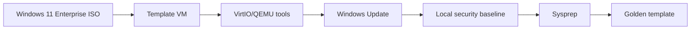

# Windows 11 Enterprise Golden Template

## Document Control

| Field | Value |
|---|---|
| Document ID | GEIL-PLAT-W11-GOLD-001 |
| Owner | Infrastructure Engineering |
| Status | Draft |
| Version | 1.0 |
| Last Reviewed | 2026-06-30 |
| Review Cycle | Quarterly |
| Classification | Internal Confidential |

!!! note "Canonical GNTECH values"

    Forest: `corp.gntech.me`; NetBIOS: `GNTECH`; primary UPN suffix: `gntech.me`; Microsoft 365 primary domain: `gntech.me`; hybrid identity plane: Microsoft Entra ID; primary firewall: MikroTik CHR `HQ-FW01`.


## Purpose

Create a Windows 11 Enterprise golden template for test workstations such as `HQ-W11-001` before domain join, Intune enrollment, and Windows Hello for Business validation.

## Architecture Overview



## Enterprise rationale

A workstation template gives GEIL a repeatable endpoint baseline for domain join, Group Policy, Intune, Defender, and Windows Hello tests without rebuilding from ISO each time.

## Build steps

### Step 1: Create template VM

Create `TPL-W11-ENT-GOLD` on `PVE-HQ01`. Attach Windows 11 Enterprise ISO and VirtIO driver ISO. Do not join the domain.

### Step 2: Install drivers and VM tools

```powershell
Get-PnpDevice | Where-Object Status -ne "OK"
Get-Service QEMU-GA -ErrorAction SilentlyContinue
```

### Step 3: Apply updates and baseline settings

Install all Windows updates and verify Defender is enabled.

```powershell
Get-ComputerInfo | Select-Object WindowsProductName,WindowsVersion,OsBuildNumber
Get-MpComputerStatus | Select-Object AntivirusEnabled,RealTimeProtectionEnabled
```

### Step 4: Keep cloud/domain state clean

Do not sign in with a production Microsoft 365 user. Do not Entra join, Intune enroll, or domain join the template.

### Step 5: Snapshot and Sysprep

```bash
qm snapshot <VMID> CP-TPL-W11-PRE-SYSPREP --description "Windows 11 Enterprise template before sysprep"
```

```powershell
C:\Windows\System32\Sysprep\Sysprep.exe /generalize /oobe /shutdown
```

### Step 6: Convert to template

```bash
qm template <VMID>
```

## Validation

Clone a test workstation and validate:

```powershell
hostname
Get-ComputerInfo | Select-Object WindowsProductName
Get-NetAdapter
Get-Service QEMU-GA
```

Expected result: clone boots uniquely, has drivers and VM tools, is not domain joined, and is ready for controlled domain/Intune tests.

## Stop conditions

STOP if the template contains user data, domain membership, Entra join, Intune enrollment, saved credentials, or production user profiles.

## Rollback

Revert to the pre-sysprep snapshot if Sysprep fails. Rebuild the template if production identity or secrets entered the image.

## Screenshot placeholders

Capture screenshots during real deployment:

- Proxmox VM hardware page.
- Windows Update history.
- Defender status.
- Device Manager showing no missing drivers.
- Sysprep shutdown state.
- Template conversion in Proxmox.

## Evidence Collection

Capture VM config, update status, driver status, Defender status, Sysprep command, template conversion command, and clone validation.

## Troubleshooting

| Symptom | Cause | Fix |
|---|---|---|
| Clone already has user profile | Template was used interactively | Rebuild and Sysprep clean image. |
| Intune enrollment conflict | Template was enrolled | Rebuild; never enroll template. |
| Network missing | Driver absent | Install VirtIO driver before Sysprep. |

## Next Guide

Use this template for controlled workstation domain join, GPO validation, Intune enrollment, and Windows Hello for Business testing.

## Deployment Verified

| Field | Value |
|---|---|
| Validated on | Not yet field validated. Must pass this guide, the code-block audit, and clean-environment review before production execution. |
| Windows Server version | Not yet field validated |
| RouterOS version | Not applicable unless the guide explicitly configures RouterOS |
| Proxmox version | Proxmox VE 9 target |
| Deployment date | Not yet field validated |
| Deployment notes | Not yet field validated. Must pass this guide, the code-block audit, and clean-environment review before production execution. |
| Known caveats | Treat as documentation-ready but not field-proven until deployment evidence is captured. |
